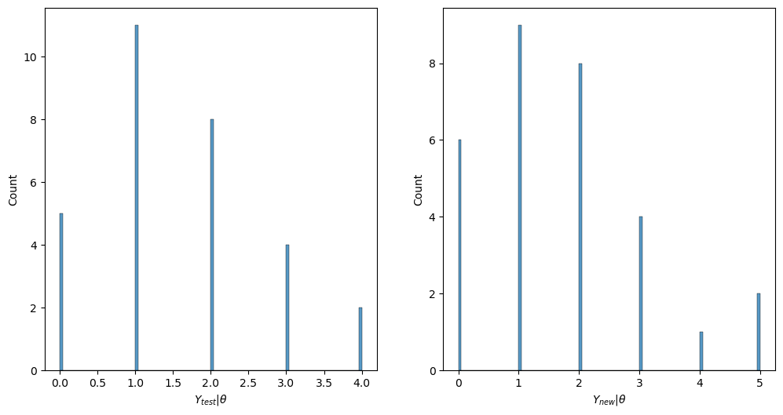
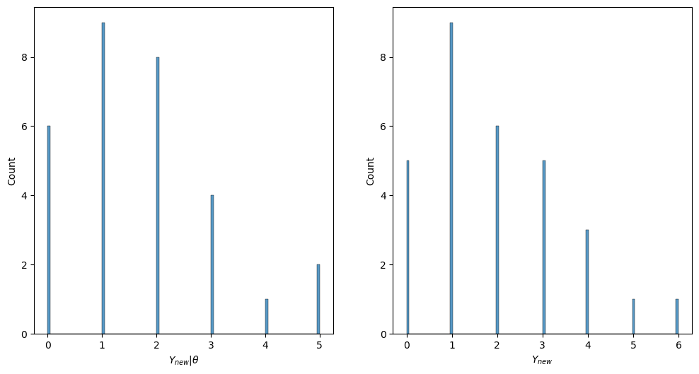
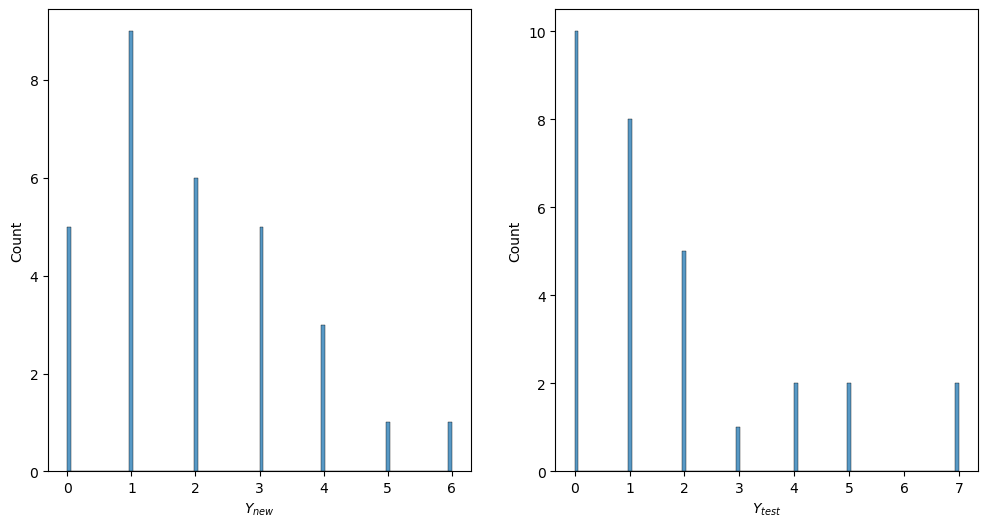

<head>
  <script type="text/x-mathjax-config"> MathJax.Hub.Config({ TeX: { equationNumbers: { tags: 'ams' } } }); </script>
  <script type="text/x-mathjax-config">
    MathJax.Hub.Config({
      tex2jax: {
        extensions: ["amsthm.js", "AMSmath.js","AMSsymbols.js", "autobold.js"],
        inlineMath: [ ['$','$'], ["\\(","\\)"] ],
         displayMath: [ ['$$','$$'], ["\\[","\\]"] ],
         processEscapes: true
      }
    });
  </script>
  <script src="https://cdn.mathjax.org/mathjax/latest/MathJax.js?config=TeX-AMS-MML_HTMLorMML" type="text/javascript">
  </script>
  <meta name="google-site-verification" content="kuks5e4as6qBaGVCSzmHkQJa5Tss89_g5DmRXeUi7K8" />

  <style> 
  body{
    .previous {
    background-color: #f1f1f1;
    color: black;
    }
    .next {
      background-color: #04AA6D;
      color: white;
    }
    .example,.theorem,.lemma,.problem, .definition {
       font-weight:bold; 
    }
  }
  </style>
</head>


<a href="index" class="previous"> &laquo; Previous</a>    <a href="HypothesisTest" class="next">Next &raquo;</a>  


<h1> Conjugate Distributions </h1>

We already saw in the <a href="index">introduction </a> that if one has a random sample $Y_1, \dots, Y_n$ such that 

$$
\begin{equation*}
Y_i \vert  \theta \sim Ber(\theta)\quad \text{and} \quad \theta \sim \mathcal{U}(0,1) = Beta(1,1)
\end{equation*}
$$


then the posterior distribution of $\theta$ is again a Beta distribution $Beta(1 + \sum_{i}y_i, 1 + n -\sum_{i}y_{i})$. We say that the Beta distribution is conjugate to the Binomial distribution.

In this section we will see this in more detail and a few more examples.

<span class = "definition"> Definition </span>  (Conjugate Distribution)<br>
A class $\mathcal{P}$ of prior distributions for $\theta$ is said to be conjugate to the sampling model $p(y_1,\dots, y_n \vert \theta)$ if

$$
p(\theta) \in \mathcal{P} \Rightarrow p(\theta \vert y_1, \dots, y_n) \in \mathcal{P}
$$


<h2> Binomial Model </h2>

For binomial sample data let's consider the following prior:

<h3> Prior Beta </h3>

Recall that if $X\sim Beta(\alpha, \beta)$ then its density function is

$$
f_X(x) = \frac{\Gamma(\alpha +\beta)}{\Gamma(\alpha)\Gamma(\beta)}x^{\alpha-1}(1-x)^{\beta -1}{\bf 1}_{(0,1)}(x)
$$

Let $\theta \in \Theta$ a parameter of interest. Let $Y_1,\dots,Y_n$ be a $\theta$ random sample, that is, the variables are conditional on $\theta$ independent and identically distributed, with distribution given by $Y_i \vert \theta \sim Ber(\theta)$.

Suppose that our prior believe on $\theta$ is that $\theta \sim Beta(\alpha_{prior}, \beta_{prior})$ for some $\alpha_{prior}, \beta_{prior}>0$ to be specified, then the posterior distribution of $\theta$ computed using Bayes rule is:

$$
p(\theta \vert y_1, \dots, y_n) = \frac{p(y_1,\dots, y_n \vert \theta)p(\theta)}{p(y_1,\dots, y_n)}
$$

where $p(y_1,\dots, y_n):=\int_{0}^{1} p(y_1,\dots, y_n \vert \theta)p(\theta)\,d\theta$

Since $Y_1,\dots, Y_n$ is a $\theta$ random sample, then 
$$
p(y_1,\dots, y_n \vert \theta) = \prod_{i=1}^{n}p(y_i \vert \theta) = \prod_{i=1}^{n}\theta^{y_i}(1-\theta)^{1-y_i} = \theta^{\sum_{i}y_i}(1-\theta)^{n -\sum_{i}y_i}
$$
where by $\sum_{i}y_i$ we mean $\sum_{i=1}^n y_i$.

Therefore the numerator in the posterior is:
<a id = "expression">
$$
\begin{align}
&\frac{\Gamma(\alpha_{prior} +\beta_{prior})}{\Gamma(\alpha_{prior})\Gamma(\beta_{prior})}\theta^{\alpha_{prior}-1}(1-\theta)^{\beta_{prior} -1} \theta^{\sum_{i}y_i}(1-\theta)^{n -\sum_{i}y_i} \notag\\
  \notag\\
=& \frac{\Gamma(\alpha_{prior} +\beta_{prior})}{\Gamma(\alpha_{prior})\Gamma(\beta_{prior})}\theta^{\alpha_{prior} + \sum_{i}y_i -1}(1-\theta)^{\beta_{prior}+ n -\sum_{i}y_i -1} \tag{1}
\end{align}
$$
</a>


Meanwhile the denominator is simply the integral with respect to $\theta$ of the last expression above [(1)](#expression) , this is because the posterior is a probability density. By use of the following property:

$$
\int_{0}^1 x^{a-1}(1-x)^{b-1} \,dx= \frac{\Gamma(a)\Gamma(b)}{\Gamma(a+b)} 
$$


we conclude that the denominator is:

$$
p(y_1,\dots, y_n) = \frac{\Gamma(\alpha_{prior}+\sum_{i}y_i)\Gamma(\beta_{prior} +n -\sum_{i}y_i)}{\Gamma(\alpha_{prior} + \beta_{prior} +n)}.
$$

Thus the final expression for the posterior distribution is:

$$
p(\theta \vert y_1,\dots y_n) = \frac{\Gamma(\alpha_{prior} + \beta_{prior} +n)}{\Gamma(\alpha_{prior}+\sum_{i}y_i)\Gamma(\beta_{prior} +n -\sum_{i}y_i)}\theta^{\alpha_{prior} + \sum_{i}y_i -1}(1-\theta)^{\beta_{prior}+ n -\sum_{i}y_i -1} {\bf 1}_{[0,1]}(\theta).
$$

In other words 
$$
\theta\sim Beta(\alpha_{post}, \beta_{post}) \quad \text{with} \quad \alpha_{post} =\alpha_{prior} + \sum_{i}y_i, \quad \text{and} \quad \beta_{post}= \beta_{prior} + n - \sum_{i}y_i
$$


For this posterior distribution we will have the posterior expected mean and posterior mode to be:

$$
\begin{align*}
\mathbb{E}(\theta \vert y_1, \dots, y_n) = & \frac{\alpha_{post}}{\alpha_{post} +\beta_{post}} \\
= & \frac{\alpha_{prior} + \sum_{i}y_i}{\alpha_{prior} + \beta_{prior} + n }\\
= & \frac{n}{\alpha_{prior} + \beta_{prior} + n}\bar{y}_n + \frac{\alpha_{prior} + \beta_{prior}}{\alpha_{prior} + \beta_{prior} + n}\frac{\alpha_{prior}}{\alpha_{prior} +\beta_{prior}}\\
\end{align*}
$$

where $\bar{y}_n = \frac{\sum_{i=1}^n y_i}{n}$.

That is, the posterior expected value is a weighted average between the sample mean $\bar{y}_n$ and the prior expected value. Due to this weighted average, the quantity $\alpha_{prior}+\beta_{prior}$ is called sometimes the *effective size* while of course, $n$ is the sample size.

<h3> Prediction </h3>

An important feature in this approach is the existence of a  predictive distribution. Let us assume we are in the same case as before, where the prior for $\theta$ is $Beta(1,1)$ and the data is, conditionally on $\theta$ iid with $Y_i \vert \theta \sim Ber(\theta)$ for $i=1, \dots, n$. 

Now, consider a new datapoint, one that has not be seen before, let's call this new observation $Y_{new}$ (we use capital letters since we are assuming this has not been observed so it is random) from the same population, then the *predictive distribution* of $Y_{new}$ can be computed as follows:

$$
\begin{align*}
p_{Y_{new}}(y \vert y_1,\dots, y_n) = & \int_{\theta \in \Theta}p(y, \theta \vert y_1,\dots, y_n)\,d\theta \\
= & \int_{\theta \in \Theta}p(y \vert \theta, y_1,\dots, y_n)p(\theta \vert y_1,\dots, y_n)\,d\theta \\
= & \int_{\theta \in \Theta} \theta p(\theta \vert y_1,\dots, y_n)\,d\theta = \mathbb{E}(\theta \vert y_1, \dots, y_n)
\end{align*}
$$

In this case, we will have:

$$
\mathbb{P}(Y_{new} = 1\vert y_1,\dots, y_n) = \frac{n}{2 + n}\bar{y}_n + \frac{2}{2 + n}\frac{1}{2}
$$


Lets make some simulations to see these results in action!


```python
# import the usual suspects!

import numpy as np
import scipy.stats
import matplotlib.pyplot as plt
```


```python
n = 100
a_prior = 1
b_prior = 1
num_iter = 10**4
Y_new = np.zeros(num_iter)

# simulate theta from a Beta(1,1) and then simulate Y_1,...,Y_n from a Bernoulli(theta):
theta = scipy.stats.beta.rvs(a = a_prior, b = b_prior, size = 1)
y = scipy.stats.binom.rvs(n = 1, p = theta, size = n) # draw n samples of Ber(theta)
# compute the new parameters
a_post = a_prior + y.sum()
b_post = b_prior +n - y.sum()

for t in range(num_iter):
    theta_post = scipy.stats.beta.rvs(a = a_post, b = b_post, size = 1)
    Y_new[t] = scipy.stats.binom.rvs(n=1, p =theta_post, size = 1)
```


```python
print(f"The posterior expectation of $\\theta$ is : {a_post/(a_post+b_post)}")
print(f"the simulated $\mathbb P(Y_new = 1\vert y_1,\\dots, y_n) = $ {Y_new.mean()}")
```

    The posterior expectation of $\theta$ is : 0.4019607843137255
    the simulated $\mathbb P(Y_new = 1\vert y_1,\dots, y_n) = $ 0.3989


<h2> <a id = "poisson">Poisson Model </a></h2>

For sample data that can be model with the Poisson distribution, let's find out what prior distribution is conjugate to it.

First recall that, if $X\sim Pois(\theta)$ then its probability distribution is given by:

$$
p_X(x) =\frac{\theta^{x}\exp(-\theta)}{x!},\quad \text{for } x\in \mathbb{N}_0
$$

If the sample data $Y_1,\dots, Y_n$ conditional on $\theta$ is i.i.d following a Poisson model with parameter $\theta$ and a prior distribution $p(\theta)$, then the posterior distribution for $\theta$ is:

$$
\begin{align*}
p(\theta \vert y_1,\dots, y_n) =& \frac{1}{p(y_1,\dots,y_n)}p(y_1,\dots, y_n \vert \theta)p(\theta)\\
= & c(y_1,\dots, y_n)\prod_{i=1}^n \frac{\theta^{y_i}\exp(-\theta)}{y_i!}p(\theta) \\
= & c(y_1,\dots, y_n)\theta^{\sum_i y_i}\exp(-n\theta)p(\theta)
\end{align*}
$$

where $c(y_1,\dots, y_n)$ is the normalizing constant denpending only on the sample data:

$$
c(y_1,\dots, y_n) = \frac{1}{\displaystyle\int_{\theta\in\Theta}\theta^{\sum_i y_i}\exp(-n\theta)p(\theta)\,d\theta}
$$

Now, observe that in order for  $p(\theta \vert y_1,\dots, y_n)$ to have the same shape than the prior, $p(\theta)$ has to be of the form $\theta^{a}\exp(-b\theta)$ for some $a, b>0$. The family of distributions of this type is the Gamma family. 
Thus, if the prior for $\theta$ is a  $Gamma(\alpha,\beta)$, that is,

$$
p(\theta) = \frac{\beta^{\alpha}}{\Gamma(\alpha)}\theta^{\alpha -1}\exp(-\beta\theta)I_{(0, +\infty)}(\theta),
$$

then, the posterior is 

$$
p(\theta \vert y_1,\dots, y_n) = c(y_1,\dots, y_n,\alpha, \beta)\theta^{\alpha + \sum_i y_i-1}\exp(-(\beta + n)\theta).
$$

with $c(y_1,\dots, y_n,\alpha, \beta) = 1/\int_{\theta}\theta^{\alpha + \sum_i y_i-1}\exp(-(\beta + n)\theta)$.

Using the fact that for any $a,b>0$

$$
\int_{0}^{+\infty}\theta^{a-1}\exp(-b\theta)\,d\theta = \frac{\Gamma(a)}{b^a},
$$

we conclude that:

$$
c(y_1,\dots, y_n,\alpha, \beta) = \frac{\Gamma(\alpha + \sum_{i}y_i)}{(\beta + n)^{\alpha + \sum_{i}y_i)}}
$$


In other words, the posterior is a $Gamma(\alpha_{post},\beta_{post})$ with

$$
\alpha_{post} = \alpha + \sum_i y_i,\quad \text{and}\quad \beta_{post} = \beta +n.
$$

**The posterior Expected value and Variance** for $\theta$ is:

$$
\begin{align*}
\mathbb{E}(\theta \vert y_1,\dots, y_n) =& \frac{\alpha_{post}}{\beta_{post}}\\
 =& \frac{\alpha +\sum_i y_i}{\beta +n} \\
 = & \frac{\beta}{\beta +n}\frac{\alpha}{\beta} + \frac{n}{\beta +n}\bar{y}_n 
\end{align*}
$$

The last expression says, as in the case of binomial data with beta prior, that this posterior expected value is a weighted sum of the prior expected value and the sample mean. Due to this expression the interpretations of $\alpha, \beta$ (the parameters of the prior distribution) are:

* $\beta$ is interpreted as the number of prior obaservations
* $\alpha$ is interpretes as the sum of counts from $\beta$ prior observations.


While the posterior variance is:

$$
\begin{align*}
\text{Var}(\theta\vert y_1,\dots, y_n) =& \frac{\alpha_{post}}{\beta_{post}^2}\\
= &\frac{\alpha +\sum_i y_i}{(\beta +n)^2}\\
 =& \frac{\beta^2}{(\beta +n)^2}\frac{\alpha}{\beta^2} + \frac{n}{(\beta + n)^2}\frac{\bar{y}_n}{n}
\end{align*}
$$

Note that for large $n$, the information from the data dominates and the posterior mean is approximately the sample mean, the same is true for the posterior variance:

$$
\mathbb{E}(\theta\vert y_1,\dots, y_n)\approx \bar{y}_n,\qquad \text{Var}(\theta\vert y_1, \dots, y_n)\approx \frac{\bar{y}_n}{n}
$$

<h3> Predictive Probability </h3>

Predictions about new data can be obtained as follows:
<a id = "predictiveBN">
$$
\begin{align}
p(y\vert y_1,\dots y_n) =& \int_{0}^{\infty}p(y,\theta \vert y_1,\dots, y_n)\,d\theta \notag\\ 
 =& \int_{0}^{\infty}p(y\vert \theta, y_1,\dots, y_n)p(\theta\vert y_1,\dots y_n)\,d\theta \notag\\
 =& \int_{0}^{\infty}p(y\vert \theta)p(\theta\vert y_1,\dots y_n)\,d\theta \notag\\
 =& \frac{(\beta_{post})^{\alpha_{post}}}{y!\Gamma(\alpha_{post})}\int_{0}^{\infty} \theta^{y}\exp(-\theta) \theta^{\alpha_{post}-1}\exp(-\beta_{post}\theta)\,d\theta \notag\\
 =& \frac{(\beta_{post})^{\alpha_{post}}}{y!\Gamma(\alpha_{post})}\left(\frac{\beta_{post}}{\beta_{post} + 1}\right)^{\alpha_{post}}\left(\frac{1}{\beta_{post} + 1} \right)^{y}
\end{align}
$$
</a>

That is, $y \vert  y_1,\dots y_n\sim BN(\alpha_{post}, \beta_{post}/(\beta_{post} +1))$.


Let's simulate some new data and plot its empirical distribution

To  simulate new data, which has posterior predictive probability $p(y_{new}\vert y_1,\dots y_n)$ we run a Monte Carlo simulation, that is, lets say we wan to draw $n_{test}$ samples from this probability law, then at iteration $j$ we draw a sample $\theta^{(j)}$ from $p(\theta\vert y_1,\dots, y_n)$ and then draw a sample $\tilde{y}^{(j)}$ from the distribution $p(y\vert \theta^{(j)})$.

We could also draw samples from the posterior $p(y\vert y_1, dots, y_n)$ that is, draw from the Negative Binomial distribution whose density is given in the last expression above


```python
import seaborn as sns
```


```python
N, n = 100, 70
n_test = N - n
a_prior, b_prior = 2, 1


# draw a sample theta from Gamma(a_prior, b_prior) and draw n samples ~ Pois(theta):

theta = scipy.stats.gamma.rvs(a = a_prior, scale = 1/b_prior, size = 1)

Y_cond_theta = scipy.stats.poisson.rvs(mu = theta, size = N)
Y = scipy.stats.nbinom.rvs(n = a_prior, p = b_prior/(b_prior+1), size = N)

Y_cond_theta_train = Y_cond_theta[0:n]
Y_cond_theta_test = Y_cond_theta[n:]

Y_train = Y[0 : n]
Y_test = Y[n : ]

# the posterior for theta is Gamma(a_post, b_post):

a_post = a_prior + sum(Y_cond_theta_train)
b_post = b_prior + n

theta_post = scipy.stats.gamma.rvs(a = a_post, scale=1/b_post, size = n_test)

Y_cond_theta_new =scipy.stats.poisson.rvs(mu = theta_post, size = n_test)

Y_new = scipy.stats.nbinom.rvs(n = a_post, p = b_post/(b_post + 1), size = n_test)


```


```python
plt.figure(figsize=(12,6))
plt.subplot(121)
sns.histplot(Y_cond_theta_test, bins= 100)
plt.xlabel("$Y_{test}\vert \\theta $")  #+ f"$ \sim Pois({theta})$")

plt.subplot(122)
sns.histplot(Y_cond_theta_new, bins=100)
plt.xlabel("$Y_{new}\vert \\theta$")  #\vert  \\theta_{post}$" + f"$\sim Pois({theta_post})$")

plt.show()
```


    

    


```python
plt.figure(figsize=(12,6))
plt.subplot(121)
sns.histplot(Y_cond_theta_new, bins = 100)
plt.xlabel("$Y_{new}\vert \\theta$")  # \\sim + f"BN({a_prior, b_prior/(b_prior+1)})$")

plt.subplot(122)
sns.histplot(Y_new, bins = 100)
plt.xlabel("$Y_{new} $") #\\sim+ f"BN({a_post, b_post/(b_post+1)})$")

plt.show()
```


    

    


```python
plt.figure(figsize=(12,6))
plt.subplot(121)
sns.histplot(Y_new, bins = 100)
plt.xlabel("$Y_{new}$")  # \\sim + f"BN({a_prior, b_prior/(b_prior+1)})$")

plt.subplot(122)
sns.histplot(Y_test, bins = 100)
plt.xlabel("$Y_{test} $") #\\sim+ f"BN({a_post, b_post/(b_post+1)})$")

plt.show()
```


    

    


we make a Kolmogorov Smirnof test, this is a non parametric test for the equality of two distributions. It can be used with one sample and the target distribution or with two samples. Roughly speaking, it answers the question of how likely is two observed two samples like this if the were drawn from the same distribution.
The null hypothesis for this test is that the given sample has the reference distribution (the one we are comparing to) or in the case of two samples, that they both have the same distribution. For more details on this test see the wikipedia <a href = "https://en.wikipedia.org/wiki/Kolmogorov%E2%80%93Smirnov_test"> article </a> and the references within.

In python we use the function **kstest** from the library **scipy.stats**. In this exampe we would like two compare thw two samples: $Y_{test}$ and $Y_{new}$ defined in the code cell above.


```python
scipy.stats.kstest(Y_new, Y_cond_theta_new)
```


    KstestResult(statistic=0.1, pvalue=0.9988393756362763, statistic_location=2, statistic_sign=-1)


```python
scipy.stats.kstest(Y_cond_theta_test, Y_cond_theta_new)
```


    KstestResult(statistic=0.06666666666666667, pvalue=0.9999999909208507, statistic_location=4, statistic_sign=1)


Since in both cases the $p-value$ is bigger than the stantadard significance levels (0.05, 0.01) we cannot reject the null hypothesis, that is, theres is statistically significative evidence that both samples come from the same distribution.


**Observation**
Although the $Y_1,\dots, Y_n$ is a $\theta$-random sample, meaning that $Y_1\vert\theta, \dots, Y_n\vert\theta \sim \mathcal{P}oiss(\theta)$ are iid random variables, this is not the case for the $Y_1,\dots,Y_n$ unconditional sample. 

First, if   $Y\vert \theta \sim \mathcal{P}ois(\theta)$ and $\theta \sim Gamma(\alpha,\beta)$ then the unconditional distribution of each $Y_i$ is a *Negative Binomial* with parameters $p = \frac{\beta}{\beta +1}$ (success probability) and $r = \alpha$ (number of succesess). This is because:

$$
\begin{aligned}
p(y) &= \int_{\theta}p(y\vert\theta)p(\theta)d\theta = \frac{1}{y!}\frac{\beta^\alpha}{\Gamma(\alpha)} \int_{0}^{+\infty}\theta^{y}\exp(-\theta)\theta^{\alpha -1}\exp(-\beta\theta)d\theta\\
& = \frac{1}{y!}\frac{\beta^\alpha}{\Gamma(\alpha)}\int_{0}^{+\infty}\theta^{y +\alpha -1}\exp(-(\beta+1)\theta)d\theta = \frac{1}{y!}\frac{\beta^\alpha}{\Gamma(\alpha)}\frac{\Gamma(y+\alpha)}{(\beta +1)^{y+\alpha}}\\
&= \frac{\Gamma(y + \alpha)}{\Gamma(y +1)\Gamma(\alpha)}\left(\frac{\beta}{\beta +1} \right)^\alpha \left(\frac{1}{\beta +1} \right)^{y}
\end{aligned}
$$


However, $Y_1,\dots,Y_n$ are not independent

In fact:

$$
\begin{aligned}
p(y_1,\dots, y_n) =& \int_{0}^{+\infty}p(y_1,\dots, y_n\vert \theta)p(\theta)\,d\theta\\
=& \int_{0}^{+\infty} \prod_{i=1}^n p(y_i\vert \theta)p(\theta)\,d\theta\\
=& \frac{1}{\prod_{i}y_i!}\frac{\beta^{\alpha}}{\Gamma(\alpha)}\int_{0}^{+\infty}\theta^{\sum_i y_i}\exp(-n\theta)\exp(-\beta\theta)\theta^{\alpha-1}\,d \theta \\ 
=& \frac{1}{\prod_{i}y_i!}\frac{\beta^{\alpha}}{\Gamma(\alpha)}\int_{0}^{+\infty}\theta^{\sum_i y_i +\alpha -1}\exp(-(n+\beta)\theta)\,d\theta\\
=& \frac{1}{\prod_{i}y_i!}\frac{\beta^{\alpha}}{\Gamma(\alpha)}\frac{\Gamma(\sum_i y_i +\alpha)}{(n+\beta)^{\sum_i y_i +\alpha}}\\
\neq& \prod_{i=1}^n p(y_i)
\end{aligned} 
$$

where $p(y_i)= \frac{\Gamma(y_i + \alpha)}{\Gamma(y_i +1)\Gamma(\alpha)}\left(\frac{\beta}{\beta +1} \right)^\alpha \left(\frac{1}{\beta +1} \right)^{y_i}$. 


<a href="WorkedExamples"> <h3> Worked Examples </h3> </a> 


