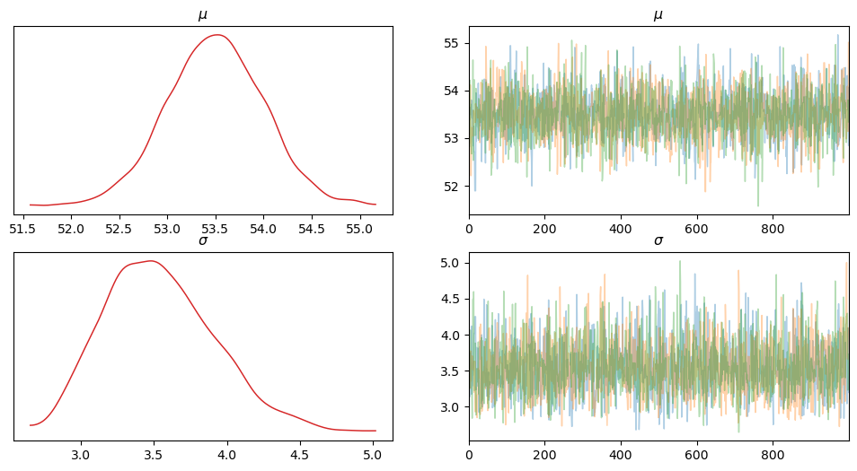

<head>
  <script type="text/x-mathjax-config"> MathJax.Hub.Config({ TeX: { equationNumbers: { tags: 'ams' } } }); </script>
  <script type="text/x-mathjax-config">
    MathJax.Hub.Config({
      tex2jax: {
        extensions: ["amsthm.js", "AMSmath.js","AMSsymbols.js", "autobold.js"],
        inlineMath: [ ['$','$'], ["\\(","\\)"] ],
         displayMath: [ ['$$','$$'], ["\\[","\\]"] ],
         processEscapes: true
      }
    });
  </script>
  <script src="https://cdn.mathjax.org/mathjax/latest/MathJax.js?config=TeX-AMS-MML_HTMLorMML" type="text/javascript">
  </script>
  <meta name="google-site-verification" content="kuks5e4as6qBaGVCSzmHkQJa5Tss89_g5DmRXeUi7K8" />

  <style> 
  body{
    .previous {
    background-color: #f1f1f1;
    color: black;
    }
    .next {
      background-color: #04AA6D;
      color: white;
    }
    .example,.theorem,.lemma,.problem, .definition {
       font-weight:bold; 
    }
  }
  </style>
</head>

<a href="MetropolisHastingsAlg" class="previous"> &laquo; Back<a>  <a href="index" class="next"> &raquo; Table of Contents<a> 

<h1>A Quick Intro to PyMC3 </h1>


```python
import numpy as np
import pandas as pd
import matplotlib.pyplot as plt
import pymc3
import arviz
import scipy.stats as stats

import warnings
warnings.filterwarnings('ignore')
warnings.simplefilter('ignore')
```

    WARNING (theano.link.c.cmodule): install mkl with `conda install mkl-service`: No module named 'mkl'


The following data is 


```python
file_name = 'data/chemical_shifts.csv'

data = np.loadtxt(file_name)
data[0:5]
```


    array([51.06, 55.12, 53.73, 50.24, 52.05])


```python
len(data)
```


    48


```python
arviz.plot_kde(data, rug=True,)
plt.show()

```


    

    


The KDE plot of this dataset suggests that,  except for a couple of observations, a bell shape distribution is a good approximation for the likelihood of this data. 

In this example we are going to make some Bayesian inference on the mean and variance of this distribution. First we are going to ignore the two 'outliers' and consider a Normal distribution for the likelihood. Then we will consider ommiting these two observations and compare both inference analysis.


Since we have no prior idea on the mean $\mu$ and the variance $\sigma^2$ of the data we will set non informative priors on both parameters. For the mean we will take as prior a uniform distirbution in the range of the data itself and for the variance we will consider the absolute value of a normal distribution, this in order to obtain a random variable with support $\mathbb{R}_{\geq 0}$. This distribution is known as *Half Normal* and it is already implemented as part of the distributions in **PyMC3**.

The model then will be of the type:

$$
\begin{align*}
\mu \sim \mathcal{U}(a, b)\\
\sigma \sim \vert \mathcal{N}(0, \sigma_0^2)\vert \\
y \sim \mathcal{N}(\mu, \sigma^2)
\end{align*}
$$

with $a = \min(data), b = \max(data)$ and $\sigma_0 = 50$, for this latter parameter we can set any ad-hoc value since we have no prior knowledge on the variance. 

Now, let us set the model, which we will call $model_0$, in **PyMC3**:


```python
a = np.floor(np.min(data) - 10)
b = np.ceil(np.max(data) + 10)
sigma_0 = 100

with pymc3.Model() as model_0:
    mu_prior = pymc3.Uniform('$\mu$',lower = a, upper= b)
    sigma_prior = pymc3.HalfNormal('$\sigma$', sd = sigma_0)
    y_likelihood = pymc3.Normal('y', mu = mu_prior, sd = sigma_prior, observed = data)
    infered_data = pymc3.sample(draws=1000, chains = 3, return_inferencedata=True)
```

    Auto-assigning NUTS sampler...
    Initializing NUTS using jitter+adapt_diag...
    Multiprocess sampling (3 chains in 4 jobs)
    NUTS: [$\sigma$, $\mu$]
    WARNING (theano.link.c.cmodule): install mkl with `conda install mkl-service`: No module named 'mkl'
    WARNING (theano.link.c.cmodule): install mkl with `conda install mkl-service`: No module named 'mkl'
    WARNING (theano.link.c.cmodule): install mkl with `conda install mkl-service`: No module named 'mkl'


<style>
    /* Turns off some styling */
    progress {
        /* gets rid of default border in Firefox and Opera. */
        border: none;
        /* Needs to be in here for Safari polyfill so background images work as expected. */
        background-size: auto;
    }
    progress:not([value]), progress:not([value])::-webkit-progress-bar {
        background: repeating-linear-gradient(45deg, #7e7e7e, #7e7e7e 10px, #5c5c5c 10px, #5c5c5c 20px);
    }
    .progress-bar-interrupted, .progress-bar-interrupted::-webkit-progress-bar {
        background: #F44336;
    }
</style>


<div>
  <progress value='6000' class='' max='6000' style='width:300px; height:20px; vertical-align: middle;'></progress>
  100.00% [6000/6000 00:01&lt;00:00 Sampling 3 chains, 0 divergences]
</div>


    /Users/juliana/opt/anaconda3/envs/Gatulin/lib/python3.10/site-packages/scipy/stats/_continuous_distns.py:624: RuntimeWarning: overflow encountered in _beta_ppf
      return _boost._beta_ppf(q, a, b)
    /Users/juliana/opt/anaconda3/envs/Gatulin/lib/python3.10/site-packages/scipy/stats/_continuous_distns.py:624: RuntimeWarning: overflow encountered in _beta_ppf
      return _boost._beta_ppf(q, a, b)
    /Users/juliana/opt/anaconda3/envs/Gatulin/lib/python3.10/site-packages/scipy/stats/_continuous_distns.py:624: RuntimeWarning: overflow encountered in _beta_ppf
      return _boost._beta_ppf(q, a, b)
    Sampling 3 chains for 1_000 tune and 1_000 draw iterations (3_000 + 3_000 draws total) took 9 seconds.


```python
infered_data
```


            <div>
              <div class='xr-header'>
                <div class="xr-obj-type">arviz.InferenceData</div>
              </div>
              <ul class="xr-sections group-sections">

            <li class = "xr-section-item">
                  <input id="idata_posterior81e908db-70a6-45bf-a60a-24d319f26a4d" class="xr-section-summary-in" type="checkbox">
                  <label for="idata_posterior81e908db-70a6-45bf-a60a-24d319f26a4d" class = "xr-section-summary">posterior</label>
                  <div class="xr-section-inline-details"></div>
                  <div class="xr-section-details">
                      <ul id="xr-dataset-coord-list" class="xr-var-list">
                          <div style="padding-left:2rem;"><div><svg style="position: absolute; width: 0; height: 0; overflow: hidden">
<defs>
<symbol id="icon-database" viewBox="0 0 32 32">
<path d="M16 0c-8.837 0-16 2.239-16 5v4c0 2.761 7.163 5 16 5s16-2.239 16-5v-4c0-2.761-7.163-5-16-5z"></path>
<path d="M16 17c-8.837 0-16-2.239-16-5v6c0 2.761 7.163 5 16 5s16-2.239 16-5v-6c0 2.761-7.163 5-16 5z"></path>
<path d="M16 26c-8.837 0-16-2.239-16-5v6c0 2.761 7.163 5 16 5s16-2.239 16-5v-6c0 2.761-7.163 5-16 5z"></path>
</symbol>
<symbol id="icon-file-text2" viewBox="0 0 32 32">
<path d="M28.681 7.159c-0.694-0.947-1.662-2.053-2.724-3.116s-2.169-2.030-3.116-2.724c-1.612-1.182-2.393-1.319-2.841-1.319h-15.5c-1.378 0-2.5 1.121-2.5 2.5v27c0 1.378 1.122 2.5 2.5 2.5h23c1.378 0 2.5-1.122 2.5-2.5v-19.5c0-0.448-0.137-1.23-1.319-2.841zM24.543 5.457c0.959 0.959 1.712 1.825 2.268 2.543h-4.811v-4.811c0.718 0.556 1.584 1.309 2.543 2.268zM28 29.5c0 0.271-0.229 0.5-0.5 0.5h-23c-0.271 0-0.5-0.229-0.5-0.5v-27c0-0.271 0.229-0.5 0.5-0.5 0 0 15.499-0 15.5 0v7c0 0.552 0.448 1 1 1h7v19.5z"></path>
<path d="M23 26h-14c-0.552 0-1-0.448-1-1s0.448-1 1-1h14c0.552 0 1 0.448 1 1s-0.448 1-1 1z"></path>
<path d="M23 22h-14c-0.552 0-1-0.448-1-1s0.448-1 1-1h14c0.552 0 1 0.448 1 1s-0.448 1-1 1z"></path>
<path d="M23 18h-14c-0.552 0-1-0.448-1-1s0.448-1 1-1h14c0.552 0 1 0.448 1 1s-0.448 1-1 1z"></path>
</symbol>
</defs>
</svg>
<style>/* CSS stylesheet for displaying xarray objects in jupyterlab.
 *
 */

:root {
  --xr-font-color0: var(--jp-content-font-color0, rgba(0, 0, 0, 1));
  --xr-font-color2: var(--jp-content-font-color2, rgba(0, 0, 0, 0.54));
  --xr-font-color3: var(--jp-content-font-color3, rgba(0, 0, 0, 0.38));
  --xr-border-color: var(--jp-border-color2, #e0e0e0);
  --xr-disabled-color: var(--jp-layout-color3, #bdbdbd);
  --xr-background-color: var(--jp-layout-color0, white);
  --xr-background-color-row-even: var(--jp-layout-color1, white);
  --xr-background-color-row-odd: var(--jp-layout-color2, #eeeeee);
}

html[theme=dark],
body[data-theme=dark],
body.vscode-dark {
  --xr-font-color0: rgba(255, 255, 255, 1);
  --xr-font-color2: rgba(255, 255, 255, 0.54);
  --xr-font-color3: rgba(255, 255, 255, 0.38);
  --xr-border-color: #1F1F1F;
  --xr-disabled-color: #515151;
  --xr-background-color: #111111;
  --xr-background-color-row-even: #111111;
  --xr-background-color-row-odd: #313131;
}

.xr-wrap {
  display: block !important;
  min-width: 300px;
  max-width: 700px;
}

.xr-text-repr-fallback {
  /* fallback to plain text repr when CSS is not injected (untrusted notebook) */
  display: none;
}

.xr-header {
  padding-top: 6px;
  padding-bottom: 6px;
  margin-bottom: 4px;
  border-bottom: solid 1px var(--xr-border-color);
}

.xr-header > div,
.xr-header > ul {
  display: inline;
  margin-top: 0;
  margin-bottom: 0;
}

.xr-obj-type,
.xr-array-name {
  margin-left: 2px;
  margin-right: 10px;
}

.xr-obj-type {
  color: var(--xr-font-color2);
}

.xr-sections {
  padding-left: 0 !important;
  display: grid;
  grid-template-columns: 150px auto auto 1fr 20px 20px;
}

.xr-section-item {
  display: contents;
}

.xr-section-item input {
  display: none;
}

.xr-section-item input + label {
  color: var(--xr-disabled-color);
}

.xr-section-item input:enabled + label {
  cursor: pointer;
  color: var(--xr-font-color2);
}

.xr-section-item input:enabled + label:hover {
  color: var(--xr-font-color0);
}

.xr-section-summary {
  grid-column: 1;
  color: var(--xr-font-color2);
  font-weight: 500;
}

.xr-section-summary > span {
  display: inline-block;
  padding-left: 0.5em;
}

.xr-section-summary-in:disabled + label {
  color: var(--xr-font-color2);
}

.xr-section-summary-in + label:before {
  display: inline-block;
  content: '►';
  font-size: 11px;
  width: 15px;
  text-align: center;
}

.xr-section-summary-in:disabled + label:before {
  color: var(--xr-disabled-color);
}

.xr-section-summary-in:checked + label:before {
  content: '▼';
}

.xr-section-summary-in:checked + label > span {
  display: none;
}

.xr-section-summary,
.xr-section-inline-details {
  padding-top: 4px;
  padding-bottom: 4px;
}

.xr-section-inline-details {
  grid-column: 2 / -1;
}

.xr-section-details {
  display: none;
  grid-column: 1 / -1;
  margin-bottom: 5px;
}

.xr-section-summary-in:checked ~ .xr-section-details {
  display: contents;
}

.xr-array-wrap {
  grid-column: 1 / -1;
  display: grid;
  grid-template-columns: 20px auto;
}

.xr-array-wrap > label {
  grid-column: 1;
  vertical-align: top;
}

.xr-preview {
  color: var(--xr-font-color3);
}

.xr-array-preview,
.xr-array-data {
  padding: 0 5px !important;
  grid-column: 2;
}

.xr-array-data,
.xr-array-in:checked ~ .xr-array-preview {
  display: none;
}

.xr-array-in:checked ~ .xr-array-data,
.xr-array-preview {
  display: inline-block;
}

.xr-dim-list {
  display: inline-block !important;
  list-style: none;
  padding: 0 !important;
  margin: 0;
}

.xr-dim-list li {
  display: inline-block;
  padding: 0;
  margin: 0;
}

.xr-dim-list:before {
  content: '(';
}

.xr-dim-list:after {
  content: ')';
}

.xr-dim-list li:not(:last-child):after {
  content: ',';
  padding-right: 5px;
}

.xr-has-index {
  font-weight: bold;
}

.xr-var-list,
.xr-var-item {
  display: contents;
}

.xr-var-item > div,
.xr-var-item label,
.xr-var-item > .xr-var-name span {
  background-color: var(--xr-background-color-row-even);
  margin-bottom: 0;
}

.xr-var-item > .xr-var-name:hover span {
  padding-right: 5px;
}

.xr-var-list > li:nth-child(odd) > div,
.xr-var-list > li:nth-child(odd) > label,
.xr-var-list > li:nth-child(odd) > .xr-var-name span {
  background-color: var(--xr-background-color-row-odd);
}

.xr-var-name {
  grid-column: 1;
}

.xr-var-dims {
  grid-column: 2;
}

.xr-var-dtype {
  grid-column: 3;
  text-align: right;
  color: var(--xr-font-color2);
}

.xr-var-preview {
  grid-column: 4;
}

.xr-index-preview {
  grid-column: 2 / 5;
  color: var(--xr-font-color2);
}

.xr-var-name,
.xr-var-dims,
.xr-var-dtype,
.xr-preview,
.xr-attrs dt {
  white-space: nowrap;
  overflow: hidden;
  text-overflow: ellipsis;
  padding-right: 10px;
}

.xr-var-name:hover,
.xr-var-dims:hover,
.xr-var-dtype:hover,
.xr-attrs dt:hover {
  overflow: visible;
  width: auto;
  z-index: 1;
}

.xr-var-attrs,
.xr-var-data,
.xr-index-data {
  display: none;
  background-color: var(--xr-background-color) !important;
  padding-bottom: 5px !important;
}

.xr-var-attrs-in:checked ~ .xr-var-attrs,
.xr-var-data-in:checked ~ .xr-var-data,
.xr-index-data-in:checked ~ .xr-index-data {
  display: block;
}

.xr-var-data > table {
  float: right;
}

.xr-var-name span,
.xr-var-data,
.xr-index-name div,
.xr-index-data,
.xr-attrs {
  padding-left: 25px !important;
}

.xr-attrs,
.xr-var-attrs,
.xr-var-data,
.xr-index-data {
  grid-column: 1 / -1;
}

dl.xr-attrs {
  padding: 0;
  margin: 0;
  display: grid;
  grid-template-columns: 125px auto;
}

.xr-attrs dt,
.xr-attrs dd {
  padding: 0;
  margin: 0;
  float: left;
  padding-right: 10px;
  width: auto;
}

.xr-attrs dt {
  font-weight: normal;
  grid-column: 1;
}

.xr-attrs dt:hover span {
  display: inline-block;
  background: var(--xr-background-color);
  padding-right: 10px;
}

.xr-attrs dd {
  grid-column: 2;
  white-space: pre-wrap;
  word-break: break-all;
}

.xr-icon-database,
.xr-icon-file-text2,
.xr-no-icon {
  display: inline-block;
  vertical-align: middle;
  width: 1em;
  height: 1.5em !important;
  stroke-width: 0;
  stroke: currentColor;
  fill: currentColor;
}
</style><pre class='xr-text-repr-fallback'>&lt;xarray.Dataset&gt;
Dimensions:   (chain: 3, draw: 1000)
Coordinates:
  * chain     (chain) int64 0 1 2
  * draw      (draw) int64 0 1 2 3 4 5 6 7 8 ... 992 993 994 995 996 997 998 999
Data variables:
    $\mu$     (chain, draw) float64 53.35 53.45 53.38 53.62 ... 53.54 53.8 53.34
    $\sigma$  (chain, draw) float64 4.063 4.19 3.138 3.661 ... 3.232 3.732 3.676
Attributes:
    created_at:                 2024-02-06T15:57:36.160573
    arviz_version:              0.12.1
    inference_library:          pymc3
    inference_library_version:  3.11.5
    sampling_time:              8.956332206726074
    tuning_steps:               1000</pre><div class='xr-wrap' style='display:none'><div class='xr-header'><div class='xr-obj-type'>xarray.Dataset</div></div><ul class='xr-sections'><li class='xr-section-item'><input id='section-a845e30a-e565-4707-85fd-edf7447bba65' class='xr-section-summary-in' type='checkbox' disabled ><label for='section-a845e30a-e565-4707-85fd-edf7447bba65' class='xr-section-summary'  title='Expand/collapse section'>Dimensions:</label><div class='xr-section-inline-details'><ul class='xr-dim-list'><li><span class='xr-has-index'>chain</span>: 3</li><li><span class='xr-has-index'>draw</span>: 1000</li></ul></div><div class='xr-section-details'></div></li><li class='xr-section-item'><input id='section-50768e57-ea6b-4717-90e3-10bbb10aa796' class='xr-section-summary-in' type='checkbox'  checked><label for='section-50768e57-ea6b-4717-90e3-10bbb10aa796' class='xr-section-summary' >Coordinates: <span>(2)</span></label><div class='xr-section-inline-details'></div><div class='xr-section-details'><ul class='xr-var-list'><li class='xr-var-item'><div class='xr-var-name'><span class='xr-has-index'>chain</span></div><div class='xr-var-dims'>(chain)</div><div class='xr-var-dtype'>int64</div><div class='xr-var-preview xr-preview'>0 1 2</div><input id='attrs-fb1506c9-91f1-4752-b45f-d82d305efb26' class='xr-var-attrs-in' type='checkbox' disabled><label for='attrs-fb1506c9-91f1-4752-b45f-d82d305efb26' title='Show/Hide attributes'><svg class='icon xr-icon-file-text2'><use xlink:href='#icon-file-text2'></use></svg></label><input id='data-1b9c0c5b-ca4a-4541-bdef-74610b2ede75' class='xr-var-data-in' type='checkbox'><label for='data-1b9c0c5b-ca4a-4541-bdef-74610b2ede75' title='Show/Hide data repr'><svg class='icon xr-icon-database'><use xlink:href='#icon-database'></use></svg></label><div class='xr-var-attrs'><dl class='xr-attrs'></dl></div><div class='xr-var-data'><pre>array([0, 1, 2])</pre></div></li><li class='xr-var-item'><div class='xr-var-name'><span class='xr-has-index'>draw</span></div><div class='xr-var-dims'>(draw)</div><div class='xr-var-dtype'>int64</div><div class='xr-var-preview xr-preview'>0 1 2 3 4 5 ... 995 996 997 998 999</div><input id='attrs-6c0b25db-4030-4338-ac6c-8d3b457420d3' class='xr-var-attrs-in' type='checkbox' disabled><label for='attrs-6c0b25db-4030-4338-ac6c-8d3b457420d3' title='Show/Hide attributes'><svg class='icon xr-icon-file-text2'><use xlink:href='#icon-file-text2'></use></svg></label><input id='data-6667ed98-931f-4ac9-8724-4e7c028157c6' class='xr-var-data-in' type='checkbox'><label for='data-6667ed98-931f-4ac9-8724-4e7c028157c6' title='Show/Hide data repr'><svg class='icon xr-icon-database'><use xlink:href='#icon-database'></use></svg></label><div class='xr-var-attrs'><dl class='xr-attrs'></dl></div><div class='xr-var-data'><pre>array([  0,   1,   2, ..., 997, 998, 999])</pre></div></li></ul></div></li><li class='xr-section-item'><input id='section-99a6da88-6007-4aa9-aaa9-ee4a4cfa956e' class='xr-section-summary-in' type='checkbox'  checked><label for='section-99a6da88-6007-4aa9-aaa9-ee4a4cfa956e' class='xr-section-summary' >Data variables: <span>(2)</span></label><div class='xr-section-inline-details'></div><div class='xr-section-details'><ul class='xr-var-list'><li class='xr-var-item'><div class='xr-var-name'><span>$\mu$</span></div><div class='xr-var-dims'>(chain, draw)</div><div class='xr-var-dtype'>float64</div><div class='xr-var-preview xr-preview'>53.35 53.45 53.38 ... 53.8 53.34</div><input id='attrs-d2677e2a-6adb-4a92-96f8-75a2c0f56d27' class='xr-var-attrs-in' type='checkbox' disabled><label for='attrs-d2677e2a-6adb-4a92-96f8-75a2c0f56d27' title='Show/Hide attributes'><svg class='icon xr-icon-file-text2'><use xlink:href='#icon-file-text2'></use></svg></label><input id='data-21b4bb9f-6931-4e0d-869f-f60e68ae276f' class='xr-var-data-in' type='checkbox'><label for='data-21b4bb9f-6931-4e0d-869f-f60e68ae276f' title='Show/Hide data repr'><svg class='icon xr-icon-database'><use xlink:href='#icon-database'></use></svg></label><div class='xr-var-attrs'><dl class='xr-attrs'></dl></div><div class='xr-var-data'><pre>array([[53.35476037, 53.45003486, 53.37961168, ..., 53.59792154,
        54.06807631, 52.84734424],
       [53.69745396, 54.07190029, 52.89614791, ..., 53.25141393,
        53.1401504 , 55.00584768],
       [52.81935214, 52.81935214, 52.81935214, ..., 53.53716142,
        53.79994073, 53.33789114]])</pre></div></li><li class='xr-var-item'><div class='xr-var-name'><span>$\sigma$</span></div><div class='xr-var-dims'>(chain, draw)</div><div class='xr-var-dtype'>float64</div><div class='xr-var-preview xr-preview'>4.063 4.19 3.138 ... 3.732 3.676</div><input id='attrs-204f0731-7815-4c43-be11-3f8640ec628d' class='xr-var-attrs-in' type='checkbox' disabled><label for='attrs-204f0731-7815-4c43-be11-3f8640ec628d' title='Show/Hide attributes'><svg class='icon xr-icon-file-text2'><use xlink:href='#icon-file-text2'></use></svg></label><input id='data-8ce0b7af-2a20-4ce1-ab59-76c7e0447a10' class='xr-var-data-in' type='checkbox'><label for='data-8ce0b7af-2a20-4ce1-ab59-76c7e0447a10' title='Show/Hide data repr'><svg class='icon xr-icon-database'><use xlink:href='#icon-database'></use></svg></label><div class='xr-var-attrs'><dl class='xr-attrs'></dl></div><div class='xr-var-data'><pre>array([[4.06291072, 4.1901593 , 3.13783121, ..., 4.09232321, 3.45612264,
        3.19959368],
       [3.30757648, 3.84085764, 3.5387336 , ..., 3.65759668, 3.94849858,
        4.0950285 ],
       [3.60552761, 3.60552761, 3.60552761, ..., 3.23181457, 3.73169289,
        3.67631649]])</pre></div></li></ul></div></li><li class='xr-section-item'><input id='section-9971e4da-982d-4adf-b4b1-0a8813391011' class='xr-section-summary-in' type='checkbox'  ><label for='section-9971e4da-982d-4adf-b4b1-0a8813391011' class='xr-section-summary' >Indexes: <span>(2)</span></label><div class='xr-section-inline-details'></div><div class='xr-section-details'><ul class='xr-var-list'><li class='xr-var-item'><div class='xr-index-name'><div>chain</div></div><div class='xr-index-preview'>PandasIndex</div><div></div><input id='index-c9e1e669-d7a4-40c6-aa40-80c5909154ac' class='xr-index-data-in' type='checkbox'/><label for='index-c9e1e669-d7a4-40c6-aa40-80c5909154ac' title='Show/Hide index repr'><svg class='icon xr-icon-database'><use xlink:href='#icon-database'></use></svg></label><div class='xr-index-data'><pre>PandasIndex(Int64Index([0, 1, 2], dtype=&#x27;int64&#x27;, name=&#x27;chain&#x27;))</pre></div></li><li class='xr-var-item'><div class='xr-index-name'><div>draw</div></div><div class='xr-index-preview'>PandasIndex</div><div></div><input id='index-40cd7dca-2327-4bbe-a387-d558037affd1' class='xr-index-data-in' type='checkbox'/><label for='index-40cd7dca-2327-4bbe-a387-d558037affd1' title='Show/Hide index repr'><svg class='icon xr-icon-database'><use xlink:href='#icon-database'></use></svg></label><div class='xr-index-data'><pre>PandasIndex(Int64Index([  0,   1,   2,   3,   4,   5,   6,   7,   8,   9,
            ...
            990, 991, 992, 993, 994, 995, 996, 997, 998, 999],
           dtype=&#x27;int64&#x27;, name=&#x27;draw&#x27;, length=1000))</pre></div></li></ul></div></li><li class='xr-section-item'><input id='section-4a87f34e-da04-4368-b813-518c64b1a6dc' class='xr-section-summary-in' type='checkbox'  checked><label for='section-4a87f34e-da04-4368-b813-518c64b1a6dc' class='xr-section-summary' >Attributes: <span>(6)</span></label><div class='xr-section-inline-details'></div><div class='xr-section-details'><dl class='xr-attrs'><dt><span>created_at :</span></dt><dd>2024-02-06T15:57:36.160573</dd><dt><span>arviz_version :</span></dt><dd>0.12.1</dd><dt><span>inference_library :</span></dt><dd>pymc3</dd><dt><span>inference_library_version :</span></dt><dd>3.11.5</dd><dt><span>sampling_time :</span></dt><dd>8.956332206726074</dd><dt><span>tuning_steps :</span></dt><dd>1000</dd></dl></div></li></ul></div></div><br></div>
                      </ul>
                  </div>
            </li>

            <li class = "xr-section-item">
                  <input id="idata_log_likelihoode37cfae2-426a-4195-a2d5-244be0bf540c" class="xr-section-summary-in" type="checkbox">
                  <label for="idata_log_likelihoode37cfae2-426a-4195-a2d5-244be0bf540c" class = "xr-section-summary">log_likelihood</label>
                  <div class="xr-section-inline-details"></div>
                  <div class="xr-section-details">
                      <ul id="xr-dataset-coord-list" class="xr-var-list">
                          <div style="padding-left:2rem;"><div><svg style="position: absolute; width: 0; height: 0; overflow: hidden">
<defs>
<symbol id="icon-database" viewBox="0 0 32 32">
<path d="M16 0c-8.837 0-16 2.239-16 5v4c0 2.761 7.163 5 16 5s16-2.239 16-5v-4c0-2.761-7.163-5-16-5z"></path>
<path d="M16 17c-8.837 0-16-2.239-16-5v6c0 2.761 7.163 5 16 5s16-2.239 16-5v-6c0 2.761-7.163 5-16 5z"></path>
<path d="M16 26c-8.837 0-16-2.239-16-5v6c0 2.761 7.163 5 16 5s16-2.239 16-5v-6c0 2.761-7.163 5-16 5z"></path>
</symbol>
<symbol id="icon-file-text2" viewBox="0 0 32 32">
<path d="M28.681 7.159c-0.694-0.947-1.662-2.053-2.724-3.116s-2.169-2.030-3.116-2.724c-1.612-1.182-2.393-1.319-2.841-1.319h-15.5c-1.378 0-2.5 1.121-2.5 2.5v27c0 1.378 1.122 2.5 2.5 2.5h23c1.378 0 2.5-1.122 2.5-2.5v-19.5c0-0.448-0.137-1.23-1.319-2.841zM24.543 5.457c0.959 0.959 1.712 1.825 2.268 2.543h-4.811v-4.811c0.718 0.556 1.584 1.309 2.543 2.268zM28 29.5c0 0.271-0.229 0.5-0.5 0.5h-23c-0.271 0-0.5-0.229-0.5-0.5v-27c0-0.271 0.229-0.5 0.5-0.5 0 0 15.499-0 15.5 0v7c0 0.552 0.448 1 1 1h7v19.5z"></path>
<path d="M23 26h-14c-0.552 0-1-0.448-1-1s0.448-1 1-1h14c0.552 0 1 0.448 1 1s-0.448 1-1 1z"></path>
<path d="M23 22h-14c-0.552 0-1-0.448-1-1s0.448-1 1-1h14c0.552 0 1 0.448 1 1s-0.448 1-1 1z"></path>
<path d="M23 18h-14c-0.552 0-1-0.448-1-1s0.448-1 1-1h14c0.552 0 1 0.448 1 1s-0.448 1-1 1z"></path>
</symbol>
</defs>
</svg>
<style>/* CSS stylesheet for displaying xarray objects in jupyterlab.
 *
 */

:root {
  --xr-font-color0: var(--jp-content-font-color0, rgba(0, 0, 0, 1));
  --xr-font-color2: var(--jp-content-font-color2, rgba(0, 0, 0, 0.54));
  --xr-font-color3: var(--jp-content-font-color3, rgba(0, 0, 0, 0.38));
  --xr-border-color: var(--jp-border-color2, #e0e0e0);
  --xr-disabled-color: var(--jp-layout-color3, #bdbdbd);
  --xr-background-color: var(--jp-layout-color0, white);
  --xr-background-color-row-even: var(--jp-layout-color1, white);
  --xr-background-color-row-odd: var(--jp-layout-color2, #eeeeee);
}

html[theme=dark],
body[data-theme=dark],
body.vscode-dark {
  --xr-font-color0: rgba(255, 255, 255, 1);
  --xr-font-color2: rgba(255, 255, 255, 0.54);
  --xr-font-color3: rgba(255, 255, 255, 0.38);
  --xr-border-color: #1F1F1F;
  --xr-disabled-color: #515151;
  --xr-background-color: #111111;
  --xr-background-color-row-even: #111111;
  --xr-background-color-row-odd: #313131;
}

.xr-wrap {
  display: block !important;
  min-width: 300px;
  max-width: 700px;
}

.xr-text-repr-fallback {
  /* fallback to plain text repr when CSS is not injected (untrusted notebook) */
  display: none;
}

.xr-header {
  padding-top: 6px;
  padding-bottom: 6px;
  margin-bottom: 4px;
  border-bottom: solid 1px var(--xr-border-color);
}

.xr-header > div,
.xr-header > ul {
  display: inline;
  margin-top: 0;
  margin-bottom: 0;
}

.xr-obj-type,
.xr-array-name {
  margin-left: 2px;
  margin-right: 10px;
}

.xr-obj-type {
  color: var(--xr-font-color2);
}

.xr-sections {
  padding-left: 0 !important;
  display: grid;
  grid-template-columns: 150px auto auto 1fr 20px 20px;
}

.xr-section-item {
  display: contents;
}

.xr-section-item input {
  display: none;
}

.xr-section-item input + label {
  color: var(--xr-disabled-color);
}

.xr-section-item input:enabled + label {
  cursor: pointer;
  color: var(--xr-font-color2);
}

.xr-section-item input:enabled + label:hover {
  color: var(--xr-font-color0);
}

.xr-section-summary {
  grid-column: 1;
  color: var(--xr-font-color2);
  font-weight: 500;
}

.xr-section-summary > span {
  display: inline-block;
  padding-left: 0.5em;
}

.xr-section-summary-in:disabled + label {
  color: var(--xr-font-color2);
}

.xr-section-summary-in + label:before {
  display: inline-block;
  content: '►';
  font-size: 11px;
  width: 15px;
  text-align: center;
}

.xr-section-summary-in:disabled + label:before {
  color: var(--xr-disabled-color);
}

.xr-section-summary-in:checked + label:before {
  content: '▼';
}

.xr-section-summary-in:checked + label > span {
  display: none;
}

.xr-section-summary,
.xr-section-inline-details {
  padding-top: 4px;
  padding-bottom: 4px;
}

.xr-section-inline-details {
  grid-column: 2 / -1;
}

.xr-section-details {
  display: none;
  grid-column: 1 / -1;
  margin-bottom: 5px;
}

.xr-section-summary-in:checked ~ .xr-section-details {
  display: contents;
}

.xr-array-wrap {
  grid-column: 1 / -1;
  display: grid;
  grid-template-columns: 20px auto;
}

.xr-array-wrap > label {
  grid-column: 1;
  vertical-align: top;
}

.xr-preview {
  color: var(--xr-font-color3);
}

.xr-array-preview,
.xr-array-data {
  padding: 0 5px !important;
  grid-column: 2;
}

.xr-array-data,
.xr-array-in:checked ~ .xr-array-preview {
  display: none;
}

.xr-array-in:checked ~ .xr-array-data,
.xr-array-preview {
  display: inline-block;
}

.xr-dim-list {
  display: inline-block !important;
  list-style: none;
  padding: 0 !important;
  margin: 0;
}

.xr-dim-list li {
  display: inline-block;
  padding: 0;
  margin: 0;
}

.xr-dim-list:before {
  content: '(';
}

.xr-dim-list:after {
  content: ')';
}

.xr-dim-list li:not(:last-child):after {
  content: ',';
  padding-right: 5px;
}

.xr-has-index {
  font-weight: bold;
}

.xr-var-list,
.xr-var-item {
  display: contents;
}

.xr-var-item > div,
.xr-var-item label,
.xr-var-item > .xr-var-name span {
  background-color: var(--xr-background-color-row-even);
  margin-bottom: 0;
}

.xr-var-item > .xr-var-name:hover span {
  padding-right: 5px;
}

.xr-var-list > li:nth-child(odd) > div,
.xr-var-list > li:nth-child(odd) > label,
.xr-var-list > li:nth-child(odd) > .xr-var-name span {
  background-color: var(--xr-background-color-row-odd);
}

.xr-var-name {
  grid-column: 1;
}

.xr-var-dims {
  grid-column: 2;
}

.xr-var-dtype {
  grid-column: 3;
  text-align: right;
  color: var(--xr-font-color2);
}

.xr-var-preview {
  grid-column: 4;
}

.xr-index-preview {
  grid-column: 2 / 5;
  color: var(--xr-font-color2);
}

.xr-var-name,
.xr-var-dims,
.xr-var-dtype,
.xr-preview,
.xr-attrs dt {
  white-space: nowrap;
  overflow: hidden;
  text-overflow: ellipsis;
  padding-right: 10px;
}

.xr-var-name:hover,
.xr-var-dims:hover,
.xr-var-dtype:hover,
.xr-attrs dt:hover {
  overflow: visible;
  width: auto;
  z-index: 1;
}

.xr-var-attrs,
.xr-var-data,
.xr-index-data {
  display: none;
  background-color: var(--xr-background-color) !important;
  padding-bottom: 5px !important;
}

.xr-var-attrs-in:checked ~ .xr-var-attrs,
.xr-var-data-in:checked ~ .xr-var-data,
.xr-index-data-in:checked ~ .xr-index-data {
  display: block;
}

.xr-var-data > table {
  float: right;
}

.xr-var-name span,
.xr-var-data,
.xr-index-name div,
.xr-index-data,
.xr-attrs {
  padding-left: 25px !important;
}

.xr-attrs,
.xr-var-attrs,
.xr-var-data,
.xr-index-data {
  grid-column: 1 / -1;
}

dl.xr-attrs {
  padding: 0;
  margin: 0;
  display: grid;
  grid-template-columns: 125px auto;
}

.xr-attrs dt,
.xr-attrs dd {
  padding: 0;
  margin: 0;
  float: left;
  padding-right: 10px;
  width: auto;
}

.xr-attrs dt {
  font-weight: normal;
  grid-column: 1;
}

.xr-attrs dt:hover span {
  display: inline-block;
  background: var(--xr-background-color);
  padding-right: 10px;
}

.xr-attrs dd {
  grid-column: 2;
  white-space: pre-wrap;
  word-break: break-all;
}

.xr-icon-database,
.xr-icon-file-text2,
.xr-no-icon {
  display: inline-block;
  vertical-align: middle;
  width: 1em;
  height: 1.5em !important;
  stroke-width: 0;
  stroke: currentColor;
  fill: currentColor;
}
</style><pre class='xr-text-repr-fallback'>&lt;xarray.Dataset&gt;
Dimensions:  (chain: 3, draw: 1000, y_dim_0: 48)
Coordinates:
  * chain    (chain) int64 0 1 2
  * draw     (draw) int64 0 1 2 3 4 5 6 7 8 ... 992 993 994 995 996 997 998 999
  * y_dim_0  (y_dim_0) int64 0 1 2 3 4 5 6 7 8 9 ... 39 40 41 42 43 44 45 46 47
Data variables:
    y        (chain, draw, y_dim_0) float64 -2.48 -2.415 -2.325 ... -2.23 -2.222
Attributes:
    created_at:                 2024-02-06T15:57:36.301178
    arviz_version:              0.12.1
    inference_library:          pymc3
    inference_library_version:  3.11.5</pre><div class='xr-wrap' style='display:none'><div class='xr-header'><div class='xr-obj-type'>xarray.Dataset</div></div><ul class='xr-sections'><li class='xr-section-item'><input id='section-df7e1475-ec33-47c4-b045-2a0e1c990928' class='xr-section-summary-in' type='checkbox' disabled ><label for='section-df7e1475-ec33-47c4-b045-2a0e1c990928' class='xr-section-summary'  title='Expand/collapse section'>Dimensions:</label><div class='xr-section-inline-details'><ul class='xr-dim-list'><li><span class='xr-has-index'>chain</span>: 3</li><li><span class='xr-has-index'>draw</span>: 1000</li><li><span class='xr-has-index'>y_dim_0</span>: 48</li></ul></div><div class='xr-section-details'></div></li><li class='xr-section-item'><input id='section-ffbd6844-a6e9-40b8-8395-86bfcfae28f2' class='xr-section-summary-in' type='checkbox'  checked><label for='section-ffbd6844-a6e9-40b8-8395-86bfcfae28f2' class='xr-section-summary' >Coordinates: <span>(3)</span></label><div class='xr-section-inline-details'></div><div class='xr-section-details'><ul class='xr-var-list'><li class='xr-var-item'><div class='xr-var-name'><span class='xr-has-index'>chain</span></div><div class='xr-var-dims'>(chain)</div><div class='xr-var-dtype'>int64</div><div class='xr-var-preview xr-preview'>0 1 2</div><input id='attrs-da20dafc-4b44-4b20-992e-e4c6008c7f1a' class='xr-var-attrs-in' type='checkbox' disabled><label for='attrs-da20dafc-4b44-4b20-992e-e4c6008c7f1a' title='Show/Hide attributes'><svg class='icon xr-icon-file-text2'><use xlink:href='#icon-file-text2'></use></svg></label><input id='data-3af39517-e57e-4f0f-9a93-b82d32bafdb7' class='xr-var-data-in' type='checkbox'><label for='data-3af39517-e57e-4f0f-9a93-b82d32bafdb7' title='Show/Hide data repr'><svg class='icon xr-icon-database'><use xlink:href='#icon-database'></use></svg></label><div class='xr-var-attrs'><dl class='xr-attrs'></dl></div><div class='xr-var-data'><pre>array([0, 1, 2])</pre></div></li><li class='xr-var-item'><div class='xr-var-name'><span class='xr-has-index'>draw</span></div><div class='xr-var-dims'>(draw)</div><div class='xr-var-dtype'>int64</div><div class='xr-var-preview xr-preview'>0 1 2 3 4 5 ... 995 996 997 998 999</div><input id='attrs-9333e1a5-d80c-4f3b-8228-6e33ab111be8' class='xr-var-attrs-in' type='checkbox' disabled><label for='attrs-9333e1a5-d80c-4f3b-8228-6e33ab111be8' title='Show/Hide attributes'><svg class='icon xr-icon-file-text2'><use xlink:href='#icon-file-text2'></use></svg></label><input id='data-477953fe-3698-4e4b-838c-6c842ebe6204' class='xr-var-data-in' type='checkbox'><label for='data-477953fe-3698-4e4b-838c-6c842ebe6204' title='Show/Hide data repr'><svg class='icon xr-icon-database'><use xlink:href='#icon-database'></use></svg></label><div class='xr-var-attrs'><dl class='xr-attrs'></dl></div><div class='xr-var-data'><pre>array([  0,   1,   2, ..., 997, 998, 999])</pre></div></li><li class='xr-var-item'><div class='xr-var-name'><span class='xr-has-index'>y_dim_0</span></div><div class='xr-var-dims'>(y_dim_0)</div><div class='xr-var-dtype'>int64</div><div class='xr-var-preview xr-preview'>0 1 2 3 4 5 6 ... 42 43 44 45 46 47</div><input id='attrs-db5d59e6-85d9-4625-bd32-55b2faace48f' class='xr-var-attrs-in' type='checkbox' disabled><label for='attrs-db5d59e6-85d9-4625-bd32-55b2faace48f' title='Show/Hide attributes'><svg class='icon xr-icon-file-text2'><use xlink:href='#icon-file-text2'></use></svg></label><input id='data-b1cbe520-a94f-419a-af15-729375cae95c' class='xr-var-data-in' type='checkbox'><label for='data-b1cbe520-a94f-419a-af15-729375cae95c' title='Show/Hide data repr'><svg class='icon xr-icon-database'><use xlink:href='#icon-database'></use></svg></label><div class='xr-var-attrs'><dl class='xr-attrs'></dl></div><div class='xr-var-data'><pre>array([ 0,  1,  2,  3,  4,  5,  6,  7,  8,  9, 10, 11, 12, 13, 14, 15, 16, 17,
       18, 19, 20, 21, 22, 23, 24, 25, 26, 27, 28, 29, 30, 31, 32, 33, 34, 35,
       36, 37, 38, 39, 40, 41, 42, 43, 44, 45, 46, 47])</pre></div></li></ul></div></li><li class='xr-section-item'><input id='section-792e6128-077c-422e-9a3a-56ceccb48212' class='xr-section-summary-in' type='checkbox'  checked><label for='section-792e6128-077c-422e-9a3a-56ceccb48212' class='xr-section-summary' >Data variables: <span>(1)</span></label><div class='xr-section-inline-details'></div><div class='xr-section-details'><ul class='xr-var-list'><li class='xr-var-item'><div class='xr-var-name'><span>y</span></div><div class='xr-var-dims'>(chain, draw, y_dim_0)</div><div class='xr-var-dtype'>float64</div><div class='xr-var-preview xr-preview'>-2.48 -2.415 ... -2.23 -2.222</div><input id='attrs-54c2f2e6-7f1d-4d01-9eeb-ebf5206f32b4' class='xr-var-attrs-in' type='checkbox' disabled><label for='attrs-54c2f2e6-7f1d-4d01-9eeb-ebf5206f32b4' title='Show/Hide attributes'><svg class='icon xr-icon-file-text2'><use xlink:href='#icon-file-text2'></use></svg></label><input id='data-161ecc7c-11c5-4d89-b5fc-ea3cd9562131' class='xr-var-data-in' type='checkbox'><label for='data-161ecc7c-11c5-4d89-b5fc-ea3cd9562131' title='Show/Hide data repr'><svg class='icon xr-icon-database'><use xlink:href='#icon-database'></use></svg></label><div class='xr-var-attrs'><dl class='xr-attrs'></dl></div><div class='xr-var-data'><pre>array([[[-2.48034164, -2.41522313, -2.32510312, ..., -2.34790138,
         -2.32797012, -2.32198711],
        [-2.51435101, -2.43109616, -2.3539094 , ..., -2.37225093,
         -2.35600801, -2.35407286],
        [-2.3357086 , -2.21628698, -2.06870502, ..., -2.10548868,
         -2.07323404, -2.06491958],
        ...,
        [-2.52035457, -2.39721921, -2.32857219, ..., -2.34276776,
         -2.32980098, -2.33377699],
        [-2.5378505 , -2.20540498, -2.1638702 , ..., -2.16133742,
         -2.16126334, -2.19360314],
        [-2.23798828, -2.33422194, -2.1200131 , ..., -2.18502607,
         -2.13008813, -2.0867367 ]],

       [[-2.43307584, -2.20764174, -2.11520268, ..., -2.13174749,
         -2.11608294, -2.12835606],
        [-2.57209857, -2.30186643, -2.2685962 , ..., -2.26639767,
         -2.26645692, -2.29281859],
        [-2.31732126, -2.38017061, -2.21046956, ..., -2.26139699,
         -2.21827732, -2.18548714],
...
        [-2.39522943, -2.34624304, -2.22430531, ..., -2.25683959,
         -2.22869269, -2.21605714],
        [-2.43104391, -2.41798411, -2.30343199, ..., -2.33541684,
         -2.30798174, -2.29228657],
        [-2.79294603, -2.32910074, -2.37724707, ..., -2.3435674 ,
         -2.36923877, -2.43030149]],

       [[-2.32045898, -2.4049855 , -2.23330243, ..., -2.28572768,
         -2.24147341, -2.20586982],
        [-2.32045898, -2.4049855 , -2.23330243, ..., -2.28572768,
         -2.24147341, -2.20586982],
        [-2.32045898, -2.4049855 , -2.23330243, ..., -2.28572768,
         -2.24147341, -2.20586982],
        ...,
        [-2.38573763, -2.21191853, -2.09376248, ..., -2.11983982,
         -2.09637265, -2.09879206],
        [-2.50535128, -2.29836749, -2.23597616, ..., -2.24477897,
         -2.23585814, -2.2505046 ],
        [-2.41280957, -2.33834302, -2.2265378 , ..., -2.25509447,
         -2.23017679, -2.22202055]]])</pre></div></li></ul></div></li><li class='xr-section-item'><input id='section-8455fc83-bb1a-44f5-87c9-7705a8a722c1' class='xr-section-summary-in' type='checkbox'  ><label for='section-8455fc83-bb1a-44f5-87c9-7705a8a722c1' class='xr-section-summary' >Indexes: <span>(3)</span></label><div class='xr-section-inline-details'></div><div class='xr-section-details'><ul class='xr-var-list'><li class='xr-var-item'><div class='xr-index-name'><div>chain</div></div><div class='xr-index-preview'>PandasIndex</div><div></div><input id='index-928150c3-66f5-47a6-9353-413a7a23f2ad' class='xr-index-data-in' type='checkbox'/><label for='index-928150c3-66f5-47a6-9353-413a7a23f2ad' title='Show/Hide index repr'><svg class='icon xr-icon-database'><use xlink:href='#icon-database'></use></svg></label><div class='xr-index-data'><pre>PandasIndex(Int64Index([0, 1, 2], dtype=&#x27;int64&#x27;, name=&#x27;chain&#x27;))</pre></div></li><li class='xr-var-item'><div class='xr-index-name'><div>draw</div></div><div class='xr-index-preview'>PandasIndex</div><div></div><input id='index-5c79500f-817a-40bb-9870-1b8c7dc5b7df' class='xr-index-data-in' type='checkbox'/><label for='index-5c79500f-817a-40bb-9870-1b8c7dc5b7df' title='Show/Hide index repr'><svg class='icon xr-icon-database'><use xlink:href='#icon-database'></use></svg></label><div class='xr-index-data'><pre>PandasIndex(Int64Index([  0,   1,   2,   3,   4,   5,   6,   7,   8,   9,
            ...
            990, 991, 992, 993, 994, 995, 996, 997, 998, 999],
           dtype=&#x27;int64&#x27;, name=&#x27;draw&#x27;, length=1000))</pre></div></li><li class='xr-var-item'><div class='xr-index-name'><div>y_dim_0</div></div><div class='xr-index-preview'>PandasIndex</div><div></div><input id='index-e05e052f-7df2-4fb2-84f6-e444b589707d' class='xr-index-data-in' type='checkbox'/><label for='index-e05e052f-7df2-4fb2-84f6-e444b589707d' title='Show/Hide index repr'><svg class='icon xr-icon-database'><use xlink:href='#icon-database'></use></svg></label><div class='xr-index-data'><pre>PandasIndex(Int64Index([ 0,  1,  2,  3,  4,  5,  6,  7,  8,  9, 10, 11, 12, 13, 14, 15, 16,
            17, 18, 19, 20, 21, 22, 23, 24, 25, 26, 27, 28, 29, 30, 31, 32, 33,
            34, 35, 36, 37, 38, 39, 40, 41, 42, 43, 44, 45, 46, 47],
           dtype=&#x27;int64&#x27;, name=&#x27;y_dim_0&#x27;))</pre></div></li></ul></div></li><li class='xr-section-item'><input id='section-a09957ff-74d1-49d2-a700-e1f0b72b0b36' class='xr-section-summary-in' type='checkbox'  checked><label for='section-a09957ff-74d1-49d2-a700-e1f0b72b0b36' class='xr-section-summary' >Attributes: <span>(4)</span></label><div class='xr-section-inline-details'></div><div class='xr-section-details'><dl class='xr-attrs'><dt><span>created_at :</span></dt><dd>2024-02-06T15:57:36.301178</dd><dt><span>arviz_version :</span></dt><dd>0.12.1</dd><dt><span>inference_library :</span></dt><dd>pymc3</dd><dt><span>inference_library_version :</span></dt><dd>3.11.5</dd></dl></div></li></ul></div></div><br></div>
                      </ul>
                  </div>
            </li>

            <li class = "xr-section-item">
                  <input id="idata_sample_stats03b86e1a-b754-49f0-9b20-c9b3e94feb22" class="xr-section-summary-in" type="checkbox">
                  <label for="idata_sample_stats03b86e1a-b754-49f0-9b20-c9b3e94feb22" class = "xr-section-summary">sample_stats</label>
                  <div class="xr-section-inline-details"></div>
                  <div class="xr-section-details">
                      <ul id="xr-dataset-coord-list" class="xr-var-list">
                          <div style="padding-left:2rem;"><div><svg style="position: absolute; width: 0; height: 0; overflow: hidden">
<defs>
<symbol id="icon-database" viewBox="0 0 32 32">
<path d="M16 0c-8.837 0-16 2.239-16 5v4c0 2.761 7.163 5 16 5s16-2.239 16-5v-4c0-2.761-7.163-5-16-5z"></path>
<path d="M16 17c-8.837 0-16-2.239-16-5v6c0 2.761 7.163 5 16 5s16-2.239 16-5v-6c0 2.761-7.163 5-16 5z"></path>
<path d="M16 26c-8.837 0-16-2.239-16-5v6c0 2.761 7.163 5 16 5s16-2.239 16-5v-6c0 2.761-7.163 5-16 5z"></path>
</symbol>
<symbol id="icon-file-text2" viewBox="0 0 32 32">
<path d="M28.681 7.159c-0.694-0.947-1.662-2.053-2.724-3.116s-2.169-2.030-3.116-2.724c-1.612-1.182-2.393-1.319-2.841-1.319h-15.5c-1.378 0-2.5 1.121-2.5 2.5v27c0 1.378 1.122 2.5 2.5 2.5h23c1.378 0 2.5-1.122 2.5-2.5v-19.5c0-0.448-0.137-1.23-1.319-2.841zM24.543 5.457c0.959 0.959 1.712 1.825 2.268 2.543h-4.811v-4.811c0.718 0.556 1.584 1.309 2.543 2.268zM28 29.5c0 0.271-0.229 0.5-0.5 0.5h-23c-0.271 0-0.5-0.229-0.5-0.5v-27c0-0.271 0.229-0.5 0.5-0.5 0 0 15.499-0 15.5 0v7c0 0.552 0.448 1 1 1h7v19.5z"></path>
<path d="M23 26h-14c-0.552 0-1-0.448-1-1s0.448-1 1-1h14c0.552 0 1 0.448 1 1s-0.448 1-1 1z"></path>
<path d="M23 22h-14c-0.552 0-1-0.448-1-1s0.448-1 1-1h14c0.552 0 1 0.448 1 1s-0.448 1-1 1z"></path>
<path d="M23 18h-14c-0.552 0-1-0.448-1-1s0.448-1 1-1h14c0.552 0 1 0.448 1 1s-0.448 1-1 1z"></path>
</symbol>
</defs>
</svg>
<style>/* CSS stylesheet for displaying xarray objects in jupyterlab.
 *
 */

:root {
  --xr-font-color0: var(--jp-content-font-color0, rgba(0, 0, 0, 1));
  --xr-font-color2: var(--jp-content-font-color2, rgba(0, 0, 0, 0.54));
  --xr-font-color3: var(--jp-content-font-color3, rgba(0, 0, 0, 0.38));
  --xr-border-color: var(--jp-border-color2, #e0e0e0);
  --xr-disabled-color: var(--jp-layout-color3, #bdbdbd);
  --xr-background-color: var(--jp-layout-color0, white);
  --xr-background-color-row-even: var(--jp-layout-color1, white);
  --xr-background-color-row-odd: var(--jp-layout-color2, #eeeeee);
}

html[theme=dark],
body[data-theme=dark],
body.vscode-dark {
  --xr-font-color0: rgba(255, 255, 255, 1);
  --xr-font-color2: rgba(255, 255, 255, 0.54);
  --xr-font-color3: rgba(255, 255, 255, 0.38);
  --xr-border-color: #1F1F1F;
  --xr-disabled-color: #515151;
  --xr-background-color: #111111;
  --xr-background-color-row-even: #111111;
  --xr-background-color-row-odd: #313131;
}

.xr-wrap {
  display: block !important;
  min-width: 300px;
  max-width: 700px;
}

.xr-text-repr-fallback {
  /* fallback to plain text repr when CSS is not injected (untrusted notebook) */
  display: none;
}

.xr-header {
  padding-top: 6px;
  padding-bottom: 6px;
  margin-bottom: 4px;
  border-bottom: solid 1px var(--xr-border-color);
}

.xr-header > div,
.xr-header > ul {
  display: inline;
  margin-top: 0;
  margin-bottom: 0;
}

.xr-obj-type,
.xr-array-name {
  margin-left: 2px;
  margin-right: 10px;
}

.xr-obj-type {
  color: var(--xr-font-color2);
}

.xr-sections {
  padding-left: 0 !important;
  display: grid;
  grid-template-columns: 150px auto auto 1fr 20px 20px;
}

.xr-section-item {
  display: contents;
}

.xr-section-item input {
  display: none;
}

.xr-section-item input + label {
  color: var(--xr-disabled-color);
}

.xr-section-item input:enabled + label {
  cursor: pointer;
  color: var(--xr-font-color2);
}

.xr-section-item input:enabled + label:hover {
  color: var(--xr-font-color0);
}

.xr-section-summary {
  grid-column: 1;
  color: var(--xr-font-color2);
  font-weight: 500;
}

.xr-section-summary > span {
  display: inline-block;
  padding-left: 0.5em;
}

.xr-section-summary-in:disabled + label {
  color: var(--xr-font-color2);
}

.xr-section-summary-in + label:before {
  display: inline-block;
  content: '►';
  font-size: 11px;
  width: 15px;
  text-align: center;
}

.xr-section-summary-in:disabled + label:before {
  color: var(--xr-disabled-color);
}

.xr-section-summary-in:checked + label:before {
  content: '▼';
}

.xr-section-summary-in:checked + label > span {
  display: none;
}

.xr-section-summary,
.xr-section-inline-details {
  padding-top: 4px;
  padding-bottom: 4px;
}

.xr-section-inline-details {
  grid-column: 2 / -1;
}

.xr-section-details {
  display: none;
  grid-column: 1 / -1;
  margin-bottom: 5px;
}

.xr-section-summary-in:checked ~ .xr-section-details {
  display: contents;
}

.xr-array-wrap {
  grid-column: 1 / -1;
  display: grid;
  grid-template-columns: 20px auto;
}

.xr-array-wrap > label {
  grid-column: 1;
  vertical-align: top;
}

.xr-preview {
  color: var(--xr-font-color3);
}

.xr-array-preview,
.xr-array-data {
  padding: 0 5px !important;
  grid-column: 2;
}

.xr-array-data,
.xr-array-in:checked ~ .xr-array-preview {
  display: none;
}

.xr-array-in:checked ~ .xr-array-data,
.xr-array-preview {
  display: inline-block;
}

.xr-dim-list {
  display: inline-block !important;
  list-style: none;
  padding: 0 !important;
  margin: 0;
}

.xr-dim-list li {
  display: inline-block;
  padding: 0;
  margin: 0;
}

.xr-dim-list:before {
  content: '(';
}

.xr-dim-list:after {
  content: ')';
}

.xr-dim-list li:not(:last-child):after {
  content: ',';
  padding-right: 5px;
}

.xr-has-index {
  font-weight: bold;
}

.xr-var-list,
.xr-var-item {
  display: contents;
}

.xr-var-item > div,
.xr-var-item label,
.xr-var-item > .xr-var-name span {
  background-color: var(--xr-background-color-row-even);
  margin-bottom: 0;
}

.xr-var-item > .xr-var-name:hover span {
  padding-right: 5px;
}

.xr-var-list > li:nth-child(odd) > div,
.xr-var-list > li:nth-child(odd) > label,
.xr-var-list > li:nth-child(odd) > .xr-var-name span {
  background-color: var(--xr-background-color-row-odd);
}

.xr-var-name {
  grid-column: 1;
}

.xr-var-dims {
  grid-column: 2;
}

.xr-var-dtype {
  grid-column: 3;
  text-align: right;
  color: var(--xr-font-color2);
}

.xr-var-preview {
  grid-column: 4;
}

.xr-index-preview {
  grid-column: 2 / 5;
  color: var(--xr-font-color2);
}

.xr-var-name,
.xr-var-dims,
.xr-var-dtype,
.xr-preview,
.xr-attrs dt {
  white-space: nowrap;
  overflow: hidden;
  text-overflow: ellipsis;
  padding-right: 10px;
}

.xr-var-name:hover,
.xr-var-dims:hover,
.xr-var-dtype:hover,
.xr-attrs dt:hover {
  overflow: visible;
  width: auto;
  z-index: 1;
}

.xr-var-attrs,
.xr-var-data,
.xr-index-data {
  display: none;
  background-color: var(--xr-background-color) !important;
  padding-bottom: 5px !important;
}

.xr-var-attrs-in:checked ~ .xr-var-attrs,
.xr-var-data-in:checked ~ .xr-var-data,
.xr-index-data-in:checked ~ .xr-index-data {
  display: block;
}

.xr-var-data > table {
  float: right;
}

.xr-var-name span,
.xr-var-data,
.xr-index-name div,
.xr-index-data,
.xr-attrs {
  padding-left: 25px !important;
}

.xr-attrs,
.xr-var-attrs,
.xr-var-data,
.xr-index-data {
  grid-column: 1 / -1;
}

dl.xr-attrs {
  padding: 0;
  margin: 0;
  display: grid;
  grid-template-columns: 125px auto;
}

.xr-attrs dt,
.xr-attrs dd {
  padding: 0;
  margin: 0;
  float: left;
  padding-right: 10px;
  width: auto;
}

.xr-attrs dt {
  font-weight: normal;
  grid-column: 1;
}

.xr-attrs dt:hover span {
  display: inline-block;
  background: var(--xr-background-color);
  padding-right: 10px;
}

.xr-attrs dd {
  grid-column: 2;
  white-space: pre-wrap;
  word-break: break-all;
}

.xr-icon-database,
.xr-icon-file-text2,
.xr-no-icon {
  display: inline-block;
  vertical-align: middle;
  width: 1em;
  height: 1.5em !important;
  stroke-width: 0;
  stroke: currentColor;
  fill: currentColor;
}
</style><pre class='xr-text-repr-fallback'>&lt;xarray.Dataset&gt;
Dimensions:             (chain: 3, draw: 1000)
Coordinates:
  * chain               (chain) int64 0 1 2
  * draw                (draw) int64 0 1 2 3 4 5 6 ... 994 995 996 997 998 999
Data variables: (12/13)
    energy              (chain, draw) float64 138.2 133.9 133.5 ... 132.8 132.7
    energy_error        (chain, draw) float64 0.0 0.08411 ... 0.09622 -0.05676
    lp                  (chain, draw) float64 -133.3 -133.7 ... -132.6 -132.4
    diverging           (chain, draw) bool False False False ... False False
    process_time_diff   (chain, draw) float64 0.000273 0.000141 ... 0.000238
    max_energy_error    (chain, draw) float64 2.046 0.08411 ... 0.1694 -0.05676
    ...                  ...
    perf_counter_diff   (chain, draw) float64 0.000273 0.0001403 ... 0.0002378
    acceptance_rate     (chain, draw) float64 0.2873 0.9193 1.0 ... 0.8915 0.997
    step_size_bar       (chain, draw) float64 1.153 1.153 1.153 ... 1.13 1.13
    perf_counter_start  (chain, draw) float64 3.723e+04 3.723e+04 ... 3.723e+04
    tree_depth          (chain, draw) int64 2 1 2 2 1 2 2 2 ... 2 1 1 1 1 2 2 2
    n_steps             (chain, draw) float64 3.0 1.0 3.0 3.0 ... 3.0 3.0 3.0
Attributes:
    created_at:                 2024-02-06T15:57:36.164783
    arviz_version:              0.12.1
    inference_library:          pymc3
    inference_library_version:  3.11.5
    sampling_time:              8.956332206726074
    tuning_steps:               1000</pre><div class='xr-wrap' style='display:none'><div class='xr-header'><div class='xr-obj-type'>xarray.Dataset</div></div><ul class='xr-sections'><li class='xr-section-item'><input id='section-f8cbe3aa-2fd5-40ab-979d-8b09408dcb48' class='xr-section-summary-in' type='checkbox' disabled ><label for='section-f8cbe3aa-2fd5-40ab-979d-8b09408dcb48' class='xr-section-summary'  title='Expand/collapse section'>Dimensions:</label><div class='xr-section-inline-details'><ul class='xr-dim-list'><li><span class='xr-has-index'>chain</span>: 3</li><li><span class='xr-has-index'>draw</span>: 1000</li></ul></div><div class='xr-section-details'></div></li><li class='xr-section-item'><input id='section-fd11b84d-e285-44ec-aded-c1475145bbe0' class='xr-section-summary-in' type='checkbox'  checked><label for='section-fd11b84d-e285-44ec-aded-c1475145bbe0' class='xr-section-summary' >Coordinates: <span>(2)</span></label><div class='xr-section-inline-details'></div><div class='xr-section-details'><ul class='xr-var-list'><li class='xr-var-item'><div class='xr-var-name'><span class='xr-has-index'>chain</span></div><div class='xr-var-dims'>(chain)</div><div class='xr-var-dtype'>int64</div><div class='xr-var-preview xr-preview'>0 1 2</div><input id='attrs-4efccb75-f065-4aec-abb4-ed42cabf2dc1' class='xr-var-attrs-in' type='checkbox' disabled><label for='attrs-4efccb75-f065-4aec-abb4-ed42cabf2dc1' title='Show/Hide attributes'><svg class='icon xr-icon-file-text2'><use xlink:href='#icon-file-text2'></use></svg></label><input id='data-9c930854-9862-4f47-98ea-026328ca079b' class='xr-var-data-in' type='checkbox'><label for='data-9c930854-9862-4f47-98ea-026328ca079b' title='Show/Hide data repr'><svg class='icon xr-icon-database'><use xlink:href='#icon-database'></use></svg></label><div class='xr-var-attrs'><dl class='xr-attrs'></dl></div><div class='xr-var-data'><pre>array([0, 1, 2])</pre></div></li><li class='xr-var-item'><div class='xr-var-name'><span class='xr-has-index'>draw</span></div><div class='xr-var-dims'>(draw)</div><div class='xr-var-dtype'>int64</div><div class='xr-var-preview xr-preview'>0 1 2 3 4 5 ... 995 996 997 998 999</div><input id='attrs-851eb311-8732-4e81-87cf-512d01184a8f' class='xr-var-attrs-in' type='checkbox' disabled><label for='attrs-851eb311-8732-4e81-87cf-512d01184a8f' title='Show/Hide attributes'><svg class='icon xr-icon-file-text2'><use xlink:href='#icon-file-text2'></use></svg></label><input id='data-49147e6f-d7d4-4ef9-af55-36f3b91708fc' class='xr-var-data-in' type='checkbox'><label for='data-49147e6f-d7d4-4ef9-af55-36f3b91708fc' title='Show/Hide data repr'><svg class='icon xr-icon-database'><use xlink:href='#icon-database'></use></svg></label><div class='xr-var-attrs'><dl class='xr-attrs'></dl></div><div class='xr-var-data'><pre>array([  0,   1,   2, ..., 997, 998, 999])</pre></div></li></ul></div></li><li class='xr-section-item'><input id='section-2582bac1-b6c8-4f3d-8c22-6b8d05c5f07d' class='xr-section-summary-in' type='checkbox'  checked><label for='section-2582bac1-b6c8-4f3d-8c22-6b8d05c5f07d' class='xr-section-summary' >Data variables: <span>(13)</span></label><div class='xr-section-inline-details'></div><div class='xr-section-details'><ul class='xr-var-list'><li class='xr-var-item'><div class='xr-var-name'><span>energy</span></div><div class='xr-var-dims'>(chain, draw)</div><div class='xr-var-dtype'>float64</div><div class='xr-var-preview xr-preview'>138.2 133.9 133.5 ... 132.8 132.7</div><input id='attrs-9cc529b4-b454-405d-888f-9b0b9ae1d938' class='xr-var-attrs-in' type='checkbox' disabled><label for='attrs-9cc529b4-b454-405d-888f-9b0b9ae1d938' title='Show/Hide attributes'><svg class='icon xr-icon-file-text2'><use xlink:href='#icon-file-text2'></use></svg></label><input id='data-8fd72c70-730d-41b2-9770-6bb2504ac079' class='xr-var-data-in' type='checkbox'><label for='data-8fd72c70-730d-41b2-9770-6bb2504ac079' title='Show/Hide data repr'><svg class='icon xr-icon-database'><use xlink:href='#icon-database'></use></svg></label><div class='xr-var-attrs'><dl class='xr-attrs'></dl></div><div class='xr-var-data'><pre>array([[138.21987428, 133.88747391, 133.47732722, ..., 135.4504674 ,
        134.77994195, 134.0746492 ],
       [134.04193065, 133.42958914, 133.7217363 , ..., 134.83694147,
        134.25082455, 138.67184557],
       [133.17094166, 134.46048449, 134.07000104, ..., 134.52226612,
        132.8474755 , 132.65067763]])</pre></div></li><li class='xr-var-item'><div class='xr-var-name'><span>energy_error</span></div><div class='xr-var-dims'>(chain, draw)</div><div class='xr-var-dtype'>float64</div><div class='xr-var-preview xr-preview'>0.0 0.08411 ... 0.09622 -0.05676</div><input id='attrs-4c8700b6-9815-4406-9190-d75291b41521' class='xr-var-attrs-in' type='checkbox' disabled><label for='attrs-4c8700b6-9815-4406-9190-d75291b41521' title='Show/Hide attributes'><svg class='icon xr-icon-file-text2'><use xlink:href='#icon-file-text2'></use></svg></label><input id='data-f1af9c4f-fe2f-4ba8-a1c6-bd7897063d9a' class='xr-var-data-in' type='checkbox'><label for='data-f1af9c4f-fe2f-4ba8-a1c6-bd7897063d9a' title='Show/Hide data repr'><svg class='icon xr-icon-database'><use xlink:href='#icon-database'></use></svg></label><div class='xr-var-attrs'><dl class='xr-attrs'></dl></div><div class='xr-var-data'><pre>array([[ 0.        ,  0.08410623, -0.32574162, ..., -0.14732449,
        -0.21255229,  0.44910575],
       [-0.00356826,  0.26893523, -0.13469059, ..., -0.03397892,
         0.24759185,  0.70495793],
       [ 0.15945592,  0.        ,  0.        , ..., -0.70157932,
         0.09622487, -0.05675509]])</pre></div></li><li class='xr-var-item'><div class='xr-var-name'><span>lp</span></div><div class='xr-var-dims'>(chain, draw)</div><div class='xr-var-dtype'>float64</div><div class='xr-var-preview xr-preview'>-133.3 -133.7 ... -132.6 -132.4</div><input id='attrs-7f11eecb-0b91-4563-a0e7-260d0a64fc7b' class='xr-var-attrs-in' type='checkbox' disabled><label for='attrs-7f11eecb-0b91-4563-a0e7-260d0a64fc7b' title='Show/Hide attributes'><svg class='icon xr-icon-file-text2'><use xlink:href='#icon-file-text2'></use></svg></label><input id='data-10926645-2822-4a23-b776-c733edfdd559' class='xr-var-data-in' type='checkbox'><label for='data-10926645-2822-4a23-b776-c733edfdd559' title='Show/Hide data repr'><svg class='icon xr-icon-database'><use xlink:href='#icon-database'></use></svg></label><div class='xr-var-attrs'><dl class='xr-attrs'></dl></div><div class='xr-var-data'><pre>array([[-133.30131755, -133.70529533, -132.66626585, ..., -133.3771119 ,
        -132.80705266, -133.45932016],
       [-132.33983109, -133.17774888, -132.8922    , ..., -132.42036178,
        -133.12965614, -136.60749991],
       [-133.10588768, -133.10588768, -133.10588768, ..., -132.38637516,
        -132.57734246, -132.38213729]])</pre></div></li><li class='xr-var-item'><div class='xr-var-name'><span>diverging</span></div><div class='xr-var-dims'>(chain, draw)</div><div class='xr-var-dtype'>bool</div><div class='xr-var-preview xr-preview'>False False False ... False False</div><input id='attrs-c97e7862-62e8-43ab-8fd7-6d911fc73f1c' class='xr-var-attrs-in' type='checkbox' disabled><label for='attrs-c97e7862-62e8-43ab-8fd7-6d911fc73f1c' title='Show/Hide attributes'><svg class='icon xr-icon-file-text2'><use xlink:href='#icon-file-text2'></use></svg></label><input id='data-befacd7e-ce8f-4c5f-b082-503bd6630dcb' class='xr-var-data-in' type='checkbox'><label for='data-befacd7e-ce8f-4c5f-b082-503bd6630dcb' title='Show/Hide data repr'><svg class='icon xr-icon-database'><use xlink:href='#icon-database'></use></svg></label><div class='xr-var-attrs'><dl class='xr-attrs'></dl></div><div class='xr-var-data'><pre>array([[False, False, False, ..., False, False, False],
       [False, False, False, ..., False, False, False],
       [False, False, False, ..., False, False, False]])</pre></div></li><li class='xr-var-item'><div class='xr-var-name'><span>process_time_diff</span></div><div class='xr-var-dims'>(chain, draw)</div><div class='xr-var-dtype'>float64</div><div class='xr-var-preview xr-preview'>0.000273 0.000141 ... 0.000238</div><input id='attrs-e745f4f9-3e15-433a-9c4c-cb0adc3511a1' class='xr-var-attrs-in' type='checkbox' disabled><label for='attrs-e745f4f9-3e15-433a-9c4c-cb0adc3511a1' title='Show/Hide attributes'><svg class='icon xr-icon-file-text2'><use xlink:href='#icon-file-text2'></use></svg></label><input id='data-c0055ea1-6d3f-4eb8-a198-523c355b70ab' class='xr-var-data-in' type='checkbox'><label for='data-c0055ea1-6d3f-4eb8-a198-523c355b70ab' title='Show/Hide data repr'><svg class='icon xr-icon-database'><use xlink:href='#icon-database'></use></svg></label><div class='xr-var-attrs'><dl class='xr-attrs'></dl></div><div class='xr-var-data'><pre>array([[0.000273, 0.000141, 0.000272, ..., 0.000306, 0.000307, 0.000304],
       [0.000278, 0.000274, 0.000275, ..., 0.000311, 0.000314, 0.0003  ],
       [0.000126, 0.000121, 0.000126, ..., 0.000236, 0.000235, 0.000238]])</pre></div></li><li class='xr-var-item'><div class='xr-var-name'><span>max_energy_error</span></div><div class='xr-var-dims'>(chain, draw)</div><div class='xr-var-dtype'>float64</div><div class='xr-var-preview xr-preview'>2.046 0.08411 ... 0.1694 -0.05676</div><input id='attrs-7bf8c3fd-d84b-487f-a8d2-2cc3d53af198' class='xr-var-attrs-in' type='checkbox' disabled><label for='attrs-7bf8c3fd-d84b-487f-a8d2-2cc3d53af198' title='Show/Hide attributes'><svg class='icon xr-icon-file-text2'><use xlink:href='#icon-file-text2'></use></svg></label><input id='data-1784bad2-6296-41b3-b7fe-2eb3cfbffaf8' class='xr-var-data-in' type='checkbox'><label for='data-1784bad2-6296-41b3-b7fe-2eb3cfbffaf8' title='Show/Hide data repr'><svg class='icon xr-icon-database'><use xlink:href='#icon-database'></use></svg></label><div class='xr-var-attrs'><dl class='xr-attrs'></dl></div><div class='xr-var-data'><pre>array([[ 2.04560616,  0.08410623, -0.32574162, ...,  0.45891152,
         0.86991381,  0.44910575],
       [ 1.16696671,  0.4453475 ,  0.29667377, ...,  0.87808743,
         0.57408799,  2.15385553],
       [ 0.15945592,  0.44038625,  0.57520652, ..., -0.70157932,
         0.16944232, -0.05675509]])</pre></div></li><li class='xr-var-item'><div class='xr-var-name'><span>step_size</span></div><div class='xr-var-dims'>(chain, draw)</div><div class='xr-var-dtype'>float64</div><div class='xr-var-preview xr-preview'>1.187 1.187 1.187 ... 1.36 1.36</div><input id='attrs-85103c20-fa6f-4261-8006-e06c4b8f9366' class='xr-var-attrs-in' type='checkbox' disabled><label for='attrs-85103c20-fa6f-4261-8006-e06c4b8f9366' title='Show/Hide attributes'><svg class='icon xr-icon-file-text2'><use xlink:href='#icon-file-text2'></use></svg></label><input id='data-01cbc51f-26ce-4a44-afb9-1b3b51fab05c' class='xr-var-data-in' type='checkbox'><label for='data-01cbc51f-26ce-4a44-afb9-1b3b51fab05c' title='Show/Hide data repr'><svg class='icon xr-icon-database'><use xlink:href='#icon-database'></use></svg></label><div class='xr-var-attrs'><dl class='xr-attrs'></dl></div><div class='xr-var-data'><pre>array([[1.18711604, 1.18711604, 1.18711604, ..., 1.18711604, 1.18711604,
        1.18711604],
       [1.01606115, 1.01606115, 1.01606115, ..., 1.01606115, 1.01606115,
        1.01606115],
       [1.3598017 , 1.3598017 , 1.3598017 , ..., 1.3598017 , 1.3598017 ,
        1.3598017 ]])</pre></div></li><li class='xr-var-item'><div class='xr-var-name'><span>perf_counter_diff</span></div><div class='xr-var-dims'>(chain, draw)</div><div class='xr-var-dtype'>float64</div><div class='xr-var-preview xr-preview'>0.000273 0.0001403 ... 0.0002378</div><input id='attrs-e2a5444f-a4ad-4c44-9059-6c2dd601dc41' class='xr-var-attrs-in' type='checkbox' disabled><label for='attrs-e2a5444f-a4ad-4c44-9059-6c2dd601dc41' title='Show/Hide attributes'><svg class='icon xr-icon-file-text2'><use xlink:href='#icon-file-text2'></use></svg></label><input id='data-d9a312e2-e115-41b7-be0e-8280794f0641' class='xr-var-data-in' type='checkbox'><label for='data-d9a312e2-e115-41b7-be0e-8280794f0641' title='Show/Hide data repr'><svg class='icon xr-icon-database'><use xlink:href='#icon-database'></use></svg></label><div class='xr-var-attrs'><dl class='xr-attrs'></dl></div><div class='xr-var-data'><pre>array([[0.000273  , 0.00014029, 0.00027279, ..., 0.00030529, 0.00030646,
        0.000303  ],
       [0.00027817, 0.000273  , 0.00027571, ..., 0.00031204, 0.00031467,
        0.00030075],
       [0.00012717, 0.000121  , 0.00012504, ..., 0.00023613, 0.00023562,
        0.00023779]])</pre></div></li><li class='xr-var-item'><div class='xr-var-name'><span>acceptance_rate</span></div><div class='xr-var-dims'>(chain, draw)</div><div class='xr-var-dtype'>float64</div><div class='xr-var-preview xr-preview'>0.2873 0.9193 1.0 ... 0.8915 0.997</div><input id='attrs-7cd4633a-d99d-4960-9dda-5406b00c0016' class='xr-var-attrs-in' type='checkbox' disabled><label for='attrs-7cd4633a-d99d-4960-9dda-5406b00c0016' title='Show/Hide attributes'><svg class='icon xr-icon-file-text2'><use xlink:href='#icon-file-text2'></use></svg></label><input id='data-2d0bd794-fb80-4406-b1d6-f1d45ebfa5c2' class='xr-var-data-in' type='checkbox'><label for='data-2d0bd794-fb80-4406-b1d6-f1d45ebfa5c2' title='Show/Hide data repr'><svg class='icon xr-icon-database'><use xlink:href='#icon-database'></use></svg></label><div class='xr-var-attrs'><dl class='xr-attrs'></dl></div><div class='xr-var-data'><pre>array([[0.28733924, 0.91933359, 1.        , ..., 0.9184249 , 0.78676755,
        0.82875345],
       [0.74976224, 0.72713638, 0.88518723, ..., 0.82426056, 0.82506159,
        0.49412936],
       [0.85260755, 0.64378771, 0.56258867, ..., 0.96469232, 0.89150321,
        0.99704234]])</pre></div></li><li class='xr-var-item'><div class='xr-var-name'><span>step_size_bar</span></div><div class='xr-var-dims'>(chain, draw)</div><div class='xr-var-dtype'>float64</div><div class='xr-var-preview xr-preview'>1.153 1.153 1.153 ... 1.13 1.13</div><input id='attrs-9ce61ef4-f51e-40ec-b279-dcf4bde89d2d' class='xr-var-attrs-in' type='checkbox' disabled><label for='attrs-9ce61ef4-f51e-40ec-b279-dcf4bde89d2d' title='Show/Hide attributes'><svg class='icon xr-icon-file-text2'><use xlink:href='#icon-file-text2'></use></svg></label><input id='data-67d1ff93-6cc4-4c0f-947c-e56e21b6455e' class='xr-var-data-in' type='checkbox'><label for='data-67d1ff93-6cc4-4c0f-947c-e56e21b6455e' title='Show/Hide data repr'><svg class='icon xr-icon-database'><use xlink:href='#icon-database'></use></svg></label><div class='xr-var-attrs'><dl class='xr-attrs'></dl></div><div class='xr-var-data'><pre>array([[1.15334482, 1.15334482, 1.15334482, ..., 1.15334482, 1.15334482,
        1.15334482],
       [1.06274095, 1.06274095, 1.06274095, ..., 1.06274095, 1.06274095,
        1.06274095],
       [1.1298692 , 1.1298692 , 1.1298692 , ..., 1.1298692 , 1.1298692 ,
        1.1298692 ]])</pre></div></li><li class='xr-var-item'><div class='xr-var-name'><span>perf_counter_start</span></div><div class='xr-var-dims'>(chain, draw)</div><div class='xr-var-dtype'>float64</div><div class='xr-var-preview xr-preview'>3.723e+04 3.723e+04 ... 3.723e+04</div><input id='attrs-6cd2cae1-8529-4a87-8d2b-d173adb255ed' class='xr-var-attrs-in' type='checkbox' disabled><label for='attrs-6cd2cae1-8529-4a87-8d2b-d173adb255ed' title='Show/Hide attributes'><svg class='icon xr-icon-file-text2'><use xlink:href='#icon-file-text2'></use></svg></label><input id='data-713a4179-c4f1-4d63-89e8-7c9a2f4d05a0' class='xr-var-data-in' type='checkbox'><label for='data-713a4179-c4f1-4d63-89e8-7c9a2f4d05a0' title='Show/Hide data repr'><svg class='icon xr-icon-database'><use xlink:href='#icon-database'></use></svg></label><div class='xr-var-attrs'><dl class='xr-attrs'></dl></div><div class='xr-var-data'><pre>array([[37230.02340858, 37230.02374583, 37230.02394813, ...,
        37230.33178379, 37230.33215096, 37230.33252008],
       [37230.025029  , 37230.02537725, 37230.02571446, ...,
        37230.35486646, 37230.35524421, 37230.35562463],
       [37230.85680858, 37230.85698867, 37230.85716054, ...,
        37231.11907842, 37231.11936425, 37231.11964871]])</pre></div></li><li class='xr-var-item'><div class='xr-var-name'><span>tree_depth</span></div><div class='xr-var-dims'>(chain, draw)</div><div class='xr-var-dtype'>int64</div><div class='xr-var-preview xr-preview'>2 1 2 2 1 2 2 2 ... 2 1 1 1 1 2 2 2</div><input id='attrs-1176796f-298d-42e6-a8f1-310af4172ade' class='xr-var-attrs-in' type='checkbox' disabled><label for='attrs-1176796f-298d-42e6-a8f1-310af4172ade' title='Show/Hide attributes'><svg class='icon xr-icon-file-text2'><use xlink:href='#icon-file-text2'></use></svg></label><input id='data-ce005aee-3971-4151-ac05-198040435d17' class='xr-var-data-in' type='checkbox'><label for='data-ce005aee-3971-4151-ac05-198040435d17' title='Show/Hide data repr'><svg class='icon xr-icon-database'><use xlink:href='#icon-database'></use></svg></label><div class='xr-var-attrs'><dl class='xr-attrs'></dl></div><div class='xr-var-data'><pre>array([[2, 1, 2, ..., 2, 2, 2],
       [2, 2, 2, ..., 2, 2, 2],
       [1, 1, 1, ..., 2, 2, 2]])</pre></div></li><li class='xr-var-item'><div class='xr-var-name'><span>n_steps</span></div><div class='xr-var-dims'>(chain, draw)</div><div class='xr-var-dtype'>float64</div><div class='xr-var-preview xr-preview'>3.0 1.0 3.0 3.0 ... 1.0 3.0 3.0 3.0</div><input id='attrs-022114bc-645d-4193-a3e1-7c734f9cd82e' class='xr-var-attrs-in' type='checkbox' disabled><label for='attrs-022114bc-645d-4193-a3e1-7c734f9cd82e' title='Show/Hide attributes'><svg class='icon xr-icon-file-text2'><use xlink:href='#icon-file-text2'></use></svg></label><input id='data-4a3d9f54-d795-43e9-82fe-4b4396859f90' class='xr-var-data-in' type='checkbox'><label for='data-4a3d9f54-d795-43e9-82fe-4b4396859f90' title='Show/Hide data repr'><svg class='icon xr-icon-database'><use xlink:href='#icon-database'></use></svg></label><div class='xr-var-attrs'><dl class='xr-attrs'></dl></div><div class='xr-var-data'><pre>array([[3., 1., 3., ..., 3., 3., 3.],
       [3., 3., 3., ..., 3., 3., 3.],
       [1., 1., 1., ..., 3., 3., 3.]])</pre></div></li></ul></div></li><li class='xr-section-item'><input id='section-c92431b5-1a08-4522-8c6f-f466f9ba7804' class='xr-section-summary-in' type='checkbox'  ><label for='section-c92431b5-1a08-4522-8c6f-f466f9ba7804' class='xr-section-summary' >Indexes: <span>(2)</span></label><div class='xr-section-inline-details'></div><div class='xr-section-details'><ul class='xr-var-list'><li class='xr-var-item'><div class='xr-index-name'><div>chain</div></div><div class='xr-index-preview'>PandasIndex</div><div></div><input id='index-6aefbb3b-5cfc-4ab2-aeee-81bcb9a2113d' class='xr-index-data-in' type='checkbox'/><label for='index-6aefbb3b-5cfc-4ab2-aeee-81bcb9a2113d' title='Show/Hide index repr'><svg class='icon xr-icon-database'><use xlink:href='#icon-database'></use></svg></label><div class='xr-index-data'><pre>PandasIndex(Int64Index([0, 1, 2], dtype=&#x27;int64&#x27;, name=&#x27;chain&#x27;))</pre></div></li><li class='xr-var-item'><div class='xr-index-name'><div>draw</div></div><div class='xr-index-preview'>PandasIndex</div><div></div><input id='index-dd365508-8a1c-462c-878c-1dff541bd12a' class='xr-index-data-in' type='checkbox'/><label for='index-dd365508-8a1c-462c-878c-1dff541bd12a' title='Show/Hide index repr'><svg class='icon xr-icon-database'><use xlink:href='#icon-database'></use></svg></label><div class='xr-index-data'><pre>PandasIndex(Int64Index([  0,   1,   2,   3,   4,   5,   6,   7,   8,   9,
            ...
            990, 991, 992, 993, 994, 995, 996, 997, 998, 999],
           dtype=&#x27;int64&#x27;, name=&#x27;draw&#x27;, length=1000))</pre></div></li></ul></div></li><li class='xr-section-item'><input id='section-b39f3e75-e413-47a6-b618-828d5b9fd319' class='xr-section-summary-in' type='checkbox'  checked><label for='section-b39f3e75-e413-47a6-b618-828d5b9fd319' class='xr-section-summary' >Attributes: <span>(6)</span></label><div class='xr-section-inline-details'></div><div class='xr-section-details'><dl class='xr-attrs'><dt><span>created_at :</span></dt><dd>2024-02-06T15:57:36.164783</dd><dt><span>arviz_version :</span></dt><dd>0.12.1</dd><dt><span>inference_library :</span></dt><dd>pymc3</dd><dt><span>inference_library_version :</span></dt><dd>3.11.5</dd><dt><span>sampling_time :</span></dt><dd>8.956332206726074</dd><dt><span>tuning_steps :</span></dt><dd>1000</dd></dl></div></li></ul></div></div><br></div>
                      </ul>
                  </div>
            </li>

            <li class = "xr-section-item">
                  <input id="idata_observed_data317f9a19-ccfb-407b-bc48-3e32d29f133a" class="xr-section-summary-in" type="checkbox">
                  <label for="idata_observed_data317f9a19-ccfb-407b-bc48-3e32d29f133a" class = "xr-section-summary">observed_data</label>
                  <div class="xr-section-inline-details"></div>
                  <div class="xr-section-details">
                      <ul id="xr-dataset-coord-list" class="xr-var-list">
                          <div style="padding-left:2rem;"><div><svg style="position: absolute; width: 0; height: 0; overflow: hidden">
<defs>
<symbol id="icon-database" viewBox="0 0 32 32">
<path d="M16 0c-8.837 0-16 2.239-16 5v4c0 2.761 7.163 5 16 5s16-2.239 16-5v-4c0-2.761-7.163-5-16-5z"></path>
<path d="M16 17c-8.837 0-16-2.239-16-5v6c0 2.761 7.163 5 16 5s16-2.239 16-5v-6c0 2.761-7.163 5-16 5z"></path>
<path d="M16 26c-8.837 0-16-2.239-16-5v6c0 2.761 7.163 5 16 5s16-2.239 16-5v-6c0 2.761-7.163 5-16 5z"></path>
</symbol>
<symbol id="icon-file-text2" viewBox="0 0 32 32">
<path d="M28.681 7.159c-0.694-0.947-1.662-2.053-2.724-3.116s-2.169-2.030-3.116-2.724c-1.612-1.182-2.393-1.319-2.841-1.319h-15.5c-1.378 0-2.5 1.121-2.5 2.5v27c0 1.378 1.122 2.5 2.5 2.5h23c1.378 0 2.5-1.122 2.5-2.5v-19.5c0-0.448-0.137-1.23-1.319-2.841zM24.543 5.457c0.959 0.959 1.712 1.825 2.268 2.543h-4.811v-4.811c0.718 0.556 1.584 1.309 2.543 2.268zM28 29.5c0 0.271-0.229 0.5-0.5 0.5h-23c-0.271 0-0.5-0.229-0.5-0.5v-27c0-0.271 0.229-0.5 0.5-0.5 0 0 15.499-0 15.5 0v7c0 0.552 0.448 1 1 1h7v19.5z"></path>
<path d="M23 26h-14c-0.552 0-1-0.448-1-1s0.448-1 1-1h14c0.552 0 1 0.448 1 1s-0.448 1-1 1z"></path>
<path d="M23 22h-14c-0.552 0-1-0.448-1-1s0.448-1 1-1h14c0.552 0 1 0.448 1 1s-0.448 1-1 1z"></path>
<path d="M23 18h-14c-0.552 0-1-0.448-1-1s0.448-1 1-1h14c0.552 0 1 0.448 1 1s-0.448 1-1 1z"></path>
</symbol>
</defs>
</svg>
<style>/* CSS stylesheet for displaying xarray objects in jupyterlab.
 *
 */

:root {
  --xr-font-color0: var(--jp-content-font-color0, rgba(0, 0, 0, 1));
  --xr-font-color2: var(--jp-content-font-color2, rgba(0, 0, 0, 0.54));
  --xr-font-color3: var(--jp-content-font-color3, rgba(0, 0, 0, 0.38));
  --xr-border-color: var(--jp-border-color2, #e0e0e0);
  --xr-disabled-color: var(--jp-layout-color3, #bdbdbd);
  --xr-background-color: var(--jp-layout-color0, white);
  --xr-background-color-row-even: var(--jp-layout-color1, white);
  --xr-background-color-row-odd: var(--jp-layout-color2, #eeeeee);
}

html[theme=dark],
body[data-theme=dark],
body.vscode-dark {
  --xr-font-color0: rgba(255, 255, 255, 1);
  --xr-font-color2: rgba(255, 255, 255, 0.54);
  --xr-font-color3: rgba(255, 255, 255, 0.38);
  --xr-border-color: #1F1F1F;
  --xr-disabled-color: #515151;
  --xr-background-color: #111111;
  --xr-background-color-row-even: #111111;
  --xr-background-color-row-odd: #313131;
}

.xr-wrap {
  display: block !important;
  min-width: 300px;
  max-width: 700px;
}

.xr-text-repr-fallback {
  /* fallback to plain text repr when CSS is not injected (untrusted notebook) */
  display: none;
}

.xr-header {
  padding-top: 6px;
  padding-bottom: 6px;
  margin-bottom: 4px;
  border-bottom: solid 1px var(--xr-border-color);
}

.xr-header > div,
.xr-header > ul {
  display: inline;
  margin-top: 0;
  margin-bottom: 0;
}

.xr-obj-type,
.xr-array-name {
  margin-left: 2px;
  margin-right: 10px;
}

.xr-obj-type {
  color: var(--xr-font-color2);
}

.xr-sections {
  padding-left: 0 !important;
  display: grid;
  grid-template-columns: 150px auto auto 1fr 20px 20px;
}

.xr-section-item {
  display: contents;
}

.xr-section-item input {
  display: none;
}

.xr-section-item input + label {
  color: var(--xr-disabled-color);
}

.xr-section-item input:enabled + label {
  cursor: pointer;
  color: var(--xr-font-color2);
}

.xr-section-item input:enabled + label:hover {
  color: var(--xr-font-color0);
}

.xr-section-summary {
  grid-column: 1;
  color: var(--xr-font-color2);
  font-weight: 500;
}

.xr-section-summary > span {
  display: inline-block;
  padding-left: 0.5em;
}

.xr-section-summary-in:disabled + label {
  color: var(--xr-font-color2);
}

.xr-section-summary-in + label:before {
  display: inline-block;
  content: '►';
  font-size: 11px;
  width: 15px;
  text-align: center;
}

.xr-section-summary-in:disabled + label:before {
  color: var(--xr-disabled-color);
}

.xr-section-summary-in:checked + label:before {
  content: '▼';
}

.xr-section-summary-in:checked + label > span {
  display: none;
}

.xr-section-summary,
.xr-section-inline-details {
  padding-top: 4px;
  padding-bottom: 4px;
}

.xr-section-inline-details {
  grid-column: 2 / -1;
}

.xr-section-details {
  display: none;
  grid-column: 1 / -1;
  margin-bottom: 5px;
}

.xr-section-summary-in:checked ~ .xr-section-details {
  display: contents;
}

.xr-array-wrap {
  grid-column: 1 / -1;
  display: grid;
  grid-template-columns: 20px auto;
}

.xr-array-wrap > label {
  grid-column: 1;
  vertical-align: top;
}

.xr-preview {
  color: var(--xr-font-color3);
}

.xr-array-preview,
.xr-array-data {
  padding: 0 5px !important;
  grid-column: 2;
}

.xr-array-data,
.xr-array-in:checked ~ .xr-array-preview {
  display: none;
}

.xr-array-in:checked ~ .xr-array-data,
.xr-array-preview {
  display: inline-block;
}

.xr-dim-list {
  display: inline-block !important;
  list-style: none;
  padding: 0 !important;
  margin: 0;
}

.xr-dim-list li {
  display: inline-block;
  padding: 0;
  margin: 0;
}

.xr-dim-list:before {
  content: '(';
}

.xr-dim-list:after {
  content: ')';
}

.xr-dim-list li:not(:last-child):after {
  content: ',';
  padding-right: 5px;
}

.xr-has-index {
  font-weight: bold;
}

.xr-var-list,
.xr-var-item {
  display: contents;
}

.xr-var-item > div,
.xr-var-item label,
.xr-var-item > .xr-var-name span {
  background-color: var(--xr-background-color-row-even);
  margin-bottom: 0;
}

.xr-var-item > .xr-var-name:hover span {
  padding-right: 5px;
}

.xr-var-list > li:nth-child(odd) > div,
.xr-var-list > li:nth-child(odd) > label,
.xr-var-list > li:nth-child(odd) > .xr-var-name span {
  background-color: var(--xr-background-color-row-odd);
}

.xr-var-name {
  grid-column: 1;
}

.xr-var-dims {
  grid-column: 2;
}

.xr-var-dtype {
  grid-column: 3;
  text-align: right;
  color: var(--xr-font-color2);
}

.xr-var-preview {
  grid-column: 4;
}

.xr-index-preview {
  grid-column: 2 / 5;
  color: var(--xr-font-color2);
}

.xr-var-name,
.xr-var-dims,
.xr-var-dtype,
.xr-preview,
.xr-attrs dt {
  white-space: nowrap;
  overflow: hidden;
  text-overflow: ellipsis;
  padding-right: 10px;
}

.xr-var-name:hover,
.xr-var-dims:hover,
.xr-var-dtype:hover,
.xr-attrs dt:hover {
  overflow: visible;
  width: auto;
  z-index: 1;
}

.xr-var-attrs,
.xr-var-data,
.xr-index-data {
  display: none;
  background-color: var(--xr-background-color) !important;
  padding-bottom: 5px !important;
}

.xr-var-attrs-in:checked ~ .xr-var-attrs,
.xr-var-data-in:checked ~ .xr-var-data,
.xr-index-data-in:checked ~ .xr-index-data {
  display: block;
}

.xr-var-data > table {
  float: right;
}

.xr-var-name span,
.xr-var-data,
.xr-index-name div,
.xr-index-data,
.xr-attrs {
  padding-left: 25px !important;
}

.xr-attrs,
.xr-var-attrs,
.xr-var-data,
.xr-index-data {
  grid-column: 1 / -1;
}

dl.xr-attrs {
  padding: 0;
  margin: 0;
  display: grid;
  grid-template-columns: 125px auto;
}

.xr-attrs dt,
.xr-attrs dd {
  padding: 0;
  margin: 0;
  float: left;
  padding-right: 10px;
  width: auto;
}

.xr-attrs dt {
  font-weight: normal;
  grid-column: 1;
}

.xr-attrs dt:hover span {
  display: inline-block;
  background: var(--xr-background-color);
  padding-right: 10px;
}

.xr-attrs dd {
  grid-column: 2;
  white-space: pre-wrap;
  word-break: break-all;
}

.xr-icon-database,
.xr-icon-file-text2,
.xr-no-icon {
  display: inline-block;
  vertical-align: middle;
  width: 1em;
  height: 1.5em !important;
  stroke-width: 0;
  stroke: currentColor;
  fill: currentColor;
}
</style><pre class='xr-text-repr-fallback'>&lt;xarray.Dataset&gt;
Dimensions:  (y_dim_0: 48)
Coordinates:
  * y_dim_0  (y_dim_0) int64 0 1 2 3 4 5 6 7 8 9 ... 39 40 41 42 43 44 45 46 47
Data variables:
    y        (y_dim_0) float64 51.06 55.12 53.73 50.24 ... 54.3 53.84 53.16
Attributes:
    created_at:                 2024-02-06T15:57:36.301806
    arviz_version:              0.12.1
    inference_library:          pymc3
    inference_library_version:  3.11.5</pre><div class='xr-wrap' style='display:none'><div class='xr-header'><div class='xr-obj-type'>xarray.Dataset</div></div><ul class='xr-sections'><li class='xr-section-item'><input id='section-e8aa7c48-d397-4225-9c6a-bc0ee733cc94' class='xr-section-summary-in' type='checkbox' disabled ><label for='section-e8aa7c48-d397-4225-9c6a-bc0ee733cc94' class='xr-section-summary'  title='Expand/collapse section'>Dimensions:</label><div class='xr-section-inline-details'><ul class='xr-dim-list'><li><span class='xr-has-index'>y_dim_0</span>: 48</li></ul></div><div class='xr-section-details'></div></li><li class='xr-section-item'><input id='section-79427774-df1e-4b42-a27e-0d7c65431a76' class='xr-section-summary-in' type='checkbox'  checked><label for='section-79427774-df1e-4b42-a27e-0d7c65431a76' class='xr-section-summary' >Coordinates: <span>(1)</span></label><div class='xr-section-inline-details'></div><div class='xr-section-details'><ul class='xr-var-list'><li class='xr-var-item'><div class='xr-var-name'><span class='xr-has-index'>y_dim_0</span></div><div class='xr-var-dims'>(y_dim_0)</div><div class='xr-var-dtype'>int64</div><div class='xr-var-preview xr-preview'>0 1 2 3 4 5 6 ... 42 43 44 45 46 47</div><input id='attrs-713a19e3-61eb-4fe5-96fb-8b472c932720' class='xr-var-attrs-in' type='checkbox' disabled><label for='attrs-713a19e3-61eb-4fe5-96fb-8b472c932720' title='Show/Hide attributes'><svg class='icon xr-icon-file-text2'><use xlink:href='#icon-file-text2'></use></svg></label><input id='data-b866e22c-ddfa-42d0-b6e9-6a51e1e3f350' class='xr-var-data-in' type='checkbox'><label for='data-b866e22c-ddfa-42d0-b6e9-6a51e1e3f350' title='Show/Hide data repr'><svg class='icon xr-icon-database'><use xlink:href='#icon-database'></use></svg></label><div class='xr-var-attrs'><dl class='xr-attrs'></dl></div><div class='xr-var-data'><pre>array([ 0,  1,  2,  3,  4,  5,  6,  7,  8,  9, 10, 11, 12, 13, 14, 15, 16, 17,
       18, 19, 20, 21, 22, 23, 24, 25, 26, 27, 28, 29, 30, 31, 32, 33, 34, 35,
       36, 37, 38, 39, 40, 41, 42, 43, 44, 45, 46, 47])</pre></div></li></ul></div></li><li class='xr-section-item'><input id='section-8c2fd9ef-aad5-4e28-b3c1-93194dc7f90c' class='xr-section-summary-in' type='checkbox'  checked><label for='section-8c2fd9ef-aad5-4e28-b3c1-93194dc7f90c' class='xr-section-summary' >Data variables: <span>(1)</span></label><div class='xr-section-inline-details'></div><div class='xr-section-details'><ul class='xr-var-list'><li class='xr-var-item'><div class='xr-var-name'><span>y</span></div><div class='xr-var-dims'>(y_dim_0)</div><div class='xr-var-dtype'>float64</div><div class='xr-var-preview xr-preview'>51.06 55.12 53.73 ... 53.84 53.16</div><input id='attrs-734a5483-336d-49bb-bfb7-a5a87dc263c0' class='xr-var-attrs-in' type='checkbox' disabled><label for='attrs-734a5483-336d-49bb-bfb7-a5a87dc263c0' title='Show/Hide attributes'><svg class='icon xr-icon-file-text2'><use xlink:href='#icon-file-text2'></use></svg></label><input id='data-6f34915a-468f-4dd7-9825-3da7ff5cc50d' class='xr-var-data-in' type='checkbox'><label for='data-6f34915a-468f-4dd7-9825-3da7ff5cc50d' title='Show/Hide data repr'><svg class='icon xr-icon-database'><use xlink:href='#icon-database'></use></svg></label><div class='xr-var-attrs'><dl class='xr-attrs'></dl></div><div class='xr-var-data'><pre>array([51.06, 55.12, 53.73, 50.24, 52.05, 56.4 , 48.45, 52.34, 55.65,
       51.49, 51.86, 63.43, 53.  , 56.09, 51.93, 52.31, 52.33, 57.48,
       57.44, 55.14, 53.93, 54.62, 56.09, 68.58, 51.36, 55.47, 50.73,
       51.94, 54.95, 50.39, 52.91, 51.5 , 52.68, 47.72, 49.73, 51.82,
       54.99, 52.84, 53.19, 54.52, 51.46, 53.73, 51.61, 49.81, 52.42,
       54.3 , 53.84, 53.16])</pre></div></li></ul></div></li><li class='xr-section-item'><input id='section-1ee1496e-c16d-4086-93c9-e69a91d7683c' class='xr-section-summary-in' type='checkbox'  ><label for='section-1ee1496e-c16d-4086-93c9-e69a91d7683c' class='xr-section-summary' >Indexes: <span>(1)</span></label><div class='xr-section-inline-details'></div><div class='xr-section-details'><ul class='xr-var-list'><li class='xr-var-item'><div class='xr-index-name'><div>y_dim_0</div></div><div class='xr-index-preview'>PandasIndex</div><div></div><input id='index-ead07427-c59a-4fbf-9a30-43298d918ebd' class='xr-index-data-in' type='checkbox'/><label for='index-ead07427-c59a-4fbf-9a30-43298d918ebd' title='Show/Hide index repr'><svg class='icon xr-icon-database'><use xlink:href='#icon-database'></use></svg></label><div class='xr-index-data'><pre>PandasIndex(Int64Index([ 0,  1,  2,  3,  4,  5,  6,  7,  8,  9, 10, 11, 12, 13, 14, 15, 16,
            17, 18, 19, 20, 21, 22, 23, 24, 25, 26, 27, 28, 29, 30, 31, 32, 33,
            34, 35, 36, 37, 38, 39, 40, 41, 42, 43, 44, 45, 46, 47],
           dtype=&#x27;int64&#x27;, name=&#x27;y_dim_0&#x27;))</pre></div></li></ul></div></li><li class='xr-section-item'><input id='section-623cdb81-9eaf-4a0e-9f33-9b725e3cc32e' class='xr-section-summary-in' type='checkbox'  checked><label for='section-623cdb81-9eaf-4a0e-9f33-9b725e3cc32e' class='xr-section-summary' >Attributes: <span>(4)</span></label><div class='xr-section-inline-details'></div><div class='xr-section-details'><dl class='xr-attrs'><dt><span>created_at :</span></dt><dd>2024-02-06T15:57:36.301806</dd><dt><span>arviz_version :</span></dt><dd>0.12.1</dd><dt><span>inference_library :</span></dt><dd>pymc3</dd><dt><span>inference_library_version :</span></dt><dd>3.11.5</dd></dl></div></li></ul></div></div><br></div>
                      </ul>
                  </div>
            </li>

              </ul>
            </div>
            <style> /* CSS stylesheet for displaying InferenceData objects in jupyterlab.
 *
 */

:root {
  --xr-font-color0: var(--jp-content-font-color0, rgba(0, 0, 0, 1));
  --xr-font-color2: var(--jp-content-font-color2, rgba(0, 0, 0, 0.54));
  --xr-font-color3: var(--jp-content-font-color3, rgba(0, 0, 0, 0.38));
  --xr-border-color: var(--jp-border-color2, #e0e0e0);
  --xr-disabled-color: var(--jp-layout-color3, #bdbdbd);
  --xr-background-color: var(--jp-layout-color0, white);
  --xr-background-color-row-even: var(--jp-layout-color1, white);
  --xr-background-color-row-odd: var(--jp-layout-color2, #eeeeee);
}

html[theme=dark],
body.vscode-dark {
  --xr-font-color0: rgba(255, 255, 255, 1);
  --xr-font-color2: rgba(255, 255, 255, 0.54);
  --xr-font-color3: rgba(255, 255, 255, 0.38);
  --xr-border-color: #1F1F1F;
  --xr-disabled-color: #515151;
  --xr-background-color: #111111;
  --xr-background-color-row-even: #111111;
  --xr-background-color-row-odd: #313131;
}

.xr-wrap {
  display: block;
  min-width: 300px;
  max-width: 700px;
}

.xr-text-repr-fallback {
  /* fallback to plain text repr when CSS is not injected (untrusted notebook) */
  display: none;
}

.xr-header {
  padding-top: 6px;
  padding-bottom: 6px;
  margin-bottom: 4px;
  border-bottom: solid 1px var(--xr-border-color);
}

.xr-header > div,
.xr-header > ul {
  display: inline;
  margin-top: 0;
  margin-bottom: 0;
}

.xr-obj-type,
.xr-array-name {
  margin-left: 2px;
  margin-right: 10px;
}

.xr-obj-type {
  color: var(--xr-font-color2);
}

.xr-sections {
  padding-left: 0 !important;
  display: grid;
  grid-template-columns: 150px auto auto 1fr 20px 20px;
}

.xr-sections.group-sections {
  grid-template-columns: auto;
}

.xr-section-item {
  display: contents;
}

.xr-section-item input {
  display: none;
}

.xr-section-item input + label {
  color: var(--xr-disabled-color);
}

.xr-section-item input:enabled + label {
  cursor: pointer;
  color: var(--xr-font-color2);
}

.xr-section-item input:enabled + label:hover {
  color: var(--xr-font-color0);
}

.xr-section-summary {
  grid-column: 1;
  color: var(--xr-font-color2);
  font-weight: 500;
}

.xr-section-summary > span {
  display: inline-block;
  padding-left: 0.5em;
}

.xr-section-summary-in:disabled + label {
  color: var(--xr-font-color2);
}

.xr-section-summary-in + label:before {
  display: inline-block;
  content: '►';
  font-size: 11px;
  width: 15px;
  text-align: center;
}

.xr-section-summary-in:disabled + label:before {
  color: var(--xr-disabled-color);
}

.xr-section-summary-in:checked + label:before {
  content: '▼';
}

.xr-section-summary-in:checked + label > span {
  display: none;
}

.xr-section-summary,
.xr-section-inline-details {
  padding-top: 4px;
  padding-bottom: 4px;
}

.xr-section-inline-details {
  grid-column: 2 / -1;
}

.xr-section-details {
  display: none;
  grid-column: 1 / -1;
  margin-bottom: 5px;
}

.xr-section-summary-in:checked ~ .xr-section-details {
  display: contents;
}

.xr-array-wrap {
  grid-column: 1 / -1;
  display: grid;
  grid-template-columns: 20px auto;
}

.xr-array-wrap > label {
  grid-column: 1;
  vertical-align: top;
}

.xr-preview {
  color: var(--xr-font-color3);
}

.xr-array-preview,
.xr-array-data {
  padding: 0 5px !important;
  grid-column: 2;
}

.xr-array-data,
.xr-array-in:checked ~ .xr-array-preview {
  display: none;
}

.xr-array-in:checked ~ .xr-array-data,
.xr-array-preview {
  display: inline-block;
}

.xr-dim-list {
  display: inline-block !important;
  list-style: none;
  padding: 0 !important;
  margin: 0;
}

.xr-dim-list li {
  display: inline-block;
  padding: 0;
  margin: 0;
}

.xr-dim-list:before {
  content: '(';
}

.xr-dim-list:after {
  content: ')';
}

.xr-dim-list li:not(:last-child):after {
  content: ',';
  padding-right: 5px;
}

.xr-has-index {
  font-weight: bold;
}

.xr-var-list,
.xr-var-item {
  display: contents;
}

.xr-var-item > div,
.xr-var-item label,
.xr-var-item > .xr-var-name span {
  background-color: var(--xr-background-color-row-even);
  margin-bottom: 0;
}

.xr-var-item > .xr-var-name:hover span {
  padding-right: 5px;
}

.xr-var-list > li:nth-child(odd) > div,
.xr-var-list > li:nth-child(odd) > label,
.xr-var-list > li:nth-child(odd) > .xr-var-name span {
  background-color: var(--xr-background-color-row-odd);
}

.xr-var-name {
  grid-column: 1;
}

.xr-var-dims {
  grid-column: 2;
}

.xr-var-dtype {
  grid-column: 3;
  text-align: right;
  color: var(--xr-font-color2);
}

.xr-var-preview {
  grid-column: 4;
}

.xr-var-name,
.xr-var-dims,
.xr-var-dtype,
.xr-preview,
.xr-attrs dt {
  white-space: nowrap;
  overflow: hidden;
  text-overflow: ellipsis;
  padding-right: 10px;
}

.xr-var-name:hover,
.xr-var-dims:hover,
.xr-var-dtype:hover,
.xr-attrs dt:hover {
  overflow: visible;
  width: auto;
  z-index: 1;
}

.xr-var-attrs,
.xr-var-data {
  display: none;
  background-color: var(--xr-background-color) !important;
  padding-bottom: 5px !important;
}

.xr-var-attrs-in:checked ~ .xr-var-attrs,
.xr-var-data-in:checked ~ .xr-var-data {
  display: block;
}

.xr-var-data > table {
  float: right;
}

.xr-var-name span,
.xr-var-data,
.xr-attrs {
  padding-left: 25px !important;
}

.xr-attrs,
.xr-var-attrs,
.xr-var-data {
  grid-column: 1 / -1;
}

dl.xr-attrs {
  padding: 0;
  margin: 0;
  display: grid;
  grid-template-columns: 125px auto;
}

.xr-attrs dt, dd {
  padding: 0;
  margin: 0;
  float: left;
  padding-right: 10px;
  width: auto;
}

.xr-attrs dt {
  font-weight: normal;
  grid-column: 1;
}

.xr-attrs dt:hover span {
  display: inline-block;
  background: var(--xr-background-color);
  padding-right: 10px;
}

.xr-attrs dd {
  grid-column: 2;
  white-space: pre-wrap;
  word-break: break-all;
}

.xr-icon-database,
.xr-icon-file-text2 {
  display: inline-block;
  vertical-align: middle;
  width: 1em;
  height: 1.5em !important;
  stroke-width: 0;
  stroke: currentColor;
  fill: currentColor;
}
.xr-wrap{width:700px!important;} </style>


Now, let us plot the results:


```python
arviz.plot_trace(infered_data, compact=False, figsize=(12, 6))
plt.show()
```


    

    


PymC3 runs three Markov chains for us and we can see in the plot above the KDE's of each chain for each parameter (left) and the trajectories or values of each draw.  By setting the parameter *combine* to True, the plot_trace function combines the three chains into one. Let's see the result of doing this:


```python
arviz.plot_trace(infered_data, combined = True, compact=False, figsize=(12, 6))
plt.show()
```


    

    


The function *summary* from ArviZ library gives us a summary of the results of the MCMC algorithm. It returns a pandas data frame with all the statistics of the Markov Chain such as the estimated mean and standard deviation for each parameter, the 94% high density interval although we can ask for other sizes by setting the *hdi_prob* to the required value, the Markov chain standard error for the mean and standar deviation estimations, the effective sample size computed with two methods (ess_bulk, ess_tail) which tell us the amount of independent samples would be necessary to obtained similar estimations; the nearer this number is to the total of samples the better. Finally the r_hat which tell us the ratio of variability in the chains to the variability within the chains.

The plot above for the KDE for each parameter correspond to the estimation of the marginal densities. We can also plot the KDE of the joint density with the function *plot_pair* form Arviz:


```python
arviz.plot_pair(infered_data, kind = 'kde',  marginals = True, )
plt.show()
```


    

    


If we wanted to get access to the drwas of each parameter we can index the posterior and indicate the variable (in this case we have two) and also the chain from which we want the samples.


```python
infered_data.posterior['$\mu$'][0].to_numpy()[0:10]
```


    array([53.35476037, 53.45003486, 53.37961168, 53.62442727, 53.64037276,
           53.49560377, 53.49560377, 53.79726556, 53.42916389, 53.41942054])


We can combine the samples from the three chains into a big numpy array:


```python
mu_samples = infered_data.posterior['$\mu$'][0:3].to_numpy()
```


```python
mu_samples.shape
```


    (3, 1000)


<h3> Posterior Predictive Checks </h3>

Now, with the posterior samples obtained via the MCMC we can simulate new data and check how consistent this simulated data is with respect to the observed data. This is a kind of diagnosis of the model since we are going to use these posterior samples to make some predictions and use them to check the model.

With the function *sample_posterior_predictive* we generate of samples of the variable $Y$ each of these set with the size of the original data:


```python
y_pred_model0 = pymc3.sample_posterior_predictive(trace = infered_data, model=model_0, keep_size=True)
```


<style>
    /* Turns off some styling */
    progress {
        /* gets rid of default border in Firefox and Opera. */
        border: none;
        /* Needs to be in here for Safari polyfill so background images work as expected. */
        background-size: auto;
    }
    progress:not([value]), progress:not([value])::-webkit-progress-bar {
        background: repeating-linear-gradient(45deg, #7e7e7e, #7e7e7e 10px, #5c5c5c 10px, #5c5c5c 20px);
    }
    .progress-bar-interrupted, .progress-bar-interrupted::-webkit-progress-bar {
        background: #F44336;
    }
</style>


<div>
  <progress value='3000' class='' max='3000' style='width:300px; height:20px; vertical-align: middle;'></progress>
  100.00% [3000/3000 00:01&lt;00:00]
</div>


This function returns a Dictionary object with keys the name of the observed variable which we  called 'y' and the value is a numpy array of shape $(chains, draws, len(data))$, this because we set the parameter *keep_size* equals to True in order to be able to make a posterior predictive check (ppc) plot 


```python
print(y_pred_model0['y'].shape)
```

    (3, 1000, 48)


```python
y_pred_model0['y'][0,0,0:10]
```


    array([58.14823624, 57.68249386, 46.18514987, 55.28961718, 57.00301707,
           57.16203663, 54.3395682 , 57.83787608, 53.90723813, 53.9189246 ])


Now, we add these posterior predictive samples to the object *infered_data* using the function *concat* from Arviz:


```python
ppc_data = arviz.concat(infered_data, arviz.from_dict(posterior_predictive= y_pred_model0), inplace=False)
ppc_data
```


            <div>
              <div class='xr-header'>
                <div class="xr-obj-type">arviz.InferenceData</div>
              </div>
              <ul class="xr-sections group-sections">

            <li class = "xr-section-item">
                  <input id="idata_posterior7f333916-63f6-488a-8ae6-13cf1e858916" class="xr-section-summary-in" type="checkbox">
                  <label for="idata_posterior7f333916-63f6-488a-8ae6-13cf1e858916" class = "xr-section-summary">posterior</label>
                  <div class="xr-section-inline-details"></div>
                  <div class="xr-section-details">
                      <ul id="xr-dataset-coord-list" class="xr-var-list">
                          <div style="padding-left:2rem;"><div><svg style="position: absolute; width: 0; height: 0; overflow: hidden">
<defs>
<symbol id="icon-database" viewBox="0 0 32 32">
<path d="M16 0c-8.837 0-16 2.239-16 5v4c0 2.761 7.163 5 16 5s16-2.239 16-5v-4c0-2.761-7.163-5-16-5z"></path>
<path d="M16 17c-8.837 0-16-2.239-16-5v6c0 2.761 7.163 5 16 5s16-2.239 16-5v-6c0 2.761-7.163 5-16 5z"></path>
<path d="M16 26c-8.837 0-16-2.239-16-5v6c0 2.761 7.163 5 16 5s16-2.239 16-5v-6c0 2.761-7.163 5-16 5z"></path>
</symbol>
<symbol id="icon-file-text2" viewBox="0 0 32 32">
<path d="M28.681 7.159c-0.694-0.947-1.662-2.053-2.724-3.116s-2.169-2.030-3.116-2.724c-1.612-1.182-2.393-1.319-2.841-1.319h-15.5c-1.378 0-2.5 1.121-2.5 2.5v27c0 1.378 1.122 2.5 2.5 2.5h23c1.378 0 2.5-1.122 2.5-2.5v-19.5c0-0.448-0.137-1.23-1.319-2.841zM24.543 5.457c0.959 0.959 1.712 1.825 2.268 2.543h-4.811v-4.811c0.718 0.556 1.584 1.309 2.543 2.268zM28 29.5c0 0.271-0.229 0.5-0.5 0.5h-23c-0.271 0-0.5-0.229-0.5-0.5v-27c0-0.271 0.229-0.5 0.5-0.5 0 0 15.499-0 15.5 0v7c0 0.552 0.448 1 1 1h7v19.5z"></path>
<path d="M23 26h-14c-0.552 0-1-0.448-1-1s0.448-1 1-1h14c0.552 0 1 0.448 1 1s-0.448 1-1 1z"></path>
<path d="M23 22h-14c-0.552 0-1-0.448-1-1s0.448-1 1-1h14c0.552 0 1 0.448 1 1s-0.448 1-1 1z"></path>
<path d="M23 18h-14c-0.552 0-1-0.448-1-1s0.448-1 1-1h14c0.552 0 1 0.448 1 1s-0.448 1-1 1z"></path>
</symbol>
</defs>
</svg>
<style>/* CSS stylesheet for displaying xarray objects in jupyterlab.
 *
 */

:root {
  --xr-font-color0: var(--jp-content-font-color0, rgba(0, 0, 0, 1));
  --xr-font-color2: var(--jp-content-font-color2, rgba(0, 0, 0, 0.54));
  --xr-font-color3: var(--jp-content-font-color3, rgba(0, 0, 0, 0.38));
  --xr-border-color: var(--jp-border-color2, #e0e0e0);
  --xr-disabled-color: var(--jp-layout-color3, #bdbdbd);
  --xr-background-color: var(--jp-layout-color0, white);
  --xr-background-color-row-even: var(--jp-layout-color1, white);
  --xr-background-color-row-odd: var(--jp-layout-color2, #eeeeee);
}

html[theme=dark],
body[data-theme=dark],
body.vscode-dark {
  --xr-font-color0: rgba(255, 255, 255, 1);
  --xr-font-color2: rgba(255, 255, 255, 0.54);
  --xr-font-color3: rgba(255, 255, 255, 0.38);
  --xr-border-color: #1F1F1F;
  --xr-disabled-color: #515151;
  --xr-background-color: #111111;
  --xr-background-color-row-even: #111111;
  --xr-background-color-row-odd: #313131;
}

.xr-wrap {
  display: block !important;
  min-width: 300px;
  max-width: 700px;
}

.xr-text-repr-fallback {
  /* fallback to plain text repr when CSS is not injected (untrusted notebook) */
  display: none;
}

.xr-header {
  padding-top: 6px;
  padding-bottom: 6px;
  margin-bottom: 4px;
  border-bottom: solid 1px var(--xr-border-color);
}

.xr-header > div,
.xr-header > ul {
  display: inline;
  margin-top: 0;
  margin-bottom: 0;
}

.xr-obj-type,
.xr-array-name {
  margin-left: 2px;
  margin-right: 10px;
}

.xr-obj-type {
  color: var(--xr-font-color2);
}

.xr-sections {
  padding-left: 0 !important;
  display: grid;
  grid-template-columns: 150px auto auto 1fr 20px 20px;
}

.xr-section-item {
  display: contents;
}

.xr-section-item input {
  display: none;
}

.xr-section-item input + label {
  color: var(--xr-disabled-color);
}

.xr-section-item input:enabled + label {
  cursor: pointer;
  color: var(--xr-font-color2);
}

.xr-section-item input:enabled + label:hover {
  color: var(--xr-font-color0);
}

.xr-section-summary {
  grid-column: 1;
  color: var(--xr-font-color2);
  font-weight: 500;
}

.xr-section-summary > span {
  display: inline-block;
  padding-left: 0.5em;
}

.xr-section-summary-in:disabled + label {
  color: var(--xr-font-color2);
}

.xr-section-summary-in + label:before {
  display: inline-block;
  content: '►';
  font-size: 11px;
  width: 15px;
  text-align: center;
}

.xr-section-summary-in:disabled + label:before {
  color: var(--xr-disabled-color);
}

.xr-section-summary-in:checked + label:before {
  content: '▼';
}

.xr-section-summary-in:checked + label > span {
  display: none;
}

.xr-section-summary,
.xr-section-inline-details {
  padding-top: 4px;
  padding-bottom: 4px;
}

.xr-section-inline-details {
  grid-column: 2 / -1;
}

.xr-section-details {
  display: none;
  grid-column: 1 / -1;
  margin-bottom: 5px;
}

.xr-section-summary-in:checked ~ .xr-section-details {
  display: contents;
}

.xr-array-wrap {
  grid-column: 1 / -1;
  display: grid;
  grid-template-columns: 20px auto;
}

.xr-array-wrap > label {
  grid-column: 1;
  vertical-align: top;
}

.xr-preview {
  color: var(--xr-font-color3);
}

.xr-array-preview,
.xr-array-data {
  padding: 0 5px !important;
  grid-column: 2;
}

.xr-array-data,
.xr-array-in:checked ~ .xr-array-preview {
  display: none;
}

.xr-array-in:checked ~ .xr-array-data,
.xr-array-preview {
  display: inline-block;
}

.xr-dim-list {
  display: inline-block !important;
  list-style: none;
  padding: 0 !important;
  margin: 0;
}

.xr-dim-list li {
  display: inline-block;
  padding: 0;
  margin: 0;
}

.xr-dim-list:before {
  content: '(';
}

.xr-dim-list:after {
  content: ')';
}

.xr-dim-list li:not(:last-child):after {
  content: ',';
  padding-right: 5px;
}

.xr-has-index {
  font-weight: bold;
}

.xr-var-list,
.xr-var-item {
  display: contents;
}

.xr-var-item > div,
.xr-var-item label,
.xr-var-item > .xr-var-name span {
  background-color: var(--xr-background-color-row-even);
  margin-bottom: 0;
}

.xr-var-item > .xr-var-name:hover span {
  padding-right: 5px;
}

.xr-var-list > li:nth-child(odd) > div,
.xr-var-list > li:nth-child(odd) > label,
.xr-var-list > li:nth-child(odd) > .xr-var-name span {
  background-color: var(--xr-background-color-row-odd);
}

.xr-var-name {
  grid-column: 1;
}

.xr-var-dims {
  grid-column: 2;
}

.xr-var-dtype {
  grid-column: 3;
  text-align: right;
  color: var(--xr-font-color2);
}

.xr-var-preview {
  grid-column: 4;
}

.xr-index-preview {
  grid-column: 2 / 5;
  color: var(--xr-font-color2);
}

.xr-var-name,
.xr-var-dims,
.xr-var-dtype,
.xr-preview,
.xr-attrs dt {
  white-space: nowrap;
  overflow: hidden;
  text-overflow: ellipsis;
  padding-right: 10px;
}

.xr-var-name:hover,
.xr-var-dims:hover,
.xr-var-dtype:hover,
.xr-attrs dt:hover {
  overflow: visible;
  width: auto;
  z-index: 1;
}

.xr-var-attrs,
.xr-var-data,
.xr-index-data {
  display: none;
  background-color: var(--xr-background-color) !important;
  padding-bottom: 5px !important;
}

.xr-var-attrs-in:checked ~ .xr-var-attrs,
.xr-var-data-in:checked ~ .xr-var-data,
.xr-index-data-in:checked ~ .xr-index-data {
  display: block;
}

.xr-var-data > table {
  float: right;
}

.xr-var-name span,
.xr-var-data,
.xr-index-name div,
.xr-index-data,
.xr-attrs {
  padding-left: 25px !important;
}

.xr-attrs,
.xr-var-attrs,
.xr-var-data,
.xr-index-data {
  grid-column: 1 / -1;
}

dl.xr-attrs {
  padding: 0;
  margin: 0;
  display: grid;
  grid-template-columns: 125px auto;
}

.xr-attrs dt,
.xr-attrs dd {
  padding: 0;
  margin: 0;
  float: left;
  padding-right: 10px;
  width: auto;
}

.xr-attrs dt {
  font-weight: normal;
  grid-column: 1;
}

.xr-attrs dt:hover span {
  display: inline-block;
  background: var(--xr-background-color);
  padding-right: 10px;
}

.xr-attrs dd {
  grid-column: 2;
  white-space: pre-wrap;
  word-break: break-all;
}

.xr-icon-database,
.xr-icon-file-text2,
.xr-no-icon {
  display: inline-block;
  vertical-align: middle;
  width: 1em;
  height: 1.5em !important;
  stroke-width: 0;
  stroke: currentColor;
  fill: currentColor;
}
</style><pre class='xr-text-repr-fallback'>&lt;xarray.Dataset&gt;
Dimensions:   (chain: 3, draw: 1000)
Coordinates:
  * chain     (chain) int64 0 1 2
  * draw      (draw) int64 0 1 2 3 4 5 6 7 8 ... 992 993 994 995 996 997 998 999
Data variables:
    $\mu$     (chain, draw) float64 53.35 53.45 53.38 53.62 ... 53.54 53.8 53.34
    $\sigma$  (chain, draw) float64 4.063 4.19 3.138 3.661 ... 3.232 3.732 3.676
Attributes:
    created_at:                 2024-02-06T15:57:36.160573
    arviz_version:              0.12.1
    inference_library:          pymc3
    inference_library_version:  3.11.5
    sampling_time:              8.956332206726074
    tuning_steps:               1000</pre><div class='xr-wrap' style='display:none'><div class='xr-header'><div class='xr-obj-type'>xarray.Dataset</div></div><ul class='xr-sections'><li class='xr-section-item'><input id='section-3d7bb962-c95d-4517-bcc8-ced2c2985071' class='xr-section-summary-in' type='checkbox' disabled ><label for='section-3d7bb962-c95d-4517-bcc8-ced2c2985071' class='xr-section-summary'  title='Expand/collapse section'>Dimensions:</label><div class='xr-section-inline-details'><ul class='xr-dim-list'><li><span class='xr-has-index'>chain</span>: 3</li><li><span class='xr-has-index'>draw</span>: 1000</li></ul></div><div class='xr-section-details'></div></li><li class='xr-section-item'><input id='section-9c891ce1-31c1-494e-9444-885fbfa68d4d' class='xr-section-summary-in' type='checkbox'  checked><label for='section-9c891ce1-31c1-494e-9444-885fbfa68d4d' class='xr-section-summary' >Coordinates: <span>(2)</span></label><div class='xr-section-inline-details'></div><div class='xr-section-details'><ul class='xr-var-list'><li class='xr-var-item'><div class='xr-var-name'><span class='xr-has-index'>chain</span></div><div class='xr-var-dims'>(chain)</div><div class='xr-var-dtype'>int64</div><div class='xr-var-preview xr-preview'>0 1 2</div><input id='attrs-92ab18a0-464a-4164-adbc-3a5c783739a7' class='xr-var-attrs-in' type='checkbox' disabled><label for='attrs-92ab18a0-464a-4164-adbc-3a5c783739a7' title='Show/Hide attributes'><svg class='icon xr-icon-file-text2'><use xlink:href='#icon-file-text2'></use></svg></label><input id='data-a9a1e262-0d7a-4bf1-b02d-788bea12cdd8' class='xr-var-data-in' type='checkbox'><label for='data-a9a1e262-0d7a-4bf1-b02d-788bea12cdd8' title='Show/Hide data repr'><svg class='icon xr-icon-database'><use xlink:href='#icon-database'></use></svg></label><div class='xr-var-attrs'><dl class='xr-attrs'></dl></div><div class='xr-var-data'><pre>array([0, 1, 2])</pre></div></li><li class='xr-var-item'><div class='xr-var-name'><span class='xr-has-index'>draw</span></div><div class='xr-var-dims'>(draw)</div><div class='xr-var-dtype'>int64</div><div class='xr-var-preview xr-preview'>0 1 2 3 4 5 ... 995 996 997 998 999</div><input id='attrs-9a984c34-6a52-4cd6-ab53-63dc0b0935bc' class='xr-var-attrs-in' type='checkbox' disabled><label for='attrs-9a984c34-6a52-4cd6-ab53-63dc0b0935bc' title='Show/Hide attributes'><svg class='icon xr-icon-file-text2'><use xlink:href='#icon-file-text2'></use></svg></label><input id='data-4f02a633-d185-4b78-b626-81330e3439df' class='xr-var-data-in' type='checkbox'><label for='data-4f02a633-d185-4b78-b626-81330e3439df' title='Show/Hide data repr'><svg class='icon xr-icon-database'><use xlink:href='#icon-database'></use></svg></label><div class='xr-var-attrs'><dl class='xr-attrs'></dl></div><div class='xr-var-data'><pre>array([  0,   1,   2, ..., 997, 998, 999])</pre></div></li></ul></div></li><li class='xr-section-item'><input id='section-e3721a86-d703-4ad6-809f-915227e15c36' class='xr-section-summary-in' type='checkbox'  checked><label for='section-e3721a86-d703-4ad6-809f-915227e15c36' class='xr-section-summary' >Data variables: <span>(2)</span></label><div class='xr-section-inline-details'></div><div class='xr-section-details'><ul class='xr-var-list'><li class='xr-var-item'><div class='xr-var-name'><span>$\mu$</span></div><div class='xr-var-dims'>(chain, draw)</div><div class='xr-var-dtype'>float64</div><div class='xr-var-preview xr-preview'>53.35 53.45 53.38 ... 53.8 53.34</div><input id='attrs-af015c61-a320-4d30-96f9-02f5e6fe0df0' class='xr-var-attrs-in' type='checkbox' disabled><label for='attrs-af015c61-a320-4d30-96f9-02f5e6fe0df0' title='Show/Hide attributes'><svg class='icon xr-icon-file-text2'><use xlink:href='#icon-file-text2'></use></svg></label><input id='data-107b22ea-de97-4926-b68a-d41128dc90d1' class='xr-var-data-in' type='checkbox'><label for='data-107b22ea-de97-4926-b68a-d41128dc90d1' title='Show/Hide data repr'><svg class='icon xr-icon-database'><use xlink:href='#icon-database'></use></svg></label><div class='xr-var-attrs'><dl class='xr-attrs'></dl></div><div class='xr-var-data'><pre>array([[53.35476037, 53.45003486, 53.37961168, ..., 53.59792154,
        54.06807631, 52.84734424],
       [53.69745396, 54.07190029, 52.89614791, ..., 53.25141393,
        53.1401504 , 55.00584768],
       [52.81935214, 52.81935214, 52.81935214, ..., 53.53716142,
        53.79994073, 53.33789114]])</pre></div></li><li class='xr-var-item'><div class='xr-var-name'><span>$\sigma$</span></div><div class='xr-var-dims'>(chain, draw)</div><div class='xr-var-dtype'>float64</div><div class='xr-var-preview xr-preview'>4.063 4.19 3.138 ... 3.732 3.676</div><input id='attrs-eec4aa55-f225-4bb4-b6e6-01e5134e803c' class='xr-var-attrs-in' type='checkbox' disabled><label for='attrs-eec4aa55-f225-4bb4-b6e6-01e5134e803c' title='Show/Hide attributes'><svg class='icon xr-icon-file-text2'><use xlink:href='#icon-file-text2'></use></svg></label><input id='data-f71c477d-ff7c-4bf3-af2f-819deb5d8c8a' class='xr-var-data-in' type='checkbox'><label for='data-f71c477d-ff7c-4bf3-af2f-819deb5d8c8a' title='Show/Hide data repr'><svg class='icon xr-icon-database'><use xlink:href='#icon-database'></use></svg></label><div class='xr-var-attrs'><dl class='xr-attrs'></dl></div><div class='xr-var-data'><pre>array([[4.06291072, 4.1901593 , 3.13783121, ..., 4.09232321, 3.45612264,
        3.19959368],
       [3.30757648, 3.84085764, 3.5387336 , ..., 3.65759668, 3.94849858,
        4.0950285 ],
       [3.60552761, 3.60552761, 3.60552761, ..., 3.23181457, 3.73169289,
        3.67631649]])</pre></div></li></ul></div></li><li class='xr-section-item'><input id='section-38af00ba-fe39-4c94-9d84-380790554e0f' class='xr-section-summary-in' type='checkbox'  ><label for='section-38af00ba-fe39-4c94-9d84-380790554e0f' class='xr-section-summary' >Indexes: <span>(2)</span></label><div class='xr-section-inline-details'></div><div class='xr-section-details'><ul class='xr-var-list'><li class='xr-var-item'><div class='xr-index-name'><div>chain</div></div><div class='xr-index-preview'>PandasIndex</div><div></div><input id='index-ef154d22-08c6-4799-8765-4c4396c7ef53' class='xr-index-data-in' type='checkbox'/><label for='index-ef154d22-08c6-4799-8765-4c4396c7ef53' title='Show/Hide index repr'><svg class='icon xr-icon-database'><use xlink:href='#icon-database'></use></svg></label><div class='xr-index-data'><pre>PandasIndex(Int64Index([0, 1, 2], dtype=&#x27;int64&#x27;, name=&#x27;chain&#x27;))</pre></div></li><li class='xr-var-item'><div class='xr-index-name'><div>draw</div></div><div class='xr-index-preview'>PandasIndex</div><div></div><input id='index-a35cf516-3ec8-4d56-a5ca-e8f45d0c146f' class='xr-index-data-in' type='checkbox'/><label for='index-a35cf516-3ec8-4d56-a5ca-e8f45d0c146f' title='Show/Hide index repr'><svg class='icon xr-icon-database'><use xlink:href='#icon-database'></use></svg></label><div class='xr-index-data'><pre>PandasIndex(Int64Index([  0,   1,   2,   3,   4,   5,   6,   7,   8,   9,
            ...
            990, 991, 992, 993, 994, 995, 996, 997, 998, 999],
           dtype=&#x27;int64&#x27;, name=&#x27;draw&#x27;, length=1000))</pre></div></li></ul></div></li><li class='xr-section-item'><input id='section-197640a5-e47d-4a54-b16e-ad427f5f2a10' class='xr-section-summary-in' type='checkbox'  checked><label for='section-197640a5-e47d-4a54-b16e-ad427f5f2a10' class='xr-section-summary' >Attributes: <span>(6)</span></label><div class='xr-section-inline-details'></div><div class='xr-section-details'><dl class='xr-attrs'><dt><span>created_at :</span></dt><dd>2024-02-06T15:57:36.160573</dd><dt><span>arviz_version :</span></dt><dd>0.12.1</dd><dt><span>inference_library :</span></dt><dd>pymc3</dd><dt><span>inference_library_version :</span></dt><dd>3.11.5</dd><dt><span>sampling_time :</span></dt><dd>8.956332206726074</dd><dt><span>tuning_steps :</span></dt><dd>1000</dd></dl></div></li></ul></div></div><br></div>
                      </ul>
                  </div>
            </li>

            <li class = "xr-section-item">
                  <input id="idata_posterior_predictivee3b755cb-c460-42fc-84b6-79a94ecb706d" class="xr-section-summary-in" type="checkbox">
                  <label for="idata_posterior_predictivee3b755cb-c460-42fc-84b6-79a94ecb706d" class = "xr-section-summary">posterior_predictive</label>
                  <div class="xr-section-inline-details"></div>
                  <div class="xr-section-details">
                      <ul id="xr-dataset-coord-list" class="xr-var-list">
                          <div style="padding-left:2rem;"><div><svg style="position: absolute; width: 0; height: 0; overflow: hidden">
<defs>
<symbol id="icon-database" viewBox="0 0 32 32">
<path d="M16 0c-8.837 0-16 2.239-16 5v4c0 2.761 7.163 5 16 5s16-2.239 16-5v-4c0-2.761-7.163-5-16-5z"></path>
<path d="M16 17c-8.837 0-16-2.239-16-5v6c0 2.761 7.163 5 16 5s16-2.239 16-5v-6c0 2.761-7.163 5-16 5z"></path>
<path d="M16 26c-8.837 0-16-2.239-16-5v6c0 2.761 7.163 5 16 5s16-2.239 16-5v-6c0 2.761-7.163 5-16 5z"></path>
</symbol>
<symbol id="icon-file-text2" viewBox="0 0 32 32">
<path d="M28.681 7.159c-0.694-0.947-1.662-2.053-2.724-3.116s-2.169-2.030-3.116-2.724c-1.612-1.182-2.393-1.319-2.841-1.319h-15.5c-1.378 0-2.5 1.121-2.5 2.5v27c0 1.378 1.122 2.5 2.5 2.5h23c1.378 0 2.5-1.122 2.5-2.5v-19.5c0-0.448-0.137-1.23-1.319-2.841zM24.543 5.457c0.959 0.959 1.712 1.825 2.268 2.543h-4.811v-4.811c0.718 0.556 1.584 1.309 2.543 2.268zM28 29.5c0 0.271-0.229 0.5-0.5 0.5h-23c-0.271 0-0.5-0.229-0.5-0.5v-27c0-0.271 0.229-0.5 0.5-0.5 0 0 15.499-0 15.5 0v7c0 0.552 0.448 1 1 1h7v19.5z"></path>
<path d="M23 26h-14c-0.552 0-1-0.448-1-1s0.448-1 1-1h14c0.552 0 1 0.448 1 1s-0.448 1-1 1z"></path>
<path d="M23 22h-14c-0.552 0-1-0.448-1-1s0.448-1 1-1h14c0.552 0 1 0.448 1 1s-0.448 1-1 1z"></path>
<path d="M23 18h-14c-0.552 0-1-0.448-1-1s0.448-1 1-1h14c0.552 0 1 0.448 1 1s-0.448 1-1 1z"></path>
</symbol>
</defs>
</svg>
<style>/* CSS stylesheet for displaying xarray objects in jupyterlab.
 *
 */

:root {
  --xr-font-color0: var(--jp-content-font-color0, rgba(0, 0, 0, 1));
  --xr-font-color2: var(--jp-content-font-color2, rgba(0, 0, 0, 0.54));
  --xr-font-color3: var(--jp-content-font-color3, rgba(0, 0, 0, 0.38));
  --xr-border-color: var(--jp-border-color2, #e0e0e0);
  --xr-disabled-color: var(--jp-layout-color3, #bdbdbd);
  --xr-background-color: var(--jp-layout-color0, white);
  --xr-background-color-row-even: var(--jp-layout-color1, white);
  --xr-background-color-row-odd: var(--jp-layout-color2, #eeeeee);
}

html[theme=dark],
body[data-theme=dark],
body.vscode-dark {
  --xr-font-color0: rgba(255, 255, 255, 1);
  --xr-font-color2: rgba(255, 255, 255, 0.54);
  --xr-font-color3: rgba(255, 255, 255, 0.38);
  --xr-border-color: #1F1F1F;
  --xr-disabled-color: #515151;
  --xr-background-color: #111111;
  --xr-background-color-row-even: #111111;
  --xr-background-color-row-odd: #313131;
}

.xr-wrap {
  display: block !important;
  min-width: 300px;
  max-width: 700px;
}

.xr-text-repr-fallback {
  /* fallback to plain text repr when CSS is not injected (untrusted notebook) */
  display: none;
}

.xr-header {
  padding-top: 6px;
  padding-bottom: 6px;
  margin-bottom: 4px;
  border-bottom: solid 1px var(--xr-border-color);
}

.xr-header > div,
.xr-header > ul {
  display: inline;
  margin-top: 0;
  margin-bottom: 0;
}

.xr-obj-type,
.xr-array-name {
  margin-left: 2px;
  margin-right: 10px;
}

.xr-obj-type {
  color: var(--xr-font-color2);
}

.xr-sections {
  padding-left: 0 !important;
  display: grid;
  grid-template-columns: 150px auto auto 1fr 20px 20px;
}

.xr-section-item {
  display: contents;
}

.xr-section-item input {
  display: none;
}

.xr-section-item input + label {
  color: var(--xr-disabled-color);
}

.xr-section-item input:enabled + label {
  cursor: pointer;
  color: var(--xr-font-color2);
}

.xr-section-item input:enabled + label:hover {
  color: var(--xr-font-color0);
}

.xr-section-summary {
  grid-column: 1;
  color: var(--xr-font-color2);
  font-weight: 500;
}

.xr-section-summary > span {
  display: inline-block;
  padding-left: 0.5em;
}

.xr-section-summary-in:disabled + label {
  color: var(--xr-font-color2);
}

.xr-section-summary-in + label:before {
  display: inline-block;
  content: '►';
  font-size: 11px;
  width: 15px;
  text-align: center;
}

.xr-section-summary-in:disabled + label:before {
  color: var(--xr-disabled-color);
}

.xr-section-summary-in:checked + label:before {
  content: '▼';
}

.xr-section-summary-in:checked + label > span {
  display: none;
}

.xr-section-summary,
.xr-section-inline-details {
  padding-top: 4px;
  padding-bottom: 4px;
}

.xr-section-inline-details {
  grid-column: 2 / -1;
}

.xr-section-details {
  display: none;
  grid-column: 1 / -1;
  margin-bottom: 5px;
}

.xr-section-summary-in:checked ~ .xr-section-details {
  display: contents;
}

.xr-array-wrap {
  grid-column: 1 / -1;
  display: grid;
  grid-template-columns: 20px auto;
}

.xr-array-wrap > label {
  grid-column: 1;
  vertical-align: top;
}

.xr-preview {
  color: var(--xr-font-color3);
}

.xr-array-preview,
.xr-array-data {
  padding: 0 5px !important;
  grid-column: 2;
}

.xr-array-data,
.xr-array-in:checked ~ .xr-array-preview {
  display: none;
}

.xr-array-in:checked ~ .xr-array-data,
.xr-array-preview {
  display: inline-block;
}

.xr-dim-list {
  display: inline-block !important;
  list-style: none;
  padding: 0 !important;
  margin: 0;
}

.xr-dim-list li {
  display: inline-block;
  padding: 0;
  margin: 0;
}

.xr-dim-list:before {
  content: '(';
}

.xr-dim-list:after {
  content: ')';
}

.xr-dim-list li:not(:last-child):after {
  content: ',';
  padding-right: 5px;
}

.xr-has-index {
  font-weight: bold;
}

.xr-var-list,
.xr-var-item {
  display: contents;
}

.xr-var-item > div,
.xr-var-item label,
.xr-var-item > .xr-var-name span {
  background-color: var(--xr-background-color-row-even);
  margin-bottom: 0;
}

.xr-var-item > .xr-var-name:hover span {
  padding-right: 5px;
}

.xr-var-list > li:nth-child(odd) > div,
.xr-var-list > li:nth-child(odd) > label,
.xr-var-list > li:nth-child(odd) > .xr-var-name span {
  background-color: var(--xr-background-color-row-odd);
}

.xr-var-name {
  grid-column: 1;
}

.xr-var-dims {
  grid-column: 2;
}

.xr-var-dtype {
  grid-column: 3;
  text-align: right;
  color: var(--xr-font-color2);
}

.xr-var-preview {
  grid-column: 4;
}

.xr-index-preview {
  grid-column: 2 / 5;
  color: var(--xr-font-color2);
}

.xr-var-name,
.xr-var-dims,
.xr-var-dtype,
.xr-preview,
.xr-attrs dt {
  white-space: nowrap;
  overflow: hidden;
  text-overflow: ellipsis;
  padding-right: 10px;
}

.xr-var-name:hover,
.xr-var-dims:hover,
.xr-var-dtype:hover,
.xr-attrs dt:hover {
  overflow: visible;
  width: auto;
  z-index: 1;
}

.xr-var-attrs,
.xr-var-data,
.xr-index-data {
  display: none;
  background-color: var(--xr-background-color) !important;
  padding-bottom: 5px !important;
}

.xr-var-attrs-in:checked ~ .xr-var-attrs,
.xr-var-data-in:checked ~ .xr-var-data,
.xr-index-data-in:checked ~ .xr-index-data {
  display: block;
}

.xr-var-data > table {
  float: right;
}

.xr-var-name span,
.xr-var-data,
.xr-index-name div,
.xr-index-data,
.xr-attrs {
  padding-left: 25px !important;
}

.xr-attrs,
.xr-var-attrs,
.xr-var-data,
.xr-index-data {
  grid-column: 1 / -1;
}

dl.xr-attrs {
  padding: 0;
  margin: 0;
  display: grid;
  grid-template-columns: 125px auto;
}

.xr-attrs dt,
.xr-attrs dd {
  padding: 0;
  margin: 0;
  float: left;
  padding-right: 10px;
  width: auto;
}

.xr-attrs dt {
  font-weight: normal;
  grid-column: 1;
}

.xr-attrs dt:hover span {
  display: inline-block;
  background: var(--xr-background-color);
  padding-right: 10px;
}

.xr-attrs dd {
  grid-column: 2;
  white-space: pre-wrap;
  word-break: break-all;
}

.xr-icon-database,
.xr-icon-file-text2,
.xr-no-icon {
  display: inline-block;
  vertical-align: middle;
  width: 1em;
  height: 1.5em !important;
  stroke-width: 0;
  stroke: currentColor;
  fill: currentColor;
}
</style><pre class='xr-text-repr-fallback'>&lt;xarray.Dataset&gt;
Dimensions:  (chain: 3, draw: 1000, y_dim_0: 48)
Coordinates:
  * chain    (chain) int64 0 1 2
  * draw     (draw) int64 0 1 2 3 4 5 6 7 8 ... 992 993 994 995 996 997 998 999
  * y_dim_0  (y_dim_0) int64 0 1 2 3 4 5 6 7 8 9 ... 39 40 41 42 43 44 45 46 47
Data variables:
    y        (chain, draw, y_dim_0) float64 58.15 57.68 46.19 ... 55.79 57.39
Attributes:
    created_at:     2024-02-06T15:57:39.791858
    arviz_version:  0.12.1</pre><div class='xr-wrap' style='display:none'><div class='xr-header'><div class='xr-obj-type'>xarray.Dataset</div></div><ul class='xr-sections'><li class='xr-section-item'><input id='section-44ae4f29-0d71-43d9-b384-8478cc7d00a6' class='xr-section-summary-in' type='checkbox' disabled ><label for='section-44ae4f29-0d71-43d9-b384-8478cc7d00a6' class='xr-section-summary'  title='Expand/collapse section'>Dimensions:</label><div class='xr-section-inline-details'><ul class='xr-dim-list'><li><span class='xr-has-index'>chain</span>: 3</li><li><span class='xr-has-index'>draw</span>: 1000</li><li><span class='xr-has-index'>y_dim_0</span>: 48</li></ul></div><div class='xr-section-details'></div></li><li class='xr-section-item'><input id='section-d0caafbe-d247-4660-a790-b22a8375f295' class='xr-section-summary-in' type='checkbox'  checked><label for='section-d0caafbe-d247-4660-a790-b22a8375f295' class='xr-section-summary' >Coordinates: <span>(3)</span></label><div class='xr-section-inline-details'></div><div class='xr-section-details'><ul class='xr-var-list'><li class='xr-var-item'><div class='xr-var-name'><span class='xr-has-index'>chain</span></div><div class='xr-var-dims'>(chain)</div><div class='xr-var-dtype'>int64</div><div class='xr-var-preview xr-preview'>0 1 2</div><input id='attrs-ffddd7a1-d037-4e73-9d76-0dcbf508dc9b' class='xr-var-attrs-in' type='checkbox' disabled><label for='attrs-ffddd7a1-d037-4e73-9d76-0dcbf508dc9b' title='Show/Hide attributes'><svg class='icon xr-icon-file-text2'><use xlink:href='#icon-file-text2'></use></svg></label><input id='data-22df8cc1-2a8e-4d8a-adb8-7bcb1446fb81' class='xr-var-data-in' type='checkbox'><label for='data-22df8cc1-2a8e-4d8a-adb8-7bcb1446fb81' title='Show/Hide data repr'><svg class='icon xr-icon-database'><use xlink:href='#icon-database'></use></svg></label><div class='xr-var-attrs'><dl class='xr-attrs'></dl></div><div class='xr-var-data'><pre>array([0, 1, 2])</pre></div></li><li class='xr-var-item'><div class='xr-var-name'><span class='xr-has-index'>draw</span></div><div class='xr-var-dims'>(draw)</div><div class='xr-var-dtype'>int64</div><div class='xr-var-preview xr-preview'>0 1 2 3 4 5 ... 995 996 997 998 999</div><input id='attrs-1dcbe223-7c7a-47cf-bed1-2220c561519c' class='xr-var-attrs-in' type='checkbox' disabled><label for='attrs-1dcbe223-7c7a-47cf-bed1-2220c561519c' title='Show/Hide attributes'><svg class='icon xr-icon-file-text2'><use xlink:href='#icon-file-text2'></use></svg></label><input id='data-95ae4028-b0b1-4b5f-94f3-e43543f477de' class='xr-var-data-in' type='checkbox'><label for='data-95ae4028-b0b1-4b5f-94f3-e43543f477de' title='Show/Hide data repr'><svg class='icon xr-icon-database'><use xlink:href='#icon-database'></use></svg></label><div class='xr-var-attrs'><dl class='xr-attrs'></dl></div><div class='xr-var-data'><pre>array([  0,   1,   2, ..., 997, 998, 999])</pre></div></li><li class='xr-var-item'><div class='xr-var-name'><span class='xr-has-index'>y_dim_0</span></div><div class='xr-var-dims'>(y_dim_0)</div><div class='xr-var-dtype'>int64</div><div class='xr-var-preview xr-preview'>0 1 2 3 4 5 6 ... 42 43 44 45 46 47</div><input id='attrs-0aa9ec46-7fd9-450f-8954-5ada9c7ab271' class='xr-var-attrs-in' type='checkbox' disabled><label for='attrs-0aa9ec46-7fd9-450f-8954-5ada9c7ab271' title='Show/Hide attributes'><svg class='icon xr-icon-file-text2'><use xlink:href='#icon-file-text2'></use></svg></label><input id='data-a7be48ac-667a-4caa-bb94-ee3e4620fd4c' class='xr-var-data-in' type='checkbox'><label for='data-a7be48ac-667a-4caa-bb94-ee3e4620fd4c' title='Show/Hide data repr'><svg class='icon xr-icon-database'><use xlink:href='#icon-database'></use></svg></label><div class='xr-var-attrs'><dl class='xr-attrs'></dl></div><div class='xr-var-data'><pre>array([ 0,  1,  2,  3,  4,  5,  6,  7,  8,  9, 10, 11, 12, 13, 14, 15, 16, 17,
       18, 19, 20, 21, 22, 23, 24, 25, 26, 27, 28, 29, 30, 31, 32, 33, 34, 35,
       36, 37, 38, 39, 40, 41, 42, 43, 44, 45, 46, 47])</pre></div></li></ul></div></li><li class='xr-section-item'><input id='section-66178ac3-8fb3-45d3-ad00-e9290d730d9e' class='xr-section-summary-in' type='checkbox'  checked><label for='section-66178ac3-8fb3-45d3-ad00-e9290d730d9e' class='xr-section-summary' >Data variables: <span>(1)</span></label><div class='xr-section-inline-details'></div><div class='xr-section-details'><ul class='xr-var-list'><li class='xr-var-item'><div class='xr-var-name'><span>y</span></div><div class='xr-var-dims'>(chain, draw, y_dim_0)</div><div class='xr-var-dtype'>float64</div><div class='xr-var-preview xr-preview'>58.15 57.68 46.19 ... 55.79 57.39</div><input id='attrs-fa4e2830-3f74-4417-a1b7-49cafddad530' class='xr-var-attrs-in' type='checkbox' disabled><label for='attrs-fa4e2830-3f74-4417-a1b7-49cafddad530' title='Show/Hide attributes'><svg class='icon xr-icon-file-text2'><use xlink:href='#icon-file-text2'></use></svg></label><input id='data-43519d2d-0557-4d86-9059-c5695e585a21' class='xr-var-data-in' type='checkbox'><label for='data-43519d2d-0557-4d86-9059-c5695e585a21' title='Show/Hide data repr'><svg class='icon xr-icon-database'><use xlink:href='#icon-database'></use></svg></label><div class='xr-var-attrs'><dl class='xr-attrs'></dl></div><div class='xr-var-data'><pre>array([[[58.14823624, 57.68249386, 46.18514987, ..., 56.2830036 ,
         50.11235104, 52.96668397],
        [51.59421577, 62.92304958, 58.14016321, ..., 44.24334904,
         58.26613503, 53.14701869],
        [51.04946063, 50.66247792, 57.78210031, ..., 47.88934633,
         55.67987113, 60.41288877],
        ...,
        [55.74508741, 60.09483241, 52.47405084, ..., 51.63581   ,
         55.60738013, 57.64310462],
        [54.68843177, 54.01793455, 52.06365812, ..., 52.28069412,
         52.0103353 , 59.32469587],
        [51.33368212, 52.64406413, 54.95190286, ..., 52.67152999,
         55.44093179, 46.26183927]],

       [[56.65285395, 53.7642218 , 57.72489637, ..., 54.18469178,
         49.82786669, 58.70491216],
        [46.41053249, 47.92021025, 62.67741533, ..., 57.74181636,
         57.67359517, 53.57248188],
        [49.31899601, 51.77553698, 57.54938336, ..., 55.56787378,
         59.67168219, 47.19923147],
...
        [46.84988564, 57.25433862, 55.45665209, ..., 56.13230923,
         53.73913686, 57.5817719 ],
        [51.95604492, 50.52985258, 52.96005541, ..., 55.95723121,
         53.59535012, 54.15326314],
        [50.27556566, 54.76611514, 50.61372692, ..., 56.63120215,
         49.73031088, 50.55451449]],

       [[53.07513101, 50.77851824, 50.67692548, ..., 54.25821907,
         55.20712517, 52.12088907],
        [54.87467714, 53.68973193, 45.72589262, ..., 49.1148531 ,
         47.91486808, 51.14320177],
        [51.29871583, 56.00150221, 53.51251731, ..., 54.2365901 ,
         49.83856567, 50.76051518],
        ...,
        [56.06966533, 57.27070607, 51.03114263, ..., 54.7923529 ,
         51.42062347, 51.83058186],
        [45.20489513, 50.26437951, 54.60361865, ..., 49.21336284,
         51.26123847, 58.69565722],
        [56.95602094, 56.87611211, 52.62384358, ..., 52.28762759,
         55.78967245, 57.38558371]]])</pre></div></li></ul></div></li><li class='xr-section-item'><input id='section-f44eb2c4-b483-48b9-ad89-3eef8184e7c9' class='xr-section-summary-in' type='checkbox'  ><label for='section-f44eb2c4-b483-48b9-ad89-3eef8184e7c9' class='xr-section-summary' >Indexes: <span>(3)</span></label><div class='xr-section-inline-details'></div><div class='xr-section-details'><ul class='xr-var-list'><li class='xr-var-item'><div class='xr-index-name'><div>chain</div></div><div class='xr-index-preview'>PandasIndex</div><div></div><input id='index-45035a66-c1b7-4f15-ab4d-c77cfa07394a' class='xr-index-data-in' type='checkbox'/><label for='index-45035a66-c1b7-4f15-ab4d-c77cfa07394a' title='Show/Hide index repr'><svg class='icon xr-icon-database'><use xlink:href='#icon-database'></use></svg></label><div class='xr-index-data'><pre>PandasIndex(Int64Index([0, 1, 2], dtype=&#x27;int64&#x27;, name=&#x27;chain&#x27;))</pre></div></li><li class='xr-var-item'><div class='xr-index-name'><div>draw</div></div><div class='xr-index-preview'>PandasIndex</div><div></div><input id='index-ee5c31a8-f3a4-4b2b-938f-21b60ee07ed0' class='xr-index-data-in' type='checkbox'/><label for='index-ee5c31a8-f3a4-4b2b-938f-21b60ee07ed0' title='Show/Hide index repr'><svg class='icon xr-icon-database'><use xlink:href='#icon-database'></use></svg></label><div class='xr-index-data'><pre>PandasIndex(Int64Index([  0,   1,   2,   3,   4,   5,   6,   7,   8,   9,
            ...
            990, 991, 992, 993, 994, 995, 996, 997, 998, 999],
           dtype=&#x27;int64&#x27;, name=&#x27;draw&#x27;, length=1000))</pre></div></li><li class='xr-var-item'><div class='xr-index-name'><div>y_dim_0</div></div><div class='xr-index-preview'>PandasIndex</div><div></div><input id='index-ce0508a6-c006-44a2-b11c-ffff7e5754e5' class='xr-index-data-in' type='checkbox'/><label for='index-ce0508a6-c006-44a2-b11c-ffff7e5754e5' title='Show/Hide index repr'><svg class='icon xr-icon-database'><use xlink:href='#icon-database'></use></svg></label><div class='xr-index-data'><pre>PandasIndex(Int64Index([ 0,  1,  2,  3,  4,  5,  6,  7,  8,  9, 10, 11, 12, 13, 14, 15, 16,
            17, 18, 19, 20, 21, 22, 23, 24, 25, 26, 27, 28, 29, 30, 31, 32, 33,
            34, 35, 36, 37, 38, 39, 40, 41, 42, 43, 44, 45, 46, 47],
           dtype=&#x27;int64&#x27;, name=&#x27;y_dim_0&#x27;))</pre></div></li></ul></div></li><li class='xr-section-item'><input id='section-9338885b-43e4-401c-8a5d-043803852073' class='xr-section-summary-in' type='checkbox'  checked><label for='section-9338885b-43e4-401c-8a5d-043803852073' class='xr-section-summary' >Attributes: <span>(2)</span></label><div class='xr-section-inline-details'></div><div class='xr-section-details'><dl class='xr-attrs'><dt><span>created_at :</span></dt><dd>2024-02-06T15:57:39.791858</dd><dt><span>arviz_version :</span></dt><dd>0.12.1</dd></dl></div></li></ul></div></div><br></div>
                      </ul>
                  </div>
            </li>

            <li class = "xr-section-item">
                  <input id="idata_log_likelihood83dcaf7b-8093-4f88-8e44-f6458ea17e87" class="xr-section-summary-in" type="checkbox">
                  <label for="idata_log_likelihood83dcaf7b-8093-4f88-8e44-f6458ea17e87" class = "xr-section-summary">log_likelihood</label>
                  <div class="xr-section-inline-details"></div>
                  <div class="xr-section-details">
                      <ul id="xr-dataset-coord-list" class="xr-var-list">
                          <div style="padding-left:2rem;"><div><svg style="position: absolute; width: 0; height: 0; overflow: hidden">
<defs>
<symbol id="icon-database" viewBox="0 0 32 32">
<path d="M16 0c-8.837 0-16 2.239-16 5v4c0 2.761 7.163 5 16 5s16-2.239 16-5v-4c0-2.761-7.163-5-16-5z"></path>
<path d="M16 17c-8.837 0-16-2.239-16-5v6c0 2.761 7.163 5 16 5s16-2.239 16-5v-6c0 2.761-7.163 5-16 5z"></path>
<path d="M16 26c-8.837 0-16-2.239-16-5v6c0 2.761 7.163 5 16 5s16-2.239 16-5v-6c0 2.761-7.163 5-16 5z"></path>
</symbol>
<symbol id="icon-file-text2" viewBox="0 0 32 32">
<path d="M28.681 7.159c-0.694-0.947-1.662-2.053-2.724-3.116s-2.169-2.030-3.116-2.724c-1.612-1.182-2.393-1.319-2.841-1.319h-15.5c-1.378 0-2.5 1.121-2.5 2.5v27c0 1.378 1.122 2.5 2.5 2.5h23c1.378 0 2.5-1.122 2.5-2.5v-19.5c0-0.448-0.137-1.23-1.319-2.841zM24.543 5.457c0.959 0.959 1.712 1.825 2.268 2.543h-4.811v-4.811c0.718 0.556 1.584 1.309 2.543 2.268zM28 29.5c0 0.271-0.229 0.5-0.5 0.5h-23c-0.271 0-0.5-0.229-0.5-0.5v-27c0-0.271 0.229-0.5 0.5-0.5 0 0 15.499-0 15.5 0v7c0 0.552 0.448 1 1 1h7v19.5z"></path>
<path d="M23 26h-14c-0.552 0-1-0.448-1-1s0.448-1 1-1h14c0.552 0 1 0.448 1 1s-0.448 1-1 1z"></path>
<path d="M23 22h-14c-0.552 0-1-0.448-1-1s0.448-1 1-1h14c0.552 0 1 0.448 1 1s-0.448 1-1 1z"></path>
<path d="M23 18h-14c-0.552 0-1-0.448-1-1s0.448-1 1-1h14c0.552 0 1 0.448 1 1s-0.448 1-1 1z"></path>
</symbol>
</defs>
</svg>
<style>/* CSS stylesheet for displaying xarray objects in jupyterlab.
 *
 */

:root {
  --xr-font-color0: var(--jp-content-font-color0, rgba(0, 0, 0, 1));
  --xr-font-color2: var(--jp-content-font-color2, rgba(0, 0, 0, 0.54));
  --xr-font-color3: var(--jp-content-font-color3, rgba(0, 0, 0, 0.38));
  --xr-border-color: var(--jp-border-color2, #e0e0e0);
  --xr-disabled-color: var(--jp-layout-color3, #bdbdbd);
  --xr-background-color: var(--jp-layout-color0, white);
  --xr-background-color-row-even: var(--jp-layout-color1, white);
  --xr-background-color-row-odd: var(--jp-layout-color2, #eeeeee);
}

html[theme=dark],
body[data-theme=dark],
body.vscode-dark {
  --xr-font-color0: rgba(255, 255, 255, 1);
  --xr-font-color2: rgba(255, 255, 255, 0.54);
  --xr-font-color3: rgba(255, 255, 255, 0.38);
  --xr-border-color: #1F1F1F;
  --xr-disabled-color: #515151;
  --xr-background-color: #111111;
  --xr-background-color-row-even: #111111;
  --xr-background-color-row-odd: #313131;
}

.xr-wrap {
  display: block !important;
  min-width: 300px;
  max-width: 700px;
}

.xr-text-repr-fallback {
  /* fallback to plain text repr when CSS is not injected (untrusted notebook) */
  display: none;
}

.xr-header {
  padding-top: 6px;
  padding-bottom: 6px;
  margin-bottom: 4px;
  border-bottom: solid 1px var(--xr-border-color);
}

.xr-header > div,
.xr-header > ul {
  display: inline;
  margin-top: 0;
  margin-bottom: 0;
}

.xr-obj-type,
.xr-array-name {
  margin-left: 2px;
  margin-right: 10px;
}

.xr-obj-type {
  color: var(--xr-font-color2);
}

.xr-sections {
  padding-left: 0 !important;
  display: grid;
  grid-template-columns: 150px auto auto 1fr 20px 20px;
}

.xr-section-item {
  display: contents;
}

.xr-section-item input {
  display: none;
}

.xr-section-item input + label {
  color: var(--xr-disabled-color);
}

.xr-section-item input:enabled + label {
  cursor: pointer;
  color: var(--xr-font-color2);
}

.xr-section-item input:enabled + label:hover {
  color: var(--xr-font-color0);
}

.xr-section-summary {
  grid-column: 1;
  color: var(--xr-font-color2);
  font-weight: 500;
}

.xr-section-summary > span {
  display: inline-block;
  padding-left: 0.5em;
}

.xr-section-summary-in:disabled + label {
  color: var(--xr-font-color2);
}

.xr-section-summary-in + label:before {
  display: inline-block;
  content: '►';
  font-size: 11px;
  width: 15px;
  text-align: center;
}

.xr-section-summary-in:disabled + label:before {
  color: var(--xr-disabled-color);
}

.xr-section-summary-in:checked + label:before {
  content: '▼';
}

.xr-section-summary-in:checked + label > span {
  display: none;
}

.xr-section-summary,
.xr-section-inline-details {
  padding-top: 4px;
  padding-bottom: 4px;
}

.xr-section-inline-details {
  grid-column: 2 / -1;
}

.xr-section-details {
  display: none;
  grid-column: 1 / -1;
  margin-bottom: 5px;
}

.xr-section-summary-in:checked ~ .xr-section-details {
  display: contents;
}

.xr-array-wrap {
  grid-column: 1 / -1;
  display: grid;
  grid-template-columns: 20px auto;
}

.xr-array-wrap > label {
  grid-column: 1;
  vertical-align: top;
}

.xr-preview {
  color: var(--xr-font-color3);
}

.xr-array-preview,
.xr-array-data {
  padding: 0 5px !important;
  grid-column: 2;
}

.xr-array-data,
.xr-array-in:checked ~ .xr-array-preview {
  display: none;
}

.xr-array-in:checked ~ .xr-array-data,
.xr-array-preview {
  display: inline-block;
}

.xr-dim-list {
  display: inline-block !important;
  list-style: none;
  padding: 0 !important;
  margin: 0;
}

.xr-dim-list li {
  display: inline-block;
  padding: 0;
  margin: 0;
}

.xr-dim-list:before {
  content: '(';
}

.xr-dim-list:after {
  content: ')';
}

.xr-dim-list li:not(:last-child):after {
  content: ',';
  padding-right: 5px;
}

.xr-has-index {
  font-weight: bold;
}

.xr-var-list,
.xr-var-item {
  display: contents;
}

.xr-var-item > div,
.xr-var-item label,
.xr-var-item > .xr-var-name span {
  background-color: var(--xr-background-color-row-even);
  margin-bottom: 0;
}

.xr-var-item > .xr-var-name:hover span {
  padding-right: 5px;
}

.xr-var-list > li:nth-child(odd) > div,
.xr-var-list > li:nth-child(odd) > label,
.xr-var-list > li:nth-child(odd) > .xr-var-name span {
  background-color: var(--xr-background-color-row-odd);
}

.xr-var-name {
  grid-column: 1;
}

.xr-var-dims {
  grid-column: 2;
}

.xr-var-dtype {
  grid-column: 3;
  text-align: right;
  color: var(--xr-font-color2);
}

.xr-var-preview {
  grid-column: 4;
}

.xr-index-preview {
  grid-column: 2 / 5;
  color: var(--xr-font-color2);
}

.xr-var-name,
.xr-var-dims,
.xr-var-dtype,
.xr-preview,
.xr-attrs dt {
  white-space: nowrap;
  overflow: hidden;
  text-overflow: ellipsis;
  padding-right: 10px;
}

.xr-var-name:hover,
.xr-var-dims:hover,
.xr-var-dtype:hover,
.xr-attrs dt:hover {
  overflow: visible;
  width: auto;
  z-index: 1;
}

.xr-var-attrs,
.xr-var-data,
.xr-index-data {
  display: none;
  background-color: var(--xr-background-color) !important;
  padding-bottom: 5px !important;
}

.xr-var-attrs-in:checked ~ .xr-var-attrs,
.xr-var-data-in:checked ~ .xr-var-data,
.xr-index-data-in:checked ~ .xr-index-data {
  display: block;
}

.xr-var-data > table {
  float: right;
}

.xr-var-name span,
.xr-var-data,
.xr-index-name div,
.xr-index-data,
.xr-attrs {
  padding-left: 25px !important;
}

.xr-attrs,
.xr-var-attrs,
.xr-var-data,
.xr-index-data {
  grid-column: 1 / -1;
}

dl.xr-attrs {
  padding: 0;
  margin: 0;
  display: grid;
  grid-template-columns: 125px auto;
}

.xr-attrs dt,
.xr-attrs dd {
  padding: 0;
  margin: 0;
  float: left;
  padding-right: 10px;
  width: auto;
}

.xr-attrs dt {
  font-weight: normal;
  grid-column: 1;
}

.xr-attrs dt:hover span {
  display: inline-block;
  background: var(--xr-background-color);
  padding-right: 10px;
}

.xr-attrs dd {
  grid-column: 2;
  white-space: pre-wrap;
  word-break: break-all;
}

.xr-icon-database,
.xr-icon-file-text2,
.xr-no-icon {
  display: inline-block;
  vertical-align: middle;
  width: 1em;
  height: 1.5em !important;
  stroke-width: 0;
  stroke: currentColor;
  fill: currentColor;
}
</style><pre class='xr-text-repr-fallback'>&lt;xarray.Dataset&gt;
Dimensions:  (chain: 3, draw: 1000, y_dim_0: 48)
Coordinates:
  * chain    (chain) int64 0 1 2
  * draw     (draw) int64 0 1 2 3 4 5 6 7 8 ... 992 993 994 995 996 997 998 999
  * y_dim_0  (y_dim_0) int64 0 1 2 3 4 5 6 7 8 9 ... 39 40 41 42 43 44 45 46 47
Data variables:
    y        (chain, draw, y_dim_0) float64 -2.48 -2.415 -2.325 ... -2.23 -2.222
Attributes:
    created_at:                 2024-02-06T15:57:36.301178
    arviz_version:              0.12.1
    inference_library:          pymc3
    inference_library_version:  3.11.5</pre><div class='xr-wrap' style='display:none'><div class='xr-header'><div class='xr-obj-type'>xarray.Dataset</div></div><ul class='xr-sections'><li class='xr-section-item'><input id='section-d1e91d3d-29df-4f3c-be2a-30c35341cc00' class='xr-section-summary-in' type='checkbox' disabled ><label for='section-d1e91d3d-29df-4f3c-be2a-30c35341cc00' class='xr-section-summary'  title='Expand/collapse section'>Dimensions:</label><div class='xr-section-inline-details'><ul class='xr-dim-list'><li><span class='xr-has-index'>chain</span>: 3</li><li><span class='xr-has-index'>draw</span>: 1000</li><li><span class='xr-has-index'>y_dim_0</span>: 48</li></ul></div><div class='xr-section-details'></div></li><li class='xr-section-item'><input id='section-16d8b882-9df6-4d23-a6c8-763496c7991f' class='xr-section-summary-in' type='checkbox'  checked><label for='section-16d8b882-9df6-4d23-a6c8-763496c7991f' class='xr-section-summary' >Coordinates: <span>(3)</span></label><div class='xr-section-inline-details'></div><div class='xr-section-details'><ul class='xr-var-list'><li class='xr-var-item'><div class='xr-var-name'><span class='xr-has-index'>chain</span></div><div class='xr-var-dims'>(chain)</div><div class='xr-var-dtype'>int64</div><div class='xr-var-preview xr-preview'>0 1 2</div><input id='attrs-383b7f45-2a04-417c-a900-45e227ad8b75' class='xr-var-attrs-in' type='checkbox' disabled><label for='attrs-383b7f45-2a04-417c-a900-45e227ad8b75' title='Show/Hide attributes'><svg class='icon xr-icon-file-text2'><use xlink:href='#icon-file-text2'></use></svg></label><input id='data-9176f272-4d8c-4ede-aeb2-5df91aacc0f9' class='xr-var-data-in' type='checkbox'><label for='data-9176f272-4d8c-4ede-aeb2-5df91aacc0f9' title='Show/Hide data repr'><svg class='icon xr-icon-database'><use xlink:href='#icon-database'></use></svg></label><div class='xr-var-attrs'><dl class='xr-attrs'></dl></div><div class='xr-var-data'><pre>array([0, 1, 2])</pre></div></li><li class='xr-var-item'><div class='xr-var-name'><span class='xr-has-index'>draw</span></div><div class='xr-var-dims'>(draw)</div><div class='xr-var-dtype'>int64</div><div class='xr-var-preview xr-preview'>0 1 2 3 4 5 ... 995 996 997 998 999</div><input id='attrs-5587c956-c26a-4600-8f63-20556e0cfc98' class='xr-var-attrs-in' type='checkbox' disabled><label for='attrs-5587c956-c26a-4600-8f63-20556e0cfc98' title='Show/Hide attributes'><svg class='icon xr-icon-file-text2'><use xlink:href='#icon-file-text2'></use></svg></label><input id='data-9117853c-0bca-47d2-9edc-6c2f158de422' class='xr-var-data-in' type='checkbox'><label for='data-9117853c-0bca-47d2-9edc-6c2f158de422' title='Show/Hide data repr'><svg class='icon xr-icon-database'><use xlink:href='#icon-database'></use></svg></label><div class='xr-var-attrs'><dl class='xr-attrs'></dl></div><div class='xr-var-data'><pre>array([  0,   1,   2, ..., 997, 998, 999])</pre></div></li><li class='xr-var-item'><div class='xr-var-name'><span class='xr-has-index'>y_dim_0</span></div><div class='xr-var-dims'>(y_dim_0)</div><div class='xr-var-dtype'>int64</div><div class='xr-var-preview xr-preview'>0 1 2 3 4 5 6 ... 42 43 44 45 46 47</div><input id='attrs-5cd1cc7d-8e53-46bd-935f-62eec65a7706' class='xr-var-attrs-in' type='checkbox' disabled><label for='attrs-5cd1cc7d-8e53-46bd-935f-62eec65a7706' title='Show/Hide attributes'><svg class='icon xr-icon-file-text2'><use xlink:href='#icon-file-text2'></use></svg></label><input id='data-cde52c65-a554-45f4-8967-c71374f7bc29' class='xr-var-data-in' type='checkbox'><label for='data-cde52c65-a554-45f4-8967-c71374f7bc29' title='Show/Hide data repr'><svg class='icon xr-icon-database'><use xlink:href='#icon-database'></use></svg></label><div class='xr-var-attrs'><dl class='xr-attrs'></dl></div><div class='xr-var-data'><pre>array([ 0,  1,  2,  3,  4,  5,  6,  7,  8,  9, 10, 11, 12, 13, 14, 15, 16, 17,
       18, 19, 20, 21, 22, 23, 24, 25, 26, 27, 28, 29, 30, 31, 32, 33, 34, 35,
       36, 37, 38, 39, 40, 41, 42, 43, 44, 45, 46, 47])</pre></div></li></ul></div></li><li class='xr-section-item'><input id='section-f9ec76e0-0116-4374-ab65-ec2a4f74a89a' class='xr-section-summary-in' type='checkbox'  checked><label for='section-f9ec76e0-0116-4374-ab65-ec2a4f74a89a' class='xr-section-summary' >Data variables: <span>(1)</span></label><div class='xr-section-inline-details'></div><div class='xr-section-details'><ul class='xr-var-list'><li class='xr-var-item'><div class='xr-var-name'><span>y</span></div><div class='xr-var-dims'>(chain, draw, y_dim_0)</div><div class='xr-var-dtype'>float64</div><div class='xr-var-preview xr-preview'>-2.48 -2.415 ... -2.23 -2.222</div><input id='attrs-462529f6-fbd6-46f3-9730-0088d1d73731' class='xr-var-attrs-in' type='checkbox' disabled><label for='attrs-462529f6-fbd6-46f3-9730-0088d1d73731' title='Show/Hide attributes'><svg class='icon xr-icon-file-text2'><use xlink:href='#icon-file-text2'></use></svg></label><input id='data-fd56ec0f-e1d1-401e-92d8-a31249a1185c' class='xr-var-data-in' type='checkbox'><label for='data-fd56ec0f-e1d1-401e-92d8-a31249a1185c' title='Show/Hide data repr'><svg class='icon xr-icon-database'><use xlink:href='#icon-database'></use></svg></label><div class='xr-var-attrs'><dl class='xr-attrs'></dl></div><div class='xr-var-data'><pre>array([[[-2.48034164, -2.41522313, -2.32510312, ..., -2.34790138,
         -2.32797012, -2.32198711],
        [-2.51435101, -2.43109616, -2.3539094 , ..., -2.37225093,
         -2.35600801, -2.35407286],
        [-2.3357086 , -2.21628698, -2.06870502, ..., -2.10548868,
         -2.07323404, -2.06491958],
        ...,
        [-2.52035457, -2.39721921, -2.32857219, ..., -2.34276776,
         -2.32980098, -2.33377699],
        [-2.5378505 , -2.20540498, -2.1638702 , ..., -2.16133742,
         -2.16126334, -2.19360314],
        [-2.23798828, -2.33422194, -2.1200131 , ..., -2.18502607,
         -2.13008813, -2.0867367 ]],

       [[-2.43307584, -2.20764174, -2.11520268, ..., -2.13174749,
         -2.11608294, -2.12835606],
        [-2.57209857, -2.30186643, -2.2685962 , ..., -2.26639767,
         -2.26645692, -2.29281859],
        [-2.31732126, -2.38017061, -2.21046956, ..., -2.26139699,
         -2.21827732, -2.18548714],
...
        [-2.39522943, -2.34624304, -2.22430531, ..., -2.25683959,
         -2.22869269, -2.21605714],
        [-2.43104391, -2.41798411, -2.30343199, ..., -2.33541684,
         -2.30798174, -2.29228657],
        [-2.79294603, -2.32910074, -2.37724707, ..., -2.3435674 ,
         -2.36923877, -2.43030149]],

       [[-2.32045898, -2.4049855 , -2.23330243, ..., -2.28572768,
         -2.24147341, -2.20586982],
        [-2.32045898, -2.4049855 , -2.23330243, ..., -2.28572768,
         -2.24147341, -2.20586982],
        [-2.32045898, -2.4049855 , -2.23330243, ..., -2.28572768,
         -2.24147341, -2.20586982],
        ...,
        [-2.38573763, -2.21191853, -2.09376248, ..., -2.11983982,
         -2.09637265, -2.09879206],
        [-2.50535128, -2.29836749, -2.23597616, ..., -2.24477897,
         -2.23585814, -2.2505046 ],
        [-2.41280957, -2.33834302, -2.2265378 , ..., -2.25509447,
         -2.23017679, -2.22202055]]])</pre></div></li></ul></div></li><li class='xr-section-item'><input id='section-edbf21d3-c24f-4822-ab11-a7741b148ffa' class='xr-section-summary-in' type='checkbox'  ><label for='section-edbf21d3-c24f-4822-ab11-a7741b148ffa' class='xr-section-summary' >Indexes: <span>(3)</span></label><div class='xr-section-inline-details'></div><div class='xr-section-details'><ul class='xr-var-list'><li class='xr-var-item'><div class='xr-index-name'><div>chain</div></div><div class='xr-index-preview'>PandasIndex</div><div></div><input id='index-4ccef78c-2fc6-46c2-89c9-67ee873eb230' class='xr-index-data-in' type='checkbox'/><label for='index-4ccef78c-2fc6-46c2-89c9-67ee873eb230' title='Show/Hide index repr'><svg class='icon xr-icon-database'><use xlink:href='#icon-database'></use></svg></label><div class='xr-index-data'><pre>PandasIndex(Int64Index([0, 1, 2], dtype=&#x27;int64&#x27;, name=&#x27;chain&#x27;))</pre></div></li><li class='xr-var-item'><div class='xr-index-name'><div>draw</div></div><div class='xr-index-preview'>PandasIndex</div><div></div><input id='index-18516b3b-d69a-4df9-9279-dcd170262ea4' class='xr-index-data-in' type='checkbox'/><label for='index-18516b3b-d69a-4df9-9279-dcd170262ea4' title='Show/Hide index repr'><svg class='icon xr-icon-database'><use xlink:href='#icon-database'></use></svg></label><div class='xr-index-data'><pre>PandasIndex(Int64Index([  0,   1,   2,   3,   4,   5,   6,   7,   8,   9,
            ...
            990, 991, 992, 993, 994, 995, 996, 997, 998, 999],
           dtype=&#x27;int64&#x27;, name=&#x27;draw&#x27;, length=1000))</pre></div></li><li class='xr-var-item'><div class='xr-index-name'><div>y_dim_0</div></div><div class='xr-index-preview'>PandasIndex</div><div></div><input id='index-a69ee17e-ad87-4695-96e9-7f6d48db0ae4' class='xr-index-data-in' type='checkbox'/><label for='index-a69ee17e-ad87-4695-96e9-7f6d48db0ae4' title='Show/Hide index repr'><svg class='icon xr-icon-database'><use xlink:href='#icon-database'></use></svg></label><div class='xr-index-data'><pre>PandasIndex(Int64Index([ 0,  1,  2,  3,  4,  5,  6,  7,  8,  9, 10, 11, 12, 13, 14, 15, 16,
            17, 18, 19, 20, 21, 22, 23, 24, 25, 26, 27, 28, 29, 30, 31, 32, 33,
            34, 35, 36, 37, 38, 39, 40, 41, 42, 43, 44, 45, 46, 47],
           dtype=&#x27;int64&#x27;, name=&#x27;y_dim_0&#x27;))</pre></div></li></ul></div></li><li class='xr-section-item'><input id='section-35f3231d-2ce3-455b-a93e-e44ad6108c32' class='xr-section-summary-in' type='checkbox'  checked><label for='section-35f3231d-2ce3-455b-a93e-e44ad6108c32' class='xr-section-summary' >Attributes: <span>(4)</span></label><div class='xr-section-inline-details'></div><div class='xr-section-details'><dl class='xr-attrs'><dt><span>created_at :</span></dt><dd>2024-02-06T15:57:36.301178</dd><dt><span>arviz_version :</span></dt><dd>0.12.1</dd><dt><span>inference_library :</span></dt><dd>pymc3</dd><dt><span>inference_library_version :</span></dt><dd>3.11.5</dd></dl></div></li></ul></div></div><br></div>
                      </ul>
                  </div>
            </li>

            <li class = "xr-section-item">
                  <input id="idata_sample_statscac2c64d-25a8-4bbb-a08b-fb8e788e56a8" class="xr-section-summary-in" type="checkbox">
                  <label for="idata_sample_statscac2c64d-25a8-4bbb-a08b-fb8e788e56a8" class = "xr-section-summary">sample_stats</label>
                  <div class="xr-section-inline-details"></div>
                  <div class="xr-section-details">
                      <ul id="xr-dataset-coord-list" class="xr-var-list">
                          <div style="padding-left:2rem;"><div><svg style="position: absolute; width: 0; height: 0; overflow: hidden">
<defs>
<symbol id="icon-database" viewBox="0 0 32 32">
<path d="M16 0c-8.837 0-16 2.239-16 5v4c0 2.761 7.163 5 16 5s16-2.239 16-5v-4c0-2.761-7.163-5-16-5z"></path>
<path d="M16 17c-8.837 0-16-2.239-16-5v6c0 2.761 7.163 5 16 5s16-2.239 16-5v-6c0 2.761-7.163 5-16 5z"></path>
<path d="M16 26c-8.837 0-16-2.239-16-5v6c0 2.761 7.163 5 16 5s16-2.239 16-5v-6c0 2.761-7.163 5-16 5z"></path>
</symbol>
<symbol id="icon-file-text2" viewBox="0 0 32 32">
<path d="M28.681 7.159c-0.694-0.947-1.662-2.053-2.724-3.116s-2.169-2.030-3.116-2.724c-1.612-1.182-2.393-1.319-2.841-1.319h-15.5c-1.378 0-2.5 1.121-2.5 2.5v27c0 1.378 1.122 2.5 2.5 2.5h23c1.378 0 2.5-1.122 2.5-2.5v-19.5c0-0.448-0.137-1.23-1.319-2.841zM24.543 5.457c0.959 0.959 1.712 1.825 2.268 2.543h-4.811v-4.811c0.718 0.556 1.584 1.309 2.543 2.268zM28 29.5c0 0.271-0.229 0.5-0.5 0.5h-23c-0.271 0-0.5-0.229-0.5-0.5v-27c0-0.271 0.229-0.5 0.5-0.5 0 0 15.499-0 15.5 0v7c0 0.552 0.448 1 1 1h7v19.5z"></path>
<path d="M23 26h-14c-0.552 0-1-0.448-1-1s0.448-1 1-1h14c0.552 0 1 0.448 1 1s-0.448 1-1 1z"></path>
<path d="M23 22h-14c-0.552 0-1-0.448-1-1s0.448-1 1-1h14c0.552 0 1 0.448 1 1s-0.448 1-1 1z"></path>
<path d="M23 18h-14c-0.552 0-1-0.448-1-1s0.448-1 1-1h14c0.552 0 1 0.448 1 1s-0.448 1-1 1z"></path>
</symbol>
</defs>
</svg>
<style>/* CSS stylesheet for displaying xarray objects in jupyterlab.
 *
 */

:root {
  --xr-font-color0: var(--jp-content-font-color0, rgba(0, 0, 0, 1));
  --xr-font-color2: var(--jp-content-font-color2, rgba(0, 0, 0, 0.54));
  --xr-font-color3: var(--jp-content-font-color3, rgba(0, 0, 0, 0.38));
  --xr-border-color: var(--jp-border-color2, #e0e0e0);
  --xr-disabled-color: var(--jp-layout-color3, #bdbdbd);
  --xr-background-color: var(--jp-layout-color0, white);
  --xr-background-color-row-even: var(--jp-layout-color1, white);
  --xr-background-color-row-odd: var(--jp-layout-color2, #eeeeee);
}

html[theme=dark],
body[data-theme=dark],
body.vscode-dark {
  --xr-font-color0: rgba(255, 255, 255, 1);
  --xr-font-color2: rgba(255, 255, 255, 0.54);
  --xr-font-color3: rgba(255, 255, 255, 0.38);
  --xr-border-color: #1F1F1F;
  --xr-disabled-color: #515151;
  --xr-background-color: #111111;
  --xr-background-color-row-even: #111111;
  --xr-background-color-row-odd: #313131;
}

.xr-wrap {
  display: block !important;
  min-width: 300px;
  max-width: 700px;
}

.xr-text-repr-fallback {
  /* fallback to plain text repr when CSS is not injected (untrusted notebook) */
  display: none;
}

.xr-header {
  padding-top: 6px;
  padding-bottom: 6px;
  margin-bottom: 4px;
  border-bottom: solid 1px var(--xr-border-color);
}

.xr-header > div,
.xr-header > ul {
  display: inline;
  margin-top: 0;
  margin-bottom: 0;
}

.xr-obj-type,
.xr-array-name {
  margin-left: 2px;
  margin-right: 10px;
}

.xr-obj-type {
  color: var(--xr-font-color2);
}

.xr-sections {
  padding-left: 0 !important;
  display: grid;
  grid-template-columns: 150px auto auto 1fr 20px 20px;
}

.xr-section-item {
  display: contents;
}

.xr-section-item input {
  display: none;
}

.xr-section-item input + label {
  color: var(--xr-disabled-color);
}

.xr-section-item input:enabled + label {
  cursor: pointer;
  color: var(--xr-font-color2);
}

.xr-section-item input:enabled + label:hover {
  color: var(--xr-font-color0);
}

.xr-section-summary {
  grid-column: 1;
  color: var(--xr-font-color2);
  font-weight: 500;
}

.xr-section-summary > span {
  display: inline-block;
  padding-left: 0.5em;
}

.xr-section-summary-in:disabled + label {
  color: var(--xr-font-color2);
}

.xr-section-summary-in + label:before {
  display: inline-block;
  content: '►';
  font-size: 11px;
  width: 15px;
  text-align: center;
}

.xr-section-summary-in:disabled + label:before {
  color: var(--xr-disabled-color);
}

.xr-section-summary-in:checked + label:before {
  content: '▼';
}

.xr-section-summary-in:checked + label > span {
  display: none;
}

.xr-section-summary,
.xr-section-inline-details {
  padding-top: 4px;
  padding-bottom: 4px;
}

.xr-section-inline-details {
  grid-column: 2 / -1;
}

.xr-section-details {
  display: none;
  grid-column: 1 / -1;
  margin-bottom: 5px;
}

.xr-section-summary-in:checked ~ .xr-section-details {
  display: contents;
}

.xr-array-wrap {
  grid-column: 1 / -1;
  display: grid;
  grid-template-columns: 20px auto;
}

.xr-array-wrap > label {
  grid-column: 1;
  vertical-align: top;
}

.xr-preview {
  color: var(--xr-font-color3);
}

.xr-array-preview,
.xr-array-data {
  padding: 0 5px !important;
  grid-column: 2;
}

.xr-array-data,
.xr-array-in:checked ~ .xr-array-preview {
  display: none;
}

.xr-array-in:checked ~ .xr-array-data,
.xr-array-preview {
  display: inline-block;
}

.xr-dim-list {
  display: inline-block !important;
  list-style: none;
  padding: 0 !important;
  margin: 0;
}

.xr-dim-list li {
  display: inline-block;
  padding: 0;
  margin: 0;
}

.xr-dim-list:before {
  content: '(';
}

.xr-dim-list:after {
  content: ')';
}

.xr-dim-list li:not(:last-child):after {
  content: ',';
  padding-right: 5px;
}

.xr-has-index {
  font-weight: bold;
}

.xr-var-list,
.xr-var-item {
  display: contents;
}

.xr-var-item > div,
.xr-var-item label,
.xr-var-item > .xr-var-name span {
  background-color: var(--xr-background-color-row-even);
  margin-bottom: 0;
}

.xr-var-item > .xr-var-name:hover span {
  padding-right: 5px;
}

.xr-var-list > li:nth-child(odd) > div,
.xr-var-list > li:nth-child(odd) > label,
.xr-var-list > li:nth-child(odd) > .xr-var-name span {
  background-color: var(--xr-background-color-row-odd);
}

.xr-var-name {
  grid-column: 1;
}

.xr-var-dims {
  grid-column: 2;
}

.xr-var-dtype {
  grid-column: 3;
  text-align: right;
  color: var(--xr-font-color2);
}

.xr-var-preview {
  grid-column: 4;
}

.xr-index-preview {
  grid-column: 2 / 5;
  color: var(--xr-font-color2);
}

.xr-var-name,
.xr-var-dims,
.xr-var-dtype,
.xr-preview,
.xr-attrs dt {
  white-space: nowrap;
  overflow: hidden;
  text-overflow: ellipsis;
  padding-right: 10px;
}

.xr-var-name:hover,
.xr-var-dims:hover,
.xr-var-dtype:hover,
.xr-attrs dt:hover {
  overflow: visible;
  width: auto;
  z-index: 1;
}

.xr-var-attrs,
.xr-var-data,
.xr-index-data {
  display: none;
  background-color: var(--xr-background-color) !important;
  padding-bottom: 5px !important;
}

.xr-var-attrs-in:checked ~ .xr-var-attrs,
.xr-var-data-in:checked ~ .xr-var-data,
.xr-index-data-in:checked ~ .xr-index-data {
  display: block;
}

.xr-var-data > table {
  float: right;
}

.xr-var-name span,
.xr-var-data,
.xr-index-name div,
.xr-index-data,
.xr-attrs {
  padding-left: 25px !important;
}

.xr-attrs,
.xr-var-attrs,
.xr-var-data,
.xr-index-data {
  grid-column: 1 / -1;
}

dl.xr-attrs {
  padding: 0;
  margin: 0;
  display: grid;
  grid-template-columns: 125px auto;
}

.xr-attrs dt,
.xr-attrs dd {
  padding: 0;
  margin: 0;
  float: left;
  padding-right: 10px;
  width: auto;
}

.xr-attrs dt {
  font-weight: normal;
  grid-column: 1;
}

.xr-attrs dt:hover span {
  display: inline-block;
  background: var(--xr-background-color);
  padding-right: 10px;
}

.xr-attrs dd {
  grid-column: 2;
  white-space: pre-wrap;
  word-break: break-all;
}

.xr-icon-database,
.xr-icon-file-text2,
.xr-no-icon {
  display: inline-block;
  vertical-align: middle;
  width: 1em;
  height: 1.5em !important;
  stroke-width: 0;
  stroke: currentColor;
  fill: currentColor;
}
</style><pre class='xr-text-repr-fallback'>&lt;xarray.Dataset&gt;
Dimensions:             (chain: 3, draw: 1000)
Coordinates:
  * chain               (chain) int64 0 1 2
  * draw                (draw) int64 0 1 2 3 4 5 6 ... 994 995 996 997 998 999
Data variables: (12/13)
    energy              (chain, draw) float64 138.2 133.9 133.5 ... 132.8 132.7
    energy_error        (chain, draw) float64 0.0 0.08411 ... 0.09622 -0.05676
    lp                  (chain, draw) float64 -133.3 -133.7 ... -132.6 -132.4
    diverging           (chain, draw) bool False False False ... False False
    process_time_diff   (chain, draw) float64 0.000273 0.000141 ... 0.000238
    max_energy_error    (chain, draw) float64 2.046 0.08411 ... 0.1694 -0.05676
    ...                  ...
    perf_counter_diff   (chain, draw) float64 0.000273 0.0001403 ... 0.0002378
    acceptance_rate     (chain, draw) float64 0.2873 0.9193 1.0 ... 0.8915 0.997
    step_size_bar       (chain, draw) float64 1.153 1.153 1.153 ... 1.13 1.13
    perf_counter_start  (chain, draw) float64 3.723e+04 3.723e+04 ... 3.723e+04
    tree_depth          (chain, draw) int64 2 1 2 2 1 2 2 2 ... 2 1 1 1 1 2 2 2
    n_steps             (chain, draw) float64 3.0 1.0 3.0 3.0 ... 3.0 3.0 3.0
Attributes:
    created_at:                 2024-02-06T15:57:36.164783
    arviz_version:              0.12.1
    inference_library:          pymc3
    inference_library_version:  3.11.5
    sampling_time:              8.956332206726074
    tuning_steps:               1000</pre><div class='xr-wrap' style='display:none'><div class='xr-header'><div class='xr-obj-type'>xarray.Dataset</div></div><ul class='xr-sections'><li class='xr-section-item'><input id='section-15fcaaad-70f7-4550-af1b-8a467f588f29' class='xr-section-summary-in' type='checkbox' disabled ><label for='section-15fcaaad-70f7-4550-af1b-8a467f588f29' class='xr-section-summary'  title='Expand/collapse section'>Dimensions:</label><div class='xr-section-inline-details'><ul class='xr-dim-list'><li><span class='xr-has-index'>chain</span>: 3</li><li><span class='xr-has-index'>draw</span>: 1000</li></ul></div><div class='xr-section-details'></div></li><li class='xr-section-item'><input id='section-69bc8192-c23b-4823-87b4-452e56c71ced' class='xr-section-summary-in' type='checkbox'  checked><label for='section-69bc8192-c23b-4823-87b4-452e56c71ced' class='xr-section-summary' >Coordinates: <span>(2)</span></label><div class='xr-section-inline-details'></div><div class='xr-section-details'><ul class='xr-var-list'><li class='xr-var-item'><div class='xr-var-name'><span class='xr-has-index'>chain</span></div><div class='xr-var-dims'>(chain)</div><div class='xr-var-dtype'>int64</div><div class='xr-var-preview xr-preview'>0 1 2</div><input id='attrs-96063589-0987-47cd-a698-5b7be3998e65' class='xr-var-attrs-in' type='checkbox' disabled><label for='attrs-96063589-0987-47cd-a698-5b7be3998e65' title='Show/Hide attributes'><svg class='icon xr-icon-file-text2'><use xlink:href='#icon-file-text2'></use></svg></label><input id='data-990d9d17-d8a3-49b0-85a0-0b996294d014' class='xr-var-data-in' type='checkbox'><label for='data-990d9d17-d8a3-49b0-85a0-0b996294d014' title='Show/Hide data repr'><svg class='icon xr-icon-database'><use xlink:href='#icon-database'></use></svg></label><div class='xr-var-attrs'><dl class='xr-attrs'></dl></div><div class='xr-var-data'><pre>array([0, 1, 2])</pre></div></li><li class='xr-var-item'><div class='xr-var-name'><span class='xr-has-index'>draw</span></div><div class='xr-var-dims'>(draw)</div><div class='xr-var-dtype'>int64</div><div class='xr-var-preview xr-preview'>0 1 2 3 4 5 ... 995 996 997 998 999</div><input id='attrs-250a7e0f-9965-40f8-a38a-5b4ed5ec79a1' class='xr-var-attrs-in' type='checkbox' disabled><label for='attrs-250a7e0f-9965-40f8-a38a-5b4ed5ec79a1' title='Show/Hide attributes'><svg class='icon xr-icon-file-text2'><use xlink:href='#icon-file-text2'></use></svg></label><input id='data-b2d3075d-a200-4c51-b65c-962b7b3e02b9' class='xr-var-data-in' type='checkbox'><label for='data-b2d3075d-a200-4c51-b65c-962b7b3e02b9' title='Show/Hide data repr'><svg class='icon xr-icon-database'><use xlink:href='#icon-database'></use></svg></label><div class='xr-var-attrs'><dl class='xr-attrs'></dl></div><div class='xr-var-data'><pre>array([  0,   1,   2, ..., 997, 998, 999])</pre></div></li></ul></div></li><li class='xr-section-item'><input id='section-42866043-0e12-46f5-91a7-6fb6feff22f4' class='xr-section-summary-in' type='checkbox'  checked><label for='section-42866043-0e12-46f5-91a7-6fb6feff22f4' class='xr-section-summary' >Data variables: <span>(13)</span></label><div class='xr-section-inline-details'></div><div class='xr-section-details'><ul class='xr-var-list'><li class='xr-var-item'><div class='xr-var-name'><span>energy</span></div><div class='xr-var-dims'>(chain, draw)</div><div class='xr-var-dtype'>float64</div><div class='xr-var-preview xr-preview'>138.2 133.9 133.5 ... 132.8 132.7</div><input id='attrs-2f3f008d-c549-41b3-88cf-191e25c4db2a' class='xr-var-attrs-in' type='checkbox' disabled><label for='attrs-2f3f008d-c549-41b3-88cf-191e25c4db2a' title='Show/Hide attributes'><svg class='icon xr-icon-file-text2'><use xlink:href='#icon-file-text2'></use></svg></label><input id='data-6e4f14b1-416f-4703-88e9-12d87acc07a1' class='xr-var-data-in' type='checkbox'><label for='data-6e4f14b1-416f-4703-88e9-12d87acc07a1' title='Show/Hide data repr'><svg class='icon xr-icon-database'><use xlink:href='#icon-database'></use></svg></label><div class='xr-var-attrs'><dl class='xr-attrs'></dl></div><div class='xr-var-data'><pre>array([[138.21987428, 133.88747391, 133.47732722, ..., 135.4504674 ,
        134.77994195, 134.0746492 ],
       [134.04193065, 133.42958914, 133.7217363 , ..., 134.83694147,
        134.25082455, 138.67184557],
       [133.17094166, 134.46048449, 134.07000104, ..., 134.52226612,
        132.8474755 , 132.65067763]])</pre></div></li><li class='xr-var-item'><div class='xr-var-name'><span>energy_error</span></div><div class='xr-var-dims'>(chain, draw)</div><div class='xr-var-dtype'>float64</div><div class='xr-var-preview xr-preview'>0.0 0.08411 ... 0.09622 -0.05676</div><input id='attrs-8d8f1823-623e-4686-9b89-b44629d1cc73' class='xr-var-attrs-in' type='checkbox' disabled><label for='attrs-8d8f1823-623e-4686-9b89-b44629d1cc73' title='Show/Hide attributes'><svg class='icon xr-icon-file-text2'><use xlink:href='#icon-file-text2'></use></svg></label><input id='data-a12def5b-24c4-4cb7-ab17-5b913d89d7ca' class='xr-var-data-in' type='checkbox'><label for='data-a12def5b-24c4-4cb7-ab17-5b913d89d7ca' title='Show/Hide data repr'><svg class='icon xr-icon-database'><use xlink:href='#icon-database'></use></svg></label><div class='xr-var-attrs'><dl class='xr-attrs'></dl></div><div class='xr-var-data'><pre>array([[ 0.        ,  0.08410623, -0.32574162, ..., -0.14732449,
        -0.21255229,  0.44910575],
       [-0.00356826,  0.26893523, -0.13469059, ..., -0.03397892,
         0.24759185,  0.70495793],
       [ 0.15945592,  0.        ,  0.        , ..., -0.70157932,
         0.09622487, -0.05675509]])</pre></div></li><li class='xr-var-item'><div class='xr-var-name'><span>lp</span></div><div class='xr-var-dims'>(chain, draw)</div><div class='xr-var-dtype'>float64</div><div class='xr-var-preview xr-preview'>-133.3 -133.7 ... -132.6 -132.4</div><input id='attrs-f88109cd-deb9-49dd-aee8-1f94ec5bae31' class='xr-var-attrs-in' type='checkbox' disabled><label for='attrs-f88109cd-deb9-49dd-aee8-1f94ec5bae31' title='Show/Hide attributes'><svg class='icon xr-icon-file-text2'><use xlink:href='#icon-file-text2'></use></svg></label><input id='data-d2c465e6-2b1c-431d-a0c7-d85eb5bfa461' class='xr-var-data-in' type='checkbox'><label for='data-d2c465e6-2b1c-431d-a0c7-d85eb5bfa461' title='Show/Hide data repr'><svg class='icon xr-icon-database'><use xlink:href='#icon-database'></use></svg></label><div class='xr-var-attrs'><dl class='xr-attrs'></dl></div><div class='xr-var-data'><pre>array([[-133.30131755, -133.70529533, -132.66626585, ..., -133.3771119 ,
        -132.80705266, -133.45932016],
       [-132.33983109, -133.17774888, -132.8922    , ..., -132.42036178,
        -133.12965614, -136.60749991],
       [-133.10588768, -133.10588768, -133.10588768, ..., -132.38637516,
        -132.57734246, -132.38213729]])</pre></div></li><li class='xr-var-item'><div class='xr-var-name'><span>diverging</span></div><div class='xr-var-dims'>(chain, draw)</div><div class='xr-var-dtype'>bool</div><div class='xr-var-preview xr-preview'>False False False ... False False</div><input id='attrs-26e949b7-a8a4-448c-aa5c-80e426b0442a' class='xr-var-attrs-in' type='checkbox' disabled><label for='attrs-26e949b7-a8a4-448c-aa5c-80e426b0442a' title='Show/Hide attributes'><svg class='icon xr-icon-file-text2'><use xlink:href='#icon-file-text2'></use></svg></label><input id='data-26cca508-0665-445c-9001-33ee16bf3fba' class='xr-var-data-in' type='checkbox'><label for='data-26cca508-0665-445c-9001-33ee16bf3fba' title='Show/Hide data repr'><svg class='icon xr-icon-database'><use xlink:href='#icon-database'></use></svg></label><div class='xr-var-attrs'><dl class='xr-attrs'></dl></div><div class='xr-var-data'><pre>array([[False, False, False, ..., False, False, False],
       [False, False, False, ..., False, False, False],
       [False, False, False, ..., False, False, False]])</pre></div></li><li class='xr-var-item'><div class='xr-var-name'><span>process_time_diff</span></div><div class='xr-var-dims'>(chain, draw)</div><div class='xr-var-dtype'>float64</div><div class='xr-var-preview xr-preview'>0.000273 0.000141 ... 0.000238</div><input id='attrs-026da4bf-fccf-409c-8a61-0a669875f1ea' class='xr-var-attrs-in' type='checkbox' disabled><label for='attrs-026da4bf-fccf-409c-8a61-0a669875f1ea' title='Show/Hide attributes'><svg class='icon xr-icon-file-text2'><use xlink:href='#icon-file-text2'></use></svg></label><input id='data-69e47dc9-18dd-42cf-99a5-f32aa3d7cbfc' class='xr-var-data-in' type='checkbox'><label for='data-69e47dc9-18dd-42cf-99a5-f32aa3d7cbfc' title='Show/Hide data repr'><svg class='icon xr-icon-database'><use xlink:href='#icon-database'></use></svg></label><div class='xr-var-attrs'><dl class='xr-attrs'></dl></div><div class='xr-var-data'><pre>array([[0.000273, 0.000141, 0.000272, ..., 0.000306, 0.000307, 0.000304],
       [0.000278, 0.000274, 0.000275, ..., 0.000311, 0.000314, 0.0003  ],
       [0.000126, 0.000121, 0.000126, ..., 0.000236, 0.000235, 0.000238]])</pre></div></li><li class='xr-var-item'><div class='xr-var-name'><span>max_energy_error</span></div><div class='xr-var-dims'>(chain, draw)</div><div class='xr-var-dtype'>float64</div><div class='xr-var-preview xr-preview'>2.046 0.08411 ... 0.1694 -0.05676</div><input id='attrs-844b781f-1550-4db0-a5f2-1cd7f2429a1b' class='xr-var-attrs-in' type='checkbox' disabled><label for='attrs-844b781f-1550-4db0-a5f2-1cd7f2429a1b' title='Show/Hide attributes'><svg class='icon xr-icon-file-text2'><use xlink:href='#icon-file-text2'></use></svg></label><input id='data-3248733e-8357-460d-ba45-94958d41df12' class='xr-var-data-in' type='checkbox'><label for='data-3248733e-8357-460d-ba45-94958d41df12' title='Show/Hide data repr'><svg class='icon xr-icon-database'><use xlink:href='#icon-database'></use></svg></label><div class='xr-var-attrs'><dl class='xr-attrs'></dl></div><div class='xr-var-data'><pre>array([[ 2.04560616,  0.08410623, -0.32574162, ...,  0.45891152,
         0.86991381,  0.44910575],
       [ 1.16696671,  0.4453475 ,  0.29667377, ...,  0.87808743,
         0.57408799,  2.15385553],
       [ 0.15945592,  0.44038625,  0.57520652, ..., -0.70157932,
         0.16944232, -0.05675509]])</pre></div></li><li class='xr-var-item'><div class='xr-var-name'><span>step_size</span></div><div class='xr-var-dims'>(chain, draw)</div><div class='xr-var-dtype'>float64</div><div class='xr-var-preview xr-preview'>1.187 1.187 1.187 ... 1.36 1.36</div><input id='attrs-fc1fa375-c48c-443d-8c8f-32dd569a8717' class='xr-var-attrs-in' type='checkbox' disabled><label for='attrs-fc1fa375-c48c-443d-8c8f-32dd569a8717' title='Show/Hide attributes'><svg class='icon xr-icon-file-text2'><use xlink:href='#icon-file-text2'></use></svg></label><input id='data-a26adc75-f4ca-4cc6-a3fd-79850554781c' class='xr-var-data-in' type='checkbox'><label for='data-a26adc75-f4ca-4cc6-a3fd-79850554781c' title='Show/Hide data repr'><svg class='icon xr-icon-database'><use xlink:href='#icon-database'></use></svg></label><div class='xr-var-attrs'><dl class='xr-attrs'></dl></div><div class='xr-var-data'><pre>array([[1.18711604, 1.18711604, 1.18711604, ..., 1.18711604, 1.18711604,
        1.18711604],
       [1.01606115, 1.01606115, 1.01606115, ..., 1.01606115, 1.01606115,
        1.01606115],
       [1.3598017 , 1.3598017 , 1.3598017 , ..., 1.3598017 , 1.3598017 ,
        1.3598017 ]])</pre></div></li><li class='xr-var-item'><div class='xr-var-name'><span>perf_counter_diff</span></div><div class='xr-var-dims'>(chain, draw)</div><div class='xr-var-dtype'>float64</div><div class='xr-var-preview xr-preview'>0.000273 0.0001403 ... 0.0002378</div><input id='attrs-a9252f4d-8938-4ac4-874e-70ec412e85b1' class='xr-var-attrs-in' type='checkbox' disabled><label for='attrs-a9252f4d-8938-4ac4-874e-70ec412e85b1' title='Show/Hide attributes'><svg class='icon xr-icon-file-text2'><use xlink:href='#icon-file-text2'></use></svg></label><input id='data-c51fa4bd-ac10-41d4-97dd-434872b30c89' class='xr-var-data-in' type='checkbox'><label for='data-c51fa4bd-ac10-41d4-97dd-434872b30c89' title='Show/Hide data repr'><svg class='icon xr-icon-database'><use xlink:href='#icon-database'></use></svg></label><div class='xr-var-attrs'><dl class='xr-attrs'></dl></div><div class='xr-var-data'><pre>array([[0.000273  , 0.00014029, 0.00027279, ..., 0.00030529, 0.00030646,
        0.000303  ],
       [0.00027817, 0.000273  , 0.00027571, ..., 0.00031204, 0.00031467,
        0.00030075],
       [0.00012717, 0.000121  , 0.00012504, ..., 0.00023613, 0.00023562,
        0.00023779]])</pre></div></li><li class='xr-var-item'><div class='xr-var-name'><span>acceptance_rate</span></div><div class='xr-var-dims'>(chain, draw)</div><div class='xr-var-dtype'>float64</div><div class='xr-var-preview xr-preview'>0.2873 0.9193 1.0 ... 0.8915 0.997</div><input id='attrs-4130624d-6a1a-4d55-99aa-ecf61386fc8e' class='xr-var-attrs-in' type='checkbox' disabled><label for='attrs-4130624d-6a1a-4d55-99aa-ecf61386fc8e' title='Show/Hide attributes'><svg class='icon xr-icon-file-text2'><use xlink:href='#icon-file-text2'></use></svg></label><input id='data-7b3a2257-afd3-486c-a23f-087d9017c73a' class='xr-var-data-in' type='checkbox'><label for='data-7b3a2257-afd3-486c-a23f-087d9017c73a' title='Show/Hide data repr'><svg class='icon xr-icon-database'><use xlink:href='#icon-database'></use></svg></label><div class='xr-var-attrs'><dl class='xr-attrs'></dl></div><div class='xr-var-data'><pre>array([[0.28733924, 0.91933359, 1.        , ..., 0.9184249 , 0.78676755,
        0.82875345],
       [0.74976224, 0.72713638, 0.88518723, ..., 0.82426056, 0.82506159,
        0.49412936],
       [0.85260755, 0.64378771, 0.56258867, ..., 0.96469232, 0.89150321,
        0.99704234]])</pre></div></li><li class='xr-var-item'><div class='xr-var-name'><span>step_size_bar</span></div><div class='xr-var-dims'>(chain, draw)</div><div class='xr-var-dtype'>float64</div><div class='xr-var-preview xr-preview'>1.153 1.153 1.153 ... 1.13 1.13</div><input id='attrs-ea9bb27a-1783-4818-a4ce-867d2704be69' class='xr-var-attrs-in' type='checkbox' disabled><label for='attrs-ea9bb27a-1783-4818-a4ce-867d2704be69' title='Show/Hide attributes'><svg class='icon xr-icon-file-text2'><use xlink:href='#icon-file-text2'></use></svg></label><input id='data-8d4d84a9-dc95-42ef-a2c0-3b292e8416c0' class='xr-var-data-in' type='checkbox'><label for='data-8d4d84a9-dc95-42ef-a2c0-3b292e8416c0' title='Show/Hide data repr'><svg class='icon xr-icon-database'><use xlink:href='#icon-database'></use></svg></label><div class='xr-var-attrs'><dl class='xr-attrs'></dl></div><div class='xr-var-data'><pre>array([[1.15334482, 1.15334482, 1.15334482, ..., 1.15334482, 1.15334482,
        1.15334482],
       [1.06274095, 1.06274095, 1.06274095, ..., 1.06274095, 1.06274095,
        1.06274095],
       [1.1298692 , 1.1298692 , 1.1298692 , ..., 1.1298692 , 1.1298692 ,
        1.1298692 ]])</pre></div></li><li class='xr-var-item'><div class='xr-var-name'><span>perf_counter_start</span></div><div class='xr-var-dims'>(chain, draw)</div><div class='xr-var-dtype'>float64</div><div class='xr-var-preview xr-preview'>3.723e+04 3.723e+04 ... 3.723e+04</div><input id='attrs-e30dca07-9991-49ab-8c4e-c0ef5ec6d438' class='xr-var-attrs-in' type='checkbox' disabled><label for='attrs-e30dca07-9991-49ab-8c4e-c0ef5ec6d438' title='Show/Hide attributes'><svg class='icon xr-icon-file-text2'><use xlink:href='#icon-file-text2'></use></svg></label><input id='data-9f9b8eea-12fb-4b2f-9167-e206ffe72902' class='xr-var-data-in' type='checkbox'><label for='data-9f9b8eea-12fb-4b2f-9167-e206ffe72902' title='Show/Hide data repr'><svg class='icon xr-icon-database'><use xlink:href='#icon-database'></use></svg></label><div class='xr-var-attrs'><dl class='xr-attrs'></dl></div><div class='xr-var-data'><pre>array([[37230.02340858, 37230.02374583, 37230.02394813, ...,
        37230.33178379, 37230.33215096, 37230.33252008],
       [37230.025029  , 37230.02537725, 37230.02571446, ...,
        37230.35486646, 37230.35524421, 37230.35562463],
       [37230.85680858, 37230.85698867, 37230.85716054, ...,
        37231.11907842, 37231.11936425, 37231.11964871]])</pre></div></li><li class='xr-var-item'><div class='xr-var-name'><span>tree_depth</span></div><div class='xr-var-dims'>(chain, draw)</div><div class='xr-var-dtype'>int64</div><div class='xr-var-preview xr-preview'>2 1 2 2 1 2 2 2 ... 2 1 1 1 1 2 2 2</div><input id='attrs-344beff0-16cd-454f-93fd-5fb8b828a85d' class='xr-var-attrs-in' type='checkbox' disabled><label for='attrs-344beff0-16cd-454f-93fd-5fb8b828a85d' title='Show/Hide attributes'><svg class='icon xr-icon-file-text2'><use xlink:href='#icon-file-text2'></use></svg></label><input id='data-2ba14524-9db0-4789-ab3c-cf1ef1802774' class='xr-var-data-in' type='checkbox'><label for='data-2ba14524-9db0-4789-ab3c-cf1ef1802774' title='Show/Hide data repr'><svg class='icon xr-icon-database'><use xlink:href='#icon-database'></use></svg></label><div class='xr-var-attrs'><dl class='xr-attrs'></dl></div><div class='xr-var-data'><pre>array([[2, 1, 2, ..., 2, 2, 2],
       [2, 2, 2, ..., 2, 2, 2],
       [1, 1, 1, ..., 2, 2, 2]])</pre></div></li><li class='xr-var-item'><div class='xr-var-name'><span>n_steps</span></div><div class='xr-var-dims'>(chain, draw)</div><div class='xr-var-dtype'>float64</div><div class='xr-var-preview xr-preview'>3.0 1.0 3.0 3.0 ... 1.0 3.0 3.0 3.0</div><input id='attrs-02d57e6e-f211-4244-8127-67d03c9e6e26' class='xr-var-attrs-in' type='checkbox' disabled><label for='attrs-02d57e6e-f211-4244-8127-67d03c9e6e26' title='Show/Hide attributes'><svg class='icon xr-icon-file-text2'><use xlink:href='#icon-file-text2'></use></svg></label><input id='data-07d29c98-e38e-4553-b839-57cd8929a8c7' class='xr-var-data-in' type='checkbox'><label for='data-07d29c98-e38e-4553-b839-57cd8929a8c7' title='Show/Hide data repr'><svg class='icon xr-icon-database'><use xlink:href='#icon-database'></use></svg></label><div class='xr-var-attrs'><dl class='xr-attrs'></dl></div><div class='xr-var-data'><pre>array([[3., 1., 3., ..., 3., 3., 3.],
       [3., 3., 3., ..., 3., 3., 3.],
       [1., 1., 1., ..., 3., 3., 3.]])</pre></div></li></ul></div></li><li class='xr-section-item'><input id='section-a672877b-f7e6-48dd-b426-225a951a43b1' class='xr-section-summary-in' type='checkbox'  ><label for='section-a672877b-f7e6-48dd-b426-225a951a43b1' class='xr-section-summary' >Indexes: <span>(2)</span></label><div class='xr-section-inline-details'></div><div class='xr-section-details'><ul class='xr-var-list'><li class='xr-var-item'><div class='xr-index-name'><div>chain</div></div><div class='xr-index-preview'>PandasIndex</div><div></div><input id='index-25a0ff2c-ebc4-4d3a-936b-b2358adc7757' class='xr-index-data-in' type='checkbox'/><label for='index-25a0ff2c-ebc4-4d3a-936b-b2358adc7757' title='Show/Hide index repr'><svg class='icon xr-icon-database'><use xlink:href='#icon-database'></use></svg></label><div class='xr-index-data'><pre>PandasIndex(Int64Index([0, 1, 2], dtype=&#x27;int64&#x27;, name=&#x27;chain&#x27;))</pre></div></li><li class='xr-var-item'><div class='xr-index-name'><div>draw</div></div><div class='xr-index-preview'>PandasIndex</div><div></div><input id='index-92f39ef1-f20d-47d7-bd17-0c20c8af4d91' class='xr-index-data-in' type='checkbox'/><label for='index-92f39ef1-f20d-47d7-bd17-0c20c8af4d91' title='Show/Hide index repr'><svg class='icon xr-icon-database'><use xlink:href='#icon-database'></use></svg></label><div class='xr-index-data'><pre>PandasIndex(Int64Index([  0,   1,   2,   3,   4,   5,   6,   7,   8,   9,
            ...
            990, 991, 992, 993, 994, 995, 996, 997, 998, 999],
           dtype=&#x27;int64&#x27;, name=&#x27;draw&#x27;, length=1000))</pre></div></li></ul></div></li><li class='xr-section-item'><input id='section-25ebebe4-f5a4-483d-8ae2-376a1cb78410' class='xr-section-summary-in' type='checkbox'  checked><label for='section-25ebebe4-f5a4-483d-8ae2-376a1cb78410' class='xr-section-summary' >Attributes: <span>(6)</span></label><div class='xr-section-inline-details'></div><div class='xr-section-details'><dl class='xr-attrs'><dt><span>created_at :</span></dt><dd>2024-02-06T15:57:36.164783</dd><dt><span>arviz_version :</span></dt><dd>0.12.1</dd><dt><span>inference_library :</span></dt><dd>pymc3</dd><dt><span>inference_library_version :</span></dt><dd>3.11.5</dd><dt><span>sampling_time :</span></dt><dd>8.956332206726074</dd><dt><span>tuning_steps :</span></dt><dd>1000</dd></dl></div></li></ul></div></div><br></div>
                      </ul>
                  </div>
            </li>

            <li class = "xr-section-item">
                  <input id="idata_observed_data18abce7d-4a70-4e47-a5de-4345a85ba966" class="xr-section-summary-in" type="checkbox">
                  <label for="idata_observed_data18abce7d-4a70-4e47-a5de-4345a85ba966" class = "xr-section-summary">observed_data</label>
                  <div class="xr-section-inline-details"></div>
                  <div class="xr-section-details">
                      <ul id="xr-dataset-coord-list" class="xr-var-list">
                          <div style="padding-left:2rem;"><div><svg style="position: absolute; width: 0; height: 0; overflow: hidden">
<defs>
<symbol id="icon-database" viewBox="0 0 32 32">
<path d="M16 0c-8.837 0-16 2.239-16 5v4c0 2.761 7.163 5 16 5s16-2.239 16-5v-4c0-2.761-7.163-5-16-5z"></path>
<path d="M16 17c-8.837 0-16-2.239-16-5v6c0 2.761 7.163 5 16 5s16-2.239 16-5v-6c0 2.761-7.163 5-16 5z"></path>
<path d="M16 26c-8.837 0-16-2.239-16-5v6c0 2.761 7.163 5 16 5s16-2.239 16-5v-6c0 2.761-7.163 5-16 5z"></path>
</symbol>
<symbol id="icon-file-text2" viewBox="0 0 32 32">
<path d="M28.681 7.159c-0.694-0.947-1.662-2.053-2.724-3.116s-2.169-2.030-3.116-2.724c-1.612-1.182-2.393-1.319-2.841-1.319h-15.5c-1.378 0-2.5 1.121-2.5 2.5v27c0 1.378 1.122 2.5 2.5 2.5h23c1.378 0 2.5-1.122 2.5-2.5v-19.5c0-0.448-0.137-1.23-1.319-2.841zM24.543 5.457c0.959 0.959 1.712 1.825 2.268 2.543h-4.811v-4.811c0.718 0.556 1.584 1.309 2.543 2.268zM28 29.5c0 0.271-0.229 0.5-0.5 0.5h-23c-0.271 0-0.5-0.229-0.5-0.5v-27c0-0.271 0.229-0.5 0.5-0.5 0 0 15.499-0 15.5 0v7c0 0.552 0.448 1 1 1h7v19.5z"></path>
<path d="M23 26h-14c-0.552 0-1-0.448-1-1s0.448-1 1-1h14c0.552 0 1 0.448 1 1s-0.448 1-1 1z"></path>
<path d="M23 22h-14c-0.552 0-1-0.448-1-1s0.448-1 1-1h14c0.552 0 1 0.448 1 1s-0.448 1-1 1z"></path>
<path d="M23 18h-14c-0.552 0-1-0.448-1-1s0.448-1 1-1h14c0.552 0 1 0.448 1 1s-0.448 1-1 1z"></path>
</symbol>
</defs>
</svg>
<style>/* CSS stylesheet for displaying xarray objects in jupyterlab.
 *
 */

:root {
  --xr-font-color0: var(--jp-content-font-color0, rgba(0, 0, 0, 1));
  --xr-font-color2: var(--jp-content-font-color2, rgba(0, 0, 0, 0.54));
  --xr-font-color3: var(--jp-content-font-color3, rgba(0, 0, 0, 0.38));
  --xr-border-color: var(--jp-border-color2, #e0e0e0);
  --xr-disabled-color: var(--jp-layout-color3, #bdbdbd);
  --xr-background-color: var(--jp-layout-color0, white);
  --xr-background-color-row-even: var(--jp-layout-color1, white);
  --xr-background-color-row-odd: var(--jp-layout-color2, #eeeeee);
}

html[theme=dark],
body[data-theme=dark],
body.vscode-dark {
  --xr-font-color0: rgba(255, 255, 255, 1);
  --xr-font-color2: rgba(255, 255, 255, 0.54);
  --xr-font-color3: rgba(255, 255, 255, 0.38);
  --xr-border-color: #1F1F1F;
  --xr-disabled-color: #515151;
  --xr-background-color: #111111;
  --xr-background-color-row-even: #111111;
  --xr-background-color-row-odd: #313131;
}

.xr-wrap {
  display: block !important;
  min-width: 300px;
  max-width: 700px;
}

.xr-text-repr-fallback {
  /* fallback to plain text repr when CSS is not injected (untrusted notebook) */
  display: none;
}

.xr-header {
  padding-top: 6px;
  padding-bottom: 6px;
  margin-bottom: 4px;
  border-bottom: solid 1px var(--xr-border-color);
}

.xr-header > div,
.xr-header > ul {
  display: inline;
  margin-top: 0;
  margin-bottom: 0;
}

.xr-obj-type,
.xr-array-name {
  margin-left: 2px;
  margin-right: 10px;
}

.xr-obj-type {
  color: var(--xr-font-color2);
}

.xr-sections {
  padding-left: 0 !important;
  display: grid;
  grid-template-columns: 150px auto auto 1fr 20px 20px;
}

.xr-section-item {
  display: contents;
}

.xr-section-item input {
  display: none;
}

.xr-section-item input + label {
  color: var(--xr-disabled-color);
}

.xr-section-item input:enabled + label {
  cursor: pointer;
  color: var(--xr-font-color2);
}

.xr-section-item input:enabled + label:hover {
  color: var(--xr-font-color0);
}

.xr-section-summary {
  grid-column: 1;
  color: var(--xr-font-color2);
  font-weight: 500;
}

.xr-section-summary > span {
  display: inline-block;
  padding-left: 0.5em;
}

.xr-section-summary-in:disabled + label {
  color: var(--xr-font-color2);
}

.xr-section-summary-in + label:before {
  display: inline-block;
  content: '►';
  font-size: 11px;
  width: 15px;
  text-align: center;
}

.xr-section-summary-in:disabled + label:before {
  color: var(--xr-disabled-color);
}

.xr-section-summary-in:checked + label:before {
  content: '▼';
}

.xr-section-summary-in:checked + label > span {
  display: none;
}

.xr-section-summary,
.xr-section-inline-details {
  padding-top: 4px;
  padding-bottom: 4px;
}

.xr-section-inline-details {
  grid-column: 2 / -1;
}

.xr-section-details {
  display: none;
  grid-column: 1 / -1;
  margin-bottom: 5px;
}

.xr-section-summary-in:checked ~ .xr-section-details {
  display: contents;
}

.xr-array-wrap {
  grid-column: 1 / -1;
  display: grid;
  grid-template-columns: 20px auto;
}

.xr-array-wrap > label {
  grid-column: 1;
  vertical-align: top;
}

.xr-preview {
  color: var(--xr-font-color3);
}

.xr-array-preview,
.xr-array-data {
  padding: 0 5px !important;
  grid-column: 2;
}

.xr-array-data,
.xr-array-in:checked ~ .xr-array-preview {
  display: none;
}

.xr-array-in:checked ~ .xr-array-data,
.xr-array-preview {
  display: inline-block;
}

.xr-dim-list {
  display: inline-block !important;
  list-style: none;
  padding: 0 !important;
  margin: 0;
}

.xr-dim-list li {
  display: inline-block;
  padding: 0;
  margin: 0;
}

.xr-dim-list:before {
  content: '(';
}

.xr-dim-list:after {
  content: ')';
}

.xr-dim-list li:not(:last-child):after {
  content: ',';
  padding-right: 5px;
}

.xr-has-index {
  font-weight: bold;
}

.xr-var-list,
.xr-var-item {
  display: contents;
}

.xr-var-item > div,
.xr-var-item label,
.xr-var-item > .xr-var-name span {
  background-color: var(--xr-background-color-row-even);
  margin-bottom: 0;
}

.xr-var-item > .xr-var-name:hover span {
  padding-right: 5px;
}

.xr-var-list > li:nth-child(odd) > div,
.xr-var-list > li:nth-child(odd) > label,
.xr-var-list > li:nth-child(odd) > .xr-var-name span {
  background-color: var(--xr-background-color-row-odd);
}

.xr-var-name {
  grid-column: 1;
}

.xr-var-dims {
  grid-column: 2;
}

.xr-var-dtype {
  grid-column: 3;
  text-align: right;
  color: var(--xr-font-color2);
}

.xr-var-preview {
  grid-column: 4;
}

.xr-index-preview {
  grid-column: 2 / 5;
  color: var(--xr-font-color2);
}

.xr-var-name,
.xr-var-dims,
.xr-var-dtype,
.xr-preview,
.xr-attrs dt {
  white-space: nowrap;
  overflow: hidden;
  text-overflow: ellipsis;
  padding-right: 10px;
}

.xr-var-name:hover,
.xr-var-dims:hover,
.xr-var-dtype:hover,
.xr-attrs dt:hover {
  overflow: visible;
  width: auto;
  z-index: 1;
}

.xr-var-attrs,
.xr-var-data,
.xr-index-data {
  display: none;
  background-color: var(--xr-background-color) !important;
  padding-bottom: 5px !important;
}

.xr-var-attrs-in:checked ~ .xr-var-attrs,
.xr-var-data-in:checked ~ .xr-var-data,
.xr-index-data-in:checked ~ .xr-index-data {
  display: block;
}

.xr-var-data > table {
  float: right;
}

.xr-var-name span,
.xr-var-data,
.xr-index-name div,
.xr-index-data,
.xr-attrs {
  padding-left: 25px !important;
}

.xr-attrs,
.xr-var-attrs,
.xr-var-data,
.xr-index-data {
  grid-column: 1 / -1;
}

dl.xr-attrs {
  padding: 0;
  margin: 0;
  display: grid;
  grid-template-columns: 125px auto;
}

.xr-attrs dt,
.xr-attrs dd {
  padding: 0;
  margin: 0;
  float: left;
  padding-right: 10px;
  width: auto;
}

.xr-attrs dt {
  font-weight: normal;
  grid-column: 1;
}

.xr-attrs dt:hover span {
  display: inline-block;
  background: var(--xr-background-color);
  padding-right: 10px;
}

.xr-attrs dd {
  grid-column: 2;
  white-space: pre-wrap;
  word-break: break-all;
}

.xr-icon-database,
.xr-icon-file-text2,
.xr-no-icon {
  display: inline-block;
  vertical-align: middle;
  width: 1em;
  height: 1.5em !important;
  stroke-width: 0;
  stroke: currentColor;
  fill: currentColor;
}
</style><pre class='xr-text-repr-fallback'>&lt;xarray.Dataset&gt;
Dimensions:  (y_dim_0: 48)
Coordinates:
  * y_dim_0  (y_dim_0) int64 0 1 2 3 4 5 6 7 8 9 ... 39 40 41 42 43 44 45 46 47
Data variables:
    y        (y_dim_0) float64 51.06 55.12 53.73 50.24 ... 54.3 53.84 53.16
Attributes:
    created_at:                 2024-02-06T15:57:36.301806
    arviz_version:              0.12.1
    inference_library:          pymc3
    inference_library_version:  3.11.5</pre><div class='xr-wrap' style='display:none'><div class='xr-header'><div class='xr-obj-type'>xarray.Dataset</div></div><ul class='xr-sections'><li class='xr-section-item'><input id='section-3ab67df2-10e5-46e0-8de6-802981155077' class='xr-section-summary-in' type='checkbox' disabled ><label for='section-3ab67df2-10e5-46e0-8de6-802981155077' class='xr-section-summary'  title='Expand/collapse section'>Dimensions:</label><div class='xr-section-inline-details'><ul class='xr-dim-list'><li><span class='xr-has-index'>y_dim_0</span>: 48</li></ul></div><div class='xr-section-details'></div></li><li class='xr-section-item'><input id='section-1f8fbb38-ee1c-4df0-95b6-393f74908b68' class='xr-section-summary-in' type='checkbox'  checked><label for='section-1f8fbb38-ee1c-4df0-95b6-393f74908b68' class='xr-section-summary' >Coordinates: <span>(1)</span></label><div class='xr-section-inline-details'></div><div class='xr-section-details'><ul class='xr-var-list'><li class='xr-var-item'><div class='xr-var-name'><span class='xr-has-index'>y_dim_0</span></div><div class='xr-var-dims'>(y_dim_0)</div><div class='xr-var-dtype'>int64</div><div class='xr-var-preview xr-preview'>0 1 2 3 4 5 6 ... 42 43 44 45 46 47</div><input id='attrs-f2a4df52-70b2-403c-a70e-760956c5bfaa' class='xr-var-attrs-in' type='checkbox' disabled><label for='attrs-f2a4df52-70b2-403c-a70e-760956c5bfaa' title='Show/Hide attributes'><svg class='icon xr-icon-file-text2'><use xlink:href='#icon-file-text2'></use></svg></label><input id='data-76bcbb66-c4ac-4099-b39c-99808e1a3f1e' class='xr-var-data-in' type='checkbox'><label for='data-76bcbb66-c4ac-4099-b39c-99808e1a3f1e' title='Show/Hide data repr'><svg class='icon xr-icon-database'><use xlink:href='#icon-database'></use></svg></label><div class='xr-var-attrs'><dl class='xr-attrs'></dl></div><div class='xr-var-data'><pre>array([ 0,  1,  2,  3,  4,  5,  6,  7,  8,  9, 10, 11, 12, 13, 14, 15, 16, 17,
       18, 19, 20, 21, 22, 23, 24, 25, 26, 27, 28, 29, 30, 31, 32, 33, 34, 35,
       36, 37, 38, 39, 40, 41, 42, 43, 44, 45, 46, 47])</pre></div></li></ul></div></li><li class='xr-section-item'><input id='section-8938265f-72ad-43c9-b130-be6c133d4fa5' class='xr-section-summary-in' type='checkbox'  checked><label for='section-8938265f-72ad-43c9-b130-be6c133d4fa5' class='xr-section-summary' >Data variables: <span>(1)</span></label><div class='xr-section-inline-details'></div><div class='xr-section-details'><ul class='xr-var-list'><li class='xr-var-item'><div class='xr-var-name'><span>y</span></div><div class='xr-var-dims'>(y_dim_0)</div><div class='xr-var-dtype'>float64</div><div class='xr-var-preview xr-preview'>51.06 55.12 53.73 ... 53.84 53.16</div><input id='attrs-50202336-be86-4e82-ac29-f35dfc0c6ec5' class='xr-var-attrs-in' type='checkbox' disabled><label for='attrs-50202336-be86-4e82-ac29-f35dfc0c6ec5' title='Show/Hide attributes'><svg class='icon xr-icon-file-text2'><use xlink:href='#icon-file-text2'></use></svg></label><input id='data-2b058892-45f1-4202-9048-1c72690cba11' class='xr-var-data-in' type='checkbox'><label for='data-2b058892-45f1-4202-9048-1c72690cba11' title='Show/Hide data repr'><svg class='icon xr-icon-database'><use xlink:href='#icon-database'></use></svg></label><div class='xr-var-attrs'><dl class='xr-attrs'></dl></div><div class='xr-var-data'><pre>array([51.06, 55.12, 53.73, 50.24, 52.05, 56.4 , 48.45, 52.34, 55.65,
       51.49, 51.86, 63.43, 53.  , 56.09, 51.93, 52.31, 52.33, 57.48,
       57.44, 55.14, 53.93, 54.62, 56.09, 68.58, 51.36, 55.47, 50.73,
       51.94, 54.95, 50.39, 52.91, 51.5 , 52.68, 47.72, 49.73, 51.82,
       54.99, 52.84, 53.19, 54.52, 51.46, 53.73, 51.61, 49.81, 52.42,
       54.3 , 53.84, 53.16])</pre></div></li></ul></div></li><li class='xr-section-item'><input id='section-61f43299-fddd-430f-a38f-1a62439bb697' class='xr-section-summary-in' type='checkbox'  ><label for='section-61f43299-fddd-430f-a38f-1a62439bb697' class='xr-section-summary' >Indexes: <span>(1)</span></label><div class='xr-section-inline-details'></div><div class='xr-section-details'><ul class='xr-var-list'><li class='xr-var-item'><div class='xr-index-name'><div>y_dim_0</div></div><div class='xr-index-preview'>PandasIndex</div><div></div><input id='index-bdd9ecb4-eb86-4390-9a4e-2c8df495ca45' class='xr-index-data-in' type='checkbox'/><label for='index-bdd9ecb4-eb86-4390-9a4e-2c8df495ca45' title='Show/Hide index repr'><svg class='icon xr-icon-database'><use xlink:href='#icon-database'></use></svg></label><div class='xr-index-data'><pre>PandasIndex(Int64Index([ 0,  1,  2,  3,  4,  5,  6,  7,  8,  9, 10, 11, 12, 13, 14, 15, 16,
            17, 18, 19, 20, 21, 22, 23, 24, 25, 26, 27, 28, 29, 30, 31, 32, 33,
            34, 35, 36, 37, 38, 39, 40, 41, 42, 43, 44, 45, 46, 47],
           dtype=&#x27;int64&#x27;, name=&#x27;y_dim_0&#x27;))</pre></div></li></ul></div></li><li class='xr-section-item'><input id='section-0ef98d70-3cbe-4c56-a125-b7497557e394' class='xr-section-summary-in' type='checkbox'  checked><label for='section-0ef98d70-3cbe-4c56-a125-b7497557e394' class='xr-section-summary' >Attributes: <span>(4)</span></label><div class='xr-section-inline-details'></div><div class='xr-section-details'><dl class='xr-attrs'><dt><span>created_at :</span></dt><dd>2024-02-06T15:57:36.301806</dd><dt><span>arviz_version :</span></dt><dd>0.12.1</dd><dt><span>inference_library :</span></dt><dd>pymc3</dd><dt><span>inference_library_version :</span></dt><dd>3.11.5</dd></dl></div></li></ul></div></div><br></div>
                      </ul>
                  </div>
            </li>

              </ul>
            </div>
            <style> /* CSS stylesheet for displaying InferenceData objects in jupyterlab.
 *
 */

:root {
  --xr-font-color0: var(--jp-content-font-color0, rgba(0, 0, 0, 1));
  --xr-font-color2: var(--jp-content-font-color2, rgba(0, 0, 0, 0.54));
  --xr-font-color3: var(--jp-content-font-color3, rgba(0, 0, 0, 0.38));
  --xr-border-color: var(--jp-border-color2, #e0e0e0);
  --xr-disabled-color: var(--jp-layout-color3, #bdbdbd);
  --xr-background-color: var(--jp-layout-color0, white);
  --xr-background-color-row-even: var(--jp-layout-color1, white);
  --xr-background-color-row-odd: var(--jp-layout-color2, #eeeeee);
}

html[theme=dark],
body.vscode-dark {
  --xr-font-color0: rgba(255, 255, 255, 1);
  --xr-font-color2: rgba(255, 255, 255, 0.54);
  --xr-font-color3: rgba(255, 255, 255, 0.38);
  --xr-border-color: #1F1F1F;
  --xr-disabled-color: #515151;
  --xr-background-color: #111111;
  --xr-background-color-row-even: #111111;
  --xr-background-color-row-odd: #313131;
}

.xr-wrap {
  display: block;
  min-width: 300px;
  max-width: 700px;
}

.xr-text-repr-fallback {
  /* fallback to plain text repr when CSS is not injected (untrusted notebook) */
  display: none;
}

.xr-header {
  padding-top: 6px;
  padding-bottom: 6px;
  margin-bottom: 4px;
  border-bottom: solid 1px var(--xr-border-color);
}

.xr-header > div,
.xr-header > ul {
  display: inline;
  margin-top: 0;
  margin-bottom: 0;
}

.xr-obj-type,
.xr-array-name {
  margin-left: 2px;
  margin-right: 10px;
}

.xr-obj-type {
  color: var(--xr-font-color2);
}

.xr-sections {
  padding-left: 0 !important;
  display: grid;
  grid-template-columns: 150px auto auto 1fr 20px 20px;
}

.xr-sections.group-sections {
  grid-template-columns: auto;
}

.xr-section-item {
  display: contents;
}

.xr-section-item input {
  display: none;
}

.xr-section-item input + label {
  color: var(--xr-disabled-color);
}

.xr-section-item input:enabled + label {
  cursor: pointer;
  color: var(--xr-font-color2);
}

.xr-section-item input:enabled + label:hover {
  color: var(--xr-font-color0);
}

.xr-section-summary {
  grid-column: 1;
  color: var(--xr-font-color2);
  font-weight: 500;
}

.xr-section-summary > span {
  display: inline-block;
  padding-left: 0.5em;
}

.xr-section-summary-in:disabled + label {
  color: var(--xr-font-color2);
}

.xr-section-summary-in + label:before {
  display: inline-block;
  content: '►';
  font-size: 11px;
  width: 15px;
  text-align: center;
}

.xr-section-summary-in:disabled + label:before {
  color: var(--xr-disabled-color);
}

.xr-section-summary-in:checked + label:before {
  content: '▼';
}

.xr-section-summary-in:checked + label > span {
  display: none;
}

.xr-section-summary,
.xr-section-inline-details {
  padding-top: 4px;
  padding-bottom: 4px;
}

.xr-section-inline-details {
  grid-column: 2 / -1;
}

.xr-section-details {
  display: none;
  grid-column: 1 / -1;
  margin-bottom: 5px;
}

.xr-section-summary-in:checked ~ .xr-section-details {
  display: contents;
}

.xr-array-wrap {
  grid-column: 1 / -1;
  display: grid;
  grid-template-columns: 20px auto;
}

.xr-array-wrap > label {
  grid-column: 1;
  vertical-align: top;
}

.xr-preview {
  color: var(--xr-font-color3);
}

.xr-array-preview,
.xr-array-data {
  padding: 0 5px !important;
  grid-column: 2;
}

.xr-array-data,
.xr-array-in:checked ~ .xr-array-preview {
  display: none;
}

.xr-array-in:checked ~ .xr-array-data,
.xr-array-preview {
  display: inline-block;
}

.xr-dim-list {
  display: inline-block !important;
  list-style: none;
  padding: 0 !important;
  margin: 0;
}

.xr-dim-list li {
  display: inline-block;
  padding: 0;
  margin: 0;
}

.xr-dim-list:before {
  content: '(';
}

.xr-dim-list:after {
  content: ')';
}

.xr-dim-list li:not(:last-child):after {
  content: ',';
  padding-right: 5px;
}

.xr-has-index {
  font-weight: bold;
}

.xr-var-list,
.xr-var-item {
  display: contents;
}

.xr-var-item > div,
.xr-var-item label,
.xr-var-item > .xr-var-name span {
  background-color: var(--xr-background-color-row-even);
  margin-bottom: 0;
}

.xr-var-item > .xr-var-name:hover span {
  padding-right: 5px;
}

.xr-var-list > li:nth-child(odd) > div,
.xr-var-list > li:nth-child(odd) > label,
.xr-var-list > li:nth-child(odd) > .xr-var-name span {
  background-color: var(--xr-background-color-row-odd);
}

.xr-var-name {
  grid-column: 1;
}

.xr-var-dims {
  grid-column: 2;
}

.xr-var-dtype {
  grid-column: 3;
  text-align: right;
  color: var(--xr-font-color2);
}

.xr-var-preview {
  grid-column: 4;
}

.xr-var-name,
.xr-var-dims,
.xr-var-dtype,
.xr-preview,
.xr-attrs dt {
  white-space: nowrap;
  overflow: hidden;
  text-overflow: ellipsis;
  padding-right: 10px;
}

.xr-var-name:hover,
.xr-var-dims:hover,
.xr-var-dtype:hover,
.xr-attrs dt:hover {
  overflow: visible;
  width: auto;
  z-index: 1;
}

.xr-var-attrs,
.xr-var-data {
  display: none;
  background-color: var(--xr-background-color) !important;
  padding-bottom: 5px !important;
}

.xr-var-attrs-in:checked ~ .xr-var-attrs,
.xr-var-data-in:checked ~ .xr-var-data {
  display: block;
}

.xr-var-data > table {
  float: right;
}

.xr-var-name span,
.xr-var-data,
.xr-attrs {
  padding-left: 25px !important;
}

.xr-attrs,
.xr-var-attrs,
.xr-var-data {
  grid-column: 1 / -1;
}

dl.xr-attrs {
  padding: 0;
  margin: 0;
  display: grid;
  grid-template-columns: 125px auto;
}

.xr-attrs dt, dd {
  padding: 0;
  margin: 0;
  float: left;
  padding-right: 10px;
  width: auto;
}

.xr-attrs dt {
  font-weight: normal;
  grid-column: 1;
}

.xr-attrs dt:hover span {
  display: inline-block;
  background: var(--xr-background-color);
  padding-right: 10px;
}

.xr-attrs dd {
  grid-column: 2;
  white-space: pre-wrap;
  word-break: break-all;
}

.xr-icon-database,
.xr-icon-file-text2 {
  display: inline-block;
  vertical-align: middle;
  width: 1em;
  height: 1.5em !important;
  stroke-width: 0;
  stroke: currentColor;
  fill: currentColor;
}
.xr-wrap{width:700px!important;} </style>


Check that in fact these posterior predictive samples are the ones saved in *y_pred_model0*:


```python
ppc_data.posterior_predictive['y'].to_numpy()[0,0, 0:10]
```


    array([58.14823624, 57.68249386, 46.18514987, 55.28961718, 57.00301707,
           57.16203663, 54.3395682 , 57.83787608, 53.90723813, 53.9189246 ])


Now, let us make the *ppc* plot:


```python

arviz.plot_ppc(data=ppc_data,num_pp_samples= 30, data_pairs={"y":"y"}, color='purple', random_seed= 33)
plt.show()

```


    

    


The curves in light purple are the KDE plots of num_pp_samples =10 sets of 48 samples randomly chosen from the posterior predictive simulated data. The orange dashed curve is the average of all the light purple curves. The black curve is the KDE plot of the observed data. What one hopes to see in this plot is that the light curves surrounds the black curve. This provides confidence that our model is able to produce data similar to the observed one.

Let us make tha same analysis but dropping out the two points from the observed data that seemed to be outliers. This of course is completely adhoc since we don't really know whether they are outliers or not.


```python
mask = data > 60
sum(mask)
```


    2


```python
data_reduced = data[~mask]
print(len(data), len(data_reduced))

arviz.plot_kde(data_reduced, figsize=(12,4), rug = True)
plt.show()
```

    48 46


    

    


```python
with pymc3.Model() as model_1:
    mu_prior = pymc3.Uniform('$\mu$',lower = a, upper= b)
    sigma_prior = pymc3.HalfNormal('$\sigma$', sd = sigma_0)
    y_likelihood = pymc3.Normal('y', mu = mu_prior, sd = sigma_prior, observed = data_reduced)
    infered_data_1 = pymc3.sample(draws=1000, chains = 3, return_inferencedata=True)

y_pred_model1 = pymc3.sample_posterior_predictive(trace = infered_data_1, model=model_1, keep_size=True)

ppc_data_reduced = arviz.concat(infered_data_1, arviz.from_dict(posterior_predictive= y_pred_model1), inplace=False)
ppc_data_reduced

```

    Auto-assigning NUTS sampler...
    Initializing NUTS using jitter+adapt_diag...
    Multiprocess sampling (3 chains in 4 jobs)
    NUTS: [$\sigma$, $\mu$]
    WARNING (theano.link.c.cmodule): install mkl with `conda install mkl-service`: No module named 'mkl'
    WARNING (theano.link.c.cmodule): install mkl with `conda install mkl-service`: No module named 'mkl'
    WARNING (theano.link.c.cmodule): install mkl with `conda install mkl-service`: No module named 'mkl'


<style>
    /* Turns off some styling */
    progress {
        /* gets rid of default border in Firefox and Opera. */
        border: none;
        /* Needs to be in here for Safari polyfill so background images work as expected. */
        background-size: auto;
    }
    progress:not([value]), progress:not([value])::-webkit-progress-bar {
        background: repeating-linear-gradient(45deg, #7e7e7e, #7e7e7e 10px, #5c5c5c 10px, #5c5c5c 20px);
    }
    .progress-bar-interrupted, .progress-bar-interrupted::-webkit-progress-bar {
        background: #F44336;
    }
</style>


<div>
  <progress value='6000' class='' max='6000' style='width:300px; height:20px; vertical-align: middle;'></progress>
  100.00% [6000/6000 00:01&lt;00:00 Sampling 3 chains, 0 divergences]
</div>


    /Users/juliana/opt/anaconda3/envs/Gatulin/lib/python3.10/site-packages/scipy/stats/_continuous_distns.py:624: RuntimeWarning: overflow encountered in _beta_ppf
      return _boost._beta_ppf(q, a, b)
    /Users/juliana/opt/anaconda3/envs/Gatulin/lib/python3.10/site-packages/scipy/stats/_continuous_distns.py:624: RuntimeWarning: overflow encountered in _beta_ppf
      return _boost._beta_ppf(q, a, b)
    /Users/juliana/opt/anaconda3/envs/Gatulin/lib/python3.10/site-packages/scipy/stats/_continuous_distns.py:624: RuntimeWarning: overflow encountered in _beta_ppf
      return _boost._beta_ppf(q, a, b)
    Sampling 3 chains for 1_000 tune and 1_000 draw iterations (3_000 + 3_000 draws total) took 10 seconds.


<style>
    /* Turns off some styling */
    progress {
        /* gets rid of default border in Firefox and Opera. */
        border: none;
        /* Needs to be in here for Safari polyfill so background images work as expected. */
        background-size: auto;
    }
    progress:not([value]), progress:not([value])::-webkit-progress-bar {
        background: repeating-linear-gradient(45deg, #7e7e7e, #7e7e7e 10px, #5c5c5c 10px, #5c5c5c 20px);
    }
    .progress-bar-interrupted, .progress-bar-interrupted::-webkit-progress-bar {
        background: #F44336;
    }
</style>


<div>
  <progress value='3000' class='' max='3000' style='width:300px; height:20px; vertical-align: middle;'></progress>
  100.00% [3000/3000 00:01&lt;00:00]
</div>


            <div>
              <div class='xr-header'>
                <div class="xr-obj-type">arviz.InferenceData</div>
              </div>
              <ul class="xr-sections group-sections">

            <li class = "xr-section-item">
                  <input id="idata_posteriore6f550f5-6d9e-406c-96ed-e8dee30e102c" class="xr-section-summary-in" type="checkbox">
                  <label for="idata_posteriore6f550f5-6d9e-406c-96ed-e8dee30e102c" class = "xr-section-summary">posterior</label>
                  <div class="xr-section-inline-details"></div>
                  <div class="xr-section-details">
                      <ul id="xr-dataset-coord-list" class="xr-var-list">
                          <div style="padding-left:2rem;"><div><svg style="position: absolute; width: 0; height: 0; overflow: hidden">
<defs>
<symbol id="icon-database" viewBox="0 0 32 32">
<path d="M16 0c-8.837 0-16 2.239-16 5v4c0 2.761 7.163 5 16 5s16-2.239 16-5v-4c0-2.761-7.163-5-16-5z"></path>
<path d="M16 17c-8.837 0-16-2.239-16-5v6c0 2.761 7.163 5 16 5s16-2.239 16-5v-6c0 2.761-7.163 5-16 5z"></path>
<path d="M16 26c-8.837 0-16-2.239-16-5v6c0 2.761 7.163 5 16 5s16-2.239 16-5v-6c0 2.761-7.163 5-16 5z"></path>
</symbol>
<symbol id="icon-file-text2" viewBox="0 0 32 32">
<path d="M28.681 7.159c-0.694-0.947-1.662-2.053-2.724-3.116s-2.169-2.030-3.116-2.724c-1.612-1.182-2.393-1.319-2.841-1.319h-15.5c-1.378 0-2.5 1.121-2.5 2.5v27c0 1.378 1.122 2.5 2.5 2.5h23c1.378 0 2.5-1.122 2.5-2.5v-19.5c0-0.448-0.137-1.23-1.319-2.841zM24.543 5.457c0.959 0.959 1.712 1.825 2.268 2.543h-4.811v-4.811c0.718 0.556 1.584 1.309 2.543 2.268zM28 29.5c0 0.271-0.229 0.5-0.5 0.5h-23c-0.271 0-0.5-0.229-0.5-0.5v-27c0-0.271 0.229-0.5 0.5-0.5 0 0 15.499-0 15.5 0v7c0 0.552 0.448 1 1 1h7v19.5z"></path>
<path d="M23 26h-14c-0.552 0-1-0.448-1-1s0.448-1 1-1h14c0.552 0 1 0.448 1 1s-0.448 1-1 1z"></path>
<path d="M23 22h-14c-0.552 0-1-0.448-1-1s0.448-1 1-1h14c0.552 0 1 0.448 1 1s-0.448 1-1 1z"></path>
<path d="M23 18h-14c-0.552 0-1-0.448-1-1s0.448-1 1-1h14c0.552 0 1 0.448 1 1s-0.448 1-1 1z"></path>
</symbol>
</defs>
</svg>
<style>/* CSS stylesheet for displaying xarray objects in jupyterlab.
 *
 */

:root {
  --xr-font-color0: var(--jp-content-font-color0, rgba(0, 0, 0, 1));
  --xr-font-color2: var(--jp-content-font-color2, rgba(0, 0, 0, 0.54));
  --xr-font-color3: var(--jp-content-font-color3, rgba(0, 0, 0, 0.38));
  --xr-border-color: var(--jp-border-color2, #e0e0e0);
  --xr-disabled-color: var(--jp-layout-color3, #bdbdbd);
  --xr-background-color: var(--jp-layout-color0, white);
  --xr-background-color-row-even: var(--jp-layout-color1, white);
  --xr-background-color-row-odd: var(--jp-layout-color2, #eeeeee);
}

html[theme=dark],
body[data-theme=dark],
body.vscode-dark {
  --xr-font-color0: rgba(255, 255, 255, 1);
  --xr-font-color2: rgba(255, 255, 255, 0.54);
  --xr-font-color3: rgba(255, 255, 255, 0.38);
  --xr-border-color: #1F1F1F;
  --xr-disabled-color: #515151;
  --xr-background-color: #111111;
  --xr-background-color-row-even: #111111;
  --xr-background-color-row-odd: #313131;
}

.xr-wrap {
  display: block !important;
  min-width: 300px;
  max-width: 700px;
}

.xr-text-repr-fallback {
  /* fallback to plain text repr when CSS is not injected (untrusted notebook) */
  display: none;
}

.xr-header {
  padding-top: 6px;
  padding-bottom: 6px;
  margin-bottom: 4px;
  border-bottom: solid 1px var(--xr-border-color);
}

.xr-header > div,
.xr-header > ul {
  display: inline;
  margin-top: 0;
  margin-bottom: 0;
}

.xr-obj-type,
.xr-array-name {
  margin-left: 2px;
  margin-right: 10px;
}

.xr-obj-type {
  color: var(--xr-font-color2);
}

.xr-sections {
  padding-left: 0 !important;
  display: grid;
  grid-template-columns: 150px auto auto 1fr 20px 20px;
}

.xr-section-item {
  display: contents;
}

.xr-section-item input {
  display: none;
}

.xr-section-item input + label {
  color: var(--xr-disabled-color);
}

.xr-section-item input:enabled + label {
  cursor: pointer;
  color: var(--xr-font-color2);
}

.xr-section-item input:enabled + label:hover {
  color: var(--xr-font-color0);
}

.xr-section-summary {
  grid-column: 1;
  color: var(--xr-font-color2);
  font-weight: 500;
}

.xr-section-summary > span {
  display: inline-block;
  padding-left: 0.5em;
}

.xr-section-summary-in:disabled + label {
  color: var(--xr-font-color2);
}

.xr-section-summary-in + label:before {
  display: inline-block;
  content: '►';
  font-size: 11px;
  width: 15px;
  text-align: center;
}

.xr-section-summary-in:disabled + label:before {
  color: var(--xr-disabled-color);
}

.xr-section-summary-in:checked + label:before {
  content: '▼';
}

.xr-section-summary-in:checked + label > span {
  display: none;
}

.xr-section-summary,
.xr-section-inline-details {
  padding-top: 4px;
  padding-bottom: 4px;
}

.xr-section-inline-details {
  grid-column: 2 / -1;
}

.xr-section-details {
  display: none;
  grid-column: 1 / -1;
  margin-bottom: 5px;
}

.xr-section-summary-in:checked ~ .xr-section-details {
  display: contents;
}

.xr-array-wrap {
  grid-column: 1 / -1;
  display: grid;
  grid-template-columns: 20px auto;
}

.xr-array-wrap > label {
  grid-column: 1;
  vertical-align: top;
}

.xr-preview {
  color: var(--xr-font-color3);
}

.xr-array-preview,
.xr-array-data {
  padding: 0 5px !important;
  grid-column: 2;
}

.xr-array-data,
.xr-array-in:checked ~ .xr-array-preview {
  display: none;
}

.xr-array-in:checked ~ .xr-array-data,
.xr-array-preview {
  display: inline-block;
}

.xr-dim-list {
  display: inline-block !important;
  list-style: none;
  padding: 0 !important;
  margin: 0;
}

.xr-dim-list li {
  display: inline-block;
  padding: 0;
  margin: 0;
}

.xr-dim-list:before {
  content: '(';
}

.xr-dim-list:after {
  content: ')';
}

.xr-dim-list li:not(:last-child):after {
  content: ',';
  padding-right: 5px;
}

.xr-has-index {
  font-weight: bold;
}

.xr-var-list,
.xr-var-item {
  display: contents;
}

.xr-var-item > div,
.xr-var-item label,
.xr-var-item > .xr-var-name span {
  background-color: var(--xr-background-color-row-even);
  margin-bottom: 0;
}

.xr-var-item > .xr-var-name:hover span {
  padding-right: 5px;
}

.xr-var-list > li:nth-child(odd) > div,
.xr-var-list > li:nth-child(odd) > label,
.xr-var-list > li:nth-child(odd) > .xr-var-name span {
  background-color: var(--xr-background-color-row-odd);
}

.xr-var-name {
  grid-column: 1;
}

.xr-var-dims {
  grid-column: 2;
}

.xr-var-dtype {
  grid-column: 3;
  text-align: right;
  color: var(--xr-font-color2);
}

.xr-var-preview {
  grid-column: 4;
}

.xr-index-preview {
  grid-column: 2 / 5;
  color: var(--xr-font-color2);
}

.xr-var-name,
.xr-var-dims,
.xr-var-dtype,
.xr-preview,
.xr-attrs dt {
  white-space: nowrap;
  overflow: hidden;
  text-overflow: ellipsis;
  padding-right: 10px;
}

.xr-var-name:hover,
.xr-var-dims:hover,
.xr-var-dtype:hover,
.xr-attrs dt:hover {
  overflow: visible;
  width: auto;
  z-index: 1;
}

.xr-var-attrs,
.xr-var-data,
.xr-index-data {
  display: none;
  background-color: var(--xr-background-color) !important;
  padding-bottom: 5px !important;
}

.xr-var-attrs-in:checked ~ .xr-var-attrs,
.xr-var-data-in:checked ~ .xr-var-data,
.xr-index-data-in:checked ~ .xr-index-data {
  display: block;
}

.xr-var-data > table {
  float: right;
}

.xr-var-name span,
.xr-var-data,
.xr-index-name div,
.xr-index-data,
.xr-attrs {
  padding-left: 25px !important;
}

.xr-attrs,
.xr-var-attrs,
.xr-var-data,
.xr-index-data {
  grid-column: 1 / -1;
}

dl.xr-attrs {
  padding: 0;
  margin: 0;
  display: grid;
  grid-template-columns: 125px auto;
}

.xr-attrs dt,
.xr-attrs dd {
  padding: 0;
  margin: 0;
  float: left;
  padding-right: 10px;
  width: auto;
}

.xr-attrs dt {
  font-weight: normal;
  grid-column: 1;
}

.xr-attrs dt:hover span {
  display: inline-block;
  background: var(--xr-background-color);
  padding-right: 10px;
}

.xr-attrs dd {
  grid-column: 2;
  white-space: pre-wrap;
  word-break: break-all;
}

.xr-icon-database,
.xr-icon-file-text2,
.xr-no-icon {
  display: inline-block;
  vertical-align: middle;
  width: 1em;
  height: 1.5em !important;
  stroke-width: 0;
  stroke: currentColor;
  fill: currentColor;
}
</style><pre class='xr-text-repr-fallback'>&lt;xarray.Dataset&gt;
Dimensions:   (chain: 3, draw: 1000)
Coordinates:
  * chain     (chain) int64 0 1 2
  * draw      (draw) int64 0 1 2 3 4 5 6 7 8 ... 992 993 994 995 996 997 998 999
Data variables:
    $\mu$     (chain, draw) float64 52.85 52.96 53.0 53.25 ... 52.97 52.94 52.99
    $\sigma$  (chain, draw) float64 2.428 2.098 2.661 ... 2.083 2.276 2.103
Attributes:
    created_at:                 2024-02-06T17:23:25.846643
    arviz_version:              0.12.1
    inference_library:          pymc3
    inference_library_version:  3.11.5
    sampling_time:              9.668142795562744
    tuning_steps:               1000</pre><div class='xr-wrap' style='display:none'><div class='xr-header'><div class='xr-obj-type'>xarray.Dataset</div></div><ul class='xr-sections'><li class='xr-section-item'><input id='section-af1085d6-25cf-4d32-b258-92e83e3bd50b' class='xr-section-summary-in' type='checkbox' disabled ><label for='section-af1085d6-25cf-4d32-b258-92e83e3bd50b' class='xr-section-summary'  title='Expand/collapse section'>Dimensions:</label><div class='xr-section-inline-details'><ul class='xr-dim-list'><li><span class='xr-has-index'>chain</span>: 3</li><li><span class='xr-has-index'>draw</span>: 1000</li></ul></div><div class='xr-section-details'></div></li><li class='xr-section-item'><input id='section-f827f81b-0ec4-4400-8fe2-a0203f515576' class='xr-section-summary-in' type='checkbox'  checked><label for='section-f827f81b-0ec4-4400-8fe2-a0203f515576' class='xr-section-summary' >Coordinates: <span>(2)</span></label><div class='xr-section-inline-details'></div><div class='xr-section-details'><ul class='xr-var-list'><li class='xr-var-item'><div class='xr-var-name'><span class='xr-has-index'>chain</span></div><div class='xr-var-dims'>(chain)</div><div class='xr-var-dtype'>int64</div><div class='xr-var-preview xr-preview'>0 1 2</div><input id='attrs-3c0aef76-4229-4e62-aac0-9c92920b03c0' class='xr-var-attrs-in' type='checkbox' disabled><label for='attrs-3c0aef76-4229-4e62-aac0-9c92920b03c0' title='Show/Hide attributes'><svg class='icon xr-icon-file-text2'><use xlink:href='#icon-file-text2'></use></svg></label><input id='data-174b5292-7a54-41f5-b75c-84c80683df4b' class='xr-var-data-in' type='checkbox'><label for='data-174b5292-7a54-41f5-b75c-84c80683df4b' title='Show/Hide data repr'><svg class='icon xr-icon-database'><use xlink:href='#icon-database'></use></svg></label><div class='xr-var-attrs'><dl class='xr-attrs'></dl></div><div class='xr-var-data'><pre>array([0, 1, 2])</pre></div></li><li class='xr-var-item'><div class='xr-var-name'><span class='xr-has-index'>draw</span></div><div class='xr-var-dims'>(draw)</div><div class='xr-var-dtype'>int64</div><div class='xr-var-preview xr-preview'>0 1 2 3 4 5 ... 995 996 997 998 999</div><input id='attrs-7779893b-5077-4ab7-b7aa-8a079c260821' class='xr-var-attrs-in' type='checkbox' disabled><label for='attrs-7779893b-5077-4ab7-b7aa-8a079c260821' title='Show/Hide attributes'><svg class='icon xr-icon-file-text2'><use xlink:href='#icon-file-text2'></use></svg></label><input id='data-fdfa7373-60d7-471b-a767-83639a94f402' class='xr-var-data-in' type='checkbox'><label for='data-fdfa7373-60d7-471b-a767-83639a94f402' title='Show/Hide data repr'><svg class='icon xr-icon-database'><use xlink:href='#icon-database'></use></svg></label><div class='xr-var-attrs'><dl class='xr-attrs'></dl></div><div class='xr-var-data'><pre>array([  0,   1,   2, ..., 997, 998, 999])</pre></div></li></ul></div></li><li class='xr-section-item'><input id='section-817635bf-f21e-4247-a408-f3efb18ade87' class='xr-section-summary-in' type='checkbox'  checked><label for='section-817635bf-f21e-4247-a408-f3efb18ade87' class='xr-section-summary' >Data variables: <span>(2)</span></label><div class='xr-section-inline-details'></div><div class='xr-section-details'><ul class='xr-var-list'><li class='xr-var-item'><div class='xr-var-name'><span>$\mu$</span></div><div class='xr-var-dims'>(chain, draw)</div><div class='xr-var-dtype'>float64</div><div class='xr-var-preview xr-preview'>52.85 52.96 53.0 ... 52.94 52.99</div><input id='attrs-d1abc0b5-0bf6-405d-806e-c6f99642427c' class='xr-var-attrs-in' type='checkbox' disabled><label for='attrs-d1abc0b5-0bf6-405d-806e-c6f99642427c' title='Show/Hide attributes'><svg class='icon xr-icon-file-text2'><use xlink:href='#icon-file-text2'></use></svg></label><input id='data-2dd5ab53-2688-4635-8404-e8cfaa843e79' class='xr-var-data-in' type='checkbox'><label for='data-2dd5ab53-2688-4635-8404-e8cfaa843e79' title='Show/Hide data repr'><svg class='icon xr-icon-database'><use xlink:href='#icon-database'></use></svg></label><div class='xr-var-attrs'><dl class='xr-attrs'></dl></div><div class='xr-var-data'><pre>array([[52.84507711, 52.96121435, 52.99530499, ..., 52.89100037,
        53.02542774, 53.18087793],
       [53.28831543, 53.22298913, 53.22298913, ..., 52.81678674,
        53.12001951, 52.7228255 ],
       [52.68445496, 52.68445496, 53.07317074, ..., 52.96969494,
        52.94034125, 52.9899851 ]])</pre></div></li><li class='xr-var-item'><div class='xr-var-name'><span>$\sigma$</span></div><div class='xr-var-dims'>(chain, draw)</div><div class='xr-var-dtype'>float64</div><div class='xr-var-preview xr-preview'>2.428 2.098 2.661 ... 2.276 2.103</div><input id='attrs-4c3a3728-dafd-4e10-ba85-6d8edf0f0e03' class='xr-var-attrs-in' type='checkbox' disabled><label for='attrs-4c3a3728-dafd-4e10-ba85-6d8edf0f0e03' title='Show/Hide attributes'><svg class='icon xr-icon-file-text2'><use xlink:href='#icon-file-text2'></use></svg></label><input id='data-867d4cbc-4889-4aa3-80fd-d284468d4925' class='xr-var-data-in' type='checkbox'><label for='data-867d4cbc-4889-4aa3-80fd-d284468d4925' title='Show/Hide data repr'><svg class='icon xr-icon-database'><use xlink:href='#icon-database'></use></svg></label><div class='xr-var-attrs'><dl class='xr-attrs'></dl></div><div class='xr-var-data'><pre>array([[2.42783617, 2.09756673, 2.66075559, ..., 2.05538604, 1.88201289,
        1.89768042],
       [2.26568335, 2.31636782, 2.31636782, ..., 2.32361943, 2.34223846,
        2.14457316],
       [2.30461974, 2.30461974, 2.4607045 , ..., 2.08347524, 2.2762395 ,
        2.10284625]])</pre></div></li></ul></div></li><li class='xr-section-item'><input id='section-644e5ae9-90bb-4801-84b2-c53ede705c88' class='xr-section-summary-in' type='checkbox'  ><label for='section-644e5ae9-90bb-4801-84b2-c53ede705c88' class='xr-section-summary' >Indexes: <span>(2)</span></label><div class='xr-section-inline-details'></div><div class='xr-section-details'><ul class='xr-var-list'><li class='xr-var-item'><div class='xr-index-name'><div>chain</div></div><div class='xr-index-preview'>PandasIndex</div><div></div><input id='index-c92f87aa-2026-47a0-80a8-d68fb300af04' class='xr-index-data-in' type='checkbox'/><label for='index-c92f87aa-2026-47a0-80a8-d68fb300af04' title='Show/Hide index repr'><svg class='icon xr-icon-database'><use xlink:href='#icon-database'></use></svg></label><div class='xr-index-data'><pre>PandasIndex(Int64Index([0, 1, 2], dtype=&#x27;int64&#x27;, name=&#x27;chain&#x27;))</pre></div></li><li class='xr-var-item'><div class='xr-index-name'><div>draw</div></div><div class='xr-index-preview'>PandasIndex</div><div></div><input id='index-3884fc07-5d04-4374-937b-f507f41313e0' class='xr-index-data-in' type='checkbox'/><label for='index-3884fc07-5d04-4374-937b-f507f41313e0' title='Show/Hide index repr'><svg class='icon xr-icon-database'><use xlink:href='#icon-database'></use></svg></label><div class='xr-index-data'><pre>PandasIndex(Int64Index([  0,   1,   2,   3,   4,   5,   6,   7,   8,   9,
            ...
            990, 991, 992, 993, 994, 995, 996, 997, 998, 999],
           dtype=&#x27;int64&#x27;, name=&#x27;draw&#x27;, length=1000))</pre></div></li></ul></div></li><li class='xr-section-item'><input id='section-c591a5ae-a061-46dd-8676-1ee0a33f3bbd' class='xr-section-summary-in' type='checkbox'  checked><label for='section-c591a5ae-a061-46dd-8676-1ee0a33f3bbd' class='xr-section-summary' >Attributes: <span>(6)</span></label><div class='xr-section-inline-details'></div><div class='xr-section-details'><dl class='xr-attrs'><dt><span>created_at :</span></dt><dd>2024-02-06T17:23:25.846643</dd><dt><span>arviz_version :</span></dt><dd>0.12.1</dd><dt><span>inference_library :</span></dt><dd>pymc3</dd><dt><span>inference_library_version :</span></dt><dd>3.11.5</dd><dt><span>sampling_time :</span></dt><dd>9.668142795562744</dd><dt><span>tuning_steps :</span></dt><dd>1000</dd></dl></div></li></ul></div></div><br></div>
                      </ul>
                  </div>
            </li>

            <li class = "xr-section-item">
                  <input id="idata_posterior_predictive02d14914-0212-41a0-864c-97ec1df1fb28" class="xr-section-summary-in" type="checkbox">
                  <label for="idata_posterior_predictive02d14914-0212-41a0-864c-97ec1df1fb28" class = "xr-section-summary">posterior_predictive</label>
                  <div class="xr-section-inline-details"></div>
                  <div class="xr-section-details">
                      <ul id="xr-dataset-coord-list" class="xr-var-list">
                          <div style="padding-left:2rem;"><div><svg style="position: absolute; width: 0; height: 0; overflow: hidden">
<defs>
<symbol id="icon-database" viewBox="0 0 32 32">
<path d="M16 0c-8.837 0-16 2.239-16 5v4c0 2.761 7.163 5 16 5s16-2.239 16-5v-4c0-2.761-7.163-5-16-5z"></path>
<path d="M16 17c-8.837 0-16-2.239-16-5v6c0 2.761 7.163 5 16 5s16-2.239 16-5v-6c0 2.761-7.163 5-16 5z"></path>
<path d="M16 26c-8.837 0-16-2.239-16-5v6c0 2.761 7.163 5 16 5s16-2.239 16-5v-6c0 2.761-7.163 5-16 5z"></path>
</symbol>
<symbol id="icon-file-text2" viewBox="0 0 32 32">
<path d="M28.681 7.159c-0.694-0.947-1.662-2.053-2.724-3.116s-2.169-2.030-3.116-2.724c-1.612-1.182-2.393-1.319-2.841-1.319h-15.5c-1.378 0-2.5 1.121-2.5 2.5v27c0 1.378 1.122 2.5 2.5 2.5h23c1.378 0 2.5-1.122 2.5-2.5v-19.5c0-0.448-0.137-1.23-1.319-2.841zM24.543 5.457c0.959 0.959 1.712 1.825 2.268 2.543h-4.811v-4.811c0.718 0.556 1.584 1.309 2.543 2.268zM28 29.5c0 0.271-0.229 0.5-0.5 0.5h-23c-0.271 0-0.5-0.229-0.5-0.5v-27c0-0.271 0.229-0.5 0.5-0.5 0 0 15.499-0 15.5 0v7c0 0.552 0.448 1 1 1h7v19.5z"></path>
<path d="M23 26h-14c-0.552 0-1-0.448-1-1s0.448-1 1-1h14c0.552 0 1 0.448 1 1s-0.448 1-1 1z"></path>
<path d="M23 22h-14c-0.552 0-1-0.448-1-1s0.448-1 1-1h14c0.552 0 1 0.448 1 1s-0.448 1-1 1z"></path>
<path d="M23 18h-14c-0.552 0-1-0.448-1-1s0.448-1 1-1h14c0.552 0 1 0.448 1 1s-0.448 1-1 1z"></path>
</symbol>
</defs>
</svg>
<style>/* CSS stylesheet for displaying xarray objects in jupyterlab.
 *
 */

:root {
  --xr-font-color0: var(--jp-content-font-color0, rgba(0, 0, 0, 1));
  --xr-font-color2: var(--jp-content-font-color2, rgba(0, 0, 0, 0.54));
  --xr-font-color3: var(--jp-content-font-color3, rgba(0, 0, 0, 0.38));
  --xr-border-color: var(--jp-border-color2, #e0e0e0);
  --xr-disabled-color: var(--jp-layout-color3, #bdbdbd);
  --xr-background-color: var(--jp-layout-color0, white);
  --xr-background-color-row-even: var(--jp-layout-color1, white);
  --xr-background-color-row-odd: var(--jp-layout-color2, #eeeeee);
}

html[theme=dark],
body[data-theme=dark],
body.vscode-dark {
  --xr-font-color0: rgba(255, 255, 255, 1);
  --xr-font-color2: rgba(255, 255, 255, 0.54);
  --xr-font-color3: rgba(255, 255, 255, 0.38);
  --xr-border-color: #1F1F1F;
  --xr-disabled-color: #515151;
  --xr-background-color: #111111;
  --xr-background-color-row-even: #111111;
  --xr-background-color-row-odd: #313131;
}

.xr-wrap {
  display: block !important;
  min-width: 300px;
  max-width: 700px;
}

.xr-text-repr-fallback {
  /* fallback to plain text repr when CSS is not injected (untrusted notebook) */
  display: none;
}

.xr-header {
  padding-top: 6px;
  padding-bottom: 6px;
  margin-bottom: 4px;
  border-bottom: solid 1px var(--xr-border-color);
}

.xr-header > div,
.xr-header > ul {
  display: inline;
  margin-top: 0;
  margin-bottom: 0;
}

.xr-obj-type,
.xr-array-name {
  margin-left: 2px;
  margin-right: 10px;
}

.xr-obj-type {
  color: var(--xr-font-color2);
}

.xr-sections {
  padding-left: 0 !important;
  display: grid;
  grid-template-columns: 150px auto auto 1fr 20px 20px;
}

.xr-section-item {
  display: contents;
}

.xr-section-item input {
  display: none;
}

.xr-section-item input + label {
  color: var(--xr-disabled-color);
}

.xr-section-item input:enabled + label {
  cursor: pointer;
  color: var(--xr-font-color2);
}

.xr-section-item input:enabled + label:hover {
  color: var(--xr-font-color0);
}

.xr-section-summary {
  grid-column: 1;
  color: var(--xr-font-color2);
  font-weight: 500;
}

.xr-section-summary > span {
  display: inline-block;
  padding-left: 0.5em;
}

.xr-section-summary-in:disabled + label {
  color: var(--xr-font-color2);
}

.xr-section-summary-in + label:before {
  display: inline-block;
  content: '►';
  font-size: 11px;
  width: 15px;
  text-align: center;
}

.xr-section-summary-in:disabled + label:before {
  color: var(--xr-disabled-color);
}

.xr-section-summary-in:checked + label:before {
  content: '▼';
}

.xr-section-summary-in:checked + label > span {
  display: none;
}

.xr-section-summary,
.xr-section-inline-details {
  padding-top: 4px;
  padding-bottom: 4px;
}

.xr-section-inline-details {
  grid-column: 2 / -1;
}

.xr-section-details {
  display: none;
  grid-column: 1 / -1;
  margin-bottom: 5px;
}

.xr-section-summary-in:checked ~ .xr-section-details {
  display: contents;
}

.xr-array-wrap {
  grid-column: 1 / -1;
  display: grid;
  grid-template-columns: 20px auto;
}

.xr-array-wrap > label {
  grid-column: 1;
  vertical-align: top;
}

.xr-preview {
  color: var(--xr-font-color3);
}

.xr-array-preview,
.xr-array-data {
  padding: 0 5px !important;
  grid-column: 2;
}

.xr-array-data,
.xr-array-in:checked ~ .xr-array-preview {
  display: none;
}

.xr-array-in:checked ~ .xr-array-data,
.xr-array-preview {
  display: inline-block;
}

.xr-dim-list {
  display: inline-block !important;
  list-style: none;
  padding: 0 !important;
  margin: 0;
}

.xr-dim-list li {
  display: inline-block;
  padding: 0;
  margin: 0;
}

.xr-dim-list:before {
  content: '(';
}

.xr-dim-list:after {
  content: ')';
}

.xr-dim-list li:not(:last-child):after {
  content: ',';
  padding-right: 5px;
}

.xr-has-index {
  font-weight: bold;
}

.xr-var-list,
.xr-var-item {
  display: contents;
}

.xr-var-item > div,
.xr-var-item label,
.xr-var-item > .xr-var-name span {
  background-color: var(--xr-background-color-row-even);
  margin-bottom: 0;
}

.xr-var-item > .xr-var-name:hover span {
  padding-right: 5px;
}

.xr-var-list > li:nth-child(odd) > div,
.xr-var-list > li:nth-child(odd) > label,
.xr-var-list > li:nth-child(odd) > .xr-var-name span {
  background-color: var(--xr-background-color-row-odd);
}

.xr-var-name {
  grid-column: 1;
}

.xr-var-dims {
  grid-column: 2;
}

.xr-var-dtype {
  grid-column: 3;
  text-align: right;
  color: var(--xr-font-color2);
}

.xr-var-preview {
  grid-column: 4;
}

.xr-index-preview {
  grid-column: 2 / 5;
  color: var(--xr-font-color2);
}

.xr-var-name,
.xr-var-dims,
.xr-var-dtype,
.xr-preview,
.xr-attrs dt {
  white-space: nowrap;
  overflow: hidden;
  text-overflow: ellipsis;
  padding-right: 10px;
}

.xr-var-name:hover,
.xr-var-dims:hover,
.xr-var-dtype:hover,
.xr-attrs dt:hover {
  overflow: visible;
  width: auto;
  z-index: 1;
}

.xr-var-attrs,
.xr-var-data,
.xr-index-data {
  display: none;
  background-color: var(--xr-background-color) !important;
  padding-bottom: 5px !important;
}

.xr-var-attrs-in:checked ~ .xr-var-attrs,
.xr-var-data-in:checked ~ .xr-var-data,
.xr-index-data-in:checked ~ .xr-index-data {
  display: block;
}

.xr-var-data > table {
  float: right;
}

.xr-var-name span,
.xr-var-data,
.xr-index-name div,
.xr-index-data,
.xr-attrs {
  padding-left: 25px !important;
}

.xr-attrs,
.xr-var-attrs,
.xr-var-data,
.xr-index-data {
  grid-column: 1 / -1;
}

dl.xr-attrs {
  padding: 0;
  margin: 0;
  display: grid;
  grid-template-columns: 125px auto;
}

.xr-attrs dt,
.xr-attrs dd {
  padding: 0;
  margin: 0;
  float: left;
  padding-right: 10px;
  width: auto;
}

.xr-attrs dt {
  font-weight: normal;
  grid-column: 1;
}

.xr-attrs dt:hover span {
  display: inline-block;
  background: var(--xr-background-color);
  padding-right: 10px;
}

.xr-attrs dd {
  grid-column: 2;
  white-space: pre-wrap;
  word-break: break-all;
}

.xr-icon-database,
.xr-icon-file-text2,
.xr-no-icon {
  display: inline-block;
  vertical-align: middle;
  width: 1em;
  height: 1.5em !important;
  stroke-width: 0;
  stroke: currentColor;
  fill: currentColor;
}
</style><pre class='xr-text-repr-fallback'>&lt;xarray.Dataset&gt;
Dimensions:  (chain: 3, draw: 1000, y_dim_0: 46)
Coordinates:
  * chain    (chain) int64 0 1 2
  * draw     (draw) int64 0 1 2 3 4 5 6 7 8 ... 992 993 994 995 996 997 998 999
  * y_dim_0  (y_dim_0) int64 0 1 2 3 4 5 6 7 8 9 ... 37 38 39 40 41 42 43 44 45
Data variables:
    y        (chain, draw, y_dim_0) float64 57.39 54.35 47.99 ... 52.0 51.57
Attributes:
    created_at:     2024-02-06T17:23:28.184995
    arviz_version:  0.12.1</pre><div class='xr-wrap' style='display:none'><div class='xr-header'><div class='xr-obj-type'>xarray.Dataset</div></div><ul class='xr-sections'><li class='xr-section-item'><input id='section-6fe5cf90-cf46-4f0b-9520-14e3c128a82b' class='xr-section-summary-in' type='checkbox' disabled ><label for='section-6fe5cf90-cf46-4f0b-9520-14e3c128a82b' class='xr-section-summary'  title='Expand/collapse section'>Dimensions:</label><div class='xr-section-inline-details'><ul class='xr-dim-list'><li><span class='xr-has-index'>chain</span>: 3</li><li><span class='xr-has-index'>draw</span>: 1000</li><li><span class='xr-has-index'>y_dim_0</span>: 46</li></ul></div><div class='xr-section-details'></div></li><li class='xr-section-item'><input id='section-715489ce-6f60-4b7a-8053-d603125446ae' class='xr-section-summary-in' type='checkbox'  checked><label for='section-715489ce-6f60-4b7a-8053-d603125446ae' class='xr-section-summary' >Coordinates: <span>(3)</span></label><div class='xr-section-inline-details'></div><div class='xr-section-details'><ul class='xr-var-list'><li class='xr-var-item'><div class='xr-var-name'><span class='xr-has-index'>chain</span></div><div class='xr-var-dims'>(chain)</div><div class='xr-var-dtype'>int64</div><div class='xr-var-preview xr-preview'>0 1 2</div><input id='attrs-004d8c09-d71e-4708-a5c2-d9d758d8e076' class='xr-var-attrs-in' type='checkbox' disabled><label for='attrs-004d8c09-d71e-4708-a5c2-d9d758d8e076' title='Show/Hide attributes'><svg class='icon xr-icon-file-text2'><use xlink:href='#icon-file-text2'></use></svg></label><input id='data-44b35ddb-45c0-4f4c-9de2-4dc8c8d30699' class='xr-var-data-in' type='checkbox'><label for='data-44b35ddb-45c0-4f4c-9de2-4dc8c8d30699' title='Show/Hide data repr'><svg class='icon xr-icon-database'><use xlink:href='#icon-database'></use></svg></label><div class='xr-var-attrs'><dl class='xr-attrs'></dl></div><div class='xr-var-data'><pre>array([0, 1, 2])</pre></div></li><li class='xr-var-item'><div class='xr-var-name'><span class='xr-has-index'>draw</span></div><div class='xr-var-dims'>(draw)</div><div class='xr-var-dtype'>int64</div><div class='xr-var-preview xr-preview'>0 1 2 3 4 5 ... 995 996 997 998 999</div><input id='attrs-4379377e-cf0c-4c0e-b0ca-0823b434be84' class='xr-var-attrs-in' type='checkbox' disabled><label for='attrs-4379377e-cf0c-4c0e-b0ca-0823b434be84' title='Show/Hide attributes'><svg class='icon xr-icon-file-text2'><use xlink:href='#icon-file-text2'></use></svg></label><input id='data-6976b6cf-6874-4d1d-9db3-f0ecd7568d01' class='xr-var-data-in' type='checkbox'><label for='data-6976b6cf-6874-4d1d-9db3-f0ecd7568d01' title='Show/Hide data repr'><svg class='icon xr-icon-database'><use xlink:href='#icon-database'></use></svg></label><div class='xr-var-attrs'><dl class='xr-attrs'></dl></div><div class='xr-var-data'><pre>array([  0,   1,   2, ..., 997, 998, 999])</pre></div></li><li class='xr-var-item'><div class='xr-var-name'><span class='xr-has-index'>y_dim_0</span></div><div class='xr-var-dims'>(y_dim_0)</div><div class='xr-var-dtype'>int64</div><div class='xr-var-preview xr-preview'>0 1 2 3 4 5 6 ... 40 41 42 43 44 45</div><input id='attrs-6839a887-7e34-488f-a1fb-6ee59201e37b' class='xr-var-attrs-in' type='checkbox' disabled><label for='attrs-6839a887-7e34-488f-a1fb-6ee59201e37b' title='Show/Hide attributes'><svg class='icon xr-icon-file-text2'><use xlink:href='#icon-file-text2'></use></svg></label><input id='data-f69c545f-1443-4c9b-8bdf-15dfb96e3618' class='xr-var-data-in' type='checkbox'><label for='data-f69c545f-1443-4c9b-8bdf-15dfb96e3618' title='Show/Hide data repr'><svg class='icon xr-icon-database'><use xlink:href='#icon-database'></use></svg></label><div class='xr-var-attrs'><dl class='xr-attrs'></dl></div><div class='xr-var-data'><pre>array([ 0,  1,  2,  3,  4,  5,  6,  7,  8,  9, 10, 11, 12, 13, 14, 15, 16, 17,
       18, 19, 20, 21, 22, 23, 24, 25, 26, 27, 28, 29, 30, 31, 32, 33, 34, 35,
       36, 37, 38, 39, 40, 41, 42, 43, 44, 45])</pre></div></li></ul></div></li><li class='xr-section-item'><input id='section-4afc5a82-3d7a-4b9a-b8b7-430764b5b32c' class='xr-section-summary-in' type='checkbox'  checked><label for='section-4afc5a82-3d7a-4b9a-b8b7-430764b5b32c' class='xr-section-summary' >Data variables: <span>(1)</span></label><div class='xr-section-inline-details'></div><div class='xr-section-details'><ul class='xr-var-list'><li class='xr-var-item'><div class='xr-var-name'><span>y</span></div><div class='xr-var-dims'>(chain, draw, y_dim_0)</div><div class='xr-var-dtype'>float64</div><div class='xr-var-preview xr-preview'>57.39 54.35 47.99 ... 52.0 51.57</div><input id='attrs-9870025b-ede8-4515-b4a1-a42b65abf75a' class='xr-var-attrs-in' type='checkbox' disabled><label for='attrs-9870025b-ede8-4515-b4a1-a42b65abf75a' title='Show/Hide attributes'><svg class='icon xr-icon-file-text2'><use xlink:href='#icon-file-text2'></use></svg></label><input id='data-65064470-e601-4f2c-bb32-7224705d03c6' class='xr-var-data-in' type='checkbox'><label for='data-65064470-e601-4f2c-bb32-7224705d03c6' title='Show/Hide data repr'><svg class='icon xr-icon-database'><use xlink:href='#icon-database'></use></svg></label><div class='xr-var-attrs'><dl class='xr-attrs'></dl></div><div class='xr-var-data'><pre>array([[[57.39239962, 54.35131053, 47.99150057, ..., 55.49623258,
         49.7231468 , 54.25062649],
        [54.44851866, 55.03190619, 52.09551367, ..., 54.46065387,
         54.3849404 , 49.2605634 ],
        [53.21560596, 51.24339831, 54.00031434, ..., 50.7395853 ,
         57.40145011, 57.06270302],
        ...,
        [50.4937354 , 53.18569379, 53.19624785, ..., 54.5439733 ,
         55.25539308, 50.69651301],
        [52.80132107, 55.40384426, 54.05860385, ..., 52.76778961,
         55.26226148, 54.17686056],
        [50.56567873, 55.7456254 , 53.84122573, ..., 50.8743088 ,
         52.56522709, 56.59929383]],

       [[54.62184909, 52.46706044, 54.19111652, ..., 48.87271855,
         51.82376997, 50.2747033 ],
        [54.12378187, 53.26746091, 52.91153911, ..., 50.18228475,
         58.35145172, 56.22510706],
        [56.42892802, 50.58392655, 50.48380223, ..., 48.63394305,
         54.6133983 , 51.8017809 ],
...
        [51.34318816, 55.13577793, 52.48818006, ..., 50.87499053,
         54.34298584, 50.21225487],
        [57.95924608, 52.94131967, 50.57654984, ..., 49.87888314,
         52.01343494, 48.3973795 ],
        [54.01813621, 48.68917035, 48.55913551, ..., 53.27140816,
         51.14850576, 53.32625179]],

       [[52.83553112, 55.30623573, 50.60270677, ..., 50.73514094,
         53.74676659, 53.26709945],
        [54.74319169, 51.01547574, 52.77069886, ..., 53.36437465,
         48.84572316, 55.52704033],
        [52.47483401, 51.39476277, 51.29683583, ..., 56.06901198,
         53.22046052, 54.97926718],
        ...,
        [55.51867873, 54.08439976, 50.826695  , ..., 56.45754279,
         53.15922127, 51.33215253],
        [56.60007994, 52.89182328, 50.75426657, ..., 57.08314587,
         51.90315636, 50.87387923],
        [48.85298537, 51.71581118, 53.40333104, ..., 51.0358914 ,
         52.0011159 , 51.57399522]]])</pre></div></li></ul></div></li><li class='xr-section-item'><input id='section-eaff8e03-d0cd-4b6d-b688-23d98c7657c0' class='xr-section-summary-in' type='checkbox'  ><label for='section-eaff8e03-d0cd-4b6d-b688-23d98c7657c0' class='xr-section-summary' >Indexes: <span>(3)</span></label><div class='xr-section-inline-details'></div><div class='xr-section-details'><ul class='xr-var-list'><li class='xr-var-item'><div class='xr-index-name'><div>chain</div></div><div class='xr-index-preview'>PandasIndex</div><div></div><input id='index-a6a907f6-0730-4024-9a35-749b68f2c9bf' class='xr-index-data-in' type='checkbox'/><label for='index-a6a907f6-0730-4024-9a35-749b68f2c9bf' title='Show/Hide index repr'><svg class='icon xr-icon-database'><use xlink:href='#icon-database'></use></svg></label><div class='xr-index-data'><pre>PandasIndex(Int64Index([0, 1, 2], dtype=&#x27;int64&#x27;, name=&#x27;chain&#x27;))</pre></div></li><li class='xr-var-item'><div class='xr-index-name'><div>draw</div></div><div class='xr-index-preview'>PandasIndex</div><div></div><input id='index-67fd9176-8610-4869-bea2-d621020e0da9' class='xr-index-data-in' type='checkbox'/><label for='index-67fd9176-8610-4869-bea2-d621020e0da9' title='Show/Hide index repr'><svg class='icon xr-icon-database'><use xlink:href='#icon-database'></use></svg></label><div class='xr-index-data'><pre>PandasIndex(Int64Index([  0,   1,   2,   3,   4,   5,   6,   7,   8,   9,
            ...
            990, 991, 992, 993, 994, 995, 996, 997, 998, 999],
           dtype=&#x27;int64&#x27;, name=&#x27;draw&#x27;, length=1000))</pre></div></li><li class='xr-var-item'><div class='xr-index-name'><div>y_dim_0</div></div><div class='xr-index-preview'>PandasIndex</div><div></div><input id='index-1aa2f9c5-e470-4900-bfa9-64bdcb61817b' class='xr-index-data-in' type='checkbox'/><label for='index-1aa2f9c5-e470-4900-bfa9-64bdcb61817b' title='Show/Hide index repr'><svg class='icon xr-icon-database'><use xlink:href='#icon-database'></use></svg></label><div class='xr-index-data'><pre>PandasIndex(Int64Index([ 0,  1,  2,  3,  4,  5,  6,  7,  8,  9, 10, 11, 12, 13, 14, 15, 16,
            17, 18, 19, 20, 21, 22, 23, 24, 25, 26, 27, 28, 29, 30, 31, 32, 33,
            34, 35, 36, 37, 38, 39, 40, 41, 42, 43, 44, 45],
           dtype=&#x27;int64&#x27;, name=&#x27;y_dim_0&#x27;))</pre></div></li></ul></div></li><li class='xr-section-item'><input id='section-2ce4f543-d665-4f50-b6fa-3b1777295667' class='xr-section-summary-in' type='checkbox'  checked><label for='section-2ce4f543-d665-4f50-b6fa-3b1777295667' class='xr-section-summary' >Attributes: <span>(2)</span></label><div class='xr-section-inline-details'></div><div class='xr-section-details'><dl class='xr-attrs'><dt><span>created_at :</span></dt><dd>2024-02-06T17:23:28.184995</dd><dt><span>arviz_version :</span></dt><dd>0.12.1</dd></dl></div></li></ul></div></div><br></div>
                      </ul>
                  </div>
            </li>

            <li class = "xr-section-item">
                  <input id="idata_log_likelihoodeaab90b7-991d-47a0-976c-4f3266096a28" class="xr-section-summary-in" type="checkbox">
                  <label for="idata_log_likelihoodeaab90b7-991d-47a0-976c-4f3266096a28" class = "xr-section-summary">log_likelihood</label>
                  <div class="xr-section-inline-details"></div>
                  <div class="xr-section-details">
                      <ul id="xr-dataset-coord-list" class="xr-var-list">
                          <div style="padding-left:2rem;"><div><svg style="position: absolute; width: 0; height: 0; overflow: hidden">
<defs>
<symbol id="icon-database" viewBox="0 0 32 32">
<path d="M16 0c-8.837 0-16 2.239-16 5v4c0 2.761 7.163 5 16 5s16-2.239 16-5v-4c0-2.761-7.163-5-16-5z"></path>
<path d="M16 17c-8.837 0-16-2.239-16-5v6c0 2.761 7.163 5 16 5s16-2.239 16-5v-6c0 2.761-7.163 5-16 5z"></path>
<path d="M16 26c-8.837 0-16-2.239-16-5v6c0 2.761 7.163 5 16 5s16-2.239 16-5v-6c0 2.761-7.163 5-16 5z"></path>
</symbol>
<symbol id="icon-file-text2" viewBox="0 0 32 32">
<path d="M28.681 7.159c-0.694-0.947-1.662-2.053-2.724-3.116s-2.169-2.030-3.116-2.724c-1.612-1.182-2.393-1.319-2.841-1.319h-15.5c-1.378 0-2.5 1.121-2.5 2.5v27c0 1.378 1.122 2.5 2.5 2.5h23c1.378 0 2.5-1.122 2.5-2.5v-19.5c0-0.448-0.137-1.23-1.319-2.841zM24.543 5.457c0.959 0.959 1.712 1.825 2.268 2.543h-4.811v-4.811c0.718 0.556 1.584 1.309 2.543 2.268zM28 29.5c0 0.271-0.229 0.5-0.5 0.5h-23c-0.271 0-0.5-0.229-0.5-0.5v-27c0-0.271 0.229-0.5 0.5-0.5 0 0 15.499-0 15.5 0v7c0 0.552 0.448 1 1 1h7v19.5z"></path>
<path d="M23 26h-14c-0.552 0-1-0.448-1-1s0.448-1 1-1h14c0.552 0 1 0.448 1 1s-0.448 1-1 1z"></path>
<path d="M23 22h-14c-0.552 0-1-0.448-1-1s0.448-1 1-1h14c0.552 0 1 0.448 1 1s-0.448 1-1 1z"></path>
<path d="M23 18h-14c-0.552 0-1-0.448-1-1s0.448-1 1-1h14c0.552 0 1 0.448 1 1s-0.448 1-1 1z"></path>
</symbol>
</defs>
</svg>
<style>/* CSS stylesheet for displaying xarray objects in jupyterlab.
 *
 */

:root {
  --xr-font-color0: var(--jp-content-font-color0, rgba(0, 0, 0, 1));
  --xr-font-color2: var(--jp-content-font-color2, rgba(0, 0, 0, 0.54));
  --xr-font-color3: var(--jp-content-font-color3, rgba(0, 0, 0, 0.38));
  --xr-border-color: var(--jp-border-color2, #e0e0e0);
  --xr-disabled-color: var(--jp-layout-color3, #bdbdbd);
  --xr-background-color: var(--jp-layout-color0, white);
  --xr-background-color-row-even: var(--jp-layout-color1, white);
  --xr-background-color-row-odd: var(--jp-layout-color2, #eeeeee);
}

html[theme=dark],
body[data-theme=dark],
body.vscode-dark {
  --xr-font-color0: rgba(255, 255, 255, 1);
  --xr-font-color2: rgba(255, 255, 255, 0.54);
  --xr-font-color3: rgba(255, 255, 255, 0.38);
  --xr-border-color: #1F1F1F;
  --xr-disabled-color: #515151;
  --xr-background-color: #111111;
  --xr-background-color-row-even: #111111;
  --xr-background-color-row-odd: #313131;
}

.xr-wrap {
  display: block !important;
  min-width: 300px;
  max-width: 700px;
}

.xr-text-repr-fallback {
  /* fallback to plain text repr when CSS is not injected (untrusted notebook) */
  display: none;
}

.xr-header {
  padding-top: 6px;
  padding-bottom: 6px;
  margin-bottom: 4px;
  border-bottom: solid 1px var(--xr-border-color);
}

.xr-header > div,
.xr-header > ul {
  display: inline;
  margin-top: 0;
  margin-bottom: 0;
}

.xr-obj-type,
.xr-array-name {
  margin-left: 2px;
  margin-right: 10px;
}

.xr-obj-type {
  color: var(--xr-font-color2);
}

.xr-sections {
  padding-left: 0 !important;
  display: grid;
  grid-template-columns: 150px auto auto 1fr 20px 20px;
}

.xr-section-item {
  display: contents;
}

.xr-section-item input {
  display: none;
}

.xr-section-item input + label {
  color: var(--xr-disabled-color);
}

.xr-section-item input:enabled + label {
  cursor: pointer;
  color: var(--xr-font-color2);
}

.xr-section-item input:enabled + label:hover {
  color: var(--xr-font-color0);
}

.xr-section-summary {
  grid-column: 1;
  color: var(--xr-font-color2);
  font-weight: 500;
}

.xr-section-summary > span {
  display: inline-block;
  padding-left: 0.5em;
}

.xr-section-summary-in:disabled + label {
  color: var(--xr-font-color2);
}

.xr-section-summary-in + label:before {
  display: inline-block;
  content: '►';
  font-size: 11px;
  width: 15px;
  text-align: center;
}

.xr-section-summary-in:disabled + label:before {
  color: var(--xr-disabled-color);
}

.xr-section-summary-in:checked + label:before {
  content: '▼';
}

.xr-section-summary-in:checked + label > span {
  display: none;
}

.xr-section-summary,
.xr-section-inline-details {
  padding-top: 4px;
  padding-bottom: 4px;
}

.xr-section-inline-details {
  grid-column: 2 / -1;
}

.xr-section-details {
  display: none;
  grid-column: 1 / -1;
  margin-bottom: 5px;
}

.xr-section-summary-in:checked ~ .xr-section-details {
  display: contents;
}

.xr-array-wrap {
  grid-column: 1 / -1;
  display: grid;
  grid-template-columns: 20px auto;
}

.xr-array-wrap > label {
  grid-column: 1;
  vertical-align: top;
}

.xr-preview {
  color: var(--xr-font-color3);
}

.xr-array-preview,
.xr-array-data {
  padding: 0 5px !important;
  grid-column: 2;
}

.xr-array-data,
.xr-array-in:checked ~ .xr-array-preview {
  display: none;
}

.xr-array-in:checked ~ .xr-array-data,
.xr-array-preview {
  display: inline-block;
}

.xr-dim-list {
  display: inline-block !important;
  list-style: none;
  padding: 0 !important;
  margin: 0;
}

.xr-dim-list li {
  display: inline-block;
  padding: 0;
  margin: 0;
}

.xr-dim-list:before {
  content: '(';
}

.xr-dim-list:after {
  content: ')';
}

.xr-dim-list li:not(:last-child):after {
  content: ',';
  padding-right: 5px;
}

.xr-has-index {
  font-weight: bold;
}

.xr-var-list,
.xr-var-item {
  display: contents;
}

.xr-var-item > div,
.xr-var-item label,
.xr-var-item > .xr-var-name span {
  background-color: var(--xr-background-color-row-even);
  margin-bottom: 0;
}

.xr-var-item > .xr-var-name:hover span {
  padding-right: 5px;
}

.xr-var-list > li:nth-child(odd) > div,
.xr-var-list > li:nth-child(odd) > label,
.xr-var-list > li:nth-child(odd) > .xr-var-name span {
  background-color: var(--xr-background-color-row-odd);
}

.xr-var-name {
  grid-column: 1;
}

.xr-var-dims {
  grid-column: 2;
}

.xr-var-dtype {
  grid-column: 3;
  text-align: right;
  color: var(--xr-font-color2);
}

.xr-var-preview {
  grid-column: 4;
}

.xr-index-preview {
  grid-column: 2 / 5;
  color: var(--xr-font-color2);
}

.xr-var-name,
.xr-var-dims,
.xr-var-dtype,
.xr-preview,
.xr-attrs dt {
  white-space: nowrap;
  overflow: hidden;
  text-overflow: ellipsis;
  padding-right: 10px;
}

.xr-var-name:hover,
.xr-var-dims:hover,
.xr-var-dtype:hover,
.xr-attrs dt:hover {
  overflow: visible;
  width: auto;
  z-index: 1;
}

.xr-var-attrs,
.xr-var-data,
.xr-index-data {
  display: none;
  background-color: var(--xr-background-color) !important;
  padding-bottom: 5px !important;
}

.xr-var-attrs-in:checked ~ .xr-var-attrs,
.xr-var-data-in:checked ~ .xr-var-data,
.xr-index-data-in:checked ~ .xr-index-data {
  display: block;
}

.xr-var-data > table {
  float: right;
}

.xr-var-name span,
.xr-var-data,
.xr-index-name div,
.xr-index-data,
.xr-attrs {
  padding-left: 25px !important;
}

.xr-attrs,
.xr-var-attrs,
.xr-var-data,
.xr-index-data {
  grid-column: 1 / -1;
}

dl.xr-attrs {
  padding: 0;
  margin: 0;
  display: grid;
  grid-template-columns: 125px auto;
}

.xr-attrs dt,
.xr-attrs dd {
  padding: 0;
  margin: 0;
  float: left;
  padding-right: 10px;
  width: auto;
}

.xr-attrs dt {
  font-weight: normal;
  grid-column: 1;
}

.xr-attrs dt:hover span {
  display: inline-block;
  background: var(--xr-background-color);
  padding-right: 10px;
}

.xr-attrs dd {
  grid-column: 2;
  white-space: pre-wrap;
  word-break: break-all;
}

.xr-icon-database,
.xr-icon-file-text2,
.xr-no-icon {
  display: inline-block;
  vertical-align: middle;
  width: 1em;
  height: 1.5em !important;
  stroke-width: 0;
  stroke: currentColor;
  fill: currentColor;
}
</style><pre class='xr-text-repr-fallback'>&lt;xarray.Dataset&gt;
Dimensions:  (chain: 3, draw: 1000, y_dim_0: 46)
Coordinates:
  * chain    (chain) int64 0 1 2
  * draw     (draw) int64 0 1 2 3 4 5 6 7 8 ... 992 993 994 995 996 997 998 999
  * y_dim_0  (y_dim_0) int64 0 1 2 3 4 5 6 7 8 9 ... 37 38 39 40 41 42 43 44 45
Data variables:
    y        (chain, draw, y_dim_0) float64 -2.076 -2.245 ... -1.744 -1.665
Attributes:
    created_at:                 2024-02-06T17:23:25.994310
    arviz_version:              0.12.1
    inference_library:          pymc3
    inference_library_version:  3.11.5</pre><div class='xr-wrap' style='display:none'><div class='xr-header'><div class='xr-obj-type'>xarray.Dataset</div></div><ul class='xr-sections'><li class='xr-section-item'><input id='section-21300064-9d61-44b9-8fa9-5357b58fd3b4' class='xr-section-summary-in' type='checkbox' disabled ><label for='section-21300064-9d61-44b9-8fa9-5357b58fd3b4' class='xr-section-summary'  title='Expand/collapse section'>Dimensions:</label><div class='xr-section-inline-details'><ul class='xr-dim-list'><li><span class='xr-has-index'>chain</span>: 3</li><li><span class='xr-has-index'>draw</span>: 1000</li><li><span class='xr-has-index'>y_dim_0</span>: 46</li></ul></div><div class='xr-section-details'></div></li><li class='xr-section-item'><input id='section-3ccc63d3-8631-44a4-b296-913a8c4f959b' class='xr-section-summary-in' type='checkbox'  checked><label for='section-3ccc63d3-8631-44a4-b296-913a8c4f959b' class='xr-section-summary' >Coordinates: <span>(3)</span></label><div class='xr-section-inline-details'></div><div class='xr-section-details'><ul class='xr-var-list'><li class='xr-var-item'><div class='xr-var-name'><span class='xr-has-index'>chain</span></div><div class='xr-var-dims'>(chain)</div><div class='xr-var-dtype'>int64</div><div class='xr-var-preview xr-preview'>0 1 2</div><input id='attrs-fe90e5d3-6bc5-4034-abc9-f640d30d137b' class='xr-var-attrs-in' type='checkbox' disabled><label for='attrs-fe90e5d3-6bc5-4034-abc9-f640d30d137b' title='Show/Hide attributes'><svg class='icon xr-icon-file-text2'><use xlink:href='#icon-file-text2'></use></svg></label><input id='data-09d37799-1dea-4b86-9dab-5b3af3d6cb01' class='xr-var-data-in' type='checkbox'><label for='data-09d37799-1dea-4b86-9dab-5b3af3d6cb01' title='Show/Hide data repr'><svg class='icon xr-icon-database'><use xlink:href='#icon-database'></use></svg></label><div class='xr-var-attrs'><dl class='xr-attrs'></dl></div><div class='xr-var-data'><pre>array([0, 1, 2])</pre></div></li><li class='xr-var-item'><div class='xr-var-name'><span class='xr-has-index'>draw</span></div><div class='xr-var-dims'>(draw)</div><div class='xr-var-dtype'>int64</div><div class='xr-var-preview xr-preview'>0 1 2 3 4 5 ... 995 996 997 998 999</div><input id='attrs-38af6f1c-68a2-4961-8a47-4748b4f5242f' class='xr-var-attrs-in' type='checkbox' disabled><label for='attrs-38af6f1c-68a2-4961-8a47-4748b4f5242f' title='Show/Hide attributes'><svg class='icon xr-icon-file-text2'><use xlink:href='#icon-file-text2'></use></svg></label><input id='data-96793217-84b1-42f7-9333-e05549364817' class='xr-var-data-in' type='checkbox'><label for='data-96793217-84b1-42f7-9333-e05549364817' title='Show/Hide data repr'><svg class='icon xr-icon-database'><use xlink:href='#icon-database'></use></svg></label><div class='xr-var-attrs'><dl class='xr-attrs'></dl></div><div class='xr-var-data'><pre>array([  0,   1,   2, ..., 997, 998, 999])</pre></div></li><li class='xr-var-item'><div class='xr-var-name'><span class='xr-has-index'>y_dim_0</span></div><div class='xr-var-dims'>(y_dim_0)</div><div class='xr-var-dtype'>int64</div><div class='xr-var-preview xr-preview'>0 1 2 3 4 5 6 ... 40 41 42 43 44 45</div><input id='attrs-47fab0eb-c54b-45ea-a0b9-61be07aaefed' class='xr-var-attrs-in' type='checkbox' disabled><label for='attrs-47fab0eb-c54b-45ea-a0b9-61be07aaefed' title='Show/Hide attributes'><svg class='icon xr-icon-file-text2'><use xlink:href='#icon-file-text2'></use></svg></label><input id='data-45d7296e-b841-4b1e-a1c4-202ef52897dd' class='xr-var-data-in' type='checkbox'><label for='data-45d7296e-b841-4b1e-a1c4-202ef52897dd' title='Show/Hide data repr'><svg class='icon xr-icon-database'><use xlink:href='#icon-database'></use></svg></label><div class='xr-var-attrs'><dl class='xr-attrs'></dl></div><div class='xr-var-data'><pre>array([ 0,  1,  2,  3,  4,  5,  6,  7,  8,  9, 10, 11, 12, 13, 14, 15, 16, 17,
       18, 19, 20, 21, 22, 23, 24, 25, 26, 27, 28, 29, 30, 31, 32, 33, 34, 35,
       36, 37, 38, 39, 40, 41, 42, 43, 44, 45])</pre></div></li></ul></div></li><li class='xr-section-item'><input id='section-28ada1f3-2752-4a9c-8039-e496913256a0' class='xr-section-summary-in' type='checkbox'  checked><label for='section-28ada1f3-2752-4a9c-8039-e496913256a0' class='xr-section-summary' >Data variables: <span>(1)</span></label><div class='xr-section-inline-details'></div><div class='xr-section-details'><ul class='xr-var-list'><li class='xr-var-item'><div class='xr-var-name'><span>y</span></div><div class='xr-var-dims'>(chain, draw, y_dim_0)</div><div class='xr-var-dtype'>float64</div><div class='xr-var-preview xr-preview'>-2.076 -2.245 ... -1.744 -1.665</div><input id='attrs-96112bc3-d8ac-482c-8b35-823f675e9c54' class='xr-var-attrs-in' type='checkbox' disabled><label for='attrs-96112bc3-d8ac-482c-8b35-823f675e9c54' title='Show/Hide attributes'><svg class='icon xr-icon-file-text2'><use xlink:href='#icon-file-text2'></use></svg></label><input id='data-f5608010-6caa-4805-a99d-1bd20b41d031' class='xr-var-data-in' type='checkbox'><label for='data-f5608010-6caa-4805-a99d-1bd20b41d031' title='Show/Hide data repr'><svg class='icon xr-icon-database'><use xlink:href='#icon-database'></use></svg></label><div class='xr-var-attrs'><dl class='xr-attrs'></dl></div><div class='xr-var-data'><pre>array([[[-2.07623841, -2.24493902, -1.87236554, ..., -1.98549959,
         -1.88990621, -1.81435171],
        [-2.07048829, -2.18932809, -1.72688242, ..., -1.8634022 ,
         -1.74747807, -1.66420715],
        [-2.16206889, -2.21637431, -1.93567054, ..., -2.01776904,
         -1.94794048, -1.89946434],
        ...,
        [-2.03619162, -2.22743724, -1.72271406, ..., -1.87436818,
         -1.74599193, -1.64796641],
        [-2.09658479, -2.17060101, -1.62135749, ..., -1.78060666,
         -1.64494687, -1.55383687],
        [-2.18410356, -2.08164735, -1.60143686, ..., -1.73346251,
         -1.61989004, -1.55963136]],

       [[-2.22045795, -2.0636081 , -1.7558168 , ..., -1.8365073 ,
         -1.76646007, -1.73841867],
        [-2.19491595, -2.09428603, -1.78289353, ..., -1.86703129,
         -1.79441538, -1.75930863],
        [-2.19491595, -2.09428603, -1.78289353, ..., -1.86703129,
         -1.79441538, -1.75930863],
...
        [-2.04787505, -2.2533211 , -1.83929431, ..., -1.96579095,
         -1.85902007, -1.77297318],
        [-2.15681354, -2.13459746, -1.80395654, ..., -1.89694439,
         -1.81728989, -1.77019129],
        [-1.98247398, -2.30660218, -1.79215932, ..., -1.95230465,
         -1.81756359, -1.70265679]],

       [[-2.00227436, -2.31227785, -1.85676407, ..., -1.99955673,
         -1.8795571 , -1.7751432 ],
        [-2.00227436, -2.31227785, -1.85676407, ..., -1.99955673,
         -1.8795571 , -1.7751432 ],
        [-2.15405277, -2.165337  , -1.85501132, ..., -1.9436714 ,
         -1.86794284, -1.82000879],
        ...,
        [-2.07304548, -2.18556639, -1.7195597 , ..., -1.85681882,
         -1.74021998, -1.65714734],
        [-2.08266203, -2.19993346, -1.80163784, ..., -1.9198629 ,
         -1.81957023, -1.74611947],
        [-2.0834056 , -2.17523372, -1.72415102, ..., -1.85627754,
         -1.74392768, -1.66549867]]])</pre></div></li></ul></div></li><li class='xr-section-item'><input id='section-15822787-338e-4f54-a935-7e2d6cc9aa5e' class='xr-section-summary-in' type='checkbox'  ><label for='section-15822787-338e-4f54-a935-7e2d6cc9aa5e' class='xr-section-summary' >Indexes: <span>(3)</span></label><div class='xr-section-inline-details'></div><div class='xr-section-details'><ul class='xr-var-list'><li class='xr-var-item'><div class='xr-index-name'><div>chain</div></div><div class='xr-index-preview'>PandasIndex</div><div></div><input id='index-8e6541c0-00e6-4767-b64b-c25b9bad5f3a' class='xr-index-data-in' type='checkbox'/><label for='index-8e6541c0-00e6-4767-b64b-c25b9bad5f3a' title='Show/Hide index repr'><svg class='icon xr-icon-database'><use xlink:href='#icon-database'></use></svg></label><div class='xr-index-data'><pre>PandasIndex(Int64Index([0, 1, 2], dtype=&#x27;int64&#x27;, name=&#x27;chain&#x27;))</pre></div></li><li class='xr-var-item'><div class='xr-index-name'><div>draw</div></div><div class='xr-index-preview'>PandasIndex</div><div></div><input id='index-6d577b6c-e89c-4229-9d83-190fb788b60c' class='xr-index-data-in' type='checkbox'/><label for='index-6d577b6c-e89c-4229-9d83-190fb788b60c' title='Show/Hide index repr'><svg class='icon xr-icon-database'><use xlink:href='#icon-database'></use></svg></label><div class='xr-index-data'><pre>PandasIndex(Int64Index([  0,   1,   2,   3,   4,   5,   6,   7,   8,   9,
            ...
            990, 991, 992, 993, 994, 995, 996, 997, 998, 999],
           dtype=&#x27;int64&#x27;, name=&#x27;draw&#x27;, length=1000))</pre></div></li><li class='xr-var-item'><div class='xr-index-name'><div>y_dim_0</div></div><div class='xr-index-preview'>PandasIndex</div><div></div><input id='index-b343ad2f-ae4a-4b38-9012-0f47f5c512be' class='xr-index-data-in' type='checkbox'/><label for='index-b343ad2f-ae4a-4b38-9012-0f47f5c512be' title='Show/Hide index repr'><svg class='icon xr-icon-database'><use xlink:href='#icon-database'></use></svg></label><div class='xr-index-data'><pre>PandasIndex(Int64Index([ 0,  1,  2,  3,  4,  5,  6,  7,  8,  9, 10, 11, 12, 13, 14, 15, 16,
            17, 18, 19, 20, 21, 22, 23, 24, 25, 26, 27, 28, 29, 30, 31, 32, 33,
            34, 35, 36, 37, 38, 39, 40, 41, 42, 43, 44, 45],
           dtype=&#x27;int64&#x27;, name=&#x27;y_dim_0&#x27;))</pre></div></li></ul></div></li><li class='xr-section-item'><input id='section-cd83e63c-ef1f-4533-a4b1-eb831687d1c0' class='xr-section-summary-in' type='checkbox'  checked><label for='section-cd83e63c-ef1f-4533-a4b1-eb831687d1c0' class='xr-section-summary' >Attributes: <span>(4)</span></label><div class='xr-section-inline-details'></div><div class='xr-section-details'><dl class='xr-attrs'><dt><span>created_at :</span></dt><dd>2024-02-06T17:23:25.994310</dd><dt><span>arviz_version :</span></dt><dd>0.12.1</dd><dt><span>inference_library :</span></dt><dd>pymc3</dd><dt><span>inference_library_version :</span></dt><dd>3.11.5</dd></dl></div></li></ul></div></div><br></div>
                      </ul>
                  </div>
            </li>

            <li class = "xr-section-item">
                  <input id="idata_sample_statsac83f086-2863-4f85-a66a-f7e26c984299" class="xr-section-summary-in" type="checkbox">
                  <label for="idata_sample_statsac83f086-2863-4f85-a66a-f7e26c984299" class = "xr-section-summary">sample_stats</label>
                  <div class="xr-section-inline-details"></div>
                  <div class="xr-section-details">
                      <ul id="xr-dataset-coord-list" class="xr-var-list">
                          <div style="padding-left:2rem;"><div><svg style="position: absolute; width: 0; height: 0; overflow: hidden">
<defs>
<symbol id="icon-database" viewBox="0 0 32 32">
<path d="M16 0c-8.837 0-16 2.239-16 5v4c0 2.761 7.163 5 16 5s16-2.239 16-5v-4c0-2.761-7.163-5-16-5z"></path>
<path d="M16 17c-8.837 0-16-2.239-16-5v6c0 2.761 7.163 5 16 5s16-2.239 16-5v-6c0 2.761-7.163 5-16 5z"></path>
<path d="M16 26c-8.837 0-16-2.239-16-5v6c0 2.761 7.163 5 16 5s16-2.239 16-5v-6c0 2.761-7.163 5-16 5z"></path>
</symbol>
<symbol id="icon-file-text2" viewBox="0 0 32 32">
<path d="M28.681 7.159c-0.694-0.947-1.662-2.053-2.724-3.116s-2.169-2.030-3.116-2.724c-1.612-1.182-2.393-1.319-2.841-1.319h-15.5c-1.378 0-2.5 1.121-2.5 2.5v27c0 1.378 1.122 2.5 2.5 2.5h23c1.378 0 2.5-1.122 2.5-2.5v-19.5c0-0.448-0.137-1.23-1.319-2.841zM24.543 5.457c0.959 0.959 1.712 1.825 2.268 2.543h-4.811v-4.811c0.718 0.556 1.584 1.309 2.543 2.268zM28 29.5c0 0.271-0.229 0.5-0.5 0.5h-23c-0.271 0-0.5-0.229-0.5-0.5v-27c0-0.271 0.229-0.5 0.5-0.5 0 0 15.499-0 15.5 0v7c0 0.552 0.448 1 1 1h7v19.5z"></path>
<path d="M23 26h-14c-0.552 0-1-0.448-1-1s0.448-1 1-1h14c0.552 0 1 0.448 1 1s-0.448 1-1 1z"></path>
<path d="M23 22h-14c-0.552 0-1-0.448-1-1s0.448-1 1-1h14c0.552 0 1 0.448 1 1s-0.448 1-1 1z"></path>
<path d="M23 18h-14c-0.552 0-1-0.448-1-1s0.448-1 1-1h14c0.552 0 1 0.448 1 1s-0.448 1-1 1z"></path>
</symbol>
</defs>
</svg>
<style>/* CSS stylesheet for displaying xarray objects in jupyterlab.
 *
 */

:root {
  --xr-font-color0: var(--jp-content-font-color0, rgba(0, 0, 0, 1));
  --xr-font-color2: var(--jp-content-font-color2, rgba(0, 0, 0, 0.54));
  --xr-font-color3: var(--jp-content-font-color3, rgba(0, 0, 0, 0.38));
  --xr-border-color: var(--jp-border-color2, #e0e0e0);
  --xr-disabled-color: var(--jp-layout-color3, #bdbdbd);
  --xr-background-color: var(--jp-layout-color0, white);
  --xr-background-color-row-even: var(--jp-layout-color1, white);
  --xr-background-color-row-odd: var(--jp-layout-color2, #eeeeee);
}

html[theme=dark],
body[data-theme=dark],
body.vscode-dark {
  --xr-font-color0: rgba(255, 255, 255, 1);
  --xr-font-color2: rgba(255, 255, 255, 0.54);
  --xr-font-color3: rgba(255, 255, 255, 0.38);
  --xr-border-color: #1F1F1F;
  --xr-disabled-color: #515151;
  --xr-background-color: #111111;
  --xr-background-color-row-even: #111111;
  --xr-background-color-row-odd: #313131;
}

.xr-wrap {
  display: block !important;
  min-width: 300px;
  max-width: 700px;
}

.xr-text-repr-fallback {
  /* fallback to plain text repr when CSS is not injected (untrusted notebook) */
  display: none;
}

.xr-header {
  padding-top: 6px;
  padding-bottom: 6px;
  margin-bottom: 4px;
  border-bottom: solid 1px var(--xr-border-color);
}

.xr-header > div,
.xr-header > ul {
  display: inline;
  margin-top: 0;
  margin-bottom: 0;
}

.xr-obj-type,
.xr-array-name {
  margin-left: 2px;
  margin-right: 10px;
}

.xr-obj-type {
  color: var(--xr-font-color2);
}

.xr-sections {
  padding-left: 0 !important;
  display: grid;
  grid-template-columns: 150px auto auto 1fr 20px 20px;
}

.xr-section-item {
  display: contents;
}

.xr-section-item input {
  display: none;
}

.xr-section-item input + label {
  color: var(--xr-disabled-color);
}

.xr-section-item input:enabled + label {
  cursor: pointer;
  color: var(--xr-font-color2);
}

.xr-section-item input:enabled + label:hover {
  color: var(--xr-font-color0);
}

.xr-section-summary {
  grid-column: 1;
  color: var(--xr-font-color2);
  font-weight: 500;
}

.xr-section-summary > span {
  display: inline-block;
  padding-left: 0.5em;
}

.xr-section-summary-in:disabled + label {
  color: var(--xr-font-color2);
}

.xr-section-summary-in + label:before {
  display: inline-block;
  content: '►';
  font-size: 11px;
  width: 15px;
  text-align: center;
}

.xr-section-summary-in:disabled + label:before {
  color: var(--xr-disabled-color);
}

.xr-section-summary-in:checked + label:before {
  content: '▼';
}

.xr-section-summary-in:checked + label > span {
  display: none;
}

.xr-section-summary,
.xr-section-inline-details {
  padding-top: 4px;
  padding-bottom: 4px;
}

.xr-section-inline-details {
  grid-column: 2 / -1;
}

.xr-section-details {
  display: none;
  grid-column: 1 / -1;
  margin-bottom: 5px;
}

.xr-section-summary-in:checked ~ .xr-section-details {
  display: contents;
}

.xr-array-wrap {
  grid-column: 1 / -1;
  display: grid;
  grid-template-columns: 20px auto;
}

.xr-array-wrap > label {
  grid-column: 1;
  vertical-align: top;
}

.xr-preview {
  color: var(--xr-font-color3);
}

.xr-array-preview,
.xr-array-data {
  padding: 0 5px !important;
  grid-column: 2;
}

.xr-array-data,
.xr-array-in:checked ~ .xr-array-preview {
  display: none;
}

.xr-array-in:checked ~ .xr-array-data,
.xr-array-preview {
  display: inline-block;
}

.xr-dim-list {
  display: inline-block !important;
  list-style: none;
  padding: 0 !important;
  margin: 0;
}

.xr-dim-list li {
  display: inline-block;
  padding: 0;
  margin: 0;
}

.xr-dim-list:before {
  content: '(';
}

.xr-dim-list:after {
  content: ')';
}

.xr-dim-list li:not(:last-child):after {
  content: ',';
  padding-right: 5px;
}

.xr-has-index {
  font-weight: bold;
}

.xr-var-list,
.xr-var-item {
  display: contents;
}

.xr-var-item > div,
.xr-var-item label,
.xr-var-item > .xr-var-name span {
  background-color: var(--xr-background-color-row-even);
  margin-bottom: 0;
}

.xr-var-item > .xr-var-name:hover span {
  padding-right: 5px;
}

.xr-var-list > li:nth-child(odd) > div,
.xr-var-list > li:nth-child(odd) > label,
.xr-var-list > li:nth-child(odd) > .xr-var-name span {
  background-color: var(--xr-background-color-row-odd);
}

.xr-var-name {
  grid-column: 1;
}

.xr-var-dims {
  grid-column: 2;
}

.xr-var-dtype {
  grid-column: 3;
  text-align: right;
  color: var(--xr-font-color2);
}

.xr-var-preview {
  grid-column: 4;
}

.xr-index-preview {
  grid-column: 2 / 5;
  color: var(--xr-font-color2);
}

.xr-var-name,
.xr-var-dims,
.xr-var-dtype,
.xr-preview,
.xr-attrs dt {
  white-space: nowrap;
  overflow: hidden;
  text-overflow: ellipsis;
  padding-right: 10px;
}

.xr-var-name:hover,
.xr-var-dims:hover,
.xr-var-dtype:hover,
.xr-attrs dt:hover {
  overflow: visible;
  width: auto;
  z-index: 1;
}

.xr-var-attrs,
.xr-var-data,
.xr-index-data {
  display: none;
  background-color: var(--xr-background-color) !important;
  padding-bottom: 5px !important;
}

.xr-var-attrs-in:checked ~ .xr-var-attrs,
.xr-var-data-in:checked ~ .xr-var-data,
.xr-index-data-in:checked ~ .xr-index-data {
  display: block;
}

.xr-var-data > table {
  float: right;
}

.xr-var-name span,
.xr-var-data,
.xr-index-name div,
.xr-index-data,
.xr-attrs {
  padding-left: 25px !important;
}

.xr-attrs,
.xr-var-attrs,
.xr-var-data,
.xr-index-data {
  grid-column: 1 / -1;
}

dl.xr-attrs {
  padding: 0;
  margin: 0;
  display: grid;
  grid-template-columns: 125px auto;
}

.xr-attrs dt,
.xr-attrs dd {
  padding: 0;
  margin: 0;
  float: left;
  padding-right: 10px;
  width: auto;
}

.xr-attrs dt {
  font-weight: normal;
  grid-column: 1;
}

.xr-attrs dt:hover span {
  display: inline-block;
  background: var(--xr-background-color);
  padding-right: 10px;
}

.xr-attrs dd {
  grid-column: 2;
  white-space: pre-wrap;
  word-break: break-all;
}

.xr-icon-database,
.xr-icon-file-text2,
.xr-no-icon {
  display: inline-block;
  vertical-align: middle;
  width: 1em;
  height: 1.5em !important;
  stroke-width: 0;
  stroke: currentColor;
  fill: currentColor;
}
</style><pre class='xr-text-repr-fallback'>&lt;xarray.Dataset&gt;
Dimensions:             (chain: 3, draw: 1000)
Coordinates:
  * chain               (chain) int64 0 1 2
  * draw                (draw) int64 0 1 2 3 4 5 6 ... 994 995 996 997 998 999
Data variables: (12/13)
    energy              (chain, draw) float64 108.5 107.3 109.2 ... 107.1 107.2
    energy_error        (chain, draw) float64 -0.07281 -0.07055 ... 0.03008
    lp                  (chain, draw) float64 -107.3 -107.1 ... -107.0 -107.1
    diverging           (chain, draw) bool False False False ... False False
    process_time_diff   (chain, draw) float64 0.000295 0.00032 ... 0.000234
    max_energy_error    (chain, draw) float64 0.2545 -0.07055 ... 0.08226
    ...                  ...
    perf_counter_diff   (chain, draw) float64 0.0002944 0.000321 ... 0.0002342
    acceptance_rate     (chain, draw) float64 1.0 1.0 0.6507 ... 1.0 0.958
    step_size_bar       (chain, draw) float64 1.127 1.127 1.127 ... 1.143 1.143
    perf_counter_start  (chain, draw) float64 3.936e+04 3.936e+04 ... 3.937e+04
    tree_depth          (chain, draw) int64 2 2 2 2 2 1 2 2 ... 2 2 2 2 2 1 2 2
    n_steps             (chain, draw) float64 3.0 3.0 3.0 3.0 ... 1.0 3.0 3.0
Attributes:
    created_at:                 2024-02-06T17:23:25.852135
    arviz_version:              0.12.1
    inference_library:          pymc3
    inference_library_version:  3.11.5
    sampling_time:              9.668142795562744
    tuning_steps:               1000</pre><div class='xr-wrap' style='display:none'><div class='xr-header'><div class='xr-obj-type'>xarray.Dataset</div></div><ul class='xr-sections'><li class='xr-section-item'><input id='section-580d05b4-cc6a-44d8-8454-d709c86e0995' class='xr-section-summary-in' type='checkbox' disabled ><label for='section-580d05b4-cc6a-44d8-8454-d709c86e0995' class='xr-section-summary'  title='Expand/collapse section'>Dimensions:</label><div class='xr-section-inline-details'><ul class='xr-dim-list'><li><span class='xr-has-index'>chain</span>: 3</li><li><span class='xr-has-index'>draw</span>: 1000</li></ul></div><div class='xr-section-details'></div></li><li class='xr-section-item'><input id='section-56343440-385c-4fb3-a7b4-995a92ca0cc9' class='xr-section-summary-in' type='checkbox'  checked><label for='section-56343440-385c-4fb3-a7b4-995a92ca0cc9' class='xr-section-summary' >Coordinates: <span>(2)</span></label><div class='xr-section-inline-details'></div><div class='xr-section-details'><ul class='xr-var-list'><li class='xr-var-item'><div class='xr-var-name'><span class='xr-has-index'>chain</span></div><div class='xr-var-dims'>(chain)</div><div class='xr-var-dtype'>int64</div><div class='xr-var-preview xr-preview'>0 1 2</div><input id='attrs-035ef370-c950-47db-8ec2-4138129f6fad' class='xr-var-attrs-in' type='checkbox' disabled><label for='attrs-035ef370-c950-47db-8ec2-4138129f6fad' title='Show/Hide attributes'><svg class='icon xr-icon-file-text2'><use xlink:href='#icon-file-text2'></use></svg></label><input id='data-b35beb88-315d-49b5-9181-a61e5b33fd12' class='xr-var-data-in' type='checkbox'><label for='data-b35beb88-315d-49b5-9181-a61e5b33fd12' title='Show/Hide data repr'><svg class='icon xr-icon-database'><use xlink:href='#icon-database'></use></svg></label><div class='xr-var-attrs'><dl class='xr-attrs'></dl></div><div class='xr-var-data'><pre>array([0, 1, 2])</pre></div></li><li class='xr-var-item'><div class='xr-var-name'><span class='xr-has-index'>draw</span></div><div class='xr-var-dims'>(draw)</div><div class='xr-var-dtype'>int64</div><div class='xr-var-preview xr-preview'>0 1 2 3 4 5 ... 995 996 997 998 999</div><input id='attrs-0c43f21c-1297-4a5b-9e6a-457c93055686' class='xr-var-attrs-in' type='checkbox' disabled><label for='attrs-0c43f21c-1297-4a5b-9e6a-457c93055686' title='Show/Hide attributes'><svg class='icon xr-icon-file-text2'><use xlink:href='#icon-file-text2'></use></svg></label><input id='data-98f0056b-293b-422d-9e56-78b0aab779c5' class='xr-var-data-in' type='checkbox'><label for='data-98f0056b-293b-422d-9e56-78b0aab779c5' title='Show/Hide data repr'><svg class='icon xr-icon-database'><use xlink:href='#icon-database'></use></svg></label><div class='xr-var-attrs'><dl class='xr-attrs'></dl></div><div class='xr-var-data'><pre>array([  0,   1,   2, ..., 997, 998, 999])</pre></div></li></ul></div></li><li class='xr-section-item'><input id='section-4d7eda5d-07b7-4d95-825a-b39d42443098' class='xr-section-summary-in' type='checkbox'  checked><label for='section-4d7eda5d-07b7-4d95-825a-b39d42443098' class='xr-section-summary' >Data variables: <span>(13)</span></label><div class='xr-section-inline-details'></div><div class='xr-section-details'><ul class='xr-var-list'><li class='xr-var-item'><div class='xr-var-name'><span>energy</span></div><div class='xr-var-dims'>(chain, draw)</div><div class='xr-var-dtype'>float64</div><div class='xr-var-preview xr-preview'>108.5 107.3 109.2 ... 107.1 107.2</div><input id='attrs-e2aad737-a6b1-4578-9bd1-be870e7668c4' class='xr-var-attrs-in' type='checkbox' disabled><label for='attrs-e2aad737-a6b1-4578-9bd1-be870e7668c4' title='Show/Hide attributes'><svg class='icon xr-icon-file-text2'><use xlink:href='#icon-file-text2'></use></svg></label><input id='data-0f5947cb-1d02-469a-b93b-26587ea50066' class='xr-var-data-in' type='checkbox'><label for='data-0f5947cb-1d02-469a-b93b-26587ea50066' title='Show/Hide data repr'><svg class='icon xr-icon-database'><use xlink:href='#icon-database'></use></svg></label><div class='xr-var-attrs'><dl class='xr-attrs'></dl></div><div class='xr-var-data'><pre>array([[108.52030479, 107.25879729, 109.16080985, ..., 108.43377928,
        108.36622302, 109.01986773],
       [108.78736368, 107.99495742, 109.08808644, ..., 109.00071025,
        107.58346383, 107.3376984 ],
       [110.44764679, 108.78509279, 108.14751847, ..., 107.12249027,
        107.11328842, 107.17951447]])</pre></div></li><li class='xr-var-item'><div class='xr-var-name'><span>energy_error</span></div><div class='xr-var-dims'>(chain, draw)</div><div class='xr-var-dtype'>float64</div><div class='xr-var-preview xr-preview'>-0.07281 -0.07055 ... 0.03008</div><input id='attrs-fa3ee2d3-4ab7-4e82-a106-9624baa04710' class='xr-var-attrs-in' type='checkbox' disabled><label for='attrs-fa3ee2d3-4ab7-4e82-a106-9624baa04710' title='Show/Hide attributes'><svg class='icon xr-icon-file-text2'><use xlink:href='#icon-file-text2'></use></svg></label><input id='data-08bff839-d9bb-4ef6-a439-7a1a79c73c6c' class='xr-var-data-in' type='checkbox'><label for='data-08bff839-d9bb-4ef6-a439-7a1a79c73c6c' title='Show/Hide data repr'><svg class='icon xr-icon-database'><use xlink:href='#icon-database'></use></svg></label><div class='xr-var-attrs'><dl class='xr-attrs'></dl></div><div class='xr-var-data'><pre>array([[-0.07280608, -0.07054664,  0.42974212, ..., -0.77276699,
         0.3839175 ,  0.09860376],
       [-0.61111841, -0.05041903,  0.        , ...,  0.        ,
         0.02844287,  0.05057067],
       [ 0.08783796,  0.        ,  0.07038429, ...,  0.05466645,
        -0.05132274,  0.03007732]])</pre></div></li><li class='xr-var-item'><div class='xr-var-name'><span>lp</span></div><div class='xr-var-dims'>(chain, draw)</div><div class='xr-var-dtype'>float64</div><div class='xr-var-preview xr-preview'>-107.3 -107.1 ... -107.0 -107.1</div><input id='attrs-d15d8bbd-0933-4adf-8955-592ec58f13d5' class='xr-var-attrs-in' type='checkbox' disabled><label for='attrs-d15d8bbd-0933-4adf-8955-592ec58f13d5' title='Show/Hide attributes'><svg class='icon xr-icon-file-text2'><use xlink:href='#icon-file-text2'></use></svg></label><input id='data-4d411da6-d3aa-4a11-8571-4c124d6f7d9c' class='xr-var-data-in' type='checkbox'><label for='data-4d411da6-d3aa-4a11-8571-4c124d6f7d9c' title='Show/Hide data repr'><svg class='icon xr-icon-database'><use xlink:href='#icon-database'></use></svg></label><div class='xr-var-attrs'><dl class='xr-attrs'></dl></div><div class='xr-var-data'><pre>array([[-107.31154147, -107.07039236, -108.24368258, ..., -107.22261998,
        -108.3231592 , -108.47645484],
       [-107.43763065, -107.30872964, -107.30872964, ..., -107.09560968,
        -107.16131567, -107.24527494],
       [-107.3021136 , -107.3021136 , -107.42234292, ..., -107.10986795,
        -106.95091121, -107.06338546]])</pre></div></li><li class='xr-var-item'><div class='xr-var-name'><span>diverging</span></div><div class='xr-var-dims'>(chain, draw)</div><div class='xr-var-dtype'>bool</div><div class='xr-var-preview xr-preview'>False False False ... False False</div><input id='attrs-73092727-c358-4a40-ae06-74db952b4c27' class='xr-var-attrs-in' type='checkbox' disabled><label for='attrs-73092727-c358-4a40-ae06-74db952b4c27' title='Show/Hide attributes'><svg class='icon xr-icon-file-text2'><use xlink:href='#icon-file-text2'></use></svg></label><input id='data-3bbcb742-48ef-4e30-a1a1-c56bfca9a397' class='xr-var-data-in' type='checkbox'><label for='data-3bbcb742-48ef-4e30-a1a1-c56bfca9a397' title='Show/Hide data repr'><svg class='icon xr-icon-database'><use xlink:href='#icon-database'></use></svg></label><div class='xr-var-attrs'><dl class='xr-attrs'></dl></div><div class='xr-var-data'><pre>array([[False, False, False, ..., False, False, False],
       [False, False, False, ..., False, False, False],
       [False, False, False, ..., False, False, False]])</pre></div></li><li class='xr-var-item'><div class='xr-var-name'><span>process_time_diff</span></div><div class='xr-var-dims'>(chain, draw)</div><div class='xr-var-dtype'>float64</div><div class='xr-var-preview xr-preview'>0.000295 0.00032 ... 0.000234</div><input id='attrs-7ee88746-1985-4ad1-9009-b2ccb06ed21f' class='xr-var-attrs-in' type='checkbox' disabled><label for='attrs-7ee88746-1985-4ad1-9009-b2ccb06ed21f' title='Show/Hide attributes'><svg class='icon xr-icon-file-text2'><use xlink:href='#icon-file-text2'></use></svg></label><input id='data-806d4523-dc22-4885-8ee8-803d67ae5b04' class='xr-var-data-in' type='checkbox'><label for='data-806d4523-dc22-4885-8ee8-803d67ae5b04' title='Show/Hide data repr'><svg class='icon xr-icon-database'><use xlink:href='#icon-database'></use></svg></label><div class='xr-var-attrs'><dl class='xr-attrs'></dl></div><div class='xr-var-data'><pre>array([[0.000295, 0.00032 , 0.000298, ..., 0.000162, 0.000158, 0.000307],
       [0.000321, 0.000316, 0.000324, ..., 0.000161, 0.000319, 0.000317],
       [0.000241, 0.000224, 0.000239, ..., 0.00012 , 0.000218, 0.000234]])</pre></div></li><li class='xr-var-item'><div class='xr-var-name'><span>max_energy_error</span></div><div class='xr-var-dims'>(chain, draw)</div><div class='xr-var-dtype'>float64</div><div class='xr-var-preview xr-preview'>0.2545 -0.07055 ... 0.08226</div><input id='attrs-f36feb76-d307-4663-8703-9864fab543f5' class='xr-var-attrs-in' type='checkbox' disabled><label for='attrs-f36feb76-d307-4663-8703-9864fab543f5' title='Show/Hide attributes'><svg class='icon xr-icon-file-text2'><use xlink:href='#icon-file-text2'></use></svg></label><input id='data-f2394009-e268-4a6c-93a1-0225290dd141' class='xr-var-data-in' type='checkbox'><label for='data-f2394009-e268-4a6c-93a1-0225290dd141' title='Show/Hide data repr'><svg class='icon xr-icon-database'><use xlink:href='#icon-database'></use></svg></label><div class='xr-var-attrs'><dl class='xr-attrs'></dl></div><div class='xr-var-data'><pre>array([[ 0.25453637, -0.07054664,  0.90660545, ..., -0.77276699,
         0.3839175 , -0.193547  ],
       [ 0.78162796,  0.10421295,  1.84266723, ...,  1.80751003,
         0.18792729,  0.05057067],
       [ 0.96589481,  0.59402607,  0.28936902, ...,  0.05466645,
        -0.05132274,  0.08226496]])</pre></div></li><li class='xr-var-item'><div class='xr-var-name'><span>step_size</span></div><div class='xr-var-dims'>(chain, draw)</div><div class='xr-var-dtype'>float64</div><div class='xr-var-preview xr-preview'>1.473 1.473 1.473 ... 0.8533 0.8533</div><input id='attrs-96f91976-589a-4c27-ac51-d1c64aff01ff' class='xr-var-attrs-in' type='checkbox' disabled><label for='attrs-96f91976-589a-4c27-ac51-d1c64aff01ff' title='Show/Hide attributes'><svg class='icon xr-icon-file-text2'><use xlink:href='#icon-file-text2'></use></svg></label><input id='data-e29aa453-2c0a-4c08-a761-c9297fc65ece' class='xr-var-data-in' type='checkbox'><label for='data-e29aa453-2c0a-4c08-a761-c9297fc65ece' title='Show/Hide data repr'><svg class='icon xr-icon-database'><use xlink:href='#icon-database'></use></svg></label><div class='xr-var-attrs'><dl class='xr-attrs'></dl></div><div class='xr-var-data'><pre>array([[1.47308669, 1.47308669, 1.47308669, ..., 1.47308669, 1.47308669,
        1.47308669],
       [1.05693099, 1.05693099, 1.05693099, ..., 1.05693099, 1.05693099,
        1.05693099],
       [0.8533012 , 0.8533012 , 0.8533012 , ..., 0.8533012 , 0.8533012 ,
        0.8533012 ]])</pre></div></li><li class='xr-var-item'><div class='xr-var-name'><span>perf_counter_diff</span></div><div class='xr-var-dims'>(chain, draw)</div><div class='xr-var-dtype'>float64</div><div class='xr-var-preview xr-preview'>0.0002944 0.000321 ... 0.0002342</div><input id='attrs-4f4680f5-6d9d-41db-a3ba-505a533d66de' class='xr-var-attrs-in' type='checkbox' disabled><label for='attrs-4f4680f5-6d9d-41db-a3ba-505a533d66de' title='Show/Hide attributes'><svg class='icon xr-icon-file-text2'><use xlink:href='#icon-file-text2'></use></svg></label><input id='data-e5980e35-33c3-41bc-9d72-6b546c087b3f' class='xr-var-data-in' type='checkbox'><label for='data-e5980e35-33c3-41bc-9d72-6b546c087b3f' title='Show/Hide data repr'><svg class='icon xr-icon-database'><use xlink:href='#icon-database'></use></svg></label><div class='xr-var-attrs'><dl class='xr-attrs'></dl></div><div class='xr-var-data'><pre>array([[0.00029442, 0.000321  , 0.00029875, ..., 0.00016158, 0.00015817,
        0.00030775],
       [0.00032083, 0.0003165 , 0.00032458, ..., 0.00016008, 0.00031917,
        0.00031754],
       [0.00024083, 0.00022446, 0.00025775, ..., 0.00012104, 0.00021912,
        0.00023421]])</pre></div></li><li class='xr-var-item'><div class='xr-var-name'><span>acceptance_rate</span></div><div class='xr-var-dims'>(chain, draw)</div><div class='xr-var-dtype'>float64</div><div class='xr-var-preview xr-preview'>1.0 1.0 0.6507 ... 0.9468 1.0 0.958</div><input id='attrs-81dc76c4-e975-4eb4-91e0-524bb49d9e26' class='xr-var-attrs-in' type='checkbox' disabled><label for='attrs-81dc76c4-e975-4eb4-91e0-524bb49d9e26' title='Show/Hide attributes'><svg class='icon xr-icon-file-text2'><use xlink:href='#icon-file-text2'></use></svg></label><input id='data-3d039078-f0d0-436d-b36a-5c8c567f0055' class='xr-var-data-in' type='checkbox'><label for='data-3d039078-f0d0-436d-b36a-5c8c567f0055' title='Show/Hide data repr'><svg class='icon xr-icon-database'><use xlink:href='#icon-database'></use></svg></label><div class='xr-var-attrs'><dl class='xr-attrs'></dl></div><div class='xr-var-data'><pre>array([[1.        , 1.        , 0.65067687, ..., 1.        , 0.68118762,
        0.97445071],
       [0.85718586, 0.94738541, 0.24631454, ..., 0.16406214, 0.91285018,
        0.98449426],
       [0.68795691, 0.55210001, 0.8302917 , ..., 0.9468009 , 1.        ,
        0.95798115]])</pre></div></li><li class='xr-var-item'><div class='xr-var-name'><span>step_size_bar</span></div><div class='xr-var-dims'>(chain, draw)</div><div class='xr-var-dtype'>float64</div><div class='xr-var-preview xr-preview'>1.127 1.127 1.127 ... 1.143 1.143</div><input id='attrs-b719704f-7f7d-4cf8-a0ec-e03f474442db' class='xr-var-attrs-in' type='checkbox' disabled><label for='attrs-b719704f-7f7d-4cf8-a0ec-e03f474442db' title='Show/Hide attributes'><svg class='icon xr-icon-file-text2'><use xlink:href='#icon-file-text2'></use></svg></label><input id='data-b6247332-2a59-45c7-82fb-e9ff813384a8' class='xr-var-data-in' type='checkbox'><label for='data-b6247332-2a59-45c7-82fb-e9ff813384a8' title='Show/Hide data repr'><svg class='icon xr-icon-database'><use xlink:href='#icon-database'></use></svg></label><div class='xr-var-attrs'><dl class='xr-attrs'></dl></div><div class='xr-var-data'><pre>array([[1.12732516, 1.12732516, 1.12732516, ..., 1.12732516, 1.12732516,
        1.12732516],
       [1.16168386, 1.16168386, 1.16168386, ..., 1.16168386, 1.16168386,
        1.16168386],
       [1.14278321, 1.14278321, 1.14278321, ..., 1.14278321, 1.14278321,
        1.14278321]])</pre></div></li><li class='xr-var-item'><div class='xr-var-name'><span>perf_counter_start</span></div><div class='xr-var-dims'>(chain, draw)</div><div class='xr-var-dtype'>float64</div><div class='xr-var-preview xr-preview'>3.936e+04 3.936e+04 ... 3.937e+04</div><input id='attrs-7d73c57a-02cd-4383-a598-7a1eca5afccf' class='xr-var-attrs-in' type='checkbox' disabled><label for='attrs-7d73c57a-02cd-4383-a598-7a1eca5afccf' title='Show/Hide attributes'><svg class='icon xr-icon-file-text2'><use xlink:href='#icon-file-text2'></use></svg></label><input id='data-7c94daf7-730b-45eb-9f7c-91e2997dd4cb' class='xr-var-data-in' type='checkbox'><label for='data-7c94daf7-730b-45eb-9f7c-91e2997dd4cb' title='Show/Hide data repr'><svg class='icon xr-icon-database'><use xlink:href='#icon-database'></use></svg></label><div class='xr-var-attrs'><dl class='xr-attrs'></dl></div><div class='xr-var-data'><pre>array([[39364.80074317, 39364.801108  , 39364.80149846, ...,
        39365.20623508, 39365.20646021, 39365.20668421],
       [39364.827406  , 39364.827803  , 39364.82819146, ...,
        39365.24096758, 39365.24119688, 39365.24158504],
       [39365.71335854, 39365.71365442, 39365.71393225, ...,
        39365.97314317, 39365.97331125, 39365.97357929]])</pre></div></li><li class='xr-var-item'><div class='xr-var-name'><span>tree_depth</span></div><div class='xr-var-dims'>(chain, draw)</div><div class='xr-var-dtype'>int64</div><div class='xr-var-preview xr-preview'>2 2 2 2 2 1 2 2 ... 2 2 2 2 2 1 2 2</div><input id='attrs-79a9bcd0-0fba-49c2-81ec-04521de10d08' class='xr-var-attrs-in' type='checkbox' disabled><label for='attrs-79a9bcd0-0fba-49c2-81ec-04521de10d08' title='Show/Hide attributes'><svg class='icon xr-icon-file-text2'><use xlink:href='#icon-file-text2'></use></svg></label><input id='data-1dc74e15-c70a-4514-91c1-9dbada9fcb39' class='xr-var-data-in' type='checkbox'><label for='data-1dc74e15-c70a-4514-91c1-9dbada9fcb39' title='Show/Hide data repr'><svg class='icon xr-icon-database'><use xlink:href='#icon-database'></use></svg></label><div class='xr-var-attrs'><dl class='xr-attrs'></dl></div><div class='xr-var-data'><pre>array([[2, 2, 2, ..., 1, 1, 2],
       [2, 2, 2, ..., 1, 2, 2],
       [2, 2, 2, ..., 1, 2, 2]])</pre></div></li><li class='xr-var-item'><div class='xr-var-name'><span>n_steps</span></div><div class='xr-var-dims'>(chain, draw)</div><div class='xr-var-dtype'>float64</div><div class='xr-var-preview xr-preview'>3.0 3.0 3.0 3.0 ... 3.0 1.0 3.0 3.0</div><input id='attrs-fc1ac9fd-bc17-4d9a-bf51-f6998e6b2996' class='xr-var-attrs-in' type='checkbox' disabled><label for='attrs-fc1ac9fd-bc17-4d9a-bf51-f6998e6b2996' title='Show/Hide attributes'><svg class='icon xr-icon-file-text2'><use xlink:href='#icon-file-text2'></use></svg></label><input id='data-284c2135-e8cc-4a10-a7a7-5bfbdeb355ea' class='xr-var-data-in' type='checkbox'><label for='data-284c2135-e8cc-4a10-a7a7-5bfbdeb355ea' title='Show/Hide data repr'><svg class='icon xr-icon-database'><use xlink:href='#icon-database'></use></svg></label><div class='xr-var-attrs'><dl class='xr-attrs'></dl></div><div class='xr-var-data'><pre>array([[3., 3., 3., ..., 1., 1., 3.],
       [3., 3., 3., ..., 1., 3., 3.],
       [3., 3., 3., ..., 1., 3., 3.]])</pre></div></li></ul></div></li><li class='xr-section-item'><input id='section-38b3942b-fb5c-45e2-959d-81db03f6ac18' class='xr-section-summary-in' type='checkbox'  ><label for='section-38b3942b-fb5c-45e2-959d-81db03f6ac18' class='xr-section-summary' >Indexes: <span>(2)</span></label><div class='xr-section-inline-details'></div><div class='xr-section-details'><ul class='xr-var-list'><li class='xr-var-item'><div class='xr-index-name'><div>chain</div></div><div class='xr-index-preview'>PandasIndex</div><div></div><input id='index-1ed47315-b95c-49a1-9bea-4019ad758018' class='xr-index-data-in' type='checkbox'/><label for='index-1ed47315-b95c-49a1-9bea-4019ad758018' title='Show/Hide index repr'><svg class='icon xr-icon-database'><use xlink:href='#icon-database'></use></svg></label><div class='xr-index-data'><pre>PandasIndex(Int64Index([0, 1, 2], dtype=&#x27;int64&#x27;, name=&#x27;chain&#x27;))</pre></div></li><li class='xr-var-item'><div class='xr-index-name'><div>draw</div></div><div class='xr-index-preview'>PandasIndex</div><div></div><input id='index-b3ee086a-2161-411c-b080-0dc304e8fe20' class='xr-index-data-in' type='checkbox'/><label for='index-b3ee086a-2161-411c-b080-0dc304e8fe20' title='Show/Hide index repr'><svg class='icon xr-icon-database'><use xlink:href='#icon-database'></use></svg></label><div class='xr-index-data'><pre>PandasIndex(Int64Index([  0,   1,   2,   3,   4,   5,   6,   7,   8,   9,
            ...
            990, 991, 992, 993, 994, 995, 996, 997, 998, 999],
           dtype=&#x27;int64&#x27;, name=&#x27;draw&#x27;, length=1000))</pre></div></li></ul></div></li><li class='xr-section-item'><input id='section-52eb7a85-4f6c-44d5-9523-6e0cf7f9ae24' class='xr-section-summary-in' type='checkbox'  checked><label for='section-52eb7a85-4f6c-44d5-9523-6e0cf7f9ae24' class='xr-section-summary' >Attributes: <span>(6)</span></label><div class='xr-section-inline-details'></div><div class='xr-section-details'><dl class='xr-attrs'><dt><span>created_at :</span></dt><dd>2024-02-06T17:23:25.852135</dd><dt><span>arviz_version :</span></dt><dd>0.12.1</dd><dt><span>inference_library :</span></dt><dd>pymc3</dd><dt><span>inference_library_version :</span></dt><dd>3.11.5</dd><dt><span>sampling_time :</span></dt><dd>9.668142795562744</dd><dt><span>tuning_steps :</span></dt><dd>1000</dd></dl></div></li></ul></div></div><br></div>
                      </ul>
                  </div>
            </li>

            <li class = "xr-section-item">
                  <input id="idata_observed_data6d2ffb82-29cc-4aab-80a1-a5d60e21fa50" class="xr-section-summary-in" type="checkbox">
                  <label for="idata_observed_data6d2ffb82-29cc-4aab-80a1-a5d60e21fa50" class = "xr-section-summary">observed_data</label>
                  <div class="xr-section-inline-details"></div>
                  <div class="xr-section-details">
                      <ul id="xr-dataset-coord-list" class="xr-var-list">
                          <div style="padding-left:2rem;"><div><svg style="position: absolute; width: 0; height: 0; overflow: hidden">
<defs>
<symbol id="icon-database" viewBox="0 0 32 32">
<path d="M16 0c-8.837 0-16 2.239-16 5v4c0 2.761 7.163 5 16 5s16-2.239 16-5v-4c0-2.761-7.163-5-16-5z"></path>
<path d="M16 17c-8.837 0-16-2.239-16-5v6c0 2.761 7.163 5 16 5s16-2.239 16-5v-6c0 2.761-7.163 5-16 5z"></path>
<path d="M16 26c-8.837 0-16-2.239-16-5v6c0 2.761 7.163 5 16 5s16-2.239 16-5v-6c0 2.761-7.163 5-16 5z"></path>
</symbol>
<symbol id="icon-file-text2" viewBox="0 0 32 32">
<path d="M28.681 7.159c-0.694-0.947-1.662-2.053-2.724-3.116s-2.169-2.030-3.116-2.724c-1.612-1.182-2.393-1.319-2.841-1.319h-15.5c-1.378 0-2.5 1.121-2.5 2.5v27c0 1.378 1.122 2.5 2.5 2.5h23c1.378 0 2.5-1.122 2.5-2.5v-19.5c0-0.448-0.137-1.23-1.319-2.841zM24.543 5.457c0.959 0.959 1.712 1.825 2.268 2.543h-4.811v-4.811c0.718 0.556 1.584 1.309 2.543 2.268zM28 29.5c0 0.271-0.229 0.5-0.5 0.5h-23c-0.271 0-0.5-0.229-0.5-0.5v-27c0-0.271 0.229-0.5 0.5-0.5 0 0 15.499-0 15.5 0v7c0 0.552 0.448 1 1 1h7v19.5z"></path>
<path d="M23 26h-14c-0.552 0-1-0.448-1-1s0.448-1 1-1h14c0.552 0 1 0.448 1 1s-0.448 1-1 1z"></path>
<path d="M23 22h-14c-0.552 0-1-0.448-1-1s0.448-1 1-1h14c0.552 0 1 0.448 1 1s-0.448 1-1 1z"></path>
<path d="M23 18h-14c-0.552 0-1-0.448-1-1s0.448-1 1-1h14c0.552 0 1 0.448 1 1s-0.448 1-1 1z"></path>
</symbol>
</defs>
</svg>
<style>/* CSS stylesheet for displaying xarray objects in jupyterlab.
 *
 */

:root {
  --xr-font-color0: var(--jp-content-font-color0, rgba(0, 0, 0, 1));
  --xr-font-color2: var(--jp-content-font-color2, rgba(0, 0, 0, 0.54));
  --xr-font-color3: var(--jp-content-font-color3, rgba(0, 0, 0, 0.38));
  --xr-border-color: var(--jp-border-color2, #e0e0e0);
  --xr-disabled-color: var(--jp-layout-color3, #bdbdbd);
  --xr-background-color: var(--jp-layout-color0, white);
  --xr-background-color-row-even: var(--jp-layout-color1, white);
  --xr-background-color-row-odd: var(--jp-layout-color2, #eeeeee);
}

html[theme=dark],
body[data-theme=dark],
body.vscode-dark {
  --xr-font-color0: rgba(255, 255, 255, 1);
  --xr-font-color2: rgba(255, 255, 255, 0.54);
  --xr-font-color3: rgba(255, 255, 255, 0.38);
  --xr-border-color: #1F1F1F;
  --xr-disabled-color: #515151;
  --xr-background-color: #111111;
  --xr-background-color-row-even: #111111;
  --xr-background-color-row-odd: #313131;
}

.xr-wrap {
  display: block !important;
  min-width: 300px;
  max-width: 700px;
}

.xr-text-repr-fallback {
  /* fallback to plain text repr when CSS is not injected (untrusted notebook) */
  display: none;
}

.xr-header {
  padding-top: 6px;
  padding-bottom: 6px;
  margin-bottom: 4px;
  border-bottom: solid 1px var(--xr-border-color);
}

.xr-header > div,
.xr-header > ul {
  display: inline;
  margin-top: 0;
  margin-bottom: 0;
}

.xr-obj-type,
.xr-array-name {
  margin-left: 2px;
  margin-right: 10px;
}

.xr-obj-type {
  color: var(--xr-font-color2);
}

.xr-sections {
  padding-left: 0 !important;
  display: grid;
  grid-template-columns: 150px auto auto 1fr 20px 20px;
}

.xr-section-item {
  display: contents;
}

.xr-section-item input {
  display: none;
}

.xr-section-item input + label {
  color: var(--xr-disabled-color);
}

.xr-section-item input:enabled + label {
  cursor: pointer;
  color: var(--xr-font-color2);
}

.xr-section-item input:enabled + label:hover {
  color: var(--xr-font-color0);
}

.xr-section-summary {
  grid-column: 1;
  color: var(--xr-font-color2);
  font-weight: 500;
}

.xr-section-summary > span {
  display: inline-block;
  padding-left: 0.5em;
}

.xr-section-summary-in:disabled + label {
  color: var(--xr-font-color2);
}

.xr-section-summary-in + label:before {
  display: inline-block;
  content: '►';
  font-size: 11px;
  width: 15px;
  text-align: center;
}

.xr-section-summary-in:disabled + label:before {
  color: var(--xr-disabled-color);
}

.xr-section-summary-in:checked + label:before {
  content: '▼';
}

.xr-section-summary-in:checked + label > span {
  display: none;
}

.xr-section-summary,
.xr-section-inline-details {
  padding-top: 4px;
  padding-bottom: 4px;
}

.xr-section-inline-details {
  grid-column: 2 / -1;
}

.xr-section-details {
  display: none;
  grid-column: 1 / -1;
  margin-bottom: 5px;
}

.xr-section-summary-in:checked ~ .xr-section-details {
  display: contents;
}

.xr-array-wrap {
  grid-column: 1 / -1;
  display: grid;
  grid-template-columns: 20px auto;
}

.xr-array-wrap > label {
  grid-column: 1;
  vertical-align: top;
}

.xr-preview {
  color: var(--xr-font-color3);
}

.xr-array-preview,
.xr-array-data {
  padding: 0 5px !important;
  grid-column: 2;
}

.xr-array-data,
.xr-array-in:checked ~ .xr-array-preview {
  display: none;
}

.xr-array-in:checked ~ .xr-array-data,
.xr-array-preview {
  display: inline-block;
}

.xr-dim-list {
  display: inline-block !important;
  list-style: none;
  padding: 0 !important;
  margin: 0;
}

.xr-dim-list li {
  display: inline-block;
  padding: 0;
  margin: 0;
}

.xr-dim-list:before {
  content: '(';
}

.xr-dim-list:after {
  content: ')';
}

.xr-dim-list li:not(:last-child):after {
  content: ',';
  padding-right: 5px;
}

.xr-has-index {
  font-weight: bold;
}

.xr-var-list,
.xr-var-item {
  display: contents;
}

.xr-var-item > div,
.xr-var-item label,
.xr-var-item > .xr-var-name span {
  background-color: var(--xr-background-color-row-even);
  margin-bottom: 0;
}

.xr-var-item > .xr-var-name:hover span {
  padding-right: 5px;
}

.xr-var-list > li:nth-child(odd) > div,
.xr-var-list > li:nth-child(odd) > label,
.xr-var-list > li:nth-child(odd) > .xr-var-name span {
  background-color: var(--xr-background-color-row-odd);
}

.xr-var-name {
  grid-column: 1;
}

.xr-var-dims {
  grid-column: 2;
}

.xr-var-dtype {
  grid-column: 3;
  text-align: right;
  color: var(--xr-font-color2);
}

.xr-var-preview {
  grid-column: 4;
}

.xr-index-preview {
  grid-column: 2 / 5;
  color: var(--xr-font-color2);
}

.xr-var-name,
.xr-var-dims,
.xr-var-dtype,
.xr-preview,
.xr-attrs dt {
  white-space: nowrap;
  overflow: hidden;
  text-overflow: ellipsis;
  padding-right: 10px;
}

.xr-var-name:hover,
.xr-var-dims:hover,
.xr-var-dtype:hover,
.xr-attrs dt:hover {
  overflow: visible;
  width: auto;
  z-index: 1;
}

.xr-var-attrs,
.xr-var-data,
.xr-index-data {
  display: none;
  background-color: var(--xr-background-color) !important;
  padding-bottom: 5px !important;
}

.xr-var-attrs-in:checked ~ .xr-var-attrs,
.xr-var-data-in:checked ~ .xr-var-data,
.xr-index-data-in:checked ~ .xr-index-data {
  display: block;
}

.xr-var-data > table {
  float: right;
}

.xr-var-name span,
.xr-var-data,
.xr-index-name div,
.xr-index-data,
.xr-attrs {
  padding-left: 25px !important;
}

.xr-attrs,
.xr-var-attrs,
.xr-var-data,
.xr-index-data {
  grid-column: 1 / -1;
}

dl.xr-attrs {
  padding: 0;
  margin: 0;
  display: grid;
  grid-template-columns: 125px auto;
}

.xr-attrs dt,
.xr-attrs dd {
  padding: 0;
  margin: 0;
  float: left;
  padding-right: 10px;
  width: auto;
}

.xr-attrs dt {
  font-weight: normal;
  grid-column: 1;
}

.xr-attrs dt:hover span {
  display: inline-block;
  background: var(--xr-background-color);
  padding-right: 10px;
}

.xr-attrs dd {
  grid-column: 2;
  white-space: pre-wrap;
  word-break: break-all;
}

.xr-icon-database,
.xr-icon-file-text2,
.xr-no-icon {
  display: inline-block;
  vertical-align: middle;
  width: 1em;
  height: 1.5em !important;
  stroke-width: 0;
  stroke: currentColor;
  fill: currentColor;
}
</style><pre class='xr-text-repr-fallback'>&lt;xarray.Dataset&gt;
Dimensions:  (y_dim_0: 46)
Coordinates:
  * y_dim_0  (y_dim_0) int64 0 1 2 3 4 5 6 7 8 9 ... 37 38 39 40 41 42 43 44 45
Data variables:
    y        (y_dim_0) float64 51.06 55.12 53.73 50.24 ... 54.3 53.84 53.16
Attributes:
    created_at:                 2024-02-06T17:23:25.994965
    arviz_version:              0.12.1
    inference_library:          pymc3
    inference_library_version:  3.11.5</pre><div class='xr-wrap' style='display:none'><div class='xr-header'><div class='xr-obj-type'>xarray.Dataset</div></div><ul class='xr-sections'><li class='xr-section-item'><input id='section-d8d26516-9c80-49f2-8881-565114689aa4' class='xr-section-summary-in' type='checkbox' disabled ><label for='section-d8d26516-9c80-49f2-8881-565114689aa4' class='xr-section-summary'  title='Expand/collapse section'>Dimensions:</label><div class='xr-section-inline-details'><ul class='xr-dim-list'><li><span class='xr-has-index'>y_dim_0</span>: 46</li></ul></div><div class='xr-section-details'></div></li><li class='xr-section-item'><input id='section-80e27518-6092-468c-b1ac-ea486b0210ba' class='xr-section-summary-in' type='checkbox'  checked><label for='section-80e27518-6092-468c-b1ac-ea486b0210ba' class='xr-section-summary' >Coordinates: <span>(1)</span></label><div class='xr-section-inline-details'></div><div class='xr-section-details'><ul class='xr-var-list'><li class='xr-var-item'><div class='xr-var-name'><span class='xr-has-index'>y_dim_0</span></div><div class='xr-var-dims'>(y_dim_0)</div><div class='xr-var-dtype'>int64</div><div class='xr-var-preview xr-preview'>0 1 2 3 4 5 6 ... 40 41 42 43 44 45</div><input id='attrs-1e088729-f86f-4491-97b0-9a630b6edcc0' class='xr-var-attrs-in' type='checkbox' disabled><label for='attrs-1e088729-f86f-4491-97b0-9a630b6edcc0' title='Show/Hide attributes'><svg class='icon xr-icon-file-text2'><use xlink:href='#icon-file-text2'></use></svg></label><input id='data-2421cb47-97f3-4912-9b84-387812cd1727' class='xr-var-data-in' type='checkbox'><label for='data-2421cb47-97f3-4912-9b84-387812cd1727' title='Show/Hide data repr'><svg class='icon xr-icon-database'><use xlink:href='#icon-database'></use></svg></label><div class='xr-var-attrs'><dl class='xr-attrs'></dl></div><div class='xr-var-data'><pre>array([ 0,  1,  2,  3,  4,  5,  6,  7,  8,  9, 10, 11, 12, 13, 14, 15, 16, 17,
       18, 19, 20, 21, 22, 23, 24, 25, 26, 27, 28, 29, 30, 31, 32, 33, 34, 35,
       36, 37, 38, 39, 40, 41, 42, 43, 44, 45])</pre></div></li></ul></div></li><li class='xr-section-item'><input id='section-6fe77e23-fd5b-4d2b-aa67-8f7fe65b054d' class='xr-section-summary-in' type='checkbox'  checked><label for='section-6fe77e23-fd5b-4d2b-aa67-8f7fe65b054d' class='xr-section-summary' >Data variables: <span>(1)</span></label><div class='xr-section-inline-details'></div><div class='xr-section-details'><ul class='xr-var-list'><li class='xr-var-item'><div class='xr-var-name'><span>y</span></div><div class='xr-var-dims'>(y_dim_0)</div><div class='xr-var-dtype'>float64</div><div class='xr-var-preview xr-preview'>51.06 55.12 53.73 ... 53.84 53.16</div><input id='attrs-cfb32eb0-984b-4f19-9f26-49a58fba850a' class='xr-var-attrs-in' type='checkbox' disabled><label for='attrs-cfb32eb0-984b-4f19-9f26-49a58fba850a' title='Show/Hide attributes'><svg class='icon xr-icon-file-text2'><use xlink:href='#icon-file-text2'></use></svg></label><input id='data-f3049119-5635-48e3-8ea3-0d5f075ce86d' class='xr-var-data-in' type='checkbox'><label for='data-f3049119-5635-48e3-8ea3-0d5f075ce86d' title='Show/Hide data repr'><svg class='icon xr-icon-database'><use xlink:href='#icon-database'></use></svg></label><div class='xr-var-attrs'><dl class='xr-attrs'></dl></div><div class='xr-var-data'><pre>array([51.06, 55.12, 53.73, 50.24, 52.05, 56.4 , 48.45, 52.34, 55.65,
       51.49, 51.86, 53.  , 56.09, 51.93, 52.31, 52.33, 57.48, 57.44,
       55.14, 53.93, 54.62, 56.09, 51.36, 55.47, 50.73, 51.94, 54.95,
       50.39, 52.91, 51.5 , 52.68, 47.72, 49.73, 51.82, 54.99, 52.84,
       53.19, 54.52, 51.46, 53.73, 51.61, 49.81, 52.42, 54.3 , 53.84,
       53.16])</pre></div></li></ul></div></li><li class='xr-section-item'><input id='section-a48f4783-07a3-4224-8950-ecbf6d647032' class='xr-section-summary-in' type='checkbox'  ><label for='section-a48f4783-07a3-4224-8950-ecbf6d647032' class='xr-section-summary' >Indexes: <span>(1)</span></label><div class='xr-section-inline-details'></div><div class='xr-section-details'><ul class='xr-var-list'><li class='xr-var-item'><div class='xr-index-name'><div>y_dim_0</div></div><div class='xr-index-preview'>PandasIndex</div><div></div><input id='index-1aaa1c35-4d4a-482e-abd8-60830ce730e2' class='xr-index-data-in' type='checkbox'/><label for='index-1aaa1c35-4d4a-482e-abd8-60830ce730e2' title='Show/Hide index repr'><svg class='icon xr-icon-database'><use xlink:href='#icon-database'></use></svg></label><div class='xr-index-data'><pre>PandasIndex(Int64Index([ 0,  1,  2,  3,  4,  5,  6,  7,  8,  9, 10, 11, 12, 13, 14, 15, 16,
            17, 18, 19, 20, 21, 22, 23, 24, 25, 26, 27, 28, 29, 30, 31, 32, 33,
            34, 35, 36, 37, 38, 39, 40, 41, 42, 43, 44, 45],
           dtype=&#x27;int64&#x27;, name=&#x27;y_dim_0&#x27;))</pre></div></li></ul></div></li><li class='xr-section-item'><input id='section-be576709-ffa9-4a98-a16a-e5319cfa720a' class='xr-section-summary-in' type='checkbox'  checked><label for='section-be576709-ffa9-4a98-a16a-e5319cfa720a' class='xr-section-summary' >Attributes: <span>(4)</span></label><div class='xr-section-inline-details'></div><div class='xr-section-details'><dl class='xr-attrs'><dt><span>created_at :</span></dt><dd>2024-02-06T17:23:25.994965</dd><dt><span>arviz_version :</span></dt><dd>0.12.1</dd><dt><span>inference_library :</span></dt><dd>pymc3</dd><dt><span>inference_library_version :</span></dt><dd>3.11.5</dd></dl></div></li></ul></div></div><br></div>
                      </ul>
                  </div>
            </li>

              </ul>
            </div>
            <style> /* CSS stylesheet for displaying InferenceData objects in jupyterlab.
 *
 */

:root {
  --xr-font-color0: var(--jp-content-font-color0, rgba(0, 0, 0, 1));
  --xr-font-color2: var(--jp-content-font-color2, rgba(0, 0, 0, 0.54));
  --xr-font-color3: var(--jp-content-font-color3, rgba(0, 0, 0, 0.38));
  --xr-border-color: var(--jp-border-color2, #e0e0e0);
  --xr-disabled-color: var(--jp-layout-color3, #bdbdbd);
  --xr-background-color: var(--jp-layout-color0, white);
  --xr-background-color-row-even: var(--jp-layout-color1, white);
  --xr-background-color-row-odd: var(--jp-layout-color2, #eeeeee);
}

html[theme=dark],
body.vscode-dark {
  --xr-font-color0: rgba(255, 255, 255, 1);
  --xr-font-color2: rgba(255, 255, 255, 0.54);
  --xr-font-color3: rgba(255, 255, 255, 0.38);
  --xr-border-color: #1F1F1F;
  --xr-disabled-color: #515151;
  --xr-background-color: #111111;
  --xr-background-color-row-even: #111111;
  --xr-background-color-row-odd: #313131;
}

.xr-wrap {
  display: block;
  min-width: 300px;
  max-width: 700px;
}

.xr-text-repr-fallback {
  /* fallback to plain text repr when CSS is not injected (untrusted notebook) */
  display: none;
}

.xr-header {
  padding-top: 6px;
  padding-bottom: 6px;
  margin-bottom: 4px;
  border-bottom: solid 1px var(--xr-border-color);
}

.xr-header > div,
.xr-header > ul {
  display: inline;
  margin-top: 0;
  margin-bottom: 0;
}

.xr-obj-type,
.xr-array-name {
  margin-left: 2px;
  margin-right: 10px;
}

.xr-obj-type {
  color: var(--xr-font-color2);
}

.xr-sections {
  padding-left: 0 !important;
  display: grid;
  grid-template-columns: 150px auto auto 1fr 20px 20px;
}

.xr-sections.group-sections {
  grid-template-columns: auto;
}

.xr-section-item {
  display: contents;
}

.xr-section-item input {
  display: none;
}

.xr-section-item input + label {
  color: var(--xr-disabled-color);
}

.xr-section-item input:enabled + label {
  cursor: pointer;
  color: var(--xr-font-color2);
}

.xr-section-item input:enabled + label:hover {
  color: var(--xr-font-color0);
}

.xr-section-summary {
  grid-column: 1;
  color: var(--xr-font-color2);
  font-weight: 500;
}

.xr-section-summary > span {
  display: inline-block;
  padding-left: 0.5em;
}

.xr-section-summary-in:disabled + label {
  color: var(--xr-font-color2);
}

.xr-section-summary-in + label:before {
  display: inline-block;
  content: '►';
  font-size: 11px;
  width: 15px;
  text-align: center;
}

.xr-section-summary-in:disabled + label:before {
  color: var(--xr-disabled-color);
}

.xr-section-summary-in:checked + label:before {
  content: '▼';
}

.xr-section-summary-in:checked + label > span {
  display: none;
}

.xr-section-summary,
.xr-section-inline-details {
  padding-top: 4px;
  padding-bottom: 4px;
}

.xr-section-inline-details {
  grid-column: 2 / -1;
}

.xr-section-details {
  display: none;
  grid-column: 1 / -1;
  margin-bottom: 5px;
}

.xr-section-summary-in:checked ~ .xr-section-details {
  display: contents;
}

.xr-array-wrap {
  grid-column: 1 / -1;
  display: grid;
  grid-template-columns: 20px auto;
}

.xr-array-wrap > label {
  grid-column: 1;
  vertical-align: top;
}

.xr-preview {
  color: var(--xr-font-color3);
}

.xr-array-preview,
.xr-array-data {
  padding: 0 5px !important;
  grid-column: 2;
}

.xr-array-data,
.xr-array-in:checked ~ .xr-array-preview {
  display: none;
}

.xr-array-in:checked ~ .xr-array-data,
.xr-array-preview {
  display: inline-block;
}

.xr-dim-list {
  display: inline-block !important;
  list-style: none;
  padding: 0 !important;
  margin: 0;
}

.xr-dim-list li {
  display: inline-block;
  padding: 0;
  margin: 0;
}

.xr-dim-list:before {
  content: '(';
}

.xr-dim-list:after {
  content: ')';
}

.xr-dim-list li:not(:last-child):after {
  content: ',';
  padding-right: 5px;
}

.xr-has-index {
  font-weight: bold;
}

.xr-var-list,
.xr-var-item {
  display: contents;
}

.xr-var-item > div,
.xr-var-item label,
.xr-var-item > .xr-var-name span {
  background-color: var(--xr-background-color-row-even);
  margin-bottom: 0;
}

.xr-var-item > .xr-var-name:hover span {
  padding-right: 5px;
}

.xr-var-list > li:nth-child(odd) > div,
.xr-var-list > li:nth-child(odd) > label,
.xr-var-list > li:nth-child(odd) > .xr-var-name span {
  background-color: var(--xr-background-color-row-odd);
}

.xr-var-name {
  grid-column: 1;
}

.xr-var-dims {
  grid-column: 2;
}

.xr-var-dtype {
  grid-column: 3;
  text-align: right;
  color: var(--xr-font-color2);
}

.xr-var-preview {
  grid-column: 4;
}

.xr-var-name,
.xr-var-dims,
.xr-var-dtype,
.xr-preview,
.xr-attrs dt {
  white-space: nowrap;
  overflow: hidden;
  text-overflow: ellipsis;
  padding-right: 10px;
}

.xr-var-name:hover,
.xr-var-dims:hover,
.xr-var-dtype:hover,
.xr-attrs dt:hover {
  overflow: visible;
  width: auto;
  z-index: 1;
}

.xr-var-attrs,
.xr-var-data {
  display: none;
  background-color: var(--xr-background-color) !important;
  padding-bottom: 5px !important;
}

.xr-var-attrs-in:checked ~ .xr-var-attrs,
.xr-var-data-in:checked ~ .xr-var-data {
  display: block;
}

.xr-var-data > table {
  float: right;
}

.xr-var-name span,
.xr-var-data,
.xr-attrs {
  padding-left: 25px !important;
}

.xr-attrs,
.xr-var-attrs,
.xr-var-data {
  grid-column: 1 / -1;
}

dl.xr-attrs {
  padding: 0;
  margin: 0;
  display: grid;
  grid-template-columns: 125px auto;
}

.xr-attrs dt, dd {
  padding: 0;
  margin: 0;
  float: left;
  padding-right: 10px;
  width: auto;
}

.xr-attrs dt {
  font-weight: normal;
  grid-column: 1;
}

.xr-attrs dt:hover span {
  display: inline-block;
  background: var(--xr-background-color);
  padding-right: 10px;
}

.xr-attrs dd {
  grid-column: 2;
  white-space: pre-wrap;
  word-break: break-all;
}

.xr-icon-database,
.xr-icon-file-text2 {
  display: inline-block;
  vertical-align: middle;
  width: 1em;
  height: 1.5em !important;
  stroke-width: 0;
  stroke: currentColor;
  fill: currentColor;
}
.xr-wrap{width:700px!important;} </style>


```python

arviz.plot_pair(infered_data_1, kind = 'kde',  marginals = True, )
plt.show()

_, ax = plt.subplots(1, 2, sharex=True, sharey=True, figsize=(12, 9))
arviz.plot_ppc(data=ppc_data_reduced,num_pp_samples= 10, data_pairs={"y":"y"}, color='purple', random_seed= 33, ax = ax[0])
arviz.plot_ppc(data=ppc_data,num_pp_samples= 10, data_pairs={"y":"y"}, color='purple', random_seed= 33, ax = ax[1])
plt.show()


```


    

    


    

    


```python

```
