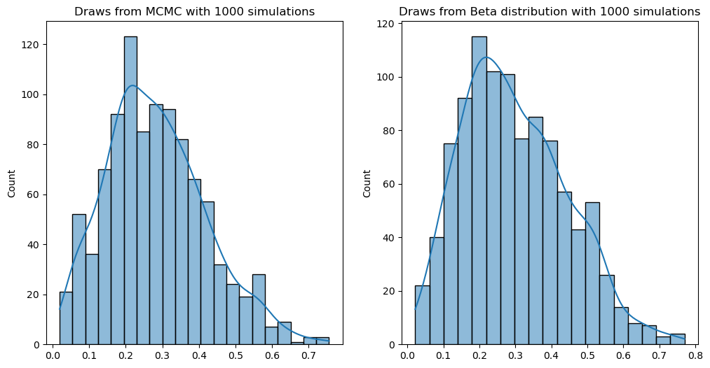

<head>
       <script type="text/x-mathjax-config"> MathJax.Hub.Config({ TeX: { equationNumbers: { autoNumber: "all" } } }); </script>
       <script type="text/x-mathjax-config">
         MathJax.Hub.Config({
           tex2jax: {
             inlineMath: [ ['$','$'], ["\\(","\\)"] ],
              displayMath: [ ['$$','$$'], ["\\[","\\]"] ],
              processEscapes: true
           }
         });
       </script>
       <script src="https://cdn.mathjax.org/mathjax/latest/MathJax.js?config=TeX-AMS-MML_HTMLorMML" type="text/javascript"></script>
       <meta name="google-site-verification" content="kuks5e4as6qBaGVCSzmHkQJa5Tss89_g5DmRXeUi7K8" />
  </head>


# Metropolis-Hastings (MH) algorithms

These algorithms are a series of procedures that help us to draw samples from a target distributions which is known up to a normalizing constant. This type of problems present when dealing with *Bayesian inference*, where the posterior distribution is not fully known because the integration to compute the normalizing constant has to be solved numerically.


## Problem: 

Given a target distribution (density $p$) from which we one to draw samples and which we know up to a normilizing constant, we construct a Markov process whose distribution is $p$.

The core of these and other algorithms is the procedure to build the Markov chain.

The idea behind the MH algorithms is the following: Given the target density $p$ there is an associated conditional density $q$ which is easier to simulate. The MH algorithm for the target $p$ and conditional density $q$ produces a Markov chain $\{X_{t} \}$ whose, as we already mention,  stationary distribution is $p$.

The algorithm follows the steps:

1. Initialize a value $x_0$ (first sample)
2. Generate a value from a random variable $Y_0$ with distribution $q(y\left|x_0 \right.)$
3. Define

    $$
    X_1 = \begin{cases}
        & Y_0 \qquad \text{with probaility } \rho(x_0, Y_0)\\
        & x_0 \qquad \text{with probaility } 1 - \rho(x_0, Y_0)
    \end{cases}
    $$
4. Repeat steps 2 and 3 "sufficiently enough".

where 
    $$
        \rho(x,y) = \min\left\{\frac{p(y)}{p(x)}\frac{q(x|y)}{q(y|x)}, 1 \right\}
    $$

Repetition of steps 2 and 3 will define a sequence of random variables $X_t$ such that $X_0 = x_0$ with probability 1. This sequence is a Markov process. The prove of this fact will be done later in this notebook.

From now on wi will denote $p \propto f$ for $p(x) = \frac{f(x)}{\int_{\mathbb R} f(y)dy}$. This implies that $\frac{p(x)}{p(y)} = \frac{f(x)}{f(y)}$.


**Result** The importanceof this algorithm is the fact that the Markov process $(X_t)$ it produces has $f$ (or more precisely $p$) as a stationary distribution. That is, for large values of $t$, $X^t \sim f$.

## Implementing the MH algorithm


```python
import numpy as np
import scipy.stats
import pandas as pd
import matplotlib.pyplot as plt
```


```python
def MetropolisHasting(x0, target, conditional, simulate_conditional,num_iter =1000):
    
    """
    This function returns the Markov chain for the target distribution
    and conditional distribution.

    Args:
    -----
    target: function object. The target distribution
    conditional: function object. The conditional distribution
    num_iter: int. The number of iterations.
    """
    
    X = np.zeros(num_iter)
    X[0] = x0
    accept = 0

    for t in range(1, num_iter):
        
        y = simulate_conditional(X[t-1])

        u = scipy.stats.uniform.rvs(size = 1)
        rho = target(y)/target(X[t-1]) * conditional(X[t-1])/conditional(y)

        if u<= rho :
            X[t] = y
            accept += 1
        else:
            X[t] = X[t-1]

    acceptance_ratio = accept/num_iter

    return X, acceptance_ratio


    
```

## Examples:

1. Let's simulate a beta distribution $\mathcal{B}(\alpha, \beta)$ with $\alpha =2.7$, $\beta =6.3$ using this algorithm, with conditional distribution the Uniform distribution in $[0,1]$. In this case the conditional distribution does not deppend of the previous value $x^{t-1}$.


```python
a = 2.7
b = 6.3
def conditional(y):

    if y >=0 and y<=1:
        return 1
    else:
        return 0
    
def target(x):

    return scipy.stats.beta.pdf(x, a = 2.7, b= 6.3)

def simulate_conditional(x):

    return scipy.stats.uniform.rvs(loc =0, scale =1, size =1)


```


```python
num_iter = 10**3
x0 = scipy.stats.uniform.rvs(size=1)

X, acceptance_ratio = MetropolisHasting(x0, target, conditional, simulate_conditional, num_iter)

```


```python
acceptance_ratio
```


    0.456


```python
plt.plot(np.linspace(0, num_iter, num_iter), X)

```


    [<matplotlib.lines.Line2D at 0x1378752d0>]


    

    


```python
import seaborn as sns
```


```python
B = scipy.stats.beta.rvs(a = a, b = b, size = num_iter)

plt.figure(figsize=(12, 6))
plt.subplot(121)
sns.histplot(X, kde=True)
plt.title(f"Draws from MCMC with {num_iter} simulations")
plt.subplot(122)
sns.histplot(B, kde=True)
plt.title(f"Draws from Beta distribution with {num_iter} simulations")
plt.show()

```


    

    


Simulating 10000 times:


```python
num_iter = 10**4
x0 = scipy.stats.uniform.rvs(size=1)


X, acceptance_ratio = MetropolisHasting(x0, target, conditional, simulate_conditional, num_iter)
B = scipy.stats.beta.rvs(a = a, b = b, size = num_iter)

```


```python


plt.figure(figsize=(12, 6))
plt.subplot(121)
sns.histplot(X, kde=True)
plt.title(f"Draws from MCMC with {num_iter} simulations")
plt.subplot(122)
sns.histplot(B, kde=True)
plt.title(f"Draws from Beta distribution with {num_iter} simulations")
plt.show()

```


    

    


```python
plt.figure(figsize=(12, 6))
plt.plot(X[4500:4800])
plt.title("zoom in the interval [4500, 4800]")
plt.show()
```


    

    


Lets make a table with several number of simulations and compare the mean and the variance of the sample generated by the algorithm and the sample generated by the distribution Beta itself.


```python
Num_iters = [10**2, 10**3, 10**4, 10**5]
df = pd.DataFrame({}, columns=["num_simulations", "sample mean of X_t", "True mean", "sample variance of X_t", "True variance"], index= np.arange(len(Num_iters)))

df

```


<div>
<style scoped>
    .dataframe tbody tr th:only-of-type {
        vertical-align: middle;
    }

    .dataframe tbody tr th {
        vertical-align: top;
    }

    .dataframe thead th {
        text-align: right;
    }
</style>
<table border="1" class="dataframe">
  <thead>
    <tr style="text-align: right;">
      <th></th>
      <th>num_simulations</th>
      <th>sample mean of X_t</th>
      <th>True mean</th>
      <th>sample variance of X_t</th>
      <th>True variance</th>
    </tr>
  </thead>
  <tbody>
    <tr>
      <th>0</th>
      <td>NaN</td>
      <td>NaN</td>
      <td>NaN</td>
      <td>NaN</td>
      <td>NaN</td>
    </tr>
    <tr>
      <th>1</th>
      <td>NaN</td>
      <td>NaN</td>
      <td>NaN</td>
      <td>NaN</td>
      <td>NaN</td>
    </tr>
    <tr>
      <th>2</th>
      <td>NaN</td>
      <td>NaN</td>
      <td>NaN</td>
      <td>NaN</td>
      <td>NaN</td>
    </tr>
    <tr>
      <th>3</th>
      <td>NaN</td>
      <td>NaN</td>
      <td>NaN</td>
      <td>NaN</td>
      <td>NaN</td>
    </tr>
  </tbody>
</table>
</div>


```python
for i, num_iter in enumerate(Num_iters):
    x0 = scipy.stats.uniform.rvs(size=1)
    X, _ = MetropolisHasting(x0, target, conditional, simulate_conditional, num_iter)
    B = scipy.stats.beta.rvs(a = a, b = b, size = num_iter)
    df.iloc[i]["num_simulations"] = num_iter
    df.iloc[i]["sample mean of X_t"] = X.mean()
    df.iloc[i]["sample variance of X_t"] = (X.std())**2

```


```python
df["True mean"] = a/(a+b)
df["True variance"] = a*b/((a+b)**2 * (a +b +1))

df

```


<div>
<style scoped>
    .dataframe tbody tr th:only-of-type {
        vertical-align: middle;
    }

    .dataframe tbody tr th {
        vertical-align: top;
    }

    .dataframe thead th {
        text-align: right;
    }
</style>
<table border="1" class="dataframe">
  <thead>
    <tr style="text-align: right;">
      <th></th>
      <th>num_simulations</th>
      <th>sample mean of X_t</th>
      <th>True mean</th>
      <th>sample variance of X_t</th>
      <th>True variance</th>
    </tr>
  </thead>
  <tbody>
    <tr>
      <th>0</th>
      <td>100</td>
      <td>0.296074</td>
      <td>0.3</td>
      <td>0.028487</td>
      <td>0.021</td>
    </tr>
    <tr>
      <th>1</th>
      <td>1000</td>
      <td>0.321668</td>
      <td>0.3</td>
      <td>0.021139</td>
      <td>0.021</td>
    </tr>
    <tr>
      <th>2</th>
      <td>10000</td>
      <td>0.302469</td>
      <td>0.3</td>
      <td>0.021061</td>
      <td>0.021</td>
    </tr>
    <tr>
      <th>3</th>
      <td>100000</td>
      <td>0.299777</td>
      <td>0.3</td>
      <td>0.021025</td>
      <td>0.021</td>
    </tr>
  </tbody>
</table>
</div>


Let us now create "iid" samples from a beta distribution using the MH algorithm. the idea is to simulate samples $X_t$ for $t=1,\dots, num_{iter}$ with $num_{iter}$ let's say equals to 100 and take the final value simulated as one of our samples. We will do this a num_sample times.


```python
num_iter = 100
num_samples = 10**3

X = np.zeros(num_samples)

for t in range(num_samples):
    x0 = scipy.stats.uniform.rvs(size = 1)
    xt, _ = MetropolisHasting(x0, target, conditional, simulate_conditional, num_iter=num_iter)
    X[t] = xt[-1]

```


```python
B = scipy.stats.beta.rvs(a = a, b = b, size = num_samples)
```


```python
sns.histplot(X)
sns.histplot(B)
plt.show()
```


    

    


```python
scipy.stats.kstest(X, scipy.stats.beta.cdf, (a, b))


```


    KstestResult(statistic=0.03126582641560305, pvalue=0.2765260242534817, statistic_location=0.3033863188261565, statistic_sign=1)


```python
scipy.stats.kstest(X, B)

```


    KstestResult(statistic=0.043, pvalue=0.3136800387320582, statistic_location=0.3283607597347612, statistic_sign=1)


Since the $p$-value is big enough, we cannot reject the null hypothesis, that is, $X$ is most likely to be a draw samples from a beta distribution $\mathcal {B}(\alpha=2.7, \beta =6.3)$

## Other Monte Carlo Simulations


```python
n = 10000

U = scipy.stats.uniform.rvs(size =n)
p_1 = 1/4
p_2 = 3/4
mu1 = 0
mu2 = 5

X = (U <= p_1)*(mu1 + scipy.stats.norm.rvs(size=len(U <= p_1))) + (U > p_1)*(mu2 + scipy.stats.norm.rvs(size= len(U>p_1)))

sns.histplot(X, bins = 100)
```


    <Axes: ylabel='Count'>


    

    


```python
n = 10**3
target = lambda x: (np.cos(50*x) + np.sin(20*x))**2
grid = np.linspace(0, 1, 1000)

plt.plot(grid, target(grid))
plt.title("function to be optimized")
plt.show()
```


    

    


```python
num_iter = 10**3
estimated_max = np.zeros(num_iter)
estimated_argmax = np.zeros(num_iter)

for i in range(num_iter):
    u = scipy.stats.uniform.rvs(size = n)
    f = target(u)
    estimated_max[i] = f.max()
    estimated_argmax[i] = u[np.argmax(f)]


```


```python
plt.figure(figsize=(12,6))
plt.subplot(121)
plt.hist(estimated_max, bins=100)
plt.subplot(122)
plt.hist(estimated_argmax, bins=100)
plt.show()
```


    

    


```python

```
