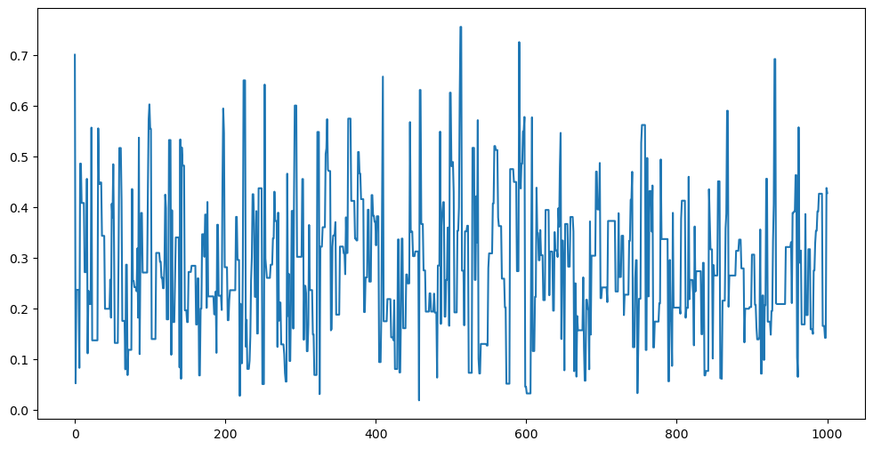

# Metropolis-Hastings (MH) algorithms

These algorithms are a series of procedures that help us to draw samples from a target distributions which is known up to a normalizing constant. This type of problems present when dealing with *Bayesian inference*, where the posterior distribution is not fully known because the integration to compute the normalizing constant has to be solved numerically.


## Problem: 

Given a target distribution (density $p$) from which we want to draw samples and which we know up to a normilizing constant, we construct a Markov chain whose stationary distribution is $p$.

The core of these and other algorithms is the procedure to build the Markov chain.

The idea behind the MH algorithms is the following: Given the target density $p$ there is an associated conditional density $q$ which is easier to simulate. The MH algorithm for the target $p$ and conditional density $q$ produces a Markov chain $\{X_{t} \}$ whose, as we already mention,  stationary distribution is $p$.

The algorithm follows the steps:

1. Initialize a value $x_0$

2. Draw a random sample $y$ form the distribution $q(y | x_0)$ ($y$ is a candidate which we will accept or reject)

3. Define

    $$
    X_1 = \begin{cases}
        & y \qquad \text{with probaility } \rho(x_0, y)\\
        & x_0 \qquad \text{with probaility } 1 - \rho(x_0, y)
    \end{cases}
    $$

4. Repeat steps 2 and 3 "sufficiently enough".

where 
    $$
        \rho(x,y) = \min\left\{\frac{g(y)}{g(x)}\frac{q(x|y)}{q(y|x)}, 1 \right\}, \quad p\propto g
    $$

Repetition of steps 2 and 3 will define a sequence of random variables $X_t$ such that $X_0 = x_0$ with probability 1. This sequence is a Markov process. The prove of this fact will be done later in this notebook.

From now on we will denote $p \propto g$ for $p(x) = \frac{g(x)}{\int_{\mathbb R} g(y)dy}$. This implies that $\frac{p(x)}{p(y)} = \frac{g(x)}{g(y)}$.


**Result** The importanceof this algorithm is the fact that the Markov process $(X_t)$ it produces has $p$ as its stationary distribution. That is, for large values of $t$, $X_t \sim p$.

## Implementing the MH algorithm


```python
import numpy as np
import scipy.stats
import pandas as pd
import matplotlib.pyplot as plt
import pymc3
import arviz    # to compute effective sample size of MCMC
import statsmodels as sm
from statsmodels.graphics import tsaplots
```


```python
def MetropolisHasting(x0, target, conditional, simulate_conditional,num_iter =1000):
    
    """
    This function returns the Markov chain for the target distribution
    and conditional distribution.

    Args:
    -----
    target: function object. The target distribution
    conditional: function object. The conditional distribution
    num_iter: int. The number of iterations.
    """
    
    X = np.zeros(num_iter)
    X[0] = x0
    accept = 0

    for t in range(1, num_iter):
        
        y = simulate_conditional(X[t-1])

        u = scipy.stats.uniform.rvs(size = 1)
        rho = target(y)/target(X[t-1]) * conditional(X[t-1])/conditional(y)

        if u<= rho :
            X[t] = y
            accept += 1
        else:
            X[t] = X[t-1]

    acceptance_ratio = accept/num_iter

    return X, acceptance_ratio


    
```

## Examples:


### 1. 
Let's simulate a beta distribution $\mathcal{B}(\alpha, \beta)$ with $\alpha =2.7$, $\beta =6.3$ using this algorithm, with conditional distribution the Uniform distribution in $[0,1]$. In this case the conditional distribution does not deppend of the previous value $x^{t-1}$.

In this example the target distribution is $p(\theta) = \frac{\Gamma(\alpha + \beta)}{\Gamma(\alpha)\Gamma(\beta)}\theta^{\alpha-1}(1-\theta)^{\beta-1} {\bf 1}_{[0,1]}(\theta)$ which is completely known and also we could sample from it directly, but for the sake of understanding and checking how it works in a known distribution let's assume we only know $p$ up to a normalizing constant, that is:

$$
p(\theta) \propto g(\theta) = \theta^{\alpha-1}(1-\theta)^{\beta-1} {\bf 1}_{[0,1]}(\theta)
$$

and we will use this function $g$ as the target in the algorithm defined above:


```python
a = 2.7
b = 6.3
def conditional(y):

    if y >=0 and y<=1:
        return 1
    else:
        return 0
    
def target(x):

    return x**(a-1)*(1-x)**(b-1)*(x>0 and x< 1)

def simulate_conditional(x):

    return scipy.stats.uniform.rvs(loc =0, scale =1, size =1)


```


```python
num_iter = 10**3
x0 = scipy.stats.uniform.rvs(size=1)

X, acceptance_ratio = MetropolisHasting(x0, target, conditional, simulate_conditional, num_iter)

```


```python
acceptance_ratio
```


    0.471


```python
plt.figure(figsize=(12, 6))
plt.plot(np.linspace(0, num_iter, num_iter), X)
plt.show()

```


    

    


```python
import seaborn as sns
```


```python
B = scipy.stats.beta.rvs(a = a, b = b, size = num_iter)

plt.figure(figsize=(12, 6))
plt.subplot(121)
sns.histplot(X, kde=True)
plt.title(f"Draws from MCMC with {num_iter} simulations")
plt.subplot(122)
sns.histplot(B, kde=True)
plt.title(f"Draws from Beta distribution with {num_iter} simulations")
plt.show()

```


    

    


Simulating 10000 times:


```python
num_iter = 10**4
x0 = scipy.stats.uniform.rvs(size=1)


X, acceptance_ratio = MetropolisHasting(x0, target, conditional, simulate_conditional, num_iter)
B = scipy.stats.beta.rvs(a = a, b = b, size = num_iter)

```


```python


plt.figure(figsize=(12, 6))
plt.subplot(121)
sns.histplot(X, kde=True)
plt.title(f"Draws from MCMC with {num_iter} simulations")
plt.subplot(122)
sns.histplot(B, kde=True)
plt.title(f"Draws from Beta distribution with {num_iter} simulations")
plt.show()

```


    

    


```python
plt.figure(figsize=(12, 6))
plt.plot(X[4500:4800])
plt.title("zoom in the interval [4500, 4800]")
plt.show()
```


    

    


Lets make a table with several number of simulations and compare the mean and the variance of the sample generated by the algorithm and the sample generated by the distribution Beta itself.


```python
Num_iters = [10**2, 10**3, 10**4, 10**5]
df = pd.DataFrame({}, columns=["num_simulations", "sample mean of X_t", "True mean", "sample variance of X_t", "True variance"], index= np.arange(len(Num_iters)))


for i, num_iter in enumerate(Num_iters):
    x0 = scipy.stats.uniform.rvs(size=1)
    X, _ = MetropolisHasting(x0, target, conditional, simulate_conditional, num_iter)
    B = scipy.stats.beta.rvs(a = a, b = b, size = num_iter)
    df.iloc[i]["num_simulations"] = num_iter
    df.iloc[i]["sample mean of X_t"] = X.mean()
    df.iloc[i]["sample variance of X_t"] = (X.std())**2

```


```python
df["True mean"] = a/(a+b)
df["True variance"] = a*b/((a+b)**2 * (a +b +1))

df

```


<div>
<style scoped>
    .dataframe tbody tr th:only-of-type {
        vertical-align: middle;
    }

    .dataframe tbody tr th {
        vertical-align: top;
    }

    .dataframe thead th {
        text-align: right;
    }
</style>
<table border="1" class="dataframe">
  <thead>
    <tr style="text-align: right;">
      <th></th>
      <th>num_simulations</th>
      <th>sample mean of X_t</th>
      <th>True mean</th>
      <th>sample variance of X_t</th>
      <th>True variance</th>
    </tr>
  </thead>
  <tbody>
    <tr>
      <th>0</th>
      <td>100</td>
      <td>0.33018</td>
      <td>0.3</td>
      <td>0.028692</td>
      <td>0.021</td>
    </tr>
    <tr>
      <th>1</th>
      <td>1000</td>
      <td>0.291244</td>
      <td>0.3</td>
      <td>0.019324</td>
      <td>0.021</td>
    </tr>
    <tr>
      <th>2</th>
      <td>10000</td>
      <td>0.301379</td>
      <td>0.3</td>
      <td>0.020117</td>
      <td>0.021</td>
    </tr>
    <tr>
      <th>3</th>
      <td>100000</td>
      <td>0.298979</td>
      <td>0.3</td>
      <td>0.021073</td>
      <td>0.021</td>
    </tr>
  </tbody>
</table>
</div>


Let us now create "iid" samples from a beta distribution using the MH algorithm. the idea is to simulate samples $X_t$ for $t=1,\dots, num_{iter}$ with $num_{iter}$ let's say equals to 100 and take the final value simulated as one of our samples. We will do this a num_sample times.


```python
num_iter = 100
num_samples = 10**3

X = np.zeros(num_samples)

for t in range(num_samples):
    x0 = scipy.stats.uniform.rvs(size = 1)
    xt, _ = MetropolisHasting(x0, target, conditional, simulate_conditional, num_iter=num_iter)
    X[t] = xt[-1]

```


```python
B = scipy.stats.beta.rvs(a = a, b = b, size = num_samples)
```


```python
sns.histplot(X)
sns.histplot(B)
plt.show()
```


    

    


```python
scipy.stats.kstest(X, scipy.stats.beta.cdf, (a, b))


```


    KstestResult(statistic=0.03126582641560305, pvalue=0.2765260242534817, statistic_location=0.3033863188261565, statistic_sign=1)


```python
scipy.stats.kstest(X, B)

```


    KstestResult(statistic=0.043, pvalue=0.3136800387320582, statistic_location=0.3283607597347612, statistic_sign=1)


Since the $p$-value is big enough, we cannot reject the null hypothesis, that is, $X$ is most likely to be a draw samples from a beta distribution $\mathcal {B}(\alpha=2.7, \beta =6.3)$

### 2. MH Random Walk with normal likelihood and $t$ prior for the mean.

Suppose we have the following data of the change rate in personnel from last year to this year for $n$ companies. We know that if the likelihood is normal with known variance and a normal prior for the mean, then the posterior for the mean is a normal distribution from which we could draw samples very easily. In this example we are going to use the MH algorithm for two different priors: normal and t.

The data of the companies is the following:

$$
y= [1.2, 1.4, -0.5, 0.3, 0.9, 2.3, 1.0, 0.1, 1.3, 1.9] 
$$

then thw two models are:

model 1:
$$
\begin{align*}
& Y_1, \dots, Y_n |\mu,\sigma^2 \sim_{iid} \mathcal{N}(\mu, \sigma_0^2)\\
& \mu \sim N(\mu_0, \tau_0^2)
\end{align*}
$$

The posterior for this model is:
$$
\begin{align*}
p(\mu|y_1,\dots,y_n) &\propto p(y_1,\dots,y_n|\mu)p(\mu)\\
& \propto \exp\left(-\frac{1}{2}(\sum_{i}(y_i - \mu)^2)\right)\exp\left(-\frac{1}{2\tau_0^2}(\mu-\mu_0)^2\right)\\
& \propto \exp\left(-\frac{1}{2}(1/\tau_0^2 + n)\mu^2 + \mu(n\bar{y}_n + \mu_0/\tau_0^2) \right) = g_1(\mu)
\end{align*}
$$

model 2:

$$
\begin{align*}
& Y_1, \dots, Y_n |\mu,\sigma^2 \sim_{iid} \mathcal{N}(\mu, \sigma_0^2)\\
& \mu \sim t(0, 1, 1)
\end{align*}
$$

where $t(0,1,1)$ is a t distribution with location parameter $a = 0$, scale parameter $\tau = 1$ and degrees of freedom $\nu =1$. See <a href = "https://en.wikipedia.org/wiki/Student%27s_t-distribution"> Wikipedia article </a> for more information on the t distribution.

The posterior for this model is:

$$
\begin{align*}
p(\mu|y_1,\dots,y_n) &\propto p(y_1,\dots,y_n|\mu)p(\mu)\\
& \propto \exp\left(-\frac{1}{2}(\sum_{i}(y_i - \mu)^2)\right)\frac{1}{1+\mu^2}\\
& \propto \frac{\exp\left(-\frac{n}{2}\mu^2 + n\bar{y}_n\mu\right)}{1+\mu^2} = g_2(\mu)
\end{align*}
$$


For stability and numerical reasons we will compute $\log(g(\mu))$ instead of $g(\mu)$ and the logarithm of the acceptance ratio $\log(\rho(x,y))$.

As candidate conditional distribution $q(x|y)$ we are going to choose a normal distribution with mean $y$, that is $q(x|y) =\mathcal{N}(y, \phi)$. By symmetry of the normal distribution with respect to its mean we have $q(x|y) = q(y|x)$, that is, the gaussian density centered at $y$ evaluated in $x$ produces the same value as the gaussian centered at $x$ and evaluated at $y$, therefore the factors $q(x|y), q(y|x)$ will cancel out in the expression for $\rho$ above and the acceptance ratio will be in this case:
$$
\rho(x, y) = \frac{g(y)}{g(x)}.
$$

This particular form of the alogrithm is called the Random Walk Metropolis Hastings.


```python
def log_g1(mu, n, ybar, mu0, tau0_sq):
    
    return -0.5*(1/tau0_sq + n)*mu**2 + (n*ybar +mu0/tau0_sq)*mu

def log_g2(mu, n, ybar):
    
    return n*(ybar*mu - mu**2/2) - np.log(1+mu**2)

def Random_Walk_MH(mu_init, n, ybar, n_iter, log_target, sig_candidate,  *params):

    """
    Implemente Metropolis Hastings to draw samples from the posterior distribuition
    for the mean of normal data with prior given by normal or t student (depending on log_target parameter).

    The candidate distribution for mu_i+1 is N(mu_i, sig_candidate)
    
    """

    mu_output = np.zeros(n_iter)
    # step 1: initialize
    mu_now = mu_init
    log_target_now = log_target(mu_now, n, ybar, *params)
    accept = 0  # to track the rate of acceptance

    for i in range(n_iter):

        mu_cand = scipy.stats.norm.rvs(loc = mu_now, scale = sig_candidate, size =1)
        
        # step 2: reject accept:
        log_target_cand  = log_target(mu_cand, n, ybar, *params)
        log_rho = log_target_cand - log_target_now  # log of acceptance ratio
        rho = np.exp(log_rho)   #acceptance ratio
        u = scipy.stats.uniform.rvs()  # uniform r.v in [0, 1]

        if u < rho:
            mu_now = mu_cand
            accept += 1   
            log_target_now = log_target_cand

        mu_output[i] = mu_now

    return mu_output, accept/n_iter


```


```python
y = np.array([1.2, 1.4, -0.5, 0.3, 0.9, 2.3, 1.0, 0.1, 1.3, 1.9])
n = len(y)
ybar = np.mean(y)
mu0 = 0     # prior mean of mu
tau0_sq = 1  #prior standard deviation mu
```


```python
# plot data and prior distribution
x1 = np.linspace(scipy.stats.norm.ppf(0.01, loc = mu0, scale =tau0_sq), scipy.stats.norm.ppf(0.99, loc = mu0, scale =tau0_sq), 100)
x2 = np.linspace(scipy.stats.t.ppf(0.1, df =1,  loc = 0, scale = 1), scipy.stats.t.ppf(0.9, df = 1, loc = 0, scale = 1), 100)

plt.figure(figsize=(12,6))
sns.histplot(y, stat="density")
plt.plot(x1, scipy.stats.norm.pdf(x1, loc = mu0, scale = tau0_sq), label = "$N(\mu_0, \tau_0))$")
plt.plot(x2, scipy.stats.t.pdf(x2, df =1, loc = mu0, scale = tau0_sq), label = "$t(0, 1, 1))$")
plt.plot(ybar, 0., ".", color = 'red')
plt.ylim((-0.1, 1))
plt.legend()
plt.show()
```


    

    


```python
mu_init = 0.0
n_iter = 1000
sig_candidate = 2.0
posterior11, acceptance_ratio1 = Random_Walk_MH(mu_init, n, ybar, n_iter, log_g1,
                                              sig_candidate, mu0, tau0_sq)

posterior21, acceptance_ratio2 = Random_Walk_MH(mu_init, n, ybar, n_iter, log_g2,
                                              sig_candidate)
```

Lets make a traceplot for the samples:


```python
plt.figure(figsize=(16,9))
plt.plot(np.arange(n_iter), posterior11, label = " with normal prior , accept ratio = " + str(acceptance_ratio1))
plt.plot(np.arange(n_iter), posterior21, label = " with t prior, accept ratio = " + str(acceptance_ratio2))
plt.title("Traceplot for samples from posterior")
plt.legend()
plt.show()
```


    

    


```python
print(f"Estimated Posterior means are: {np.mean(posterior11)} {np.mean(posterior21)}")
```

    Estimated Posterior means are: 0.8928566267385178 0.9093672169144001


Lets plot the theoretical posterior density, which in this case is known, and the empiric distribution for the samples obtained with the algorithm:


```python
# posterior mean and variance:
sig_0 = 1
data_prec = n/sig_0**2   # precision of data defined as the inverese of the variance of ybar : n/sigma_0^2
prior_prec = 1/tau0_sq**2 # prior precision of mu
posterior_prec = data_prec + prior_prec

sigma_post = np.sqrt(1/posterior_prec)
mu_post = ybar * data_prec/posterior_prec + mu0 * prior_prec/posterior_prec

griid = np.linspace(-2,4, 1000)

plt.figure(figsize=(10, 5))
sns.kdeplot(posterior11, label = "kernel density estimation form MCMC samples")
plt.plot(ybar, 0 , "o", color = "red", label = "y_bar")
plt.plot(y, np.zeros(n), ".", label = 'data points', color = "green")
plt.plot(griid, scipy.stats.norm.pdf(griid, loc = mu_post, scale = sigma_post), color = "purple", label = "posterior")
plt.plot(griid, scipy.stats.norm.pdf(griid, loc = mu0, scale = tau0_sq),color = "magenta", label = "prior")
plt.legend()
plt.ylim((-0.1, 1.8))
plt.show()
```


    

    


What if we start very far form 0, that is, $\mu_{init}=30$


```python
mu_init = 30.0
n_iter = 1000
sig_candidate = 2.0
posterior12, acceptance_ratio1 = Random_Walk_MH(mu_init, n, ybar, n_iter, log_g1,
                                              sig_candidate, mu0, tau0_sq)

posterior22, acceptance_ratio2 = Random_Walk_MH(mu_init, n, ybar, n_iter, log_g2,
                                              sig_candidate)

plt.figure(figsize=(9,3))
plt.plot(np.arange(n_iter), posterior12, label = " with normal prior , accept ratio = " + str(acceptance_ratio1))
plt.plot(np.arange(n_iter), posterior22, label = " with t prior, accept ratio = " + str(acceptance_ratio2))
plt.title("samples from posterior")
plt.legend()
plt.show()
```

    /var/folders/_k/l4kdd2l942d2rkf41cjh5_1m0000gn/T/ipykernel_5971/3533057667.py:32: RuntimeWarning: overflow encountered in exp
      rho = np.exp(log_rho)   #acceptance ratio


    

    


From the traceplot above we can observe that it took a while to reach the stationary distribution. We can discard the first 50-100 samples and compute the estimated posterior mean using the 900-950 samples left.


```python
mu_keep1 = posterior12[100:].mean()
mu_keep2 = posterior22[100:].mean()

print(f"the estimated posterior mean for both priors are: {mu_keep1, mu_keep2}")

```

    the estimated posterior mean for both priors are: (0.9013495007246863, 0.9142480507387665)


Compare these estimated values with the one computed without discarding the first 100 samples:


```python
mu_post1 = posterior12.mean()
mu_post2 = posterior22.mean()

print(mu_post1, mu_post2)
```

    1.5008917556855468 1.5519075907865219


And also compare these values with the ones obtained using the samples with initial $\mu$ given by 0, a number closer to the sample mean of data $Y$. These values are: 


```python
print(f"Estimated Posterior means for mu_init = 0.0 are: {np.mean(posterior11)} {np.mean(posterior21)}")
```

    Estimated Posterior means for mu_init = 0.0 are: 0.9213547095945693 0.9147392722559775


### What about the standard error for the estimator of the posterior mean?

If we were to estimate the mean of a distribution using iid samples $Y_1,\dots, Y_n ~Y$, we know that the standard error of the estimator is:
$$
se(\hat{\mu}) = \frac{\widehat{\mathbb{V}(Y)}}{n}
$$
this is known as the Monte Carlo error.

Since we are not drawing independent samples, for the algorithm produce a Markov chain, the samples might be (and definitely are) correlated, we cannot expect the same standard error for the estimator of the posterior mean. 

First, lets make some correlation plots for the samples obtained above:


```python
fig, axs = plt.subplots(nrows=3, ncols= 2, figsize=(10,6), sharex=True, squeeze=False, constrained_layout = True)
tsaplots.plot_acf(posterior11, ax = axs[0,0], title="Normal prior, mu_init =0")
tsaplots.plot_acf(posterior12, ax = axs[1,0], title="Normal prior, mu_init =30")
tsaplots.plot_acf(posterior12[100:], ax = axs[2,0], title="Normal prior, mu_init =30 with discarded samples")
tsaplots.plot_acf(posterior21, ax = axs[0,1], title = "t prior with mu_init =0")
tsaplots.plot_acf(posterior22, ax = axs[1,1], title= "t prior with mu_init =30")
tsaplots.plot_acf(posterior22[100:], ax = axs[2,1], title= "t prior with mu_init =30 with discarded samples")
fig.suptitle("Autocorrelation of samples")
plt.show()
```


    

    


Note that for the samples generated with $\mu_{init}=30$ the correlation starts vanishing after the lag 25, at least for the case where we did not discard the first 100 samples. When these samples are discarded the correlation vanishes after 5 to 10 lags. This is similar to the samples with $\mu_init =0$. 

Now that we saw that these are not independent sample, what is the standard error for this estimator?


```python

```


```python
arviz.ess(posterior2)
```


    61.711390756531806


```python

```
