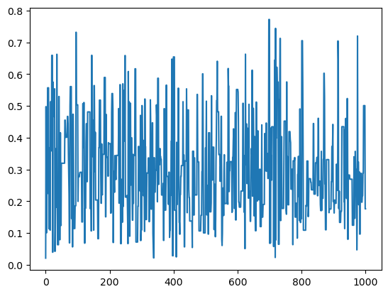

<head>
       ...
       <script type="text/x-mathjax-config"> MathJax.Hub.Config({ TeX: { equationNumbers: { autoNumber: "all" } } }); </script>
       <script type="text/x-mathjax-config">
         MathJax.Hub.Config({
           tex2jax: {
             inlineMath: [ ['$','$'], ["\\(","\\)"] ],
             processEscapes: true
           }
         });
       </script>
       <script src="https://cdn.mathjax.org/mathjax/latest/MathJax.js?config=TeX-AMS-MML_HTMLorMML" type="text/javascript"></script>
 </head>
<h1> Metropolis-Hastings (MH) algorithms </h1>

These algorithms are a series of procedures that help us to draw samples from a target distributions which is known up to a normalizing constant. This type of problems present when dealing with *Bayesian inference*, where the posterior distribution is not fully known because the integration to compute the normalizing constant has to be solved numerically.


## Problem: 

Given a target distribution (density $p$) from which we one to draw samples and which we know up to a normilizing constant, we construct a Markov process whose distribution is $p$.

The core of these and other algorithms is the procedure to build the Markov chain.

The idea behind the MH algorithms is the following: Given the target density $p$ there is an associated conditional density $q$ which is easier to simulate. The MH algorithm for the target $p$ and conditional density $q$ produces a Markov chain $\{X_{t} \}$ whose, as we already mention,  stationary distribution is $p$.

The algorithm follows the steps:

1. Initialize a value $x_0$ (first sample)
2. Generate a value from a random variable $Y_0$ with distribution $q(y|x_0)$
3. Define
```math
       X_1 = \begin{cases}
        & Y_0 \qquad \text{with probaility } \rho(x_0, Y_0)\\
        & x_0 \qquad \text{with probaility } 1 - \rho(x_0, Y_0)\end{cases}
```
5. Repeat steps 2 and 3 "sufficiently enough".

where 

```math
    \rho(x,y) = \min\left\{\frac{p(y)}{p(x)}\frac{q(x|y)}{q(y|x)}, 1 \right\}
```

Repetition of steps 2 and 3 will define a sequence of random variables $X_t$ such that $X_0 = x_0$ with probability 1. This sequence is a Markov process. The prove of this fact will be done later in this notebook.

From now on wi will denote $p \propto f$ for $p(x) = \frac{f(x)}{\int_{\mathbb R} f(y)dy}$. This implies that $\frac{p(x)}{p(y)} = \frac{f(x)}{f(y)}$.


**Result** The importanceof this algorithm is the fact that the Markov process $(X_t)$ it produces has $f$ (or more precisely $p$) as a stationary distribution. That is, for large values of $t$, $X^t \sim f$.

## Implementing the MH algorithm


```python
import numpy as np
import scipy.stats
import pandas as pd
import matplotlib.pyplot as plt
```


```python
scipy.stats.norm.rvs(size = 1)
```


    array([-0.01738963])


```python
def MetropolisHasting(target, conditional, simulate_conditional,num_iter =1000):
    
    """
    This function returns the Markov chain for the target distribution
    and conditional distribution.

    Args:
    -----
    target: function object. The target distribution
    conditional: function object. The conditional distribution
    num_iter: int. The number of iterations.
    """
    
    x0 = scipy.stats.uniform.rvs(size = 1)

    X = np.zeros(num_iter)
    X[0] = x0
    accept = 0

    for t in range(1, num_iter):
        
        y = simulate_conditional(X[t-1])

        u = scipy.stats.uniform.rvs(size = 1)
        rho = target(y)/target(X[t-1]) * conditional(X[t-1])/conditional(y)

        if u<= rho :
            X[t] = y
            accept += 1
        else:
            X[t] = X[t-1]

    acceptance_ratio = accept/num_iter

    return X, acceptance_ratio
    
```

## Examples:

1. Let's simulate a beta distribution $\mathcal{B}(\alpha, \beta)$ with $\alpha =2.7$, $\beta =6.3$ using this algorithm, with conditional distribution the Uniform distribution in $[0,1]$. In this case the conditional distribution does not deppend of the previous value $x^{t-1}$.


```python
a = 2.7
b = 6.3
def conditional(y):

    if y >=0 and y<=1:
        return 1
    else:
        return 0
    
def target(x):

    return scipy.stats.beta.pdf(x, a = 2.7, b= 6.3)

def simulate_conditional(x):

    return scipy.stats.uniform.rvs(loc =0, scale =1, size =1)


```


```python
num_iter = 10**3

X, acceptance_ration = MetropolisHasting(target, conditional, simulate_conditional, num_iter)

```


```python
acceptance_ration
```


    0.477


```python
plt.plot(np.linspace(0, num_iter, num_iter), X)

```


    [<matplotlib.lines.Line2D at 0x12e95bac0>]


    

    


```python
import seaborn as sns
```


```python
B = scipy.stats.beta.rvs(a = 2.7, b = 6.3, size = num_iter)

plt.figure(figsize=(12, 6))
plt.subplot(121)
sns.histplot(X, kde=True)
plt.title(f"Draws from MCMC with {num_iter} simulations")
plt.subplot(122)
sns.histplot(B, kde=True)
plt.title(f"Draws from Beta distribution with {num_iter} simulations")
plt.show()

```


    


<!--  -->
    


Simulating 10000 times:


```python
num_iter = 10**4

X, acceptance_ratio = MetropolisHasting(target, conditional, simulate_conditional, num_iter)
B = scipy.stats.beta.rvs(a = 2.7, b = 6.3, size = num_iter)

```


```python


plt.figure(figsize=(12, 6))
plt.subplot(121)
sns.histplot(X, kde=True)
plt.title(f"Draws from MCMC with {num_iter} simulations")
plt.subplot(122)
sns.histplot(B, kde=True)
plt.title(f"Draws from Beta distribution with {num_iter} simulations")
plt.show()

```


    

    


```python
plt.figure(figsize=(12, 6))
plt.plot(X[4500:4800])
plt.title("zoom in the interval [4500, 4800]")
plt.show()
```


    

    


```python

```
