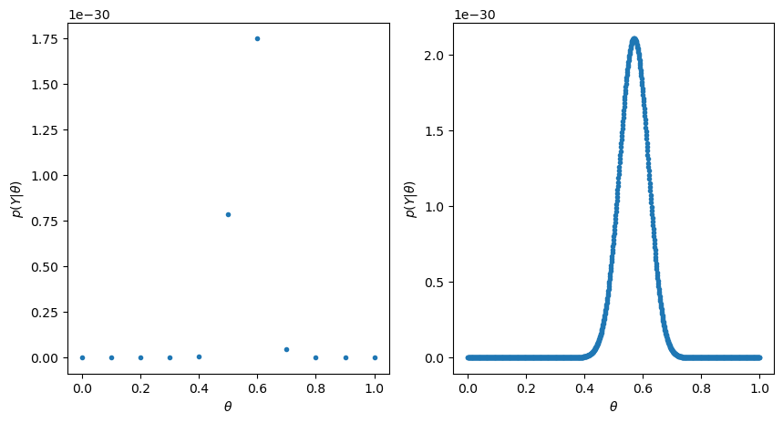
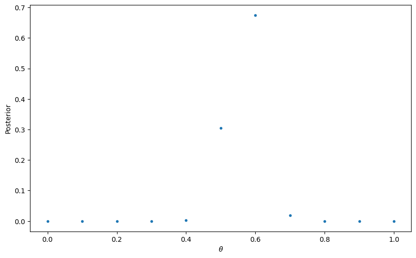
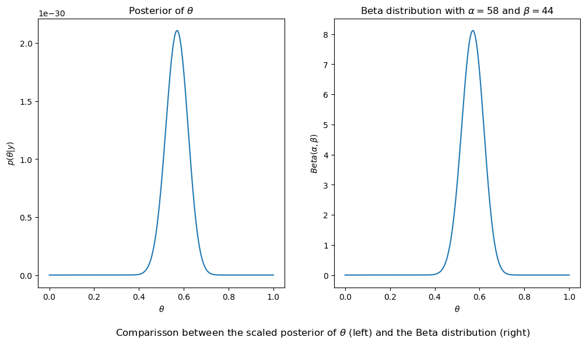

<head>
  <script type="text/x-mathjax-config"> MathJax.Hub.Config({ TeX: { equationNumbers: { autoNumber: "all" } } }); </script>
  <script type="text/x-mathjax-config">
    MathJax.Hub.Config({
      tex2jax: {
        inlineMath: [ ['$','$'], ["\\(","\\)"] ],
         displayMath: [ ['$$','$$'], ["\\[","\\]"] ],
         processEscapes: true
      }
    });
  </script>
  <script src="https://cdn.mathjax.org/mathjax/latest/MathJax.js?config=TeX-AMS-MML_HTMLorMML" type="text/javascript"></script>
  <meta name="google-site-verification" content="kuks5e4as6qBaGVCSzmHkQJa5Tss89_g5DmRXeUi7K8" />
</head>


<h1>Bayesian Statistics: a Crash Course </h1>
<header>

<h2>Table of contents</h2>
<nav>
 <ol>
     <li><a href="#introbayesian"> Introduction to Bayesian Inference  </a></li>
     <li> Bayesian Approach</li>
         <ul>
           <li><a href = "ConjugateDist">Conjugate Distributions</a></li>
        </ul>
    <li>Frequentist Approach </li>
         <ul> 
           <li> <a href = "HypothesisTest">  Hypothesis Test</a> </li>
         </ul>
    <li> Markov Chain Monte Carlo: Algorithms and Simulations</li>
        <ul>
            <li><a href = "Metropolis-Hastings"> Metropolis Hastings Algorithm </a></li>
         </ul>
 </ol>
</nav>
</header>

 <a href="ConjugateDist" class="next">Next &raquo;</a>


<h2 id = "introbayesian">Introduction to Bayesian Inference  </h2>
 <p>
Bayesian statistics is a tool in statistical inference in which a parameter to be estimated (or infered) is not consider 
an unknown but deterministic quantity rather than a random variable itself. 
<br> 
The idea is that one has a prior believe of the parameter $\theta$ in question that is expressed in terms of what is called the 
prior probability $p(\theta)$. This probability is updated to what is called as posterior probability via Bayes Theorem in the following way: 

$$
 p(\theta|y) = \frac{p(y|\theta) p(\theta)}{\int_{\theta \in \Theta}p(y|\theta) p(\theta)\,d\theta}
$$

where the integral in the denominator is a normalizing constant in order for $p(\theta|y)$ to be a probability distribution.
</p>

To illustrate better let us consider the following example:

<h3> Example </h3>

Sample survey: Suppose we are going to sample $n=100$ individuals from a county (of size much larger than $n$) and ask each sampled person whether they support policy Z or not. Let $Y_i = 1$ if person i in the sample supports the policy, and $Y_i = 0$ otherwise.

Assume that $Y_1, \dots, Y_{n}$ are, conditional on $\theta$, identically distributed and independent random variables each of distribution $Ber(\theta)$. Then the joint distribution conditional on $\theta$ is:

$$
  p(y_1,\dots, y_n |\theta) = \prod_{i=1}^n\theta^{y_i}(1-\theta)^{1-\theta_i} = \theta^{\sum_{i}y_i}(1-\theta)^{n-\sum_{i}y_i}
$$

For the moment assume that your believe on $\theta$ is that $\theta \in\{0, 0.1, 0.2, \dots, 0.9, 1 \}$. Given that the results of the survey are: $\sum_{i=1}^n y_i = 57$,let us compute for each value of $\theta$, $\mathbb{P}(\sum_i Y_i = 57 \|\theta)$ and plot these results as a function of $\theta$:


```python
import numpy as np
import matplotlib.pyplot as plt
import scipy
```


```python
n = 100
sum_y = 57
thetas = np.linspace(0, 1., 11)
x = np.linspace(0, 1, 1000)

p_Y_cond_theta = lambda theta: theta**(sum_y)*(1-theta)**(n - sum_y)

plt.figure(figsize=(10, 5))
plt.subplot(121)
plt.plot(thetas, p_Y_cond_theta(thetas), ".")
plt.xlabel("$\\theta$")
plt.ylabel("$p(Y|\\theta)$")
plt.subplot(122)
plt.plot(x, p_Y_cond_theta(x), ".")
plt.xlabel("$\\theta$")
plt.ylabel("$p(Y|\\theta)$")
plt.show()
```


    

    


```python
theta_star = np.argmax(p_Y_cond_theta(thetas))
thetas[theta_star]
```


    0.6000000000000001


```python
thetas
```


    array([0. , 0.1, 0.2, 0.3, 0.4, 0.5, 0.6, 0.7, 0.8, 0.9, 1. ])


the likelihood attains its maximum for $\theta = 0.6$

It can be shown that for $\theta \in[0,1]$, at $\tilde\theta= \frac{57}{100}$ the function $\mathbb{P}(\sum_i Y_i = 57\vert\theta)$ attains its maximum value, this solution is called the *maximum likelihood estimate* of $\theta$ for the given sample.

This estimator is found using the frequentist approach to estimation. In this case, we consider $\theta$ to be an unknown but deterministic quantity.

The Bayesian approach consists on regarding $\theta$ as a random variable with a given prior "believe", that is, a given prior distribution. Let us do that in this example:

Suppose we have no idea on what value of these listed values is the better prior believe for $\theta$, then assume all of them are equally probable, that is, assume a prior uniform (discrete) distribution on $\{0, 0.1, 0.2, \dots, 0.9, 1.0\}$. Then

$$
p(\theta = k) =\frac{1}{11} \text{ for } k\in \{0, 0.1, 0.2, \dots, 0.9, 1.0\}
$$

Using this prior distribution and the likelihood of the data $\mathbb{P}(\sum_i Y_i = 57 \vert \theta)$ we compute, via Bayes Rule,  the posterior distribution of $\theta$:

$$
p(\theta\vert\sum_i Y_i = 57) = \frac{\mathbb{P}(\sum_i Y_i = 57\vert \theta) p(\theta)}{\sum_{\theta}\mathbb{P}(\sum_i Y_i = 57\vert\theta) p(\theta)}=\frac{\mathbb{P}(\sum_i Y_i = 57\vert\theta)}{\sum_{\theta}\mathbb{P}(\sum_i Y_i = 57\vert\theta)}
$$

and we plot this expression as a function of $\theta$:


```python
thetas = thetas = np.linspace(0. , 1. , 11)
denominator = sum([p_Y_cond_theta(theta) for theta in thetas])

posterior_theta = lambda theta: p_Y_cond_theta(theta)/denominator

plt.figure(figsize=(10,6))
plt.plot(thetas, posterior_theta(thetas), '.')
plt.xlabel("$\\theta$")
plt.ylabel('Posterior')
plt.show()
```


    

    


the value of $\theta\in\{0., 0.1, \dots, 0.9, 1.0\}$ for which the posterior $p(\theta\|\sum_i Y_i = 57)$ attains its maximum is: 


```python
theta_max = np.argmax(posterior_theta(thetas))
print(thetas[theta_max])
```

    0.6000000000000001


Finally, consider $\theta$ a continuous random variable with support on the interval $[0,1]$ and give as a prior distribution the uniform distribution, that is, its density function is:

$$
p(\theta) = {\bf 1}_{[0,1]}(\theta)
$$

Then we will plot the posterior distribution of $\theta$, which is:

$$
p(\theta\vert \sum_i Y_i = 57) = \frac{\mathbb{P}(\sum_i Y_i = 57\vert \theta) p(\theta)}{\displaystyle\int_{\theta}\mathbb{P}(\sum_i Y_i = 57\vert\theta) p(\theta)\, d\theta}
$$

Note firs that the denominator in the last expression is just a normalizing constant, so in order to avoid computing this constant, we will plot only the function

$$
\mathbb{P}(\sum_i Y_i = 57\vert \theta) p(\theta)
$$
on the interval $[0,1]$:


```python
t = np.linspace(0, 1.0, 1000)
a = 1 + sum_y
b = 1 + n -sum_y

plt.figure(figsize=(12,6))
plt.subplot(121)
plt.plot(t, p_Y_cond_theta(t))
plt.xlabel("$\\theta$")
plt.ylabel("$p(\\theta | y)$")
plt.title("Posterior of $\\theta$")

plt.subplot(122)
plt.plot(t, scipy.stats.beta.pdf(t, a = a, b = b))
plt.xlabel("$\\theta$")
plt.ylabel("$Beta(\\alpha, \\beta)$")
plt.title(f"Beta distribution with $\\alpha = ${a} and $\\beta = ${b}")

txt = "Comparisson between the scaled posterior of $\\theta$ (left) and the Beta distribution (right)"
plt.text(x = -0.1, y =-2.0, s = txt,  ha='center', fontsize='large')

plt.show()


```


    

    


We will see later that when the prior for $\theta$ is a uniform distribution in $[0,1]$ and the data is, conditional on $\theta$, Binomial the posterior of $\theta$ is a Beta distribution. Even more, since a uniform distribution can be seen as a Beta distribution, this result is true for a Beta distribution as a prior. 
When the prior and the posterior belong to the same family of distributions, it is said that the distribution of the data and the posterior distribution are *conjugate* distributions. In this example we say that Binomial and Beta distributions are conjugate.

 <a href="ConjugateDist" class="next">Next &raquo;</a>


