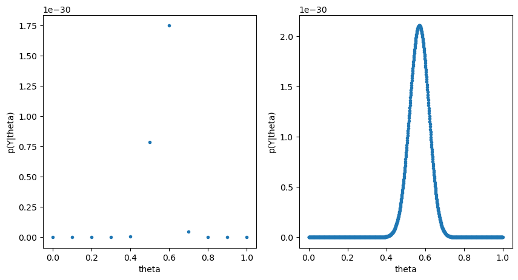

<head>
  <script type="text/x-mathjax-config"> MathJax.Hub.Config({ TeX: { equationNumbers: { autoNumber: "all" } } }); </script>
  <script type="text/x-mathjax-config">
    MathJax.Hub.Config({
      tex2jax: {
        inlineMath: [ ['$','$'], ["\\(","\\)"] ],
         displayMath: [ ['$$','$$'], ["\\[","\\]"] ],
         processEscapes: true
      }
    });
  </script>
  <script src="https://cdn.mathjax.org/mathjax/latest/MathJax.js?config=TeX-AMS-MML_HTMLorMML" type="text/javascript"></script>
  <meta name="google-site-verification" content="kuks5e4as6qBaGVCSzmHkQJa5Tss89_g5DmRXeUi7K8" />
</head>


<h1>Bayesian Statistics: a Crash Course </h1>
<header>

<h2>Table of contents</h2>
<nav>
 <ol>
     <li><a href="#introbayesian"> Introduction to Bayesian Inference  </a></li>
     <li>Frequentist Approach </li>
         <ul> 
           <li> <a href = "HypothesisTest">  Hypothesis Test</a> </li>
         </ul>
     <li> Bayesian Approach</li>
         <ul>
           <li><a href="ConjugateDistributions">Conjugate Distributions</a></li>
         <li> Algorithms and Simulations</li>
             <ol>
               <li><a href = "Metropolis-Hastings"> Metropolis Hastings Algorithm </a></li>
             </ol>
         </ul>
 </ol>
</nav>
</header>


<h2 id = "introbayesian">Introduction to Bayesian Inference  </h2>
 <p>
Bayesian statistics is a tool in statistical inference in which a parameter to be estimated (or infered) is not consider 
an unknown but deterministic quantity rather than a random variable itself. 
<br> 
The idea is that one has a prior believe of the parameter $\theta$ in question that is expressed in terms of what is called the 
prior probability $p(\theta)$. This probability is updated to what is called as posterior probability via Bayes Theorem in the following way: 

$$
 p(\theta|y) = \frac{p(y|\theta) p(\theta)}{\int_{\theta \in \Theta}p(y|\theta) p(\theta)\,d\theta}
$$

where the integral in the denominator is a normalizing constant in order for $p(\theta|y)$ to be a probability distribution.
</p>

To illustrate better let us consider the following example:

<h3> Example </h3>

Sample survey: Suppose we are going to sample $n=100$ individuals from a county (of size much larger than $n$) and ask each sampled person whether they support policy Z or not. Let $Y_i = 1$ if person i in the sample supports the policy, and $Y_i = 0$ otherwise.

Assume that $Y_1, \dots, Y_{n}$ are, conditional on $\theta$, identically distributed and independent random variables each of distribution $Ber(\theta)$. Then the joint distribution conditional on $\theta$ is:

$$
  p(y_1,\dots, y_n \|\theta) = \prod_{i=1}^n\theta^{y_i}(1-\theta)^{1-\theta_i} = \theta^{\sum_{i}y_i}(1-\theta)^{n-\sum_{i}y_i}
$$

For the moment assume that your believe on $\theta$ is that $\theta \in\{0, 0.1, 0.2, \dots, 0.9, 1 \}$. Given that the results of the survey are: $\sum_{i=1}^n y_i = 57$,let us compute for each value of $\theta$, $\mathbb{P}(\sum_i Y_i = 57 \|\theta)$ and plot these results as a function of $\theta$:


```python
import numpy as np
import matplotlib.pyplot as plt
```


```python
n = 100
sum_y = 57
thetas = np.linspace(0, 1., 11)
x = np.linspace(0, 1, 1000)

p_Y = lambda theta: theta**(sum_y)*(1-theta)**(n - sum_y)

plt.figure(figsize=(10, 5))
plt.subplot(121)
plt.plot(thetas, p_Y(thetas), ".")
plt.xlabel("theta")
plt.ylabel("p(Y|theta)")
plt.subplot(122)
plt.plot(x, p_Y(x), ".")
plt.xlabel("theta")
plt.ylabel("p(Y|theta)")
plt.show()
```


    

    


 <a href="HypothesisTest" class="previous">Next &raquo;</a>


